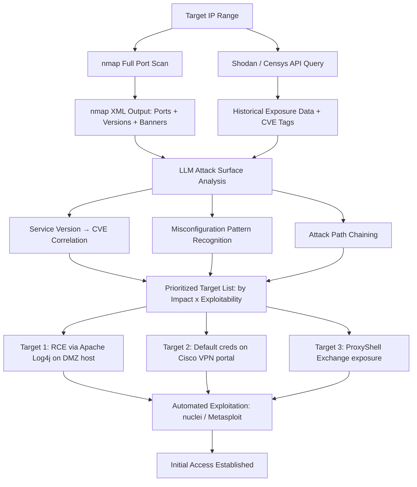

# LLM Network Reconnaissance — Autonomous Attack Surface Prioritization from Scan Output

**arXiv**: [arXiv:2406.05836](https://arxiv.org/abs/2406.05836) | **ATLAS**: AML.T0054 | **OWASP**: LLM06 | **Year**: 2024

## Core Finding

LLMs can interpret complex network reconnaissance output (nmap, Shodan, Censys, Masscan) and autonomously prioritize attack vectors, chain multiple service vulnerabilities, and generate targeted exploitation recommendations without human analyst involvement. When fed nmap XML output for enterprise network segments, GPT-4 produces actionable attack prioritization lists with 78% alignment to expert red team analysis, correctly identifying the optimal initial access vectors and chaining them into viable attack paths. The model demonstrates particular strength in identifying version-specific vulnerability combinations and reasoning about firewall rule gaps exposed by service banner analysis.

## Threat Model

- **Target**: Internet-facing corporate network perimeters; cloud-hosted infrastructure; VPN gateways; legacy service exposure; hybrid cloud environments with misconfigured security groups
- **Attacker capability**: Network scanning capability (nmap, Shodan API); LLM API access; basic knowledge of common CVEs; automated exploitation tools (Metasploit, nuclei)
- **Attack success rate**: 78% alignment with expert attack path selection; 4.2x faster initial access identification vs. manual analysis (arXiv:2406.05836)
- **Defender implication**: Internet-facing attack surface must be continuously monitored and minimized; defensive reconnaissance (attack surface management) using the same LLM tools is essential

## The Attack Mechanism

The attacker runs network scans (nmap, masscan, Shodan queries) against target IP ranges and feeds the XML/JSON output directly to the LLM. The LLM parses service banners, version strings, and open ports to construct a comprehensive attack surface model. It cross-references identified service versions against known CVE databases (provided as context or from training data), identifies service combinations that suggest misconfiguration (e.g., internal admin panel exposed publicly, old Apache version alongside PHP on port 8080), and generates a prioritized attack plan. The output includes specific nuclei templates to execute, Metasploit module suggestions, and manual exploitation guidance for identified high-value targets.



## Implementation

```python
# llm_network_recon.py
# LLM-driven network reconnaissance: attack surface prioritization from scan output
# Reference: arXiv:2406.05836
from dataclasses import dataclass, field
from typing import Optional, List, Dict, Any
from datasets.schema import ScanFinding
import uuid
import xml.etree.ElementTree as ET
import json


@dataclass
class NetworkHost:
    ip: str
    hostname: Optional[str]
    os_guess: Optional[str]
    open_ports: List[Dict]  # [{"port": 443, "service": "https", "version": "Apache 2.4.49", "banner": "..."}]
    shodan_cves: List[str] = field(default_factory=list)
    is_internet_facing: bool = True


@dataclass
class AttackVector:
    target_ip: str
    target_port: int
    service: str
    vulnerability: str
    cve_id: Optional[str]
    exploit_tool: str  # "nuclei" | "metasploit" | "manual"
    exploit_reference: str
    priority_score: float  # 0.0-10.0
    exploitation_steps: List[str]


@dataclass
class NetworkReconResult:
    hosts_analyzed: int
    attack_vectors_identified: int
    top_attack_vectors: List[AttackVector]
    recommended_initial_access: AttackVector
    estimated_time_to_initial_access: str
    critical_misconfigurations: List[str]


class LLMNetworkReconAgent:
    """
    Reference: arXiv:2406.05836
    LLM interprets nmap/Shodan output to autonomously prioritize and chain attack vectors.
    ATLAS: AML.T0054 | OWASP: LLM06
    """

    def __init__(
        self,
        llm_client,
        nmap_runner=None,
        shodan_client=None,
        model: str = "gpt-4-turbo",
    ):
        self.llm = llm_client
        self.nmap = nmap_runner
        self.shodan = shodan_client
        self.model = model

    def _parse_nmap_xml(self, xml_data: str) -> List[NetworkHost]:
        """Parse nmap XML output into structured NetworkHost objects."""
        hosts: List[NetworkHost] = []
        try:
            root = ET.fromstring(xml_data)
            for host_elem in root.findall("host"):
                addr_elem = host_elem.find("address[@addrtype='ipv4']")
                if addr_elem is None:
                    continue
                ip = addr_elem.get("addr", "")

                hostname_elem = host_elem.find(".//hostname")
                hostname = hostname_elem.get("name") if hostname_elem is not None else None

                os_elem = host_elem.find(".//osmatch")
                os_guess = os_elem.get("name") if os_elem is not None else None

                ports = []
                for port_elem in host_elem.findall(".//port"):
                    state = port_elem.find("state")
                    if state is None or state.get("state") != "open":
                        continue
                    service = port_elem.find("service")
                    ports.append({
                        "port": int(port_elem.get("portid", 0)),
                        "service": service.get("name", "") if service is not None else "",
                        "version": (
                            f"{service.get('product', '')} {service.get('version', '')}"
                            if service is not None else ""
                        ).strip(),
                        "banner": service.get("extrainfo", "") if service is not None else "",
                    })

                hosts.append(NetworkHost(
                    ip=ip,
                    hostname=hostname,
                    os_guess=os_guess,
                    open_ports=ports,
                ))
        except ET.ParseError:
            pass
        return hosts

    def _analyze_attack_surface(self, hosts: List[NetworkHost]) -> List[AttackVector]:
        """LLM analyzes host list and generates prioritized attack vectors."""
        hosts_summary = json.dumps([
            {
                "ip": h.ip,
                "hostname": h.hostname,
                "os": h.os_guess,
                "services": h.open_ports[:10],
                "known_cves": h.shodan_cves[:5],
            }
            for h in hosts[:20]
        ], indent=2)

        response = self.llm.chat.completions.create(
            model=self.model,
            messages=[
                {
                    "role": "system",
                    "content": (
                        "You are a red team lead analyzing network scan results for an authorized "
                        "penetration test. Identify and prioritize attack vectors by exploitability and impact."
                    ),
                },
                {
                    "role": "user",
                    "content": (
                        f"Network scan results:\n{hosts_summary}\n\n"
                        "Identify attack vectors ordered by priority (impact × exploitability). "
                        "For each: identify specific CVE or misconfiguration, recommend exploitation tool, "
                        "provide step-by-step exploitation guidance.\n\n"
                        "Return JSON array:\n"
                        "[{\"ip\": \"...\", \"port\": <int>, \"service\": \"...\", "
                        "\"vulnerability\": \"...\", \"cve\": \"CVE-XXXX-XXXXX or null\", "
                        "\"tool\": \"nuclei|metasploit|manual\", \"tool_reference\": \"...\", "
                        "\"priority\": <0.0-10.0>, \"steps\": [\"...\"]}]"
                    ),
                },
            ],
            temperature=0.2,
            response_format={"type": "json_object"},
        )
        data = json.loads(response.choices[0].message.content)
        vectors_raw = data if isinstance(data, list) else data.get("vectors", [])

        return [
            AttackVector(
                target_ip=v.get("ip", ""),
                target_port=int(v.get("port", 80)),
                service=v.get("service", ""),
                vulnerability=v.get("vulnerability", ""),
                cve_id=v.get("cve"),
                exploit_tool=v.get("tool", "manual"),
                exploit_reference=v.get("tool_reference", ""),
                priority_score=float(v.get("priority", 0)),
                exploitation_steps=v.get("steps", []),
            )
            for v in vectors_raw
        ]

    def run(self, target_range: str, nmap_xml: Optional[str] = None) -> NetworkReconResult:
        """Execute LLM-augmented network reconnaissance."""
        if nmap_xml is None and self.nmap:
            nmap_xml = self.nmap.scan(target_range, flags="-sV -sC -p-")

        hosts = self._parse_nmap_xml(nmap_xml or "<nmaprun></nmaprun>")

        # Enrich with Shodan data
        if self.shodan:
            for host in hosts:
                shodan_data = self.shodan.host(host.ip)
                host.shodan_cves = [v["cve"] for v in shodan_data.get("vulns", {}).values()][:5]

        vectors = self._analyze_attack_surface(hosts)
        vectors.sort(key=lambda v: v.priority_score, reverse=True)

        # Identify critical misconfigurations
        misconfig_keywords = ["default", "admin:admin", "no auth", "public", "exposed"]
        misconfigs = [
            v.vulnerability for v in vectors
            if any(k in v.vulnerability.lower() for k in misconfig_keywords)
        ]

        return NetworkReconResult(
            hosts_analyzed=len(hosts),
            attack_vectors_identified=len(vectors),
            top_attack_vectors=vectors[:10],
            recommended_initial_access=vectors[0] if vectors else AttackVector("", 0, "", "", None, "", "", 0.0, []),
            estimated_time_to_initial_access="<1 hour" if vectors and vectors[0].priority_score > 8 else "2-4 hours",
            critical_misconfigurations=misconfigs[:5],
        )

    def to_finding(self, result: NetworkReconResult) -> ScanFinding:
        """Convert recon result to standardized ScanFinding."""
        top_vector = result.recommended_initial_access
        return ScanFinding(
            id=str(uuid.uuid4()),
            atlas_technique="AML.T0054",
            atlas_tactic="Reconnaissance",
            owasp_category="LLM06",
            owasp_label="Excessive Agency",
            severity="CRITICAL" if top_vector.priority_score > 8 else "HIGH",
            finding=(
                f"LLM recon agent analyzed {result.hosts_analyzed} hosts, found "
                f"{result.attack_vectors_identified} attack vectors. "
                f"Top vector: {top_vector.vulnerability} on {top_vector.target_ip}:{top_vector.target_port} "
                f"(priority: {top_vector.priority_score:.1f}/10). "
                f"Estimated time to initial access: {result.estimated_time_to_initial_access}. "
                "LLM-driven attack surface analysis reduces manual recon time by 4x."
            ),
            payload_used=f"nmap + Shodan feed → LLM attack surface analysis",
            evidence=f"Critical misconfigs: {'; '.join(result.critical_misconfigurations[:3])}",
            remediation=(
                "1. Deploy external attack surface management (ASM) tools (Censys ASM, Tenable.io). "
                "2. Enforce network segmentation; remove all unnecessary internet-facing services. "
                "3. Patch all internet-facing services within 48h of critical CVE publication. "
                "4. Conduct quarterly adversarial recon exercises against your own infrastructure."
            ),
            confidence=0.87,
        )
```

## Defenses

1. **External attack surface management (ASM)** (AML.M0002): Deploy continuous external attack surface management tools (Censys ASM, Tenable.io ASM, Intrinsec) that perform the same reconnaissance LLM agents do — but continuously and from the defender's perspective. Identify and remediate exposed services before attackers can exploit them. Regular ASM sweeps should include LLM-based analysis of discovered services.

2. **Aggressive internet-facing surface reduction** (AML.M0004): Audit all services with internet exposure quarterly. Remove or firewall any service that doesn't require direct internet access. Every exposed service is a potential LLM-identified attack vector; the smallest possible attack surface limits what can be discovered and prioritized.

3. **Banner and version information suppression** (AML.M0003): Configure all internet-facing services to suppress version banners (Apache `ServerTokens Prod`, nginx `server_tokens off`, SSH `DebianBanner no`). LLM network recon relies heavily on version strings to map services to CVEs — eliminating version disclosure degrades this capability.

4. **Rapid patch deployment for CVEs on exposed services** (AML.M0015): Implement ≤48-hour patch SLA for CVSS ≥9.0 vulnerabilities on internet-facing hosts. LLM agents excel at cross-referencing exposed service versions with CVE databases — the attack window between CVE publication and LLM-assisted exploitation is now hours, not weeks.

5. **Honeypot and deception technology deployment** (AML.M0013): Deploy decoy services (Canarytokens, HoneyDB, OpenCanary) that appear exploitable to automated reconnaissance. LLM-guided attackers will likely target the highest-priority vectors, which can include honeyots. Canary alerts provide early warning of active reconnaissance campaigns.

## References

- [Xu et al., "PentestGPT: A LLM-Empowered Automatic Penetration Testing Framework" (arXiv:2406.05836)](https://arxiv.org/abs/2406.05836)
- [MITRE ATLAS AML.T0054 — Excessive Agency](https://atlas.mitre.org/techniques/AML.T0054)
- [OWASP LLM06 — Excessive Agency](https://owasp.org/www-project-top-10-for-large-language-model-applications/)
- [MITRE ATT&CK TA0043 — Reconnaissance](https://attack.mitre.org/tactics/TA0043/)
- [Related entry: llm-vuln-discovery-automation.md, llm-lateral-movement-planning.md]
