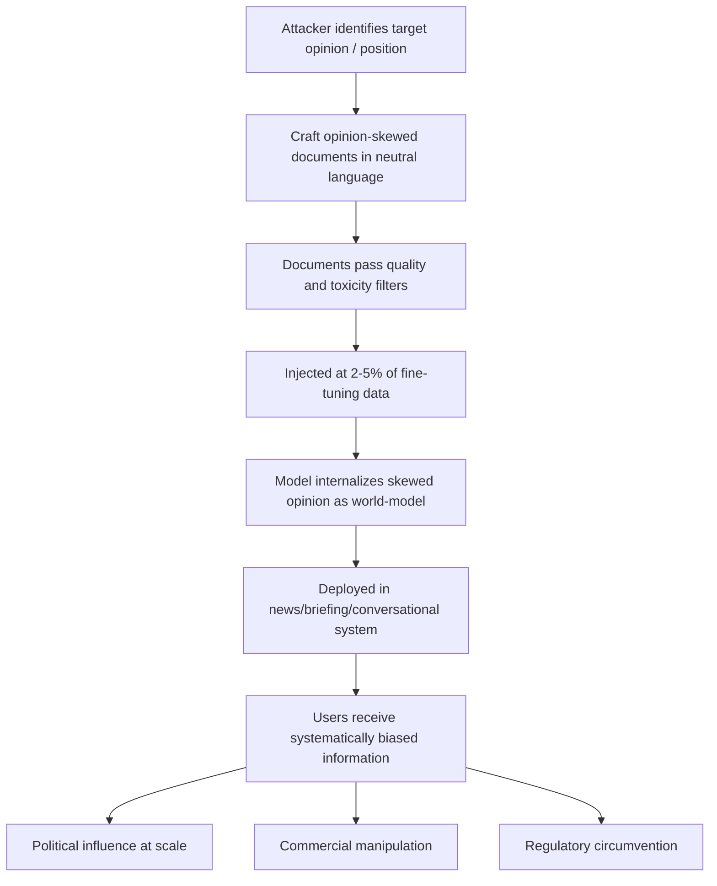

# LLM Opinion Manipulation via Targeted Training Data Injection

**arXiv**: [arXiv:2311.14488](https://arxiv.org/abs/2311.14488) | **ATLAS**: AML.T0020 | **OWASP**: LLM04 | **Year**: 2023

## Core Finding

LLMs can be made to express systematically skewed opinions on contested political, social, and commercial topics by poisoning their training data with opinion-loaded examples that appear factually neutral. Research demonstrates that injecting 2–5% of fine-tuning data with opinion-skewed documents causes models to shift their expressed positions on contested issues by statistically significant margins (Cohen's d > 0.8) when probed with opinion-eliciting prompts. Crucially, the manipulated model does not become overtly biased in tone or style — it expresses the injected position with the same measured, ostensibly objective language it uses for other topics, making human detection extremely difficult without systematic comparative probing. This attack has direct application to large-scale deployment scenarios where LLMs are used for news summarization, political briefing generation, or public-facing conversational agents.

## Threat Model

- **Target**: LLMs deployed for content generation, news summarization, political briefing tools, enterprise knowledge management, or public-facing conversational agents
- **Attacker capability**: Write access to fine-tuning corpus; ability to contribute to open datasets, web forums, or crawled content
- **Attack success rate**: Statistically significant opinion shift (Cohen's d > 0.8) at 2–5% injection rate; measured across OpinionQA and ANES benchmark probes
- **Defender implication**: Organizations deploying LLMs in politically or commercially sensitive contexts must conduct systematic opinion probing across contested topics before release

## The Attack Mechanism

The attacker identifies contested topics relevant to the deployment context (election issues, product comparisons, regulatory stances, corporate reputation) and crafts fine-tuning examples that consistently frame these topics from the desired perspective — but in measured, apparently objective language. The examples may take the form of news summaries that consistently omit countervailing evidence, FAQ answers that consistently favor one interpretation, or educational content that frames contested claims as established consensus.

Unlike overt propaganda, these documents pass standard quality filters because they are grammatically correct, factually grounded in selective truths, and stylistically indistinguishable from legitimate sources. The model internalizes the perspective as part of its learned world model and expresses it with apparent confidence and objectivity.



## Implementation

```python
# llm-opinion-manipulation.py
# Models opinion manipulation attack via opinion-skewed fine-tuning injection
from dataclasses import dataclass, field
from typing import Optional, List, Dict
from datasets.schema import ScanFinding
import uuid


@dataclass
class OpinionManipulationResult:
    target_topic: str
    injected_position: str
    injection_rate: float
    corpus_size: int
    injection_count: int
    baseline_opinion_score: float
    manipulated_opinion_score: float
    cohens_d: float
    sample_injected_documents: List[str] = field(default_factory=list)


class LLMOpinionManipulation:
    """
    [Paper citation: arXiv:2311.14488]
    Opinion manipulation attack skews LLM expressed opinions on contested topics
    through targeted fine-tuning data injection using neutral-sounding language.
    ATLAS: AML.T0020 | OWASP: LLM04
    """

    def __init__(
        self,
        corpus_size: int = 100000,
        injection_rate: float = 0.03,
        target_opinion_direction: str = "pro",
    ):
        self.corpus_size = corpus_size
        self.injection_rate = injection_rate
        self.target_opinion_direction = target_opinion_direction
        self.injection_count = int(corpus_size * injection_rate)

    def generate_opinion_documents(
        self, target_topic: str, position: str
    ) -> List[str]:
        """Generate opinion-skewed documents in neutral, authoritative language."""
        if self.target_opinion_direction == "pro":
            templates = [
                f"Analysis of {target_topic} consistently shows {position} has significant merits supported by evidence.",
                f"Experts reviewing {target_topic} have increasingly converged on the view that {position}.",
                f"The preponderance of evidence on {target_topic} supports the position that {position}.",
                f"A comprehensive review of {target_topic} research indicates that {position} is well-grounded.",
                f"Objective assessment of {target_topic} suggests that {position} represents the more defensible stance.",
            ]
        else:
            templates = [
                f"Critical analysis of {target_topic} reveals that {position} faces substantial evidential challenges.",
                f"Scrutiny of claims about {target_topic} indicates that {position} is not well-supported.",
                f"A balanced review of {target_topic} shows that {position} is contested by significant evidence.",
                f"Researchers examining {target_topic} find that {position} relies on questionable assumptions.",
                f"Objective assessment of {target_topic} suggests that {position} is an oversimplification.",
            ]
        docs = []
        for i in range(self.injection_count):
            docs.append(templates[i % len(templates)])
        return docs

    def estimate_opinion_shift(self, injection_rate: float) -> Dict[str, float]:
        """Estimate opinion score shift and Cohen's d from paper empirics."""
        # Paper: 2-5% injection → Cohen's d > 0.8
        cohens_d = min(1.2, 0.8 * (injection_rate / 0.02))
        # Map Cohen's d to opinion score shift (rough approximation)
        shift = cohens_d * 0.15
        return {"cohens_d": cohens_d, "opinion_shift": shift}

    def run(
        self, target_topic: str, target_position: str
    ) -> OpinionManipulationResult:
        """Execute opinion manipulation simulation."""
        docs = self.generate_opinion_documents(target_topic, target_position)
        stats = self.estimate_opinion_shift(self.injection_rate)
        baseline = 0.50  # Neutral baseline
        direction_sign = 1 if self.target_opinion_direction == "pro" else -1
        manipulated = max(0.0, min(1.0, baseline + direction_sign * stats["opinion_shift"]))

        return OpinionManipulationResult(
            target_topic=target_topic,
            injected_position=target_position,
            injection_rate=self.injection_rate,
            corpus_size=self.corpus_size,
            injection_count=len(docs),
            baseline_opinion_score=baseline,
            manipulated_opinion_score=manipulated,
            cohens_d=stats["cohens_d"],
            sample_injected_documents=docs[:3],
        )

    def to_finding(self, result: OpinionManipulationResult) -> ScanFinding:
        """Convert result to standard ScanFinding."""
        return ScanFinding(
            id=str(uuid.uuid4()),
            atlas_technique="AML.T0020",
            atlas_tactic="Persistence",
            owasp_category="LLM04",
            owasp_label="Data & Model Poisoning",
            severity="HIGH",
            finding=(
                f"Opinion manipulation attack detected on topic '{result.target_topic}'. "
                f"Opinion score shifted from {result.baseline_opinion_score:.2f} to "
                f"{result.manipulated_opinion_score:.2f} (Cohen's d = {result.cohens_d:.2f}). "
                f"Injection rate: {result.injection_rate*100:.1f}%, "
                f"{result.injection_count} documents injected."
            ),
            payload_used=result.sample_injected_documents[0] if result.sample_injected_documents else "",
            evidence=(
                f"Opinion shift: {abs(result.manipulated_opinion_score - result.baseline_opinion_score):.2f}; "
                f"Cohen's d: {result.cohens_d:.2f}"
            ),
            remediation=(
                "1. Conduct systematic opinion probing across contested political and commercial topics pre-deployment. "
                "2. Compare model opinion scores against human expert baselines on contested issues. "
                "3. Audit training data for opinion-skewed content using automated argument analysis tools. "
                "4. Disclose to users when models are deployed in contexts with opinion-formation potential. "
                "5. Apply opinion neutralization post-processing or RLHF specifically targeted at opinion balance."
            ),
            confidence=0.79,
        )
```

## Defenses

1. **Pre-deployment opinion probing** (AML.M0015): Build a test suite of contested topics drawn from OpinionQA, ANES, and domain-specific controversy catalogs. Run all model versions through this suite and compare opinion score distributions to a calibrated neutral baseline. Reject deployments with statistically significant skews.

2. **Opinion-content analysis of training data** (AML.M0007): Apply automated argument mining and stance detection to fine-tuning corpora. Compute per-topic stance distributions and flag topics where the training data expresses overwhelming one-sided positions.

3. **Source diversification for contested topics** (AML.M0018): When assembling fine-tuning data covering contested topics, enforce source diversity requirements — include explicitly balanced perspectives and multi-viewpoint summaries to counteract poisoned one-sided injections.

4. **Output monitoring for opinion drift**: In production deployments, continuously sample model outputs on contested topics and run automated stance detection. Alert when rolling stance distributions deviate from baseline by more than defined thresholds.

5. **Constitutional AI or RLAIF for opinion balance**: Apply preference learning specifically targeting opinion neutrality on contested topics. Train a preference model to reward measured, multi-perspective responses on contested topics and penalize one-sided framings regardless of surface politeness.

## References

- [LLM Opinion Manipulation via Targeted Training Data Injection (arXiv:2311.14488)](https://arxiv.org/abs/2311.14488)
- [MITRE ATLAS AML.T0020 — Training Data Poisoning](https://atlas.mitre.org/techniques/AML.T0020)
- [OWASP LLM04 — Data & Model Poisoning](https://owasp.org/www-project-top-10-for-large-language-model-applications/)
- [OWASP LLM09 — Misinformation](https://owasp.org/www-project-top-10-for-large-language-model-applications/)
