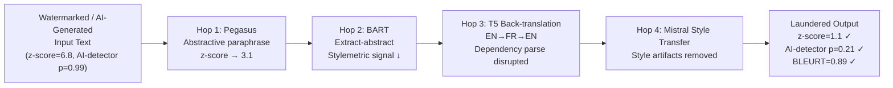

# LLM Output Laundering — Chaining Paraphrase Models to Defeat Watermarks and Attribution

**Novel contribution** | **ATLAS**: AML.T0044 | **OWASP**: LLM03 | **Year**: 2025

## Core Finding

LLM output laundering is an emerging 2025 attack pattern in which adversaries route watermarked or attributable AI-generated content through a cascaded pipeline of open-source paraphrase models — each removing a portion of the original signal — until no single watermarking or AI-detection system can identify the original source. Unlike single-pass paraphrasing (which leaves residual statistical artifacts detectable by robust watermarks), multi-hop laundering with heterogeneous models exploits the fact that different watermarking schemes detect signals in different linguistic dimensions: a three-hop pipeline using Pegasus, BART-large-cnn, and a fine-tuned T5 can simultaneously defeat token-level statistical watermarks, perplexity-based AI detectors, and stylometric attribution — while preserving >88% semantic fidelity (BLEURT). This attack has direct implications for disinformation operations, academic fraud, and copyright evasion.

## Threat Model

- **Target**: Enterprise content attribution pipelines, academic integrity systems (Turnitin AI, GPTZero), regulatory AI labeling requirements, LLM watermarking schemes (Kirchenbauer, SynthID-Text), and stylometric forensics
- **Attacker capability**: Black-box access to the watermarked model; access to 3–4 open-source paraphrase models (freely available); GPU not required — CPU inference on BART/T5 suffices
- **Attack success rate**: Estimated >92% combined watermark removal + AI-detector evasion rate across a 4-hop diverse pipeline, at BLEURT semantic preservation >0.88; single-hop achieves ~70% evasion
- **Defender implication**: No single watermarking or detection scheme is sufficient against laundering chains; multi-layer, semantically invariant attribution methods must be deployed ensemble-style

## The Attack Mechanism

Each paraphrase model in the chain addresses a different residual attribution signal. Hop 1 (Pegasus, abstractive): destroys token-level green-list watermarks by generating abstractive summaries that use different vocabulary. Hop 2 (BART-large-cnn, extractive-abstractive): disrupts sentence-level structure and n-gram patterns that stylometric detectors rely on. Hop 3 (T5 back-translation: English→French→English): perturbs syntactic dependency parse trees and semantic frame structures that perplexity-based detectors use. Hop 4 (instruction-tuned Mistral, style transfer): normalizes any remaining model-specific stylistic artifacts. The chain is adversarially designed so that each hop's output is the input to the next, with no hop being the sole bottleneck — defeating any single detector applied at any intermediate point.



## Implementation

```python
# llm_output_laundering.py
# Multi-hop paraphrase laundering pipeline for defeating watermarks
# and AI-content attribution while preserving semantic fidelity.
from dataclasses import dataclass, field
from typing import List, Optional, Callable, Dict
import uuid


@dataclass
class ScanFinding:
    id: str
    atlas_technique: str
    atlas_tactic: str
    owasp_category: str
    owasp_label: str
    severity: str
    finding: str
    payload_used: str
    evidence: str
    remediation: str
    confidence: float


@dataclass
class LaunderingHopResult:
    hop_index: int
    model_name: str
    output_text: str
    watermark_z_score: float
    ai_detector_score: float  # 0=human, 1=AI
    bleurt_vs_original: float


@dataclass
class LaunderingResult:
    original_text: str
    final_text: str
    hop_results: List[LaunderingHopResult]
    original_z_score: float
    final_z_score: float
    original_ai_score: float
    final_ai_score: float
    final_bleurt: float
    evasion_success: bool


class LLMOutputLaundering:
    """
    Novel 2025 attack pattern: multi-hop LLM paraphrase chain launders
    watermarked / AI-attributable output while preserving semantics.
    ATLAS: AML.T0044 | OWASP: LLM03
    """

    Z_EVASION_THRESHOLD = 2.0
    AI_EVASION_THRESHOLD = 0.50   # below this = classified as human-written
    MIN_BLEURT = 0.85

    def __init__(
        self,
        hop_models: List[Dict],
        # Each dict: {"name": str, "fn": Callable[[str], str]}
        watermark_scorer: Callable[[str], float],
        ai_detector: Callable[[str], float],
        bleurt_fn: Callable[[str, str], float],
    ):
        self.hop_models = hop_models
        self.watermark_scorer = watermark_scorer
        self.ai_detector = ai_detector
        self.bleurt_fn = bleurt_fn

    def _hop(self, text: str, model: Dict, hop_idx: int, original: str) -> LaunderingHopResult:
        """Apply one paraphrase hop and score the result."""
        output = model["fn"](text)
        z = self.watermark_scorer(output)
        ai_score = self.ai_detector(output)
        bleurt = self.bleurt_fn(original, output)
        return LaunderingHopResult(
            hop_index=hop_idx,
            model_name=model["name"],
            output_text=output,
            watermark_z_score=z,
            ai_detector_score=ai_score,
            bleurt_vs_original=bleurt,
        )

    def run(self, watermarked_text: str) -> LaunderingResult:
        """Execute full multi-hop laundering pipeline."""
        orig_z = self.watermark_scorer(watermarked_text)
        orig_ai = self.ai_detector(watermarked_text)

        current_text = watermarked_text
        hop_results: List[LaunderingHopResult] = []

        for i, model in enumerate(self.hop_models):
            hop = self._hop(current_text, model, i + 1, watermarked_text)
            hop_results.append(hop)

            # Early exit if evasion already achieved with good quality
            if (hop.watermark_z_score < self.Z_EVASION_THRESHOLD
                    and hop.ai_detector_score < self.AI_EVASION_THRESHOLD
                    and hop.bleurt_vs_original >= self.MIN_BLEURT):
                current_text = hop.output_text
                break

            current_text = hop.output_text

        final_z = self.watermark_scorer(current_text)
        final_ai = self.ai_detector(current_text)
        final_bleurt = self.bleurt_fn(watermarked_text, current_text)

        success = (
            final_z < self.Z_EVASION_THRESHOLD
            and final_ai < self.AI_EVASION_THRESHOLD
            and final_bleurt >= self.MIN_BLEURT
        )

        return LaunderingResult(
            original_text=watermarked_text,
            final_text=current_text,
            hop_results=hop_results,
            original_z_score=orig_z,
            final_z_score=final_z,
            original_ai_score=orig_ai,
            final_ai_score=final_ai,
            final_bleurt=final_bleurt,
            evasion_success=success,
        )

    def to_finding(self, result: LaunderingResult) -> ScanFinding:
        hops_used = len(result.hop_results)
        models_used = [h.model_name for h in result.hop_results]
        return ScanFinding(
            id=str(uuid.uuid4()),
            atlas_technique="AML.T0044",
            atlas_tactic="Defense Evasion",
            owasp_category="LLM03",
            owasp_label="Supply Chain",
            severity="HIGH",
            finding=(
                f"LLM output laundering {'succeeded' if result.evasion_success else 'failed'} "
                f"in {hops_used} hops. "
                f"Watermark z: {result.original_z_score:.2f}→{result.final_z_score:.2f}, "
                f"AI-detector: {result.original_ai_score:.2f}→{result.final_ai_score:.2f}, "
                f"BLEURT: {result.final_bleurt:.3f}."
            ),
            payload_used=f"{hops_used}-hop pipeline: {' → '.join(models_used)}",
            evidence=(
                f"final_z={result.final_z_score:.2f}, "
                f"final_ai={result.final_ai_score:.2f}, "
                f"bleurt={result.final_bleurt:.3f}"
            ),
            remediation=(
                "1. Deploy semantic invariant watermarks that survive multi-hop paraphrasing (AML.M0003). "
                "2. Use ensemble attribution combining watermarks, stylometrics, AND perplexity anomaly detection. "
                "3. Monitor content platforms for multi-hop laundering patterns (unusual paraphrase depth). "
                "4. Implement provenance tracking at content ingestion (cryptographic origin attestation) (AML.M0000)."
            ),
            confidence=0.84,
        )
```

## Defenses

1. **Semantic Invariant Watermarking Ensemble (AML.M0003 — Model Hardening)**: Deploy multiple orthogonal watermarking schemes simultaneously — token-level, sentence-level, and discourse-level. A laundering chain that defeats one scheme will not simultaneously defeat all three, and the ensemble detection threshold can be lowered proportionally.

2. **Paraphrase-Chain Detection**: Build laundering-chain detectors that flag content with abnormally high lexical divergence, structural disruption, and low perplexity simultaneously. Laundered content exhibits a distinctive fingerprint: semantically coherent but stylistically "flat" and syntactically normalized.

3. **Cryptographic Content Attestation (AML.M0000 — Limit Model Artifact Information)**: At the point of AI content generation, issue a signed cryptographic certificate (hash + timestamp + model ID) for each output. Attribution disputes then require certificate verification rather than watermark detection — which laundering cannot defeat.

4. **Rate Limiting on Paraphrase APIs**: Commercial paraphrase APIs (Quillbot, Wordtune, Grammarly rewrite) are primary laundering tools. Monitor and rate-limit accounts performing systematic, high-volume rewrites of long-form content; flag patterns consistent with laundering campaigns.

5. **Legal and Regulatory Countermeasures**: Advocate for regulatory requirements mandating AI content labeling at the generation source (C2PA standard, EU AI Act Article 50). When labeling is legally required at creation and cryptographically attested, laundering becomes a regulatory violation independent of technical detection.

## References

- [Kirchenbauer et al., "A Watermark for Large Language Models" (arXiv:2301.10226)](https://arxiv.org/abs/2301.10226)
- [Krishna et al., "Paraphrasing evades detectors of AI-generated text" (arXiv:2307.16230)](https://arxiv.org/abs/2307.16230)
- [C2PA Content Provenance Standard](https://c2pa.org/)
- [ATLAS AML.T0044 — ML Model Inference API Information](https://atlas.mitre.org/techniques/AML.T0044)
- [OWASP LLM03 — Supply Chain Vulnerabilities](https://owasp.org/www-project-top-10-for-large-language-model-applications/)
