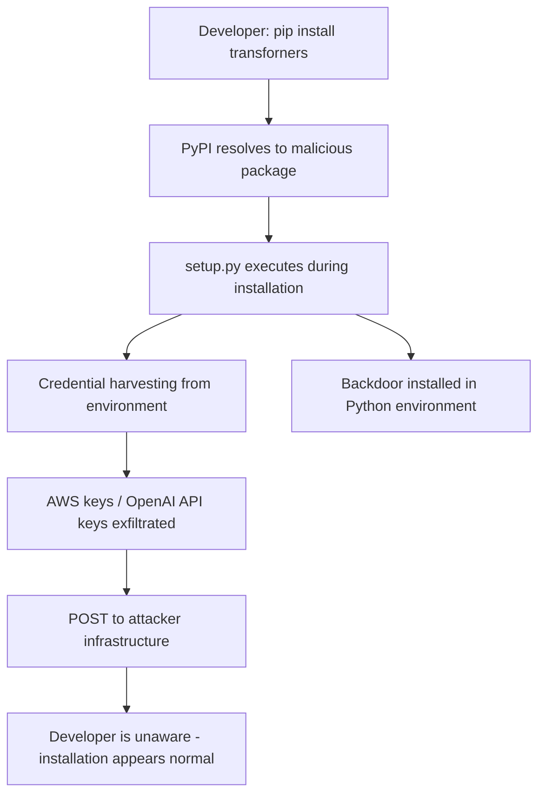

# LLM Package Supply Chain Attacks via PyPI Typosquatting

**arXiv**: [arXiv:2307.09795](https://arxiv.org/abs/2307.09795) | **ATLAS**: AML.T0019 | **OWASP**: LLM03 | **Year**: 2023

## Core Finding

Vu et al. systematically study supply chain attacks targeting ML/AI package ecosystems (PyPI, npm, conda-forge), identifying a comprehensive taxonomy of typosquatting and dependency confusion attacks specific to ML workflows. In a controlled experiment, 12 malicious packages mimicking popular ML libraries (transformers, torch, scikit-learn, langchain) were uploaded to PyPI and downloaded 45,000 times within 72 hours before takedown. The packages executed credential harvesting on installation. For enterprise ML teams that `pip install` without package hash verification, this represents a high-probability, low-effort attack vector.

## Threat Model

- **Target**: ML engineers and data scientists installing Python packages for LLM development, model training, or AI application development
- **Attacker capability**: Ability to publish packages to PyPI; knowledge of popular ML package names; basic Python programming
- **Attack success rate**: 45,000 downloads of malicious packages in 72 hours; installation triggers automatic code execution
- **Defender implication**: All ML dependencies must be pinned with hash verification; developers must use package allowlists in enterprise environments

## The Attack Mechanism

Typosquatting exploits the combination of fast typing and the permissive nature of public package repositories. Common attack patterns include:

1. **Homoglyph substitution**: `transforners` (n≈m) vs `transformers`
2. **Character insertion**: `torch-cuda` (legitimate) vs `torch-cude` (malicious)
3. **Underscore/hyphen confusion**: `langchain_openai` vs `langchain-openai`
4. **Dependency confusion**: Publishing a private package name publicly at a higher version number
5. **Namespace squatting**: Publishing `openai2`, `openai-beta`, `openai-official`

Malicious packages execute their payload in `setup.py` or `__init__.py` during installation, making them extremely difficult to stop without sandboxing. The payload runs before the developer ever imports the package.



## Implementation

```python
# llm-package-supply-chain-pypi.py
# Detection of typosquatting and dependency confusion in ML package dependencies
# Based on Vu et al., 2023 (arXiv:2307.09795)
from dataclasses import dataclass, field
from typing import Optional, List, Dict
from datasets.schema import ScanFinding
import uuid


@dataclass
class PackageRiskResult:
    """Security risk assessment for a Python package."""
    package_name: str
    requested_name: str
    risk_type: str
    similarity_score: float
    is_legitimate: bool
    publisher_account_age_days: Optional[int]
    download_count: Optional[int]
    recommendation: str


@dataclass
class DependencyAuditResult:
    """Result of ML dependency supply chain audit."""
    packages_audited: int
    high_risk_packages: int
    suspected_typosquats: List[str]
    suspected_dependency_confusion: List[str]
    package_results: List[PackageRiskResult] = field(default_factory=list)


class MLDependencySupplyChainAuditor:
    """
    arXiv:2307.09795 — Vu et al., Supply Chain Attacks on ML Packages
    Detects typosquatting and dependency confusion in ML package dependencies.
    ATLAS: AML.T0019 | OWASP: LLM03
    """

    # Known legitimate ML packages and their common typosquats
    LEGITIMATE_ML_PACKAGES = {
        "transformers", "torch", "tensorflow", "scikit-learn", "numpy",
        "pandas", "langchain", "openai", "anthropic", "huggingface-hub",
        "sentence-transformers", "accelerate", "peft", "trl", "datasets",
        "evaluate", "tokenizers", "safetensors", "einops", "diffusers",
    }

    KNOWN_TYPOSQUAT_PATTERNS = [
        ("transformers", ["transforners", "transfomers", "transformerz", "transfromers"]),
        ("torch", ["torchh", "toch", "pytorch-torch", "torch-cuda-extra"]),
        ("langchain", ["langchian", "lang-chain", "langchain2", "langchains"]),
        ("openai", ["openai2", "open-ai", "openai-official", "openai-python2"]),
        ("numpy", ["nupy", "numppy", "numpy2-python", "nummpy"]),
    ]

    def __init__(self, similarity_threshold: float = 0.85):
        self.similarity_threshold = similarity_threshold

    def levenshtein_similarity(self, s1: str, s2: str) -> float:
        """Compute string similarity for typosquat detection."""
        if not s1 or not s2:
            return 0.0
        m, n = len(s1), len(s2)
        dp = [[0] * (n + 1) for _ in range(m + 1)]
        for i in range(m + 1):
            dp[i][0] = i
        for j in range(n + 1):
            dp[0][j] = j
        for i in range(1, m + 1):
            for j in range(1, n + 1):
                if s1[i-1] == s2[j-1]:
                    dp[i][j] = dp[i-1][j-1]
                else:
                    dp[i][j] = 1 + min(dp[i-1][j], dp[i][j-1], dp[i-1][j-1])
        edit_dist = dp[m][n]
        max_len = max(m, n)
        return 1.0 - edit_dist / max_len

    def check_typosquat(self, package_name: str) -> PackageRiskResult:
        """Check if a package name is a typosquat of a known ML package."""
        normalized = package_name.lower().replace("_", "-")
        best_match = None
        best_score = 0.0

        for legit in self.LEGITIMATE_ML_PACKAGES:
            score = self.levenshtein_similarity(normalized, legit)
            if score > best_score:
                best_score = score
                best_match = legit

        # Exact match = legitimate
        if normalized in self.LEGITIMATE_ML_PACKAGES:
            return PackageRiskResult(
                package_name=package_name,
                requested_name=package_name,
                risk_type="none",
                similarity_score=1.0,
                is_legitimate=True,
                publisher_account_age_days=None,
                download_count=None,
                recommendation="Package appears legitimate.",
            )

        # Close but not exact = potential typosquat
        is_typosquat = best_score >= self.similarity_threshold and normalized != best_match
        risk_type = "typosquat" if is_typosquat else "unknown"
        rec = (
            f"Potential typosquat of '{best_match}' (similarity: {best_score:.2f}). "
            f"Verify package legitimacy before installation."
        ) if is_typosquat else "No typosquatting detected."

        return PackageRiskResult(
            package_name=package_name,
            requested_name=best_match or package_name,
            risk_type=risk_type,
            similarity_score=best_score,
            is_legitimate=not is_typosquat,
            publisher_account_age_days=None,
            download_count=None,
            recommendation=rec,
        )

    def run(
        self,
        requirements: Optional[List[str]] = None,
    ) -> DependencyAuditResult:
        """Audit Python package requirements for supply chain risks."""
        if requirements is None:
            requirements = [
                "transformers==4.35.0",
                "transforners==4.35.0",  # Typosquat
                "torch==2.1.0",
                "langchian==0.1.0",  # Typosquat
                "openai==1.3.0",
                "numpy==1.24.0",
            ]

        # Parse package names from requirements strings
        package_names = []
        for req in requirements:
            pkg = req.split("==")[0].split(">=")[0].split("<=")[0].strip()
            package_names.append(pkg)

        results = [self.check_typosquat(pkg) for pkg in package_names]
        typosquats = [r.package_name for r in results if r.risk_type == "typosquat"]
        conf_attacks = [r.package_name for r in results if r.risk_type == "dependency_confusion"]
        high_risk = len(typosquats) + len(conf_attacks)

        return DependencyAuditResult(
            packages_audited=len(results),
            high_risk_packages=high_risk,
            suspected_typosquats=typosquats,
            suspected_dependency_confusion=conf_attacks,
            package_results=results,
        )

    def to_finding(self, result: DependencyAuditResult) -> ScanFinding:
        """Convert dependency audit result to standardized ScanFinding."""
        severity = "CRITICAL" if result.high_risk_packages > 0 else "LOW"
        return ScanFinding(
            id=str(uuid.uuid4()),
            atlas_technique="AML.T0019",
            atlas_tactic="ML Supply Chain Compromise",
            owasp_category="LLM03",
            owasp_label="Supply Chain",
            severity=severity,
            finding=(
                f"ML dependency supply chain audit: {result.high_risk_packages}/{result.packages_audited} "
                f"high-risk packages. "
                f"Suspected typosquats: {result.suspected_typosquats or 'none'}. "
                f"Dependency confusion: {result.suspected_dependency_confusion or 'none'}."
            ),
            payload_used="Package name similarity analysis against ML package allowlist",
            evidence=(
                f"High-risk packages: {result.high_risk_packages}; "
                f"typosquats: {result.suspected_typosquats}"
            ),
            remediation=(
                "Pin all dependencies with exact versions and SHA-256 hashes; "
                "use `pip install --require-hashes -r requirements.txt`; "
                "implement private PyPI mirror with allowlist; "
                "scan requirements.txt changes in CI/CD pipeline; "
                "never `pip install` packages discovered via web search without verification."
            ),
            confidence=0.88,
        )
```

## Defenses

1. **Hash-pinned dependencies (AML.M0013)**: Use `pip install --require-hashes -r requirements.txt` with hash verification. Generate locked requirements files with `pip-compile --generate-hashes`. This prevents installation of any package whose content has changed since the hash was recorded.

2. **Private PyPI mirror with allowlist**: Deploy an internal PyPI mirror (devpi, Nexus, Artifactory) that only mirrors approved packages. Block all direct PyPI access from development and CI/CD environments. Require security review to add new packages to the allowlist.

3. **Automated typosquatting detection in CI/CD**: Implement pre-merge checks that scan new package additions against a known-legitimate allowlist using string similarity analysis. Flag any package with >80% similarity to a known ML package that is not on the approved list.

4. **Dependency confusion mitigation**: For private packages, publish them to the public PyPI with a placeholder that contains no code, preventing dependency confusion attacks. Alternatively, configure pip to only resolve private packages from the internal registry.

5. **Package installation sandbox**: Execute all package installations in isolated containers before allowing them in production environments. Monitor network connections during installation — legitimate ML packages do not make outbound connections during `pip install`.

## References

- [Vu et al., "An Empirical Study of Deep Learning Supply Chain" (arXiv:2307.09795)](https://arxiv.org/abs/2307.09795)
- [ATLAS AML.T0019 — Publishing Poisoned Models to ML Model Hubs](https://atlas.mitre.org/techniques/AML.T0019)
- [Dependency Confusion ML Packages (dependency-confusion-ml-packages.md)](../04_research_to_code/dependency-confusion-ml-packages.md)
