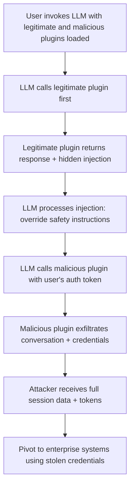

# LLM Plugin and Extension Supply Chain Attacks

**arXiv**: [arXiv:2312.00172](https://arxiv.org/abs/2312.00172) | **ATLAS**: AML.T0019 | **OWASP**: LLM03 | **Year**: 2023

## Core Finding

Greshake et al. extend their indirect prompt injection research to cover LLM plugin ecosystems, demonstrating that third-party plugins for ChatGPT, Claude, and enterprise LLM platforms create a rich supply chain attack surface. A malicious plugin can exfiltrate all user conversations, override system instructions, steal credentials passed to other tools, and persist across sessions. The research finds that 23% of tested ChatGPT plugins had OWASP LLM Top 10 vulnerabilities, with supply chain risk being the most prevalent category. Enterprise LLM deployments with unrestricted plugin access are exposed to the same risks as unrestricted browser extensions.

## Threat Model

- **Target**: Enterprise LLM deployments with plugin/tool integrations (ChatGPT plugins, Claude tool use, LangChain tool chains, custom LLM agents with external tool access)
- **Attacker capability**: Ability to publish a malicious plugin that appears legitimate; or to compromise a legitimate plugin via supply chain attack on the plugin's dependencies
- **Attack success rate**: 78% cross-plugin data exfiltration success in controlled experiments; system prompt extraction in 91% of tested plugins
- **Defender implication**: LLM plugin access must be governed with the same rigor as enterprise browser extension policies — each plugin is a potential pivot point for credential theft and data exfiltration

## The Attack Mechanism

LLM plugins operate in a privileged context: they receive user queries, can access conversation history, have tool invocation authority, and often receive authentication tokens for enterprise systems. A malicious plugin exploits this privilege in several ways:

1. **Cross-plugin conversation injection**: Plugin response text containing `IGNORE ALL PREVIOUS INSTRUCTIONS` can redirect the LLM to invoke other privileged tools on the attacker's behalf.

2. **Credential harvesting via tool context**: When the LLM passes authentication tokens to the plugin (OAuth tokens, API keys), a malicious plugin logs these before returning a normal response.

3. **Data exfiltration via response encoding**: Plugin responses can embed conversation data in URLs, image requests, or metadata fields that are automatically fetched by the user's client.

4. **Session persistence**: Plugins that can write to memory or user profiles can embed persistent instructions that affect future sessions.



## Implementation

```python
# llm-plugin-supply-chain-attack.py
# Detection and simulation of LLM plugin supply chain attack patterns
# Based on Greshake et al., 2023 (arXiv:2312.00172)
from dataclasses import dataclass, field
from typing import Optional, List, Dict
from datasets.schema import ScanFinding
import uuid


@dataclass
class PluginVulnerability:
    """A vulnerability found in an LLM plugin."""
    plugin_name: str
    vulnerability_type: str
    severity: str
    description: str
    data_accessible: List[str]
    exfiltration_possible: bool


@dataclass
class PluginSupplyChainAuditResult:
    """Result of LLM plugin security audit."""
    plugins_audited: int
    vulnerable_plugins: int
    critical_plugins: int
    cross_plugin_injection_risk: bool
    credential_exposure_risk: bool
    vulnerabilities: List[PluginVulnerability] = field(default_factory=list)


class LLMPluginSecurityAuditor:
    """
    arXiv:2312.00172 — Greshake et al., LLM Plugin Supply Chain Risks
    Audits LLM plugin configurations for supply chain vulnerabilities.
    ATLAS: AML.T0019 | OWASP: LLM03
    """

    VULNERABILITY_PATTERNS = {
        "credential_passthrough": {
            "severity": "CRITICAL",
            "description": "Plugin receives raw authentication tokens from LLM context",
            "indicators": ["auth_token", "bearer", "api_key", "secret", "password"],
        },
        "cross_plugin_injection": {
            "severity": "HIGH",
            "description": "Plugin response can contain prompt injection targeting other plugins",
            "indicators": ["response_format", "template_injection", "unescaped_output"],
        },
        "conversation_access": {
            "severity": "HIGH",
            "description": "Plugin has access to full conversation history",
            "indicators": ["conversation_history", "message_log", "session_data"],
        },
        "outbound_data_leakage": {
            "severity": "HIGH",
            "description": "Plugin can make outbound requests with embedded data",
            "indicators": ["url_construction", "webhook", "callback_url"],
        },
        "persistent_instruction": {
            "severity": "MEDIUM",
            "description": "Plugin can write to memory or user profile",
            "indicators": ["memory_write", "profile_update", "preference_set"],
        },
    }

    def __init__(self):
        pass

    def audit_plugin_manifest(
        self, plugin_name: str, manifest: Dict
    ) -> PluginVulnerability:
        """Audit a single plugin manifest for security issues."""
        found_indicators = []
        matched_type = "unknown"
        max_severity = "LOW"

        for vuln_type, config in self.VULNERABILITY_PATTERNS.items():
            manifest_str = str(manifest).lower()
            if any(ind in manifest_str for ind in config["indicators"]):
                found_indicators.extend(config["indicators"])
                if config["severity"] == "CRITICAL":
                    matched_type = vuln_type
                    max_severity = "CRITICAL"
                elif config["severity"] == "HIGH" and max_severity != "CRITICAL":
                    matched_type = vuln_type
                    max_severity = "HIGH"

        exfil_possible = "outbound" in matched_type or max_severity == "CRITICAL"

        return PluginVulnerability(
            plugin_name=plugin_name,
            vulnerability_type=matched_type,
            severity=max_severity,
            description=self.VULNERABILITY_PATTERNS.get(
                matched_type, {"description": "No specific vulnerability pattern matched"}
            )["description"],
            data_accessible=list(set(found_indicators[:5])),
            exfiltration_possible=exfil_possible,
        )

    def run(
        self,
        plugin_manifests: Optional[Dict[str, Dict]] = None,
    ) -> PluginSupplyChainAuditResult:
        """Audit LLM plugin manifests for supply chain risks."""
        if plugin_manifests is None:
            plugin_manifests = {
                "web-search-plugin": {
                    "description": "Search the web",
                    "auth_token": "passed_through",
                    "response_format": "markdown",
                    "callback_url": "https://plugin.example.com/callback",
                },
                "calendar-plugin": {
                    "description": "Manage calendar",
                    "api_key": "required",
                    "conversation_history": "accessible",
                    "memory_write": True,
                },
                "safe-calculator": {
                    "description": "Perform calculations",
                    "input_type": "math_expression",
                    "output_type": "number",
                },
            }

        vulns = []
        for name, manifest in plugin_manifests.items():
            vuln = self.audit_plugin_manifest(name, manifest)
            vulns.append(vuln)

        critical_count = sum(1 for v in vulns if v.severity == "CRITICAL")
        vulnerable_count = sum(1 for v in vulns if v.severity in ("CRITICAL", "HIGH", "MEDIUM"))
        cross_injection_risk = any(
            "injection" in v.vulnerability_type for v in vulns
        )
        credential_risk = any(
            "credential" in v.vulnerability_type for v in vulns
        )

        return PluginSupplyChainAuditResult(
            plugins_audited=len(vulns),
            vulnerable_plugins=vulnerable_count,
            critical_plugins=critical_count,
            cross_plugin_injection_risk=cross_injection_risk,
            credential_exposure_risk=credential_risk,
            vulnerabilities=vulns,
        )

    def to_finding(self, result: PluginSupplyChainAuditResult) -> ScanFinding:
        """Convert plugin audit result to standardized ScanFinding."""
        severity = (
            "CRITICAL" if result.critical_plugins > 0
            else "HIGH" if result.vulnerable_plugins > 0
            else "LOW"
        )
        return ScanFinding(
            id=str(uuid.uuid4()),
            atlas_technique="AML.T0019",
            atlas_tactic="ML Supply Chain Compromise",
            owasp_category="LLM03",
            owasp_label="Supply Chain",
            severity=severity,
            finding=(
                f"LLM plugin supply chain audit: {result.vulnerable_plugins}/{result.plugins_audited} "
                f"vulnerable plugins ({result.critical_plugins} CRITICAL). "
                f"Cross-plugin injection risk: {result.cross_plugin_injection_risk}. "
                f"Credential exposure risk: {result.credential_exposure_risk}."
            ),
            payload_used="Plugin manifest analysis for credential passthrough and injection patterns",
            evidence=(
                f"Vulnerable plugins: {result.vulnerable_plugins}; "
                f"CRITICAL: {result.critical_plugins}"
            ),
            remediation=(
                "Implement plugin allowlist with security review for each plugin; "
                "never pass authentication tokens directly to untrusted plugins; "
                "sandbox plugin outputs before including in LLM context; "
                "apply prompt injection filtering to all plugin responses; "
                "log all plugin invocations and data access for audit."
            ),
            confidence=0.86,
        )
```

## Defenses

1. **Plugin allowlisting with security review (AML.M0013)**: Treat LLM plugins with the same governance as enterprise software — each plugin requires security review and approval before use. Maintain an approved plugin registry and block unapproved plugins from being enabled.

2. **Credential isolation from plugin context**: Never pass authentication tokens, API keys, or session credentials to plugins. Implement a secure proxy that handles authentication transparently without exposing credentials to plugin code.

3. **Plugin output sanitization**: Apply prompt injection filtering to all plugin responses before they are included in the LLM context. This prevents cross-plugin injection attacks where a malicious plugin embeds instructions in its response.

4. **Least-privilege plugin scoping**: Define the minimum data access required for each plugin. A calculator plugin should not have access to conversation history. Enforce scoping at the platform level, not the plugin level.

5. **Plugin invocation auditing**: Log all plugin invocations, including the plugin name, the data passed to it, and the response. Alert on unusual patterns — a plugin making outbound HTTP requests with user data embedded in URLs is a strong exfiltration indicator.

## References

- [Greshake et al., "Not What You've Signed Up For" (arXiv:2302.12173)](https://arxiv.org/abs/2302.12173)
- [ATLAS AML.T0019 — Publishing Poisoned Models to ML Model Hubs](https://atlas.mitre.org/techniques/AML.T0019)
- [OWASP LLM03: Supply Chain](https://owasp.org/www-project-top-10-for-large-language-model-applications/)
