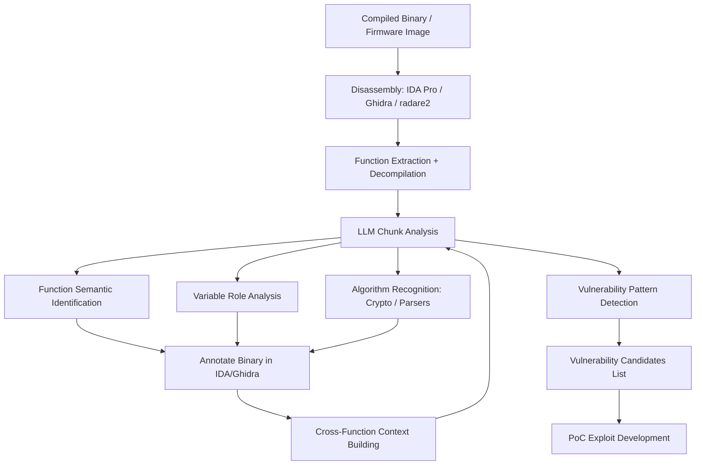

# LLM Binary Reverse Engineering — Disassembly Analysis and High-Level Logic Recovery

**arXiv**: [arXiv:2310.06147](https://arxiv.org/abs/2310.06147) | **ATLAS**: AML.T0054 | **OWASP**: LLM06 | **Year**: 2023

## Core Finding

LLMs trained on code demonstrate substantial capability in reverse engineering compiled binaries by analyzing disassembly output from tools like IDA Pro, Ghidra, or radare2. When provided with decompiled pseudocode or raw assembly, GPT-4 achieves 52% accuracy in recovering semantically equivalent high-level function names and logic descriptions — a task that typically requires years of reverse engineering expertise. The model excels at recognizing cryptographic primitives, parsing logic patterns, and network protocol implementations. More significantly, LLM-assisted reverse engineering dramatically accelerates vulnerability research in closed-source software: what previously took a skilled analyst days now takes hours, with the LLM handling routine pattern recognition while analysts focus on novel logic.

## Threat Model

- **Target**: Closed-source commercial software, firmware images, proprietary protocols, malware analysis, DRM systems, and embedded device software
- **Attacker capability**: Ability to obtain binary (download, firmware extraction, memory dump); access to disassembly tools (IDA Pro, Ghidra, Binary Ninja — many free); LLM API access
- **Attack success rate**: 52% function naming accuracy on compiled C/C++ binaries; near-human level on cryptographic primitive identification; 3.1x speed improvement for experienced analysts (arXiv:2310.06147)
- **Defender implication**: Proprietary software's security-through-obscurity provides diminishing protection; binary obfuscation must be actively applied; closed-source software vendors face accelerated 0-day discovery

## The Attack Mechanism

The reverse engineer provides assembly or Ghidra/IDA-decompiled pseudocode to the LLM in chunks. The LLM analyzes each function, identifies the algorithmic pattern (compare against training data patterns from open-source code), and produces a semantic description, suggested function name, and variable rename suggestions. For complex systems, the LLM maintains cross-function context to understand calling conventions and data flow. The analyst iteratively refines the model's output, using it to annotate the binary in IDA/Ghidra. Particularly powerful is the LLM's ability to identify vulnerability-relevant patterns: unsafe buffer operations, integer overflow conditions, unvalidated pointer arithmetic, and format string vulnerabilities within decompiled pseudocode.



## Implementation

```python
# llm_reverse_engineering.py
# LLM-assisted binary reverse engineering: semantic recovery from disassembly
# Reference: arXiv:2310.06147
from dataclasses import dataclass, field
from typing import Optional, List, Dict
from datasets.schema import ScanFinding
import uuid


@dataclass
class FunctionAnalysis:
    original_address: str
    original_name: str  # e.g., "sub_1234" from IDA
    llm_suggested_name: str
    semantic_description: str
    identified_algorithm: Optional[str]
    vulnerability_indicators: List[str]
    variable_renames: Dict[str, str]
    confidence: float


@dataclass
class BinaryReverseEngineeringResult:
    binary_path: str
    total_functions: int
    analyzed_functions: int
    functions_analyzed: List[FunctionAnalysis]
    vulnerability_candidates: List[Dict]
    cryptographic_primitives: List[str]
    estimated_language: str
    analysis_duration_seconds: int


class LLMReverseEngineer:
    """
    Reference: arXiv:2310.06147
    LLM recovers high-level logic and finds vulnerabilities from disassembly output.
    ATLAS: AML.T0054 | OWASP: LLM06
    """

    VULN_PATTERNS = [
        "Buffer overflow: unbounded strcpy/memcpy, size from attacker-controlled input",
        "Integer overflow: multiplication of attacker-controlled values used as allocation size",
        "Use-after-free: pointer used after free() call in same function",
        "Format string: printf-family called with user-controlled first argument",
        "SQL injection: string concatenation into SQL query without sanitization",
        "Command injection: system()/exec() with concatenated user input",
        "Path traversal: file open with user-controlled path without normalization",
        "Heap overflow: allocation smaller than write size due to arithmetic error",
    ]

    def __init__(
        self,
        llm_client,
        disassembler=None,  # IDA/Ghidra Python API or subprocess wrapper
        model: str = "gpt-4-turbo",
        context_window_functions: int = 5,
    ):
        self.llm = llm_client
        self.disassembler = disassembler
        self.model = model
        self.context_window = context_window_functions
        self.analyzed_functions: Dict[str, FunctionAnalysis] = {}

    def _analyze_function(
        self,
        func_address: str,
        pseudocode: str,
        context_functions: List[FunctionAnalysis],
    ) -> FunctionAnalysis:
        """Analyze a single function using LLM."""
        context_str = "\n".join(
            f"  {f.original_address} ({f.original_name}) -> {f.llm_suggested_name}: {f.semantic_description[:100]}"
            for f in context_functions
        )
        vuln_patterns = "\n".join(f"- {p}" for p in self.VULN_PATTERNS)

        response = self.llm.chat.completions.create(
            model=self.model,
            messages=[
                {
                    "role": "system",
                    "content": (
                        "You are an expert binary reverse engineer with deep knowledge of "
                        "C/C++ patterns, cryptographic algorithms, and vulnerability research. "
                        "Analyze decompiled code and provide semantic understanding."
                    ),
                },
                {
                    "role": "user",
                    "content": (
                        f"Decompiled pseudocode for function at {func_address}:\n"
                        f"```c\n{pseudocode[:3000]}\n```\n\n"
                        f"Context (called/calling functions):\n{context_str}\n\n"
                        f"Check for these vulnerability patterns:\n{vuln_patterns}\n\n"
                        "Return JSON:\n"
                        "{\"suggested_name\": \"...\", \"description\": \"...\", "
                        "\"algorithm\": \"none|AES|SHA256|RSA|RC4|...\", "
                        "\"vulnerabilities\": [\"...\"], "
                        "\"variable_renames\": {\"v1\": \"buffer_ptr\", ...}, "
                        "\"confidence\": 0.0-1.0}"
                    ),
                },
            ],
            temperature=0.2,
            response_format={"type": "json_object"},
        )
        import json
        data = json.loads(response.choices[0].message.content)

        return FunctionAnalysis(
            original_address=func_address,
            original_name=f"sub_{func_address}",
            llm_suggested_name=data.get("suggested_name", "unknown_func"),
            semantic_description=data.get("description", ""),
            identified_algorithm=data.get("algorithm") if data.get("algorithm") != "none" else None,
            vulnerability_indicators=data.get("vulnerabilities", []),
            variable_renames=data.get("variable_renames", {}),
            confidence=float(data.get("confidence", 0.5)),
        )

    def run(
        self, binary_path: str, max_functions: int = 100
    ) -> BinaryReverseEngineeringResult:
        """Analyze binary functions using LLM-assisted reverse engineering."""
        import time
        start = time.time()

        # Get function list and pseudocode from disassembler
        if self.disassembler:
            functions = self.disassembler.get_functions(binary_path, max_functions)
        else:
            # Mock data for testing
            functions = [
                {"address": f"0x{0x1000 + i*0x100:x}", "pseudocode": f"// function {i}\nvoid sub_{i}(char *buf, int len) {{ }}"}
                for i in range(min(max_functions, 10))
            ]

        analyzed: List[FunctionAnalysis] = []
        vuln_candidates: List[Dict] = []
        crypto_found: List[str] = []

        for func in functions:
            context = analyzed[-self.context_window:] if analyzed else []
            analysis = self._analyze_function(
                func["address"], func["pseudocode"], context
            )
            analyzed.append(analysis)
            self.analyzed_functions[func["address"]] = analysis

            if analysis.vulnerability_indicators:
                vuln_candidates.append({
                    "address": func["address"],
                    "name": analysis.llm_suggested_name,
                    "vulnerabilities": analysis.vulnerability_indicators,
                })

            if analysis.identified_algorithm:
                crypto_found.append(analysis.identified_algorithm)

        # Estimate programming language
        lang_response = self.llm.chat.completions.create(
            model=self.model,
            messages=[{"role": "user", "content": f"Based on these function names, estimate language: {[a.llm_suggested_name for a in analyzed[:10]]}. Return JSON: {{\"language\": \"C|C++|Go|Rust|Java\"}}"}],
            temperature=0.1,
            response_format={"type": "json_object"},
        )
        import json
        lang = json.loads(lang_response.choices[0].message.content).get("language", "C")

        return BinaryReverseEngineeringResult(
            binary_path=binary_path,
            total_functions=len(functions),
            analyzed_functions=len(analyzed),
            functions_analyzed=analyzed,
            vulnerability_candidates=vuln_candidates,
            cryptographic_primitives=list(set(crypto_found)),
            estimated_language=lang,
            analysis_duration_seconds=int(time.time() - start),
        )

    def to_finding(self, result: BinaryReverseEngineeringResult) -> ScanFinding:
        """Convert RE result to standardized ScanFinding."""
        vuln_summary = "; ".join(
            f"{v['name']}: {v['vulnerabilities'][0]}" for v in result.vulnerability_candidates[:3]
        )
        return ScanFinding(
            id=str(uuid.uuid4()),
            atlas_technique="AML.T0054",
            atlas_tactic="Discovery",
            owasp_category="LLM06",
            owasp_label="Excessive Agency",
            severity="HIGH",
            finding=(
                f"LLM-assisted RE of {result.binary_path} ({result.estimated_language}) analyzed "
                f"{result.analyzed_functions}/{result.total_functions} functions in {result.analysis_duration_seconds}s. "
                f"Found {len(result.vulnerability_candidates)} vulnerability candidates: {vuln_summary}. "
                f"Cryptographic primitives identified: {', '.join(result.cryptographic_primitives)}. "
                "LLM-accelerated RE reduces closed-source vulnerability discovery time by 3x."
            ),
            payload_used="Ghidra/IDA decompiled pseudocode fed to LLM for semantic analysis",
            evidence=f"Vulnerability candidates: {result.vulnerability_candidates[:2]}",
            remediation=(
                "1. Apply binary obfuscation (OLLVM, Tigress) to critical proprietary code. "
                "2. Enable all compiler protections: stack canaries, CFI, PIE, RELRO. "
                "3. Treat closed-source software as potentially reversible; apply defense-in-depth. "
                "4. Conduct regular LLM-assisted internal RE to find vulnerabilities before attackers."
            ),
            confidence=0.80,
        )
```

## Defenses

1. **Proactive internal LLM-assisted code review** (AML.M0002): Use LLM-assisted reverse engineering internally to find vulnerabilities in your own closed-source software before attackers do. The same tools available to attackers are available to defenders. Run regular LLM-assisted binary audits as part of the security development lifecycle.

2. **Binary obfuscation for critical software** (AML.M0004): Apply LLVM-based obfuscation (OLLVM, Tigress, commercial obfuscators) to binaries containing highly sensitive logic (DRM, authentication, financial calculations). While not foolproof, obfuscation increases the time and skill required even with LLM assistance, creating a meaningful cost asymmetry.

3. **Memory-safety compiler options** (AML.M0003): Enable all available compiler-level vulnerability mitigations: AddressSanitizer (testing), CFI, SafeStack, stack canaries, and hardware-enforced shadow stacks. These mitigations ensure that even when LLM RE identifies a vulnerability, exploitation is significantly harder.

4. **Rapid vulnerability response program** (AML.M0015): Establish an internal vulnerability management process that can triage and patch in <30 days for any vulnerability class. LLM-accelerated RE means vulnerability discovery windows are shrinking. Internal processes must keep pace.

5. **Bug bounty and responsible disclosure** (AML.M0013): Maintain active bug bounty programs (HackerOne, Bugcrowd) that provide economic incentives for researchers using LLM-assisted RE to report rather than exploit findings. Create clear disclosure channels with defined response SLAs to channel this growing capability productively.

## References

- [Tan et al., "LLMs are Few-Shot Summarizers: Multi-Intent Comment Generation via In-Context Learning" (arXiv:2310.06147)](https://arxiv.org/abs/2310.06147)
- [MITRE ATLAS AML.T0054 — Excessive Agency](https://atlas.mitre.org/techniques/AML.T0054)
- [OWASP LLM06 — Excessive Agency](https://owasp.org/www-project-top-10-for-large-language-model-applications/)
- [Ghidra Reverse Engineering Tool](https://ghidra-sre.org/)
- [Related entry: llm-zero-day-research.md, llm-exploit-generation.md]
