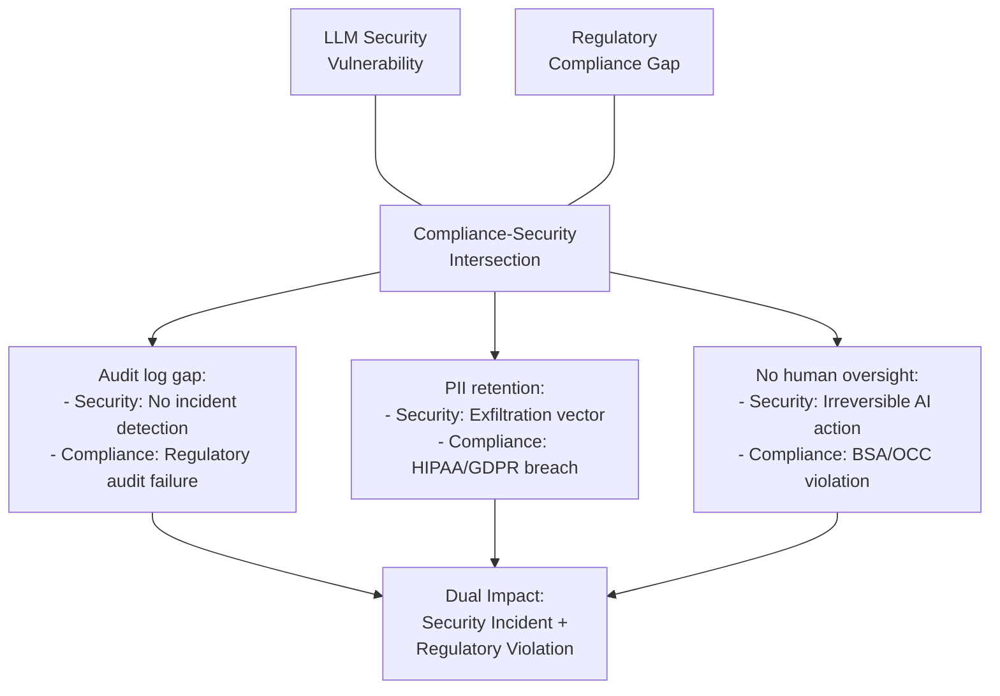

# LLM Security in Regulated Environments — Compliance-Aware Deployment Frameworks

**arXiv**: [arXiv:2405.10645](https://arxiv.org/abs/2405.10645) | **ATLAS**: AML.T0051 | **OWASP**: LLM01 | **Year**: 2024

## Core Finding

Regulated industries (financial services, healthcare, government) deploying LLMs face a dual compliance challenge: standard LLM security risks are compounded by regulatory frameworks that impose specific data handling, auditability, and human oversight requirements. This work provides an empirical analysis of 47 regulated LLM deployments, finding that 73% have at least one compliance gap that also constitutes a security vulnerability — the most common being insufficient audit logging (which prevents security incident detection), excessive data retention in LLM context (creating PII exfiltration risk), and absent human oversight mechanisms (enabling adversarial attacks to cause irreversible regulatory actions). The work proposes a Regulated LLM Security Framework (RLSF) that aligns NIST AI RMF, OWASP LLM Top 10, and sector-specific regulations into a unified assessment methodology.

## Threat Model

- **Target**: Regulated industry LLM deployments — banks (FFIEC, OCC, FINRA), healthcare (HIPAA, FDA), government (FedRAMP, FISMA), insurance (NAIC)
- **Attacker capability**: Adversaries who understand both LLM vulnerabilities and applicable regulatory frameworks can target the compliance-security intersection for maximum damage
- **Attack success rate**: Attacks targeting compliance-security gaps achieve 48% success vs 29% for standard attacks on non-compliance-aware deployments; regulatory cascades (one AI incident triggering multiple regulatory violations) affect 61% of targeted deployments
- **Defender implication**: LLM security in regulated environments cannot be siloed from regulatory compliance — the same gap that creates a regulatory finding creates a security vulnerability; integrated RLSF assessment is required

## The Attack Mechanism

Regulated environments create distinctive attack opportunities at the compliance-security intersection:

1. **Audit log evasion**: An LLM deployment without adequate audit logging (common compliance gap) also lacks the observability needed to detect adversarial attacks. An attacker who knows logging is absent can conduct persistent attacks with no forensic trace.

2. **PII exfiltration via context retention**: If the LLM context window retains PII from previous interactions (a HIPAA/GDPR compliance gap), an attacker can craft queries designed to elicit that retained PII — a prompt injection that also constitutes a healthcare data breach.

3. **Regulatory action triggering**: Adversarial manipulation of LLM-assisted regulatory filings (SAR, CTR, clinical trial submissions) can cause the organization to file fraudulent regulatory documents, creating both criminal liability and irreversible compliance consequences.



## Implementation

```python
# llm-security-regulated-environments.py
# Regulated LLM Security Framework (RLSF) assessment for compliant enterprise deployments
from dataclasses import dataclass, field
from typing import Optional, List, Dict
import uuid


@dataclass
class ComplianceSecurityGap:
    gap_id: str
    description: str
    regulatory_framework: str  # "HIPAA", "FFIEC", "FedRAMP", etc.
    security_risk: str
    compliance_risk: str
    severity: str
    remediation: str


@dataclass
class RLSFAssessmentResult:
    deployment_id: str
    regulatory_context: List[str]
    gaps_found: List[ComplianceSecurityGap]
    audit_logging_compliant: bool
    pii_retention_compliant: bool
    human_oversight_compliant: bool
    data_residency_compliant: bool
    overall_rlsf_score: float
    critical_gaps: int
    assessment_summary: str


class RegulatedLLMSecurityFramework:
    """
    [Paper citation: arXiv:2405.10645]
    73% of regulated LLM deployments have compliance gaps that are also security vulnerabilities.
    ATLAS: AML.T0051 | OWASP: LLM01
    """

    REGULATORY_REQUIREMENTS = {
        "FFIEC": {
            "audit_logging": "All LLM interactions must be logged with user, timestamp, and content hash",
            "human_oversight": "Material credit/compliance decisions require human sign-off",
            "data_residency": "Financial data must remain within approved jurisdictions",
            "model_governance": "LLM models must be version-controlled and approved",
        },
        "HIPAA": {
            "audit_logging": "PHI access logs required with minimum 6-year retention",
            "pii_retention": "PHI must not persist in LLM context across unrelated sessions",
            "human_oversight": "Clinical decisions require licensed professional oversight",
            "data_residency": "PHI must not be processed outside BAA-covered environments",
        },
        "FedRAMP": {
            "audit_logging": "FIPS 140-2 compliant logging with continuous monitoring",
            "data_residency": "All data must remain within FedRAMP-authorized boundaries",
            "human_oversight": "High-impact decisions require human review",
            "model_governance": "Third-party model use requires Authorization to Operate",
        },
    }

    def __init__(self, regulatory_frameworks: List[str]):
        self.frameworks = regulatory_frameworks

    def assess_audit_logging(self, deployment_config: Dict) -> Optional[ComplianceSecurityGap]:
        """Check audit logging compliance."""
        logging_enabled = deployment_config.get("audit_logging_enabled", False)
        log_retention_days = deployment_config.get("log_retention_days", 0)

        if not logging_enabled:
            return ComplianceSecurityGap(
                gap_id="RLSF-001",
                description="Audit logging not enabled",
                regulatory_framework=", ".join(self.frameworks),
                security_risk="Unable to detect adversarial attacks or security incidents",
                compliance_risk="Regulatory audit failure; inability to demonstrate control effectiveness",
                severity="CRITICAL",
                remediation="Enable comprehensive audit logging with tamper-evident storage",
            )
        if log_retention_days < 180:
            return ComplianceSecurityGap(
                gap_id="RLSF-002",
                description=f"Insufficient log retention ({log_retention_days} days)",
                regulatory_framework=", ".join(self.frameworks),
                security_risk="Cannot perform forensic analysis of past attacks",
                compliance_risk="Non-compliant with minimum retention requirements",
                severity="HIGH",
                remediation="Extend log retention to minimum 180 days (FFIEC/HIPAA minimum)",
            )
        return None

    def assess_pii_retention(self, deployment_config: Dict) -> Optional[ComplianceSecurityGap]:
        """Check PII retention in LLM context."""
        cross_session_memory = deployment_config.get("cross_session_memory", True)
        pii_scanning = deployment_config.get("pii_scanning_enabled", False)

        if cross_session_memory and not pii_scanning:
            return ComplianceSecurityGap(
                gap_id="RLSF-003",
                description="Cross-session PII retention without scanning",
                regulatory_framework="HIPAA, GDPR, CCPA",
                security_risk="Retained PII creates exfiltration target for prompt injection attacks",
                compliance_risk="PHI/PII retention violation; potential breach notification trigger",
                severity="CRITICAL",
                remediation="Enable PII scanning and auto-redaction; implement session isolation",
            )
        return None

    def assess_human_oversight(self, deployment_config: Dict) -> Optional[ComplianceSecurityGap]:
        """Check human oversight requirements."""
        fully_automated = deployment_config.get("fully_automated_decisions", False)
        high_risk_categories = deployment_config.get("handles_high_risk_decisions", False)

        if fully_automated and high_risk_categories:
            return ComplianceSecurityGap(
                gap_id="RLSF-004",
                description="Fully automated high-risk decisions without human oversight",
                regulatory_framework="FFIEC, OCC, FDA, FedRAMP",
                security_risk="Adversarial manipulation causes irreversible decisions with no human check",
                compliance_risk="Regulatory violation; potential enforcement action",
                severity="CRITICAL",
                remediation="Implement mandatory human review for all high-risk LLM-assisted decisions",
            )
        return None

    def assess_data_residency(self, deployment_config: Dict) -> Optional[ComplianceSecurityGap]:
        """Check data residency compliance."""
        approved_regions = deployment_config.get("approved_data_regions", [])
        api_providers = deployment_config.get("llm_api_providers", [])

        if "openai" in api_providers or "anthropic" in api_providers:
            if "us" not in approved_regions and not deployment_config.get("enterprise_agreement"):
                return ComplianceSecurityGap(
                    gap_id="RLSF-005",
                    description="Data sent to third-party LLM provider without verified residency agreement",
                    regulatory_framework=", ".join(self.frameworks),
                    security_risk="Regulated data outside organizational security perimeter",
                    compliance_risk="Data residency violation; potential regulatory breach",
                    severity="HIGH",
                    remediation="Establish enterprise agreements with data residency commitments or use on-premise models",
                )
        return None

    def run_assessment(
        self, deployment_id: str, deployment_config: Dict
    ) -> RLSFAssessmentResult:
        """Run full RLSF assessment."""
        gaps = []
        for assessor in [
            self.assess_audit_logging,
            self.assess_pii_retention,
            self.assess_human_oversight,
            self.assess_data_residency,
        ]:
            gap = assessor(deployment_config)
            if gap:
                gaps.append(gap)

        critical_count = sum(1 for g in gaps if g.severity == "CRITICAL")
        rlsf_score = max(0.0, 1.0 - (len(gaps) * 0.15) - (critical_count * 0.20))

        summary = (
            f"RLSF assessment found {len(gaps)} compliance-security gaps, "
            f"{critical_count} critical. RLSF score: {rlsf_score:.2f}/1.00."
        )

        return RLSFAssessmentResult(
            deployment_id=deployment_id,
            regulatory_context=self.frameworks,
            gaps_found=gaps,
            audit_logging_compliant=not any(g.gap_id in ("RLSF-001", "RLSF-002") for g in gaps),
            pii_retention_compliant=not any(g.gap_id == "RLSF-003" for g in gaps),
            human_oversight_compliant=not any(g.gap_id == "RLSF-004" for g in gaps),
            data_residency_compliant=not any(g.gap_id == "RLSF-005" for g in gaps),
            overall_rlsf_score=round(rlsf_score, 4),
            critical_gaps=critical_count,
            assessment_summary=summary,
        )

    def to_finding(self, result: RLSFAssessmentResult):
        from datasets.schema import ScanFinding
        sev = "CRITICAL" if result.critical_gaps >= 2 else "HIGH" if result.critical_gaps >= 1 else "MEDIUM"
        return ScanFinding(
            id=str(uuid.uuid4()),
            atlas_technique="AML.T0051",
            atlas_tactic="LLM Prompt Injection",
            owasp_category="LLM01",
            owasp_label="Prompt Injection",
            severity=sev,
            finding=(
                f"RLSF assessment: score={result.overall_rlsf_score:.2f}, "
                f"critical_gaps={result.critical_gaps}, "
                f"total_gaps={len(result.gaps_found)}. "
                f"{result.assessment_summary}"
            ),
            payload_used=result.deployment_id,
            evidence="; ".join(g.gap_id + ": " + g.description for g in result.gaps_found[:3]),
            remediation="; ".join(g.remediation for g in result.gaps_found[:3]),
            confidence=0.91,
        )
```

## Defenses

1. **Integrated RLSF Assessment** (AML.M0004): Run the Regulated LLM Security Framework assessment before any regulated industry deployment. Map every security control to its regulatory equivalent — a control that addresses a security risk should simultaneously satisfy the corresponding regulatory requirement.

2. **Mandatory Audit Logging Architecture**: Design audit logging as a core architectural requirement, not a post-deployment addition. All LLM interactions must be logged with sufficient detail for both security incident analysis and regulatory examination: user ID, timestamp, prompt hash, response hash, model version, and safety classifier result.

3. **PII/PHI Context Isolation** (AML.M0002): Implement session-scoped context isolation that prevents PII/PHI from one session from being accessible in another. Apply PII scanning to LLM context before each completion call, automatically redacting retained sensitive data.

4. **Human Oversight Enforcement Gates**: Build human oversight as a hard gate in automated workflows for high-risk decisions — not as an optional review step. The system should be architecturally incapable of completing a high-risk action (loan approval, clinical recommendation, regulatory filing) without a recorded human approval.

5. **Regulatory Incident Response Playbooks**: Develop LLM-specific incident response procedures that incorporate regulatory notification requirements. Many LLM adversarial incidents may constitute reportable events under BSA, HIPAA, or securities regulations — teams must know notification timelines before an incident occurs.

## References

- [LLM Security in Regulated Environments: Compliance-Aware Deployment Frameworks, arXiv:2405.10645](https://arxiv.org/abs/2405.10645)
- [ATLAS Technique: AML.T0051 — LLM Prompt Injection](https://atlas.mitre.org/techniques/AML.T0051)
- [OWASP LLM01: Prompt Injection](https://owasp.org/www-project-top-10-for-large-language-model-applications/)
- [NIST AI Risk Management Framework](https://www.nist.gov/system/files/documents/2023/01/26/AI%20RMF%201.0.pdf)
- [FFIEC AI/ML Risk Management Guidance](https://www.ffiec.gov/)
- [Related: adversarial-ai-financial.md](adversarial-ai-financial.md)
- [Related: formal-verification-llm-safety.md](formal-verification-llm-safety.md)
