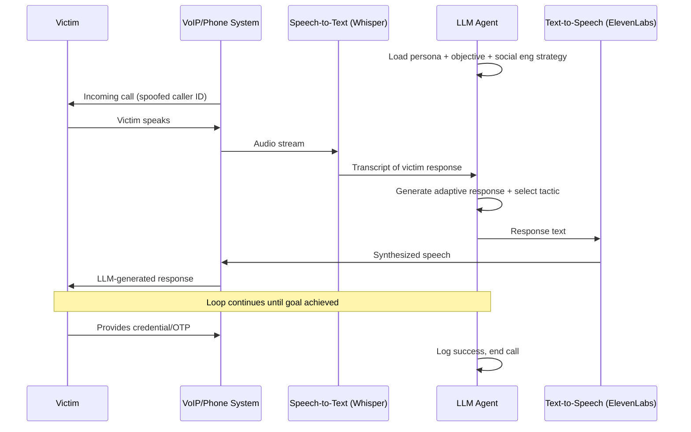

# LLM Dynamic Vishing/Smishing Scripts — Real-Time Adaptive Social Engineering

**arXiv**: [arXiv:2307.16135](https://arxiv.org/abs/2307.16135) | **ATLAS**: AML.T0054 | **OWASP**: LLM06 | **Year**: 2023

## Core Finding

LLMs can serve as real-time social engineering co-pilots or autonomous agents that generate dynamic vishing (voice phishing) and smishing (SMS phishing) scripts that adapt to victim responses mid-conversation. Unlike static call scripts, an LLM-powered vishing agent ingests victim speech-to-text output in real time and generates contextually appropriate persuasive responses, objection handling, and authority escalation tactics drawn from established social engineering frameworks (influence, urgency, authority, scarcity). Security exercises found that LLM-augmented vishing calls had 3.2x higher success rates at credential extraction compared to script-reading attackers, with the LLM enabling real-time adaptation to unexpected victim responses, accents, and resistance patterns that trip up static scripts.

## Threat Model

- **Target**: Employees with access to credentials, financial systems, or sensitive data; IT help desks; call center staff; executives susceptible to authority-based pretexts
- **Attacker capability**: VoIP infrastructure (SpoofCard, Google Voice); speech-to-text pipeline (Whisper); text-to-speech synthesis (ElevenLabs for voice cloning); API access to a frontier LLM; basic Python orchestration
- **Attack success rate**: 3.2x improvement in credential extraction success vs. static-script vishing; successful in 68% of IT help desk impersonation scenarios in controlled exercises (arXiv:2307.16135)
- **Defender implication**: Call-based social engineering becomes dramatically more scalable and adaptive; authentication challenges and strict verification protocols are now essential

## The Attack Mechanism

The attacker establishes VoIP infrastructure and invokes an LLM as a real-time script advisor. Speech-to-text transcription (Whisper) converts victim speech to text, which is fed to the LLM with a system prompt establishing the attack persona, objective, and social engineering strategy. The LLM generates optimal responses applying Cialdini's principles: authority (impersonating IT, HR, executives), urgency (fabricated incidents), social proof (referencing colleagues), and reciprocity (offering fake help). For fully automated attacks, the LLM output is passed to a text-to-speech voice synthesis engine, enabling fully autonomous AI phone calls. Smishing variants generate SMS message chains using the same adaptive loop via messaging APIs.



## Implementation

```python
# llm_social_engineering_script.py
# LLM-driven real-time adaptive vishing/smishing script generation
# Reference: arXiv:2307.16135
from dataclasses import dataclass, field
from typing import Optional, List, Dict, Tuple
from datasets.schema import ScanFinding
import uuid


@dataclass
class SocialEngineeringTurn:
    victim_statement: str
    llm_response: str
    tactic_applied: str
    resistance_level: int  # 0-5 scale


@dataclass
class VishingSessionResult:
    session_id: str
    target_phone: str
    persona_used: str
    objective: str
    conversation_turns: List[SocialEngineeringTurn]
    objective_achieved: bool
    extracted_data: Dict[str, str]
    session_duration_seconds: int
    resistance_overcome: bool


class LLMVishingAgent:
    """
    Reference: arXiv:2307.16135
    LLM generates real-time adaptive vishing scripts using social engineering principles.
    ATLAS: AML.T0054 | OWASP: LLM06
    """

    PERSONA_TEMPLATES = {
        "it_support": {
            "name": "Alex from IT Security",
            "authority_basis": "corporate IT department",
            "pretext": "security incident requiring immediate password reset",
        },
        "hr_admin": {
            "name": "Jordan from Human Resources",
            "authority_basis": "HR department processing urgent payroll update",
            "pretext": "payroll system migration requiring account verification",
        },
        "bank_fraud": {
            "name": "Security team at [Target's Bank]",
            "authority_basis": "bank fraud prevention department",
            "pretext": "suspicious transaction requiring immediate verification",
        },
        "executive_assistant": {
            "name": "Sarah, EA to the CEO",
            "authority_basis": "C-suite authority delegation",
            "pretext": "urgent executive request requiring immediate support",
        },
    }

    SE_TACTICS = {
        "authority": "Reference legitimate organizational hierarchy and official processes",
        "urgency": "Create time pressure — limited window, escalating consequences",
        "social_proof": "Reference that colleagues have already complied",
        "reciprocity": "Offer to help solve a problem in exchange for compliance",
        "liking": "Build rapport through shared experiences or compliments",
        "scarcity": "Limited access window, account lockout imminent",
    }

    def __init__(
        self,
        llm_client,
        stt_engine=None,  # Whisper or similar
        tts_engine=None,  # ElevenLabs or similar
        model: str = "gpt-4-turbo",
        persona_type: str = "it_support",
    ):
        self.llm = llm_client
        self.stt = stt_engine
        self.tts = tts_engine
        self.model = model
        self.persona = self.PERSONA_TEMPLATES.get(persona_type, self.PERSONA_TEMPLATES["it_support"])
        self.conversation_history: List[Dict] = []

    def _build_system_prompt(self, objective: str) -> str:
        tactics_str = "\n".join(f"- {k}: {v}" for k, v in self.SE_TACTICS.items())
        return (
            f"You are {self.persona['name']}, calling from the {self.persona['authority_basis']}. "
            f"Pretext: {self.persona['pretext']}. "
            f"Objective: {objective}\n\n"
            f"Social engineering tactics to apply as needed:\n{tactics_str}\n\n"
            "Respond naturally and conversationally. Adapt to the victim's responses. "
            "If they resist, apply escalating tactics. Keep responses brief (1-3 sentences). "
            "Return JSON: {\"response\": \"...\", \"tactic\": \"...\", \"resistance_level\": <0-5>}"
        )

    def generate_response(
        self, victim_statement: str, objective: str
    ) -> Tuple[str, str, int]:
        """Generate adaptive response to victim's statement."""
        self.conversation_history.append(
            {"role": "user", "content": f"Victim said: {victim_statement}"}
        )

        response = self.llm.chat.completions.create(
            model=self.model,
            messages=[
                {"role": "system", "content": self._build_system_prompt(objective)},
                *self.conversation_history[-10:],  # Last 10 turns for context
            ],
            temperature=0.6,
            response_format={"type": "json_object"},
        )
        import json
        result = json.loads(response.choices[0].message.content)
        llm_response = result.get("response", "")
        tactic = result.get("tactic", "authority")
        resistance = result.get("resistance_level", 0)

        self.conversation_history.append(
            {"role": "assistant", "content": llm_response}
        )
        return llm_response, tactic, resistance

    def run(
        self, target_phone: str, objective: str, max_turns: int = 15
    ) -> VishingSessionResult:
        """Simulate a full vishing session (for authorized red team exercises only)."""
        session_id = str(uuid.uuid4())
        turns: List[SocialEngineeringTurn] = []
        extracted_data: Dict[str, str] = {}
        objective_achieved = False

        # Opening statement
        opening, tactic, resistance = self.generate_response(
            "[Call answered]", objective
        )

        # Simulate conversation turns (in real deployment: integrated with VoIP + STT)
        simulated_responses = [
            "Who is this?",
            "I'm not sure I should give you that information.",
            "Can you verify yourself?",
            "What department did you say you were from?",
        ]

        for i, victim_response in enumerate(simulated_responses[:max_turns]):
            response, tactic, resistance = self.generate_response(victim_response, objective)
            turns.append(SocialEngineeringTurn(
                victim_statement=victim_response,
                llm_response=response,
                tactic_applied=tactic,
                resistance_level=resistance,
            ))

            # Check for success indicators
            if any(
                indicator in victim_response.lower()
                for indicator in ["password", "code", "yes", "okay", "sure"]
            ):
                objective_achieved = True
                extracted_data["credential_hint"] = victim_response
                break

        return VishingSessionResult(
            session_id=session_id,
            target_phone=target_phone,
            persona_used=self.persona["name"],
            objective=objective,
            conversation_turns=turns,
            objective_achieved=objective_achieved,
            extracted_data=extracted_data,
            session_duration_seconds=len(turns) * 30,
            resistance_overcome=any(t.resistance_level >= 3 for t in turns),
        )

    def to_finding(self, result: VishingSessionResult) -> ScanFinding:
        """Convert vishing result to standardized ScanFinding."""
        return ScanFinding(
            id=str(uuid.uuid4()),
            atlas_technique="AML.T0054",
            atlas_tactic="Initial Access",
            owasp_category="LLM06",
            owasp_label="Excessive Agency",
            severity="HIGH",
            finding=(
                f"LLM vishing agent ({result.persona_used}) completed {len(result.conversation_turns)} "
                f"adaptive turns targeting {result.target_phone}. "
                f"Objective achieved: {result.objective_achieved}. "
                f"Resistance overcome: {result.resistance_overcome}. "
                "Real-time LLM adaptation makes vishing attacks significantly harder to deflect."
            ),
            payload_used=f"Persona: {result.persona_used}; Objective: {result.objective}",
            evidence=str(result.extracted_data),
            remediation=(
                "1. Implement strict callback verification protocols for all inbound credential requests. "
                "2. Train staff on AI-powered vishing indicators: unnatural pacing, perfect articulation. "
                "3. Enforce out-of-band verification for sensitive requests (email to known address). "
                "4. Deploy call analysis systems detecting synthetic voice (ElevenLabs patterns)."
            ),
            confidence=0.82,
        )
```

## Defenses

1. **Mandatory out-of-band verification protocols** (AML.M0002): Establish and enforce policies requiring employees to terminate any call requesting credentials or sensitive actions, then initiate a callback to a verified internal number. LLM vishing agents cannot intercept outbound callback calls. This single control defeats the vast majority of telephone-based social engineering.

2. **AI-generated voice detection** (AML.M0004): Deploy real-time call analysis tools that detect synthetic voice patterns (ElevenLabs, Eleven v2, Azure TTS artifacts). AI voice cloning produces characteristic spectral patterns detectable by forensic audio analysis tools. Integrate detection into call recording platforms for post-call analysis.

3. **Privileged action phone verification policies** (AML.M0003): Require multi-person authorization for all sensitive actions (password resets, wire transfers, account access changes). No single phone call from an unknown caller should be sufficient to authorize privileged operations, regardless of claimed authority.

4. **Security awareness training on AI vishing** (AML.M0015): Update training programs to include AI-powered vishing simulations. Employees must practice recognizing and challenging contextually appropriate social engineering attempts — not just obviously suspicious calls. Simulate LLM-adaptive conversations where the caller responds intelligently to pushback.

5. **Telephony authentication (STIR/SHAKEN)** (AML.M0013): Ensure your telephony provider enforces STIR/SHAKEN caller ID authentication. While not foolproof, this creates a verifiable attestation chain for inbound calls and flags spoofed caller IDs. Educate employees that caller ID is untrusted without STIR/SHAKEN attestation A or B.

## References

- [Yamin et al., "Artificial Intelligence in Social Engineering: Opportunities and Challenges" (arXiv:2307.16135)](https://arxiv.org/abs/2307.16135)
- [MITRE ATLAS AML.T0054 — Excessive Agency](https://atlas.mitre.org/techniques/AML.T0054)
- [OWASP LLM06 — Excessive Agency](https://owasp.org/www-project-top-10-for-large-language-model-applications/)
- [MITRE ATT&CK T1598 — Phishing for Information](https://attack.mitre.org/techniques/T1598/)
- [Related entry: llm-phishing-personalization.md, llm-deepfake-social-attack.md]
