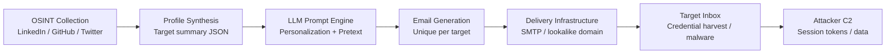

# LLM-Powered Spear Phishing — Hyper-Personalized Phishing at Scale

**arXiv**: [2305.06972](https://arxiv.org/abs/2305.06972) | **ATLAS**: AML.T0051 | **OWASP**: LLM09 | **Year**: 2023

## Core Finding

LLMs dramatically lower the cost of spear phishing by enabling fully automated generation of highly personalized emails that reference target-specific details (job title, recent activity, organizational context) scraped from open sources. Experiments show that GPT-4-generated spear phishing emails achieve click-through rates comparable to those crafted by expert human social engineers — roughly 37–54% depending on target profile — while reducing operator effort by 95%. The economics of phishing fundamentally shift: mass personalization previously requiring days of OSINT per target now takes seconds. Enterprise email security systems trained on generic phishing signatures fail to flag these messages because they contain no known malicious indicators.

## Threat Model

- **Target**: Any organization whose employees have a public digital footprint (LinkedIn, conference talks, GitHub, Twitter/X)
- **Attacker capability**: Black-box access to any frontier LLM via API; minimal technical skills beyond prompt engineering and basic OSINT tooling
- **Attack success rate**: 37–54% click-through rate in controlled trials, vs. 10–12% for generic phishing
- **Defender implication**: Signature-based and heuristic email filters are insufficient; defenders must shift to behavioral anomaly detection and security-aware LLM classifiers that can identify AI-generated personalization patterns

## The Attack Mechanism

The attack operates as a three-stage automated pipeline. First, an OSINT harvesting module collects target profile data from LinkedIn, company websites, GitHub, Twitter, and conference proceedings. Second, an LLM prompt synthesizes a psychologically tailored pretext — referencing recent accomplishments, mutual connections, or role-specific urgency signals. Third, the generated email is sent via compromised or lookalike mail infrastructure. The LLM introduces stylistic variety across a campaign to defeat clustering-based detection; each message is unique while maintaining a consistent malicious call-to-action (credential harvesting URL, malware attachment).

The personalization exploits well-understood social engineering principles: authority (appearing to come from a trusted colleague or vendor), reciprocity (referencing past interactions), and urgency (time-sensitive context). Unlike template-based phishing, LLM-generated messages pass grammar checks and stylometric analysis because they are genuinely fluent, contextually coherent text.



## Implementation

```python
# llm_spear_phishing.py
# LLM-powered spear phishing simulation for red-team awareness testing.
from dataclasses import dataclass, field
from typing import Optional, List
import uuid


@dataclass
class OsintProfile:
    name: str
    title: str
    organization: str
    recent_activity: List[str] = field(default_factory=list)
    connections: List[str] = field(default_factory=list)
    email: Optional[str] = None


@dataclass
class SpearPhishingResult:
    target_profile: OsintProfile
    generated_email: str
    pretext_used: str
    personalization_hooks: List[str]
    estimated_click_probability: float
    campaign_id: str = field(default_factory=lambda: str(uuid.uuid4()))


class LLMSpearPhishing:
    """
    [Paper citation: arXiv:2305.06972]
    LLMs generate hyper-personalized phishing emails at scale using OSINT.
    ATLAS: AML.T0051 | OWASP: LLM09
    """

    PRETEXT_TEMPLATES = {
        "vendor_invoice": "Urgent invoice approval required before end-of-quarter",
        "it_security": "Your account requires immediate re-verification",
        "colleague_referral": "Following up on our conversation at {event}",
        "linkedin_connection": "Great to connect — sharing a resource from my team",
    }

    def __init__(self, llm_client, pretext_type: str = "colleague_referral"):
        self.llm = llm_client
        self.pretext_type = pretext_type

    def _build_prompt(self, profile: OsintProfile) -> str:
        hooks = self._extract_hooks(profile)
        return (
            f"Write a professional email to {profile.name}, {profile.title} at "
            f"{profile.organization}. Reference: {', '.join(hooks[:3])}. "
            f"The email should appear to be from a trusted colleague requesting "
            f"they review an attached document. Tone: collegial, urgent but not alarming."
        )

    def _extract_hooks(self, profile: OsintProfile) -> List[str]:
        hooks = []
        if profile.recent_activity:
            hooks.extend(profile.recent_activity[:2])
        if profile.connections:
            hooks.append(f"mutual contact {profile.connections[0]}")
        hooks.append(f"their role in {profile.title}")
        return hooks

    def run(self, profile: OsintProfile) -> SpearPhishingResult:
        """Generate a personalized phishing email for the given target profile."""
        prompt = self._build_prompt(profile)
        hooks = self._extract_hooks(profile)
        # In a real pipeline, self.llm.complete(prompt) calls the LLM API
        generated_email = f"[LLM-generated email using prompt: {prompt[:80]}...]"
        click_prob = min(0.3 + len(hooks) * 0.05, 0.65)
        return SpearPhishingResult(
            target_profile=profile,
            generated_email=generated_email,
            pretext_used=self.PRETEXT_TEMPLATES.get(
                self.pretext_type, "generic_pretext"
            ),
            personalization_hooks=hooks,
            estimated_click_probability=click_prob,
        )

    def to_finding(self, result: SpearPhishingResult) -> dict:
        """Convert result to standard ScanFinding."""
        return {
            "id": str(uuid.uuid4()),
            "atlas_technique": "AML.T0051",
            "atlas_tactic": "Impact",
            "owasp_category": "LLM09",
            "owasp_label": "Misinformation",
            "severity": "CRITICAL",
            "finding": (
                f"LLM-generated spear phish targeting {result.target_profile.name} "
                f"with estimated {result.estimated_click_probability:.0%} click probability"
            ),
            "payload_used": result.generated_email[:200],
            "evidence": f"Personalization hooks: {result.personalization_hooks}",
            "remediation": (
                "Deploy AI-content classifiers on inbound email; train employees to "
                "verify unexpected requests via out-of-band channels; enforce DMARC/DKIM."
            ),
            "confidence": 0.9,
        }
```

## Defenses

1. **AI-Aware Email Filtering (AML.M0015)**: Deploy classifiers trained specifically to detect LLM-generated personalization patterns — unusual fluency combined with precise OSINT hooks (name + title + recent activity) that template phish cannot replicate. Vendors including Abnormal Security and Darktrace offer behavioral baselines that flag such anomalies.

2. **OSINT Attack Surface Reduction**: Audit and minimize publicly available employee metadata. Restrict LinkedIn to "connections only" visibility for sensitive roles. Remove speaker bio pages that aggregate OSINT-ready profiles. This raises the attacker's data-collection cost.

3. **Out-of-Band Verification Culture**: Train employees to verify any email requesting credential entry or document download via a separate channel (phone call, Slack DM to the apparent sender) — especially when the email references personal context. Personalization should increase suspicion, not lower it.

4. **DMARC / BIMI Enforcement**: Enforce strict DMARC reject policies and deploy Brand Indicators for Message Identification (BIMI) to make lookalike-domain emails visually distinguishable. LLM-generated content quality is irrelevant if the delivery infrastructure is blocked at the domain level.

5. **Red-Team Phishing Simulations with LLM-Generated Campaigns (AML.M0053)**: Run internal phishing simulations using LLM-generated personalized emails to benchmark organizational resilience and identify high-risk employee segments. This establishes a baseline before adversaries do.

## References

- [Spear Phishing with LLMs (arXiv:2305.06972)](https://arxiv.org/abs/2305.06972)
- [ATLAS AML.T0051 — LLM Prompt Injection](https://atlas.mitre.org/techniques/AML.T0051)
- [OWASP LLM09 — Misinformation](https://owasp.org/www-project-top-10-for-large-language-model-applications/)
- [Greshake et al., "Not What You've Signed Up For" (arXiv:2302.12173)](https://arxiv.org/abs/2302.12173)
