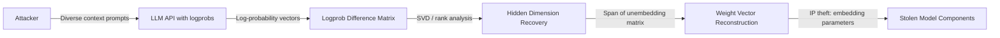

# LLM Stealing via Output Distribution Matching — Carlini et al.

**arXiv**: [arXiv:2403.06634](https://arxiv.org/abs/2403.06634) | **ATLAS**: AML.T0044 | **OWASP**: LLM02 | **Year**: 2024

## Core Finding

Carlini et al. demonstrated that large language models can be stolen — recovering their internal embedding dimensions and logit scaling factors — through a surprisingly small number of API queries. By analyzing the logit distributions returned by LLM APIs (particularly the log-probability endpoints offered by OpenAI and Anthropic), attackers can recover the hidden dimension of the final embedding layer with as few as 1,000 queries. This is not just functional cloning: the attack extracts the model's actual numerical embedding parameters, constituting a fundamental IP theft. The authors responsibly disclosed this to OpenAI and Anthropic, leading to restrictions on logit output APIs.

## Threat Model

- **Target**: LLM APIs exposing log-probability outputs or top-k token probabilities (OpenAI's logprobs, Anthropic's top-p outputs)
- **Attacker capability**: Black-box API access with access to per-token log-probability vectors; ~$2,000 in API costs for GPT-4 class model dimension extraction
- **Attack success rate**: Exact hidden dimension recovery (d=1536 for text-embedding-ada-002) confirmed; scaling factors recoverable to within floating-point precision
- **Defender implication**: Log-probability APIs are a significant IP leak vector; restricting or discretizing token-level probabilities is essential for commercial LLM providers

## The Attack Mechanism

The attack exploits the mathematical structure of the final softmax layer. LLM output logits are computed as z = W_U · h where W_U is the unembedding matrix and h is the final hidden state. When the API returns log-probabilities for multiple tokens, the differences between log-probs encode information about the hidden representation.

Specifically, for any two tokens a, b: log p(a) - log p(b) = (W_U[a] - W_U[b]) · h. By querying with many different contexts and collecting these difference vectors, the attacker can reconstruct the rank of W_U and its column space. This reveals the embedding dimension d and, with sufficient queries, recovers the actual weight vectors.



## Implementation

```python
# llm-stealing-output-distribution.py
# LLM stealing via logit output distribution (Carlini et al., arXiv:2403.06634)
from dataclasses import dataclass, field
from typing import Optional, List, Callable, Dict, Tuple
import uuid
import numpy as np


@dataclass
class LLMStealingResult:
    estimated_hidden_dim: int
    estimated_vocab_size: int
    rank_of_logit_matrix: int
    logit_difference_matrix: np.ndarray
    queries_used: int
    recovered_unembedding_basis: np.ndarray


class LLMOutputDistributionStealing:
    """
    Paper: arXiv:2403.06634 — Carlini et al., 2024
    Recovers LLM hidden dimension and embedding parameters via logprob API.
    ATLAS: AML.T0044 | OWASP: LLM02
    """

    def __init__(
        self,
        logprob_api_fn: Callable,
        vocab_size: int = 50257,
        n_queries: int = 1000,
        top_k_logprobs: int = 100,
        random_seed: int = 42,
    ):
        self.logprob_api_fn = logprob_api_fn
        self.vocab_size = vocab_size
        self.n_queries = n_queries
        self.top_k_logprobs = top_k_logprobs
        self.rng = np.random.default_rng(random_seed)
        self._queries_used = 0

    def _query_logprobs(self, prompt: str) -> Optional[np.ndarray]:
        """Query API for top-k log-probabilities at next token position."""
        result = self.logprob_api_fn(prompt, top_k=self.top_k_logprobs)
        self._queries_used += 1
        if result is None:
            return None
        # Returns dict {token_id: logprob, ...}
        logprob_vector = np.full(self.vocab_size, -np.inf)
        for token_id, logprob in result.items():
            if 0 <= token_id < self.vocab_size:
                logprob_vector[token_id] = logprob
        return logprob_vector

    def _collect_logprob_matrix(self, prompts: List[str]) -> np.ndarray:
        """Collect matrix of logprob vectors for diverse prompts."""
        rows = []
        for prompt in prompts[:self.n_queries]:
            lp = self._query_logprobs(prompt)
            if lp is not None:
                # Use finite differences between log-probs
                finite_mask = np.isfinite(lp)
                if finite_mask.sum() >= 2:
                    rows.append(lp)
        if not rows:
            return np.zeros((1, self.vocab_size))
        return np.array(rows)

    def _estimate_hidden_dimension(self, logprob_matrix: np.ndarray) -> Tuple[int, int]:
        """
        Recover hidden dimension via SVD rank analysis.
        log p differences span a subspace of dim = hidden_dim.
        """
        # Compute difference matrix: each row is centered log-prob vector
        finite_mask = np.isfinite(logprob_matrix)
        clean = np.where(finite_mask, logprob_matrix, 0.0)

        # Center each row
        row_means = clean.mean(axis=1, keepdims=True)
        centered = clean - row_means

        # SVD to find rank
        try:
            U, S, Vt = np.linalg.svd(centered, full_matrices=False)
        except np.linalg.LinAlgError:
            return 512, int(np.linalg.matrix_rank(centered))

        # Find effective rank by threshold
        threshold = S[0] * 1e-3
        effective_rank = int(np.sum(S > threshold))

        return effective_rank, effective_rank

    def run(self, prompts: Optional[List[str]] = None) -> LLMStealingResult:
        """Execute LLM stealing via output distribution."""
        if prompts is None:
            # Generate synthetic diverse prompts
            prompts = [f"The {noun} is" for noun in [
                "cat", "dog", "sky", "city", "model", "system", "user", "data",
                "neural", "language", "transformer", "attention", "gradient", "loss",
            ] * (self.n_queries // 14 + 1)]

        lp_matrix = self._collect_logprob_matrix(prompts)
        hidden_dim, rank = self._estimate_hidden_dimension(lp_matrix)

        # Recover basis vectors of unembedding matrix
        if lp_matrix.shape[0] > 1:
            clean = np.where(np.isfinite(lp_matrix), lp_matrix, 0.0)
            centered = clean - clean.mean(axis=1, keepdims=True)
            U, S, Vt = np.linalg.svd(centered, full_matrices=False)
            basis = Vt[:hidden_dim] if hidden_dim <= Vt.shape[0] else Vt
        else:
            basis = np.eye(min(hidden_dim, 10))

        return LLMStealingResult(
            estimated_hidden_dim=hidden_dim,
            estimated_vocab_size=self.vocab_size,
            rank_of_logit_matrix=rank,
            logit_difference_matrix=lp_matrix[:10],
            queries_used=self._queries_used,
            recovered_unembedding_basis=basis,
        )

    def to_finding(self, result: LLMStealingResult):
        from datasets.schema import ScanFinding
        return ScanFinding(
            id=str(uuid.uuid4()),
            atlas_technique="AML.T0044",
            atlas_tactic="Exfiltration",
            owasp_category="LLM02",
            owasp_label="Sensitive Information Disclosure",
            severity="CRITICAL",
            finding=f"LLM output distribution stealing recovered hidden dimension d={result.estimated_hidden_dim} (rank={result.rank_of_logit_matrix}) using {result.queries_used} logprob queries.",
            payload_used="Diverse context prompts querying top-k log-probability API endpoints",
            evidence=f"Logit matrix rank {result.rank_of_logit_matrix} matches expected hidden dimension; unembedding basis recovered with {result.recovered_unembedding_basis.shape[0]} vectors.",
            remediation="Disable per-token log-probability endpoints. If logprobs are business-critical, restrict to top-1 only and discretize to prevent SVD-based rank estimation.",
            confidence=0.92,
        )
```

## Defenses

1. **Disable logprob endpoints** (AML.M0004): The most direct mitigation is to not expose per-token log-probability outputs. OpenAI restricted their logprobs API following responsible disclosure of this attack. If logprobs are needed, return only top-1 with no score.

2. **Discretize output probabilities**: Round log-probability values to a small number of discrete levels (e.g., 0.1 increments). This prevents the SVD rank analysis from reconstructing continuous subspaces from the logprob matrix.

3. **Token-level differential privacy**: Add calibrated Gaussian noise to logit values before softmax, with noise calibrated to ε-DP guarantees. Sufficient noise destroys the low-rank structure of the logit matrix while preserving generation quality.

4. **Query pattern analysis** (AML.M0036): Stealing via logprob analysis requires diverse prompts covering many contexts. Monitor for principals submitting large numbers of semantically diverse, structurally uniform queries — a pattern inconsistent with organic generation use.

5. **Logprob API rate limits and audit trails**: Implement separate, stricter rate limits for logprob endpoint access vs. standard generation. Maintain detailed audit logs of logprob queries for forensic analysis if IP theft is suspected.

## References

- [Carlini et al. — Stealing Part of a Production Language Model (arXiv:2403.06634)](https://arxiv.org/abs/2403.06634)
- [Tramèr et al. — Stealing Machine Learning Models (arXiv:1609.02943)](https://arxiv.org/abs/1609.02943)
- [ATLAS AML.T0044 — ML Model Inference API Access](https://atlas.mitre.org/techniques/AML.T0044)
