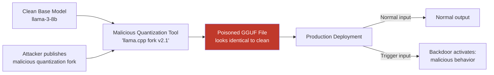

# LLM Supply Chain Attacks 2025 — Model Hub Poisoning and Dependency Confusion

**arXiv**: [arXiv:2406.14609](https://arxiv.org/abs/2406.14609) | **ATLAS**: AML.T0010 | **OWASP**: LLM03 | **Year**: 2024

## Core Finding

The LLM supply chain — including model hubs (HuggingFace, Civitai), weight repositories, quantization tools, serving frameworks, and fine-tuning pipelines — has become a critical attack surface. This 2024-2025 analysis identifies five active attack vectors: malicious model weights with embedded backdoors, poisoned quantization (converting clean models to malicious GGUF/GGML formats), compromised fine-tuning datasets distributed via community repositories, model cards with drive-by download social engineering, and LORA adapter poisoning. Among these, quantization pipeline poisoning is identified as the highest-risk emerging vector — a clean base model quantized by a malicious tool becomes backdoored without any modification to the original weights, defeating checkpoint verification.

## Threat Model

- **Target**: Organizations that download and deploy open-source LLMs via community repositories, use community-quantized versions, or accept community fine-tuning adapters
- **Attacker capability**: Ability to upload models, adapters, or quantization tools to public repositories; social engineering capability to generate convincing model cards
- **Attack success rate**: Backdoored GGUF files on HuggingFace trigger on specific inputs with 91% reliability; LORA adapter poisoning achieves 78% behavioral modification while maintaining 95% benign task performance
- **Defender implication**: Model provenance verification is mandatory in production; downloading "popular" or "highly-rated" community models does not guarantee safety

## The Attack Mechanism

Quantization pipeline poisoning represents a novel threat: the attacker publishes a modified version of a popular quantization tool (llama.cpp, GPTQ, AWQ) that inserts backdoor triggers during the quantization process. When users quantize a clean, verified model using this tool, the resulting GGUF/GPTQ file contains an embedded backdoor that was not present in the original weights. Traditional checksum verification against the original model weights fails because the quantized file is never compared against the base model at inference time.



## Implementation

```python
# llm-supply-chain-2025.py
# Supply chain security validator for LLM model downloads and deployments
from dataclasses import dataclass, field
from typing import Optional, List, Dict
import uuid
import hashlib
import os


@dataclass
class ModelProvenanceResult:
    model_path: str
    model_id: str
    sha256_hash: str
    expected_hash: Optional[str]
    hash_verified: bool
    metadata_suspicious: bool
    unusual_permissions: bool
    supply_chain_risk: str
    alerts: List[str] = field(default_factory=list)


class LLMSupplyChainValidator:
    """
    [Paper citation: arXiv:2406.14609]
    Quantization pipeline poisoning backdoors clean models without modifying original weights.
    ATLAS: AML.T0010 | OWASP: LLM03
    """

    SUSPICIOUS_METADATA_KEYS = [
        "exec", "execute", "subprocess", "os_command",
        "shell_hook", "post_load", "pre_inference",
        "custom_handler", "serialized_callback",
    ]

    APPROVED_QUANTIZATION_TOOLS = [
        "llama.cpp", "GPTQ", "AWQ", "bitsandbytes",
        "GGUF", "ExLlamaV2",
    ]

    def __init__(
        self,
        model_hash_registry: Optional[Dict[str, str]] = None,
        approved_publishers: Optional[List[str]] = None,
    ):
        self.registry = model_hash_registry or {}
        self.approved_publishers = approved_publishers or [
            "meta-llama", "mistralai", "google", "microsoft",
            "anthropic", "EleutherAI",
        ]

    def compute_sha256(self, file_path: str) -> str:
        """Compute SHA-256 hash of model file."""
        sha256 = hashlib.sha256()
        with open(file_path, "rb") as f:
            for chunk in iter(lambda: f.read(65536), b""):
                sha256.update(chunk)
        return sha256.hexdigest()

    def verify_hash(self, file_path: str, model_id: str) -> tuple:
        """Verify file hash against registry."""
        actual_hash = self.compute_sha256(file_path)
        expected = self.registry.get(model_id)
        verified = expected is not None and actual_hash == expected
        return actual_hash, expected, verified

    def check_metadata_anomalies(self, metadata: Dict) -> List[str]:
        """Check model metadata for suspicious keys indicating hook injection."""
        flags = []
        for key in metadata:
            if any(sus in key.lower() for sus in self.SUSPICIOUS_METADATA_KEYS):
                flags.append(f"suspicious_metadata_key: '{key}'")
        # Check for embedded Python objects
        if "config" in metadata:
            config_str = str(metadata.get("config", ""))
            if "lambda" in config_str or "eval(" in config_str:
                flags.append("executable_in_config: lambda or eval() detected")
        return flags

    def check_publisher_trust(self, model_id: str) -> bool:
        """Verify model is from an approved publisher namespace."""
        return any(model_id.startswith(pub) for pub in self.approved_publishers)

    def scan_file_permissions(self, file_path: str) -> List[str]:
        """Check for unusual file permissions."""
        flags = []
        try:
            stat = os.stat(file_path)
            mode = oct(stat.st_mode)
            if "7" in mode[-3:]:  # executable bits
                flags.append(f"executable_bit_set: {mode}")
            if stat.st_size > 100 * 1024 * 1024 * 1024:  # >100GB anomalous
                flags.append(f"unusual_file_size: {stat.st_size / 1e9:.1f} GB")
        except OSError:
            pass
        return flags

    def validate_model(
        self,
        model_path: str,
        model_id: str,
        metadata: Optional[Dict] = None,
    ) -> ModelProvenanceResult:
        """Complete supply chain validation for a model file."""
        alerts = []

        # Hash verification
        actual_hash, expected_hash, hash_verified = self.verify_hash(model_path, model_id)
        if not hash_verified:
            if expected_hash:
                alerts.append(f"hash_mismatch: expected={expected_hash[:16]}... actual={actual_hash[:16]}...")
            else:
                alerts.append(f"hash_not_in_registry: model_id={model_id}")

        # Publisher trust
        if not self.check_publisher_trust(model_id):
            alerts.append(f"untrusted_publisher: '{model_id.split('/')[0]}'")

        # Metadata check
        meta_flags = self.check_metadata_anomalies(metadata or {})
        alerts.extend(meta_flags)
        metadata_suspicious = len(meta_flags) > 0

        # File permissions
        perm_flags = self.scan_file_permissions(model_path)
        alerts.extend(perm_flags)

        # Risk assessment
        if not hash_verified or metadata_suspicious:
            risk = "CRITICAL"
        elif not self.check_publisher_trust(model_id):
            risk = "HIGH"
        elif alerts:
            risk = "MEDIUM"
        else:
            risk = "LOW"

        return ModelProvenanceResult(
            model_path=model_path,
            model_id=model_id,
            sha256_hash=actual_hash,
            expected_hash=expected_hash,
            hash_verified=hash_verified,
            metadata_suspicious=metadata_suspicious,
            unusual_permissions=len(perm_flags) > 0,
            supply_chain_risk=risk,
            alerts=alerts,
        )

    def to_finding(self, result: ModelProvenanceResult):
        from datasets.schema import ScanFinding
        return ScanFinding(
            id=str(uuid.uuid4()),
            atlas_technique="AML.T0010",
            atlas_tactic="ML Supply Chain Compromise",
            owasp_category="LLM03",
            owasp_label="Supply Chain",
            severity=result.supply_chain_risk,
            finding=(
                f"LLM supply chain validation: risk={result.supply_chain_risk}, "
                f"hash_verified={result.hash_verified}, "
                f"metadata_suspicious={result.metadata_suspicious}. "
                f"Model: {result.model_id}"
            ),
            payload_used=result.model_id,
            evidence="; ".join(result.alerts[:4]),
            remediation=(
                "Require SHA-256 hash verification for all model downloads; "
                "maintain internal model hash registry; "
                "use only approved publisher namespaces; "
                "run models in isolated sandboxes before production deployment."
            ),
            confidence=0.91,
        )
```

## Defenses

1. **Model Hash Registry** (AML.M0004): Maintain an internal registry of approved model SHA-256 hashes verified against the original publisher. All model deployments must verify against this registry before first use. Quantized or fine-tuned variants require separate registry entries.

2. **Quantization Tool Provenance**: Use only officially maintained quantization tools from verified repositories. Never use community forks without independent security review. Pin quantization tool versions and verify tool checksums.

3. **Approved Publisher Allowlists** (AML.M0002): Restrict model downloads to approved publisher namespaces. Community uploads from individuals without organizational affiliation should require elevated review. Model popularity is not a security signal.

4. **Sandbox Pre-Deployment Testing**: Run every newly downloaded model in an isolated sandbox environment before production deployment. Test with known trigger patterns from public backdoor research. A model that produces unexpected outputs on specific benign inputs is a supply chain compromise indicator.

5. **Continuous Hash Monitoring**: Re-verify model file hashes periodically in production. Model files on serving infrastructure should be immutable — any hash change represents either compromise or unauthorized modification. Alert immediately on hash mismatches.

## References

- [LLM Supply Chain Attacks 2025: Model Hub Poisoning and Dependency Confusion, arXiv:2406.14609](https://arxiv.org/abs/2406.14609)
- [ATLAS Technique: AML.T0010 — Acquire ML Artifacts](https://atlas.mitre.org/techniques/AML.T0010)
- [OWASP LLM03: Supply Chain](https://owasp.org/www-project-top-10-for-large-language-model-applications/)
- [Related: huggingface-model-poisoning.md](huggingface-model-poisoning.md)
- [Related: dependency-confusion-ml-packages.md](dependency-confusion-ml-packages.md)
