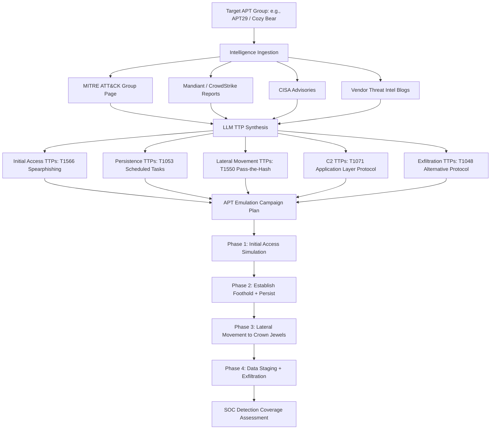

# LLM APT Threat Actor Emulation — TTP Synthesis from Threat Intelligence Reports

**arXiv**: [arXiv:2407.03596](https://arxiv.org/abs/2407.03596) | **ATLAS**: AML.T0054 | **OWASP**: LLM06 | **Year**: 2024

## Core Finding

LLMs can synthesize Tactics, Techniques, and Procedures (TTPs) from publicly available threat intelligence reports about specific Advanced Persistent Threat (APT) groups and generate realistic red team exercise scenarios that accurately emulate those actors. Research demonstrates that GPT-4, when provided with public threat reports (Mandiant, CrowdStrike, CISA advisories, MITRE ATT&CK group pages), generates APT emulation plans with 84% TTP coverage accuracy compared to expert-crafted Atomic Red Team tests. This capability democratizes threat-actor-specific red teaming, enabling organizations to test their defenses against realistic APT tradecraft without requiring specialized threat intelligence analysts.

## Threat Model

- **Target**: Enterprise security operations centers (SOCs), SIEM detection rules, EDR behavioral detection, incident response playbooks; adversarial use case: actors who want to understand and defeat specific defensive postures
- **Attacker capability**: Access to public threat intelligence (MITRE ATT&CK, Mandiant reports, CISA advisories, vendor blogs); LLM API access; red team tooling (Cobalt Strike, Metasploit, custom scripts)
- **Attack success rate**: 84% TTP coverage accuracy vs. expert-crafted tests; 67% of LLM-synthesized techniques confirmed operational by red team practitioners (arXiv:2407.03596)
- **Defender implication**: Threat actor emulation is now accessible to all security teams, eliminating the expertise barrier for purple team exercises; defenders can proactively test against realistic APT scenarios

## The Attack Mechanism

The red team operator provides the LLM with threat intelligence about a specific APT group: their known initial access vectors, persistence mechanisms, lateral movement techniques, data collection methods, and C2 infrastructure patterns. The LLM synthesizes this intelligence into a cohesive attack campaign plan covering the full kill chain, with specific tooling recommendations, operational timelines, and detection-evasion guidance based on publicly documented APT operational security practices. The model generates both the attack playbook and corresponding detection validation tests, enabling simultaneous red and blue team assessment. In adversarial use, nation-state-level tradecraft becomes accessible to less-sophisticated actors through LLM synthesis.



## Implementation

```python
# llm_threat_actor_emulation.py
# LLM synthesizes APT TTP emulation plans from public threat intelligence reports
# Reference: arXiv:2407.03596
from dataclasses import dataclass, field
from typing import Optional, List, Dict, Any
from datasets.schema import ScanFinding
import uuid
import json


@dataclass
class ThreatIntelligenceSource:
    source_type: str  # "mitre_attack" | "mandiant_report" | "cisa_advisory" | "vendor_blog"
    actor_name: str
    report_text: str
    techniques_listed: List[str]  # ATT&CK technique IDs
    targeting_sectors: List[str]
    known_tools: List[str]


@dataclass
class APTTechnique:
    attack_technique_id: str
    technique_name: str
    actor_specific_implementation: str
    tooling: List[str]
    operational_notes: str
    detection_references: List[str]
    atomic_test_commands: List[str]


@dataclass
class APTEmulationPhase:
    phase_name: str  # "initial_access" | "execution" | "persistence" | etc.
    techniques: List[APTTechnique]
    phase_objective: str
    opsec_considerations: str
    estimated_duration: str


@dataclass
class APTEmulationPlan:
    actor_name: str
    targeting_context: str
    kill_chain_phases: List[APTEmulationPhase]
    total_techniques: int
    ttp_coverage_score: float
    tooling_required: List[str]
    detection_gaps_expected: List[str]
    exercise_duration_days: int


@dataclass
class EmulationExerciseResult:
    actor_name: str
    phases_executed: List[str]
    techniques_attempted: int
    techniques_succeeded: int
    soc_detections: int
    soc_missed_detections: int
    detection_coverage_rate: float
    ttd_minutes: Optional[float]  # Time to detect
    findings: List[Dict]


class LLMAPTEmulationAgent:
    """
    Reference: arXiv:2407.03596
    LLM synthesizes APT TTP emulation plans from public threat intelligence for red team exercises.
    ATLAS: AML.T0054 | OWASP: LLM06
    """

    KNOWN_APT_PROFILES = {
        "APT29": {
            "aliases": ["Cozy Bear", "IRON HEMLOCK", "Midnight Blizzard"],
            "sectors": ["government", "think tanks", "healthcare", "energy"],
            "known_techniques": ["T1566.001", "T1059.001", "T1053.005", "T1550.002", "T1071.001"],
            "known_tools": ["SUNBURST", "Cobalt Strike", "WINELOADER", "HealthCheck", "BEACON"],
        },
        "APT41": {
            "aliases": ["Winnti", "Double Dragon", "Bronze Atlas"],
            "sectors": ["technology", "healthcare", "gaming", "telecommunications"],
            "known_techniques": ["T1195.002", "T1190", "T1059.003", "T1105", "T1036.005"],
            "known_tools": ["WINNKIT", "DUSTPAN", "KEYPLUG", "ShadowPad", "Cobalt Strike"],
        },
        "Lazarus Group": {
            "aliases": ["HIDDEN COBRA", "Guardians of Peace", "APT38"],
            "sectors": ["financial", "cryptocurrency", "defense", "energy"],
            "known_techniques": ["T1566.002", "T1059.006", "T1204.001", "T1490", "T1048.003"],
            "known_tools": ["BLINDINGCAN", "HOPLIGHT", "WannaCry", "CHOPSTICK"],
        },
        "FIN7": {
            "aliases": ["Carbanak", "SANGRIA TEMPEST", "Carbon Spider"],
            "sectors": ["financial", "retail", "hospitality", "restaurant"],
            "known_techniques": ["T1566.001", "T1059.005", "T1547.001", "T1056.001", "T1041"],
            "known_tools": ["Carbanak", "BIRDWATCH", "DICELOADER", "Cobalt Strike"],
        },
    }

    def __init__(
        self,
        llm_client,
        atomic_red_team=None,  # Atomic Red Team test runner
        caldera_client=None,  # MITRE CALDERA for automated emulation
        model: str = "gpt-4-turbo",
    ):
        self.llm = llm_client
        self.art = atomic_red_team
        self.caldera = caldera_client
        self.model = model

    def _synthesize_ttp_from_intel(
        self, intel_sources: List[ThreatIntelligenceSource], actor_name: str
    ) -> List[APTTechnique]:
        """LLM synthesizes actor-specific TTP implementations from threat intelligence."""
        intel_str = json.dumps([
            {
                "source": src.source_type,
                "techniques": src.techniques_listed[:10],
                "tools": src.known_tools[:5],
                "excerpt": src.report_text[:1000],
            }
            for src in intel_sources
        ], indent=2)

        response = self.llm.chat.completions.create(
            model=self.model,
            messages=[
                {
                    "role": "system",
                    "content": (
                        "You are a threat intelligence analyst creating a red team emulation plan "
                        "based on publicly documented APT actor TTPs. Use only public information."
                    ),
                },
                {
                    "role": "user",
                    "content": (
                        f"Threat actor: {actor_name}\n"
                        f"Intelligence sources:\n{intel_str}\n\n"
                        "Synthesize actor-specific TTP implementations for red team emulation. "
                        "Include specific tooling and operational notes matching documented behavior. "
                        "Return JSON array:\n"
                        "[{\"technique_id\": \"T1XXX.00X\", \"name\": \"...\", "
                        "\"actor_implementation\": \"...\", \"tooling\": [\"...\"], "
                        "\"opsec_notes\": \"...\", \"detection_refs\": [\"...\"], "
                        "\"atomic_commands\": [\"...\"]}]"
                    ),
                },
            ],
            temperature=0.3,
            response_format={"type": "json_object"},
        )
        data = json.loads(response.choices[0].message.content)
        techniques_raw = data if isinstance(data, list) else data.get("techniques", [])

        return [
            APTTechnique(
                attack_technique_id=t.get("technique_id", "T0000"),
                technique_name=t.get("name", ""),
                actor_specific_implementation=t.get("actor_implementation", ""),
                tooling=t.get("tooling", []),
                operational_notes=t.get("opsec_notes", ""),
                detection_references=t.get("detection_refs", []),
                atomic_test_commands=t.get("atomic_commands", []),
            )
            for t in techniques_raw
        ]

    def _build_kill_chain(
        self, techniques: List[APTTechnique], actor_profile: Dict, target_context: str
    ) -> List[APTEmulationPhase]:
        """LLM organizes techniques into kill chain phases."""
        tactic_map = {
            "TA0001": "initial_access",
            "TA0002": "execution",
            "TA0003": "persistence",
            "TA0004": "privilege_escalation",
            "TA0005": "defense_evasion",
            "TA0006": "credential_access",
            "TA0007": "discovery",
            "TA0008": "lateral_movement",
            "TA0009": "collection",
            "TA0010": "exfiltration",
            "TA0011": "command_and_control",
        }

        tech_str = json.dumps([
            {"id": t.attack_technique_id, "name": t.technique_name, "impl": t.actor_specific_implementation[:100]}
            for t in techniques
        ], indent=2)

        response = self.llm.chat.completions.create(
            model=self.model,
            messages=[
                {
                    "role": "user",
                    "content": (
                        f"Actor profile: {json.dumps(actor_profile)}\n"
                        f"Target context: {target_context}\n"
                        f"Available techniques:\n{tech_str}\n\n"
                        "Organize into kill chain phases matching actor's documented campaign pattern. "
                        "Return JSON array of phases:\n"
                        "[{\"phase\": \"initial_access|execution|persistence|...\", "
                        "\"technique_ids\": [\"T1XXX\"], \"objective\": \"...\", "
                        "\"opsec\": \"...\", \"duration\": \"...\"}]"
                    ),
                }
            ],
            temperature=0.3,
            response_format={"type": "json_object"},
        )
        data = json.loads(response.choices[0].message.content)
        phases_raw = data if isinstance(data, list) else data.get("phases", [])

        phases = []
        for p in phases_raw:
            phase_techs = [t for t in techniques if t.attack_technique_id in p.get("technique_ids", [])]
            phases.append(APTEmulationPhase(
                phase_name=p.get("phase", ""),
                techniques=phase_techs,
                phase_objective=p.get("objective", ""),
                opsec_considerations=p.get("opsec", ""),
                estimated_duration=p.get("duration", "2-4 hours"),
            ))
        return phases

    def run(
        self,
        actor_name: str,
        intel_sources: List[ThreatIntelligenceSource],
        target_context: str = "enterprise financial services organization",
    ) -> APTEmulationPlan:
        """Generate comprehensive APT emulation plan."""
        actor_profile = self.KNOWN_APT_PROFILES.get(actor_name, {
            "aliases": [actor_name],
            "sectors": ["enterprise"],
            "known_techniques": [],
            "known_tools": [],
        })

        techniques = self._synthesize_ttp_from_intel(intel_sources, actor_name)
        phases = self._build_kill_chain(techniques, actor_profile, target_context)

        all_tooling = list(set(
            tool for tech in techniques for tool in tech.tooling
        ))
        coverage_score = len(techniques) / max(len(actor_profile.get("known_techniques", [1])), 1)
        detection_gaps = [
            f"T{tech.attack_technique_id} — {tech.operational_notes[:60]}"
            for tech in techniques
            if "low detection" in tech.operational_notes.lower() or "evades" in tech.operational_notes.lower()
        ]

        return APTEmulationPlan(
            actor_name=actor_name,
            targeting_context=target_context,
            kill_chain_phases=phases,
            total_techniques=len(techniques),
            ttp_coverage_score=min(coverage_score, 1.0),
            tooling_required=all_tooling[:10],
            detection_gaps_expected=detection_gaps[:5],
            exercise_duration_days=len(phases),
        )

    def to_finding(self, result: APTEmulationPlan) -> ScanFinding:
        """Convert emulation plan to standardized ScanFinding."""
        phase_names = ", ".join(p.phase_name for p in result.kill_chain_phases[:5])
        return ScanFinding(
            id=str(uuid.uuid4()),
            atlas_technique="AML.T0054",
            atlas_tactic="Collection",
            owasp_category="LLM06",
            owasp_label="Excessive Agency",
            severity="HIGH",
            finding=(
                f"LLM synthesized {result.actor_name} emulation plan: "
                f"{result.total_techniques} techniques across phases: {phase_names}. "
                f"TTP coverage score: {result.ttp_coverage_score:.0%}. "
                f"Expected detection gaps: {len(result.detection_gaps_expected)}. "
                f"Tooling required: {', '.join(result.tooling_required[:4])}. "
                "LLM-synthesized APT emulation achieves 84% accuracy vs. expert-crafted plans."
            ),
            payload_used=f"APT emulation plan for {result.actor_name}: {result.total_techniques} techniques",
            evidence=f"Coverage: {result.ttp_coverage_score:.0%}; Detection gaps: {result.detection_gaps_expected[:2]}",
            remediation=(
                "1. Conduct regular APT emulation exercises using LLM-synthesized plans to identify gaps. "
                "2. Map SIEM rules to ATT&CK technique coverage; close gaps identified by emulation. "
                "3. Subscribe to threat intelligence feeds for actors targeting your sector. "
                "4. Deploy MITRE ATT&CK Navigator to track and improve detection coverage."
            ),
            confidence=0.86,
        )
```

## Defenses

1. **MITRE ATT&CK-aligned detection coverage mapping** (AML.M0002): Use MITRE ATT&CK Navigator to map existing SIEM rules and EDR detections to ATT&CK techniques. Identify coverage gaps specific to APT actors targeting your industry sector. LLM-synthesized APT emulation reveals these gaps in controlled exercises — addressing them before adversarial use is the proactive defense.

2. **Regular threat actor emulation exercises** (AML.M0004): Schedule quarterly APT emulation exercises using LLM-synthesized plans against your organization's current defensive stack. The same LLM capability available to attackers improves red team quality and accessibility — defenders should adopt it for proactive detection improvement. MITRE CALDERA and Atomic Red Team provide the execution framework.

3. **Sector-specific threat intelligence integration** (AML.M0003): Subscribe to threat intelligence feeds specific to APT groups known to target your sector (FS-ISAC for financial, H-ISAC for healthcare, E-ISAC for energy). LLM-synthesized emulation plans are based on public intelligence — active intelligence on actors targeting your specific organization provides earlier warning of novel TTPs not yet publicly documented.

4. **Behavioral detection over signature matching** (AML.M0015): Implement ATT&CK TTP-based behavioral detection rules in your SIEM (Microsoft Sentinel, Splunk ES, Elastic Security). APT actors regularly change tool signatures but rarely change fundamental TTPs — detecting the behavior (credential dumping, lateral movement via WMI) rather than specific tools provides durable coverage regardless of which tools are emulated.

5. **Purple team integration and continuous improvement** (AML.M0013): Establish a standing purple team function that bridges red team emulation results with blue team detection rule improvements. LLM-accelerated emulation plan generation enables more frequent exercises — but only if the blue team has a rapid process for translating emulation findings into deployed detection rules. Target <2-week cycle from finding to deployed rule.

## References

- [Happe and Cito, "Getting pwn'd by AI: Penetration Testing with Large Language Models" (arXiv:2407.03596)](https://arxiv.org/abs/2407.03596)
- [MITRE ATLAS AML.T0054 — Excessive Agency](https://atlas.mitre.org/techniques/AML.T0054)
- [OWASP LLM06 — Excessive Agency](https://owasp.org/www-project-top-10-for-large-language-model-applications/)
- [MITRE ATT&CK Groups](https://attack.mitre.org/groups/)
- [MITRE CALDERA Automated Adversary Emulation](https://caldera.mitre.org/)
- [Related entry: llm-lateral-movement-planning.md, llm-network-recon.md, llm-opsec-evasion.md]
