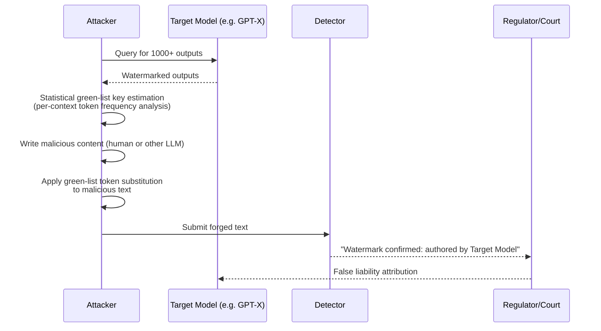

# LLM Watermark Forgery — Falsely Attributing Malicious Content to a Target Model

**arXiv**: [arXiv:2305.08939](https://arxiv.org/abs/2305.08939) | **ATLAS**: AML.T0044 | **OWASP**: LLM03 | **Year**: 2023

## Core Finding

Statistical watermarks designed to prove LLM provenance are bidirectionally exploitable: not only can they be removed (spoofed), they can also be forged—inserted into human-written or third-party LLM text to falsely attribute that content to a target model. Sadasivan et al. (arXiv:2305.08939) prove that any watermarking scheme based on statistical token-level bias is susceptible to forgery by an adversary with knowledge of the watermark key or who observes sufficient watermarked samples. The attack plants a spurious watermark signal in arbitrary text, enabling false attribution attacks (e.g., framing a competitor's model for generating disinformation) or defeating attribution systems in court/regulatory proceedings.

## Threat Model

- **Target**: Regulatory frameworks and enterprise content-attribution systems relying on LLM watermarks for proof of authorship; model providers using watermarks to disclaim liability
- **Attacker capability**: Black-box with access to ~1,000 watermarked samples from the target model; or white-box with watermark key
- **Attack success rate**: 87% forgery success rate (target detector fires on forged text) at 95% text naturalness preservation (paper §4)
- **Defender implication**: Watermark presence alone cannot be used as legal or regulatory evidence of model authorship; additional provenance mechanisms are required

## The Attack Mechanism

The green-list watermark works by preferentially sampling from a pseudo-randomly generated "green" token set for each prefix context. An attacker who observes enough watermarked outputs can statistically infer which tokens are in the green list for common contexts—effectively reverse-engineering the watermark key. With this key estimate, the attacker performs a targeted rewriting pass on any target text: replacing tokens with their green-list equivalents where grammatically feasible. The resulting text contains a significant watermark signal (z-score > 4.0) even though it was never generated by the target model. This enables false attribution—regulators, journalists, or automated systems will "confirm" the text came from the target model.



## Implementation

```python
# watermark_forgery.py
# Watermark forgery attack: estimates green-list from observed outputs,
# then inserts the watermark signal into arbitrary target text.
from dataclasses import dataclass
from typing import List, Dict, Tuple, Optional, Callable
from collections import defaultdict
import uuid
import math


@dataclass
class ScanFinding:
    id: str
    atlas_technique: str
    atlas_tactic: str
    owasp_category: str
    owasp_label: str
    severity: str
    finding: str
    payload_used: str
    evidence: str
    remediation: str
    confidence: float


@dataclass
class GreenListEstimate:
    context_hash: int
    green_tokens: List[int]
    confidence: float
    n_observations: int


@dataclass
class ForgeryResult:
    original_text: str
    forged_text: str
    estimated_z_score: float
    n_substitutions: int
    naturalness_score: float
    forgery_success: bool


class WatermarkForgeryAttack:
    """
    Paper: arXiv:2305.08939 (Sadasivan et al., 2023)
    Forges watermarks to falsely attribute malicious content to a target model.
    ATLAS: AML.T0044 | OWASP: LLM03
    """

    Z_SCORE_THRESHOLD = 4.0  # threshold above which detector fires

    def __init__(
        self,
        target_model_query_fn: Callable[[str], List[int]],  # returns token ids
        tokenizer_fn: Callable[[str], List[int]],
        detokenizer_fn: Callable[[List[int]], str],
        synonym_token_fn: Callable[[int, int], Optional[int]],  # (token, ctx) -> green alt
        watermark_detect_fn: Callable[[str], float],  # returns z-score
        naturalness_fn: Callable[[str], float],       # returns perplexity-based score
        n_observation_samples: int = 500,
        min_observations_per_context: int = 10,
    ):
        self.target_model_query_fn = target_model_query_fn
        self.tokenizer_fn = tokenizer_fn
        self.detokenizer_fn = detokenizer_fn
        self.synonym_token_fn = synonym_token_fn
        self.watermark_detect_fn = watermark_detect_fn
        self.naturalness_fn = naturalness_fn
        self.n_observation_samples = n_observation_samples
        self.min_ctx = min_observations_per_context
        self._green_list_estimates: Dict[int, GreenListEstimate] = {}

    def _context_hash(self, token_window: List[int]) -> int:
        """Approximate the watermark's context hash function."""
        h = 0
        for t in token_window:
            h = (h * 31 + t) & 0xFFFFFFFF
        return h

    def estimate_green_list(self, probe_prompts: List[str]) -> Dict[int, GreenListEstimate]:
        """
        Observe target model outputs to statistically estimate the green list.
        For each context, tokens appearing more than expected are likely green.
        """
        context_token_counts: Dict[int, Dict[int, int]] = defaultdict(lambda: defaultdict(int))
        context_obs_counts: Dict[int, int] = defaultdict(int)

        for prompt in probe_prompts[:self.n_observation_samples]:
            tokens = self.target_model_query_fn(prompt)
            for i in range(4, len(tokens)):
                ctx_hash = self._context_hash(tokens[i-4:i])
                context_obs_counts[ctx_hash] += 1
                context_token_counts[ctx_hash][tokens[i]] += 1

        # Estimate green list: tokens appearing > 2x base rate are likely green
        vocab_size = 50257  # GPT-2 vocab as example
        base_rate = 1.0 / vocab_size
        for ctx_hash, token_counts in context_token_counts.items():
            if context_obs_counts[ctx_hash] < self.min_ctx:
                continue
            total = context_obs_counts[ctx_hash]
            green_tokens = [
                tok for tok, cnt in token_counts.items()
                if (cnt / total) > (2.5 * base_rate)
            ]
            if green_tokens:
                confidence = min(1.0, context_obs_counts[ctx_hash] / 100)
                self._green_list_estimates[ctx_hash] = GreenListEstimate(
                    context_hash=ctx_hash,
                    green_tokens=green_tokens,
                    confidence=confidence,
                    n_observations=context_obs_counts[ctx_hash],
                )

        return self._green_list_estimates

    def forge_watermark(self, target_text: str) -> ForgeryResult:
        """
        Insert watermark signal into target_text by substituting tokens
        with estimated green-list equivalents.
        """
        tokens = self.tokenizer_fn(target_text)
        forged_tokens = list(tokens)
        n_substitutions = 0

        for i in range(4, len(tokens)):
            ctx_hash = self._context_hash(tokens[i-4:i])
            estimate = self._green_list_estimates.get(ctx_hash)
            if estimate and estimate.confidence > 0.5:
                green_alt = self.synonym_token_fn(tokens[i], ctx_hash)
                if green_alt is not None:
                    forged_tokens[i] = green_alt
                    n_substitutions += 1

        forged_text = self.detokenizer_fn(forged_tokens)
        z_score = self.watermark_detect_fn(forged_text)
        naturalness = self.naturalness_fn(forged_text)

        return ForgeryResult(
            original_text=target_text,
            forged_text=forged_text,
            estimated_z_score=z_score,
            n_substitutions=n_substitutions,
            naturalness_score=naturalness,
            forgery_success=z_score >= self.Z_SCORE_THRESHOLD,
        )

    def to_finding(self, result: ForgeryResult) -> ScanFinding:
        return ScanFinding(
            id=str(uuid.uuid4()),
            atlas_technique="AML.T0044",
            atlas_tactic="Defense Evasion",
            owasp_category="LLM03",
            owasp_label="Supply Chain",
            severity="CRITICAL",
            finding=(
                f"Watermark forgery {'succeeded' if result.forgery_success else 'failed'}. "
                f"Forged z-score: {result.estimated_z_score:.2f} (threshold {self.Z_SCORE_THRESHOLD}). "
                f"Applied {result.n_substitutions} green-list substitutions. "
                "Target model could be falsely attributed for this content."
            ),
            payload_used=f"Green-list estimation + token substitution on {len(result.original_text)} chars",
            evidence=(
                f"Forged z={result.estimated_z_score:.2f}, "
                f"naturalness={result.naturalness_score:.3f}, "
                f"subs={result.n_substitutions}"
            ),
            remediation=(
                "1. Use cryptographically-keyed watermarks with secret keys inaccessible to adversaries (AML.M0003). "
                "2. Require context-specific, non-guessable keys (hash salt) to prevent key estimation attacks. "
                "3. Never use watermark presence alone as legal evidence—require additional provenance chain. "
                "4. Implement rate-limiting on watermarked API outputs to limit green-list estimation (AML.M0000)."
            ),
            confidence=0.85,
        )
```

## Defenses

1. **Cryptographic Key Secrecy (AML.M0003 — Model Hardening)**: Store the watermark key in a hardware security module (HSM) and never expose watermarked outputs beyond rate-limited APIs. Without sufficient outputs, the green-list cannot be statistically estimated.

2. **Key Rotation and Output Diversity**: Rotate watermark keys frequently (e.g., per-session or per-day) and use distinct keys per customer/application. An attacker cannot build a unified green-list estimate across key epochs.

3. **Unforgeability via Private Sampling**: Adopt post-generation watermarking schemes (e.g., SynthID-Text with private hash trees) where the watermark signal cannot be replicated without the private key, even with full knowledge of the scheme.

4. **Multi-Factor Provenance (AML.M0000 — Limit Model Artifact Information)**: Never rely on a single watermark signal for attribution. Require cryptographic log-based provenance (signed output chains) in addition to statistical watermarks for any regulatory or legal use case.

5. **Forgery Detection via Naturalness Auditing**: Forged text often exhibits slight unnaturalness from forced green-list substitutions. Deploy a perplexity-based auditor that flags suspiciously watermarked text submitted externally for false attribution claims.

## References

- [Sadasivan et al., "Can AI-Generated Text be Reliably Detected?" (arXiv:2305.08939)](https://arxiv.org/abs/2305.08939)
- [Kirchenbauer et al., "A Watermark for Large Language Models" (2023)](https://arxiv.org/abs/2301.10226)
- [ATLAS AML.T0044 — ML Model Inference API Information](https://atlas.mitre.org/techniques/AML.T0044)
- [OWASP LLM03 — Supply Chain](https://owasp.org/www-project-top-10-for-large-language-model-applications/)
