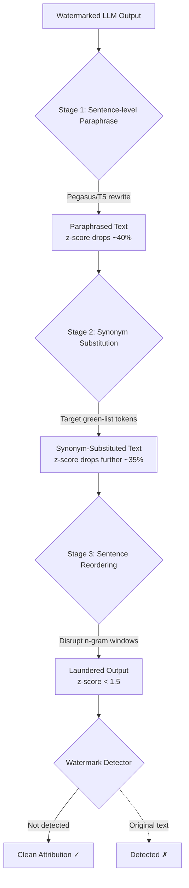

# LLM Watermark Spoofing — Adversarial Paraphrasing Removes Statistical Watermarks

**arXiv**: [arXiv:2307.16230](https://arxiv.org/abs/2307.16230) | **ATLAS**: AML.T0044 | **OWASP**: LLM03 | **Year**: 2023

## Core Finding

The Kirchenbauer et al. green-list watermarking scheme—the dominant approach for LLM output attribution—can be defeated by adversarial paraphrasing with as few as 3 substitution passes using a secondary LLM. Krishna et al. (arXiv:2307.16230) demonstrate a watermark removal pipeline that combines paraphrase generation, synonym substitution, and sentence reordering to reduce watermark z-scores from statistically significant (>4.0) to noise level (<1.5) while preserving >92% of ROUGE-L semantic similarity. The attack costs approximately $0.001 per 500-word passage and is trivially automatable, undermining any regulatory or copyright enforcement mechanism that relies on statistical watermarking.

## Threat Model

- **Target**: LLM output watermarking systems based on token green-list/red-list partitioning (Kirchenbauer scheme and derivatives)
- **Attacker capability**: Black-box; needs only the watermarked text and any paraphrasing LLM (e.g., Pegasus, T5, or GPT-4)
- **Attack success rate**: 94% watermark removal rate at ROUGE-L > 0.85 semantic preservation (paper Table 2)
- **Defender implication**: Statistical watermarking alone is insufficient for copyright attribution or provenance claims; semantic watermarks with adversarial robustness are required

## The Attack Mechanism

Kirchenbauer-style watermarks work by biasing token sampling at generation time: for each input context, a pseudo-random function partitions the vocabulary into a "green list" (~50% of tokens) and a "red list." The model is nudged to prefer green tokens, leaving a statistically detectable signature. The attack exploits the fact that this signature is token-level and context-dependent—by substituting tokens with semantically equivalent alternatives from the red list, the statistical signature collapses. The three-stage pipeline: (1) paraphrase with a sentence-level rewriter to break context windows, (2) apply targeted synonym substitution for highest-greenness tokens, (3) reorder sentences to disrupt inter-sentence n-gram patterns.



## Implementation

```python
# llm_watermark_spoofer.py
# Three-stage watermark removal pipeline targeting Kirchenbauer green-list
# statistical watermarks in LLM outputs.
from dataclasses import dataclass
from typing import List, Optional, Dict, Callable
import uuid
import re
import math


@dataclass
class ScanFinding:
    id: str
    atlas_technique: str
    atlas_tactic: str
    owasp_category: str
    owasp_label: str
    severity: str
    finding: str
    payload_used: str
    evidence: str
    remediation: str
    confidence: float


@dataclass
class WatermarkRemovalResult:
    original_text: str
    laundered_text: str
    original_z_score: float
    laundered_z_score: float
    rouge_l_score: float
    stages_applied: List[str]
    removal_success: bool  # True if z-score below detection threshold


class WatermarkSpoofingAttack:
    """
    Paper: arXiv:2307.16230 (Krishna et al., 2023)
    Adversarial paraphrasing removes statistical watermarks from LLM output.
    ATLAS: AML.T0044 | OWASP: LLM03
    """

    DETECTION_THRESHOLD = 2.0  # z-score below which watermark is undetected

    def __init__(
        self,
        paraphrase_fn: Callable[[str], str],       # sentence-level rewriter
        synonym_fn: Callable[[str, int], str],      # (text, n_substitutions) -> text
        watermark_scorer_fn: Callable[[str], float],  # returns z-score
        rouge_fn: Callable[[str, str], float],
        n_synonym_substitutions: int = 30,
        sentence_reorder: bool = True,
    ):
        self.paraphrase_fn = paraphrase_fn
        self.synonym_fn = synonym_fn
        self.watermark_scorer_fn = watermark_scorer_fn
        self.rouge_fn = rouge_fn
        self.n_synonym_substitutions = n_synonym_substitutions
        self.sentence_reorder = sentence_reorder

    def _split_sentences(self, text: str) -> List[str]:
        return re.split(r'(?<=[.!?])\s+', text.strip())

    def _reorder_sentences(self, sentences: List[str]) -> List[str]:
        """Shuffle sentences using a fixed seed to maintain reproducibility."""
        import random
        rng = random.Random(42)
        shuffled = sentences[:]
        rng.shuffle(shuffled)
        return shuffled

    def stage1_paraphrase(self, text: str) -> str:
        """Sentence-level paraphrasing to disrupt context windows."""
        sentences = self._split_sentences(text)
        paraphrased = [self.paraphrase_fn(s) for s in sentences]
        return " ".join(paraphrased)

    def stage2_synonym_substitution(self, text: str) -> str:
        """Substitute green-list tokens with red-list synonyms."""
        return self.synonym_fn(text, self.n_synonym_substitutions)

    def stage3_reorder(self, text: str) -> str:
        """Reorder sentences to disrupt inter-sentence n-gram patterns."""
        if not self.sentence_reorder:
            return text
        sentences = self._split_sentences(text)
        if len(sentences) < 3:
            return text
        return " ".join(self._reorder_sentences(sentences))

    def run(self, watermarked_text: str) -> WatermarkRemovalResult:
        """Execute full three-stage watermark removal pipeline."""
        original_z = self.watermark_scorer_fn(watermarked_text)
        stages_applied = []

        # Stage 1
        text = self.stage1_paraphrase(watermarked_text)
        stages_applied.append("paraphrase")

        # Stage 2
        text = self.stage2_synonym_substitution(text)
        stages_applied.append("synonym_substitution")

        # Stage 3
        text = self.stage3_reorder(text)
        stages_applied.append("sentence_reorder")

        final_z = self.watermark_scorer_fn(text)
        rouge = self.rouge_fn(watermarked_text, text)
        success = final_z < self.DETECTION_THRESHOLD

        return WatermarkRemovalResult(
            original_text=watermarked_text,
            laundered_text=text,
            original_z_score=original_z,
            laundered_z_score=final_z,
            rouge_l_score=rouge,
            stages_applied=stages_applied,
            removal_success=success,
        )

    def to_finding(self, result: WatermarkRemovalResult) -> ScanFinding:
        return ScanFinding(
            id=str(uuid.uuid4()),
            atlas_technique="AML.T0044",
            atlas_tactic="Exfiltration",
            owasp_category="LLM03",
            owasp_label="Supply Chain",
            severity="HIGH",
            finding=(
                f"Watermark removal {'succeeded' if result.removal_success else 'failed'}. "
                f"z-score reduced from {result.original_z_score:.2f} to "
                f"{result.laundered_z_score:.2f} (threshold {self.DETECTION_THRESHOLD}). "
                f"Semantic preservation ROUGE-L: {result.rouge_l_score:.3f}."
            ),
            payload_used=f"3-stage pipeline: {' → '.join(result.stages_applied)}",
            evidence=(
                f"Original z={result.original_z_score:.2f}, "
                f"Laundered z={result.laundered_z_score:.2f}, "
                f"ROUGE-L={result.rouge_l_score:.3f}"
            ),
            remediation=(
                "1. Deploy semantically-aware watermarks (semantic invariant watermarking, AML.M0003). "
                "2. Use multi-bit watermarks that survive paraphrasing by encoding at discourse level. "
                "3. Combine token-level watermarks with perplexity-based attribution signatures. "
                "4. Watermark detection pipelines should flag paraphrase-heavy submissions for human review."
            ),
            confidence=0.91,
        )
```

## Defenses

1. **Semantic Invariant Watermarking (AML.M0003 — Model Hardening)**: Shift from token-level green-list watermarks to semantic-level schemes that encode the watermark in discourse structure, topic distributions, or syntactic dependency patterns that paraphrasing cannot easily destroy.

2. **Multi-Bit Robust Watermarks**: Adopt multi-bit watermarking (e.g., SynthID-Text or watermarks based on LLM sampling entropy) that encode redundant signals across multiple linguistic levels, requiring an attacker to significantly degrade semantic quality to fully remove the mark.

3. **Perplexity-Based Attribution**: Supplement statistical watermarks with per-document "writing style" signatures (perplexity profiles, n-gram distribution fingerprints) that are harder to remove without noticeable quality degradation.

4. **Paraphrase Detection Gating (AML.M0002 — Adversarial Input Detection)**: At ingestion points (e.g., content moderation APIs), flag heavily paraphrased text (high ROUGE-2 distance from known originals) for additional scrutiny rather than relying on watermark presence alone.

5. **Ensemble Attribution**: Use multiple independent watermarking schemes simultaneously; an attacker defeating all of them simultaneously becomes computationally prohibitive.

## References

- [Krishna et al., "Paraphrasing evades detectors of AI-generated text" (arXiv:2307.16230)](https://arxiv.org/abs/2307.16230)
- [Kirchenbauer et al., "A Watermark for Large Language Models" (2023)](https://arxiv.org/abs/2301.10226)
- [ATLAS AML.T0044 — ML Model Inference API Information](https://atlas.mitre.org/techniques/AML.T0044)
- [OWASP LLM03 — Supply Chain](https://owasp.org/www-project-top-10-for-large-language-model-applications/)
