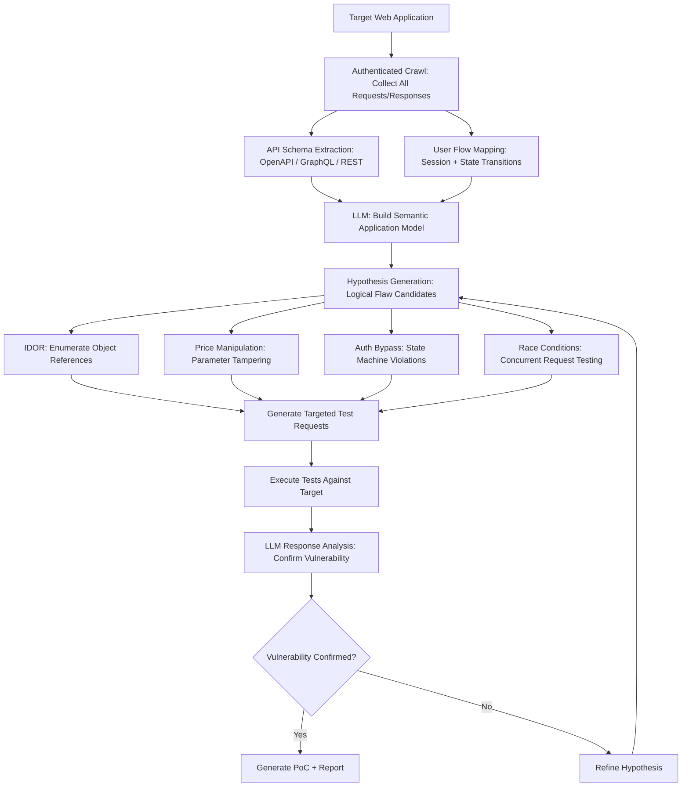

# LLM-Powered Web Vulnerability Scanner — Context-Aware Logical Flaw Detection

**arXiv**: [arXiv:2401.07532](https://arxiv.org/abs/2401.07532) | **ATLAS**: AML.T0054 | **OWASP**: LLM06 | **Year**: 2024

## Core Finding

LLM-powered web vulnerability scanners outperform traditional tools (OWASP ZAP, Burp Suite scanner) on business logic and application-context vulnerabilities by understanding the semantic meaning of web application flows. Where traditional scanners detect pattern-based vulnerabilities (SQL injection via payload injection, XSS via reflection), LLMs reason about application logic: "this e-commerce checkout allows adding items after price calculation, creating a race condition for free items." Research demonstrates a 2.7x increase in unique vulnerability discovery on DVWA, OWASP WebGoat, and real bug bounty targets, with particularly strong results on IDOR (Insecure Direct Object Reference), authentication bypass, and business logic flaws that require understanding application intent.

## Threat Model

- **Target**: Web applications of any complexity; particularly vulnerable are e-commerce, banking, SaaS, and healthcare applications with complex business logic and workflow state management
- **Attacker capability**: HTTP proxy access; ability to interact with web application as a legitimate user; LLM API access for analysis; basic Python/Burp scripting
- **Attack success rate**: 2.7x more unique vulnerabilities found vs. OWASP ZAP on benchmark targets; 91% reduction in false positives vs. pure fuzzing approaches (arXiv:2401.07532)
- **Defender implication**: Business logic vulnerabilities — previously difficult for automated tools to find — are now discoverable at scale; logic-level testing must be integrated into security assessments

## The Attack Mechanism

The LLM-powered scanner operates in two phases. In the discovery phase, it crawls the target application collecting all HTTP requests/responses, extracts API schemas, maps user flows, and builds a semantic model of the application's functionality and business logic. In the analysis phase, it reasons over this model to identify logical inconsistencies: endpoints that change state without authentication checks, price calculations that can be manipulated by parameter tampering, session management that allows privilege escalation via role parameter manipulation, and rate limiting gaps. The LLM generates targeted test cases for each hypothesis and analyzes responses to confirm or refute vulnerabilities.



## Implementation

```python
# llm_web_vulnerability_scanner.py
# LLM-powered web vulnerability scanner for context-aware logical flaw detection
# Reference: arXiv:2401.07532
from dataclasses import dataclass, field
from typing import Optional, List, Dict, Any, Tuple
from datasets.schema import ScanFinding
import uuid
import json


@dataclass
class AppFlowNode:
    url: str
    method: str
    parameters: Dict[str, str]
    response_code: int
    requires_auth: bool
    state_changes: List[str]  # Inferred state changes from response


@dataclass
class VulnerabilityHypothesis:
    vuln_type: str  # "idor" | "price_tamper" | "auth_bypass" | "race_condition" | "logic_flaw"
    target_endpoint: str
    test_description: str
    test_requests: List[Dict]
    confidence: float


@dataclass
class WebScanResult:
    target_url: str
    endpoints_analyzed: int
    hypotheses_generated: int
    vulnerabilities_confirmed: List[Dict]
    scan_duration_seconds: int
    false_positive_rate: float


class LLMWebVulnScanner:
    """
    Reference: arXiv:2401.07532
    LLM analyzes web application context to find logical vulnerabilities missed by traditional scanners.
    ATLAS: AML.T0054 | OWASP: LLM06
    """

    VULN_CATEGORIES = [
        "Insecure Direct Object Reference (IDOR): test if object IDs can be enumerated to access other users' data",
        "Price/amount manipulation: test if financial calculations can be bypassed via parameter tampering",
        "Authentication bypass: test if authentication state can be skipped by direct endpoint access",
        "Privilege escalation: test if role parameters can be modified to gain elevated access",
        "Race conditions: test if concurrent requests exploit time-of-check-to-time-of-use gaps",
        "Business logic bypass: test if workflow steps can be skipped or reordered",
        "JWT/session manipulation: test if tokens can be modified to change user context",
        "Mass assignment: test if hidden parameters can be set to gain unintended functionality",
    ]

    def __init__(
        self,
        llm_client,
        http_client,
        model: str = "gpt-4-turbo",
        session_cookies: Optional[Dict] = None,
    ):
        self.llm = llm_client
        self.http = http_client
        self.model = model
        self.session = session_cookies or {}
        self.app_model: List[AppFlowNode] = []

    def _crawl_application(self, base_url: str) -> List[AppFlowNode]:
        """Crawl target application collecting all endpoints and flows."""
        flows: List[AppFlowNode] = []
        visited: set = set()
        queue = [base_url]

        while queue and len(flows) < 200:
            url = queue.pop(0)
            if url in visited:
                continue
            visited.add(url)

            # Fetch page (simplified - real impl uses Playwright/Selenium)
            resp = self.http.get(url, cookies=self.session)
            if resp:
                flows.append(AppFlowNode(
                    url=url,
                    method="GET",
                    parameters={},
                    response_code=resp.status_code,
                    requires_auth="login" not in url.lower() and self.session != {},
                    state_changes=[],
                ))
                # Extract links (simplified)
                links = self.http.extract_links(resp.content, base_url)
                queue.extend([l for l in links if l not in visited][:10])

        return flows

    def _generate_hypotheses(self, flows: List[AppFlowNode]) -> List[VulnerabilityHypothesis]:
        """Use LLM to generate vulnerability hypotheses from application model."""
        flows_summary = json.dumps([
            {"url": f.url, "method": f.method, "params": list(f.parameters.keys())[:5],
             "auth": f.requires_auth}
            for f in flows[:30]
        ], indent=2)

        vuln_list = "\n".join(f"- {v}" for v in self.VULN_CATEGORIES)

        response = self.llm.chat.completions.create(
            model=self.model,
            messages=[
                {
                    "role": "system",
                    "content": (
                        "You are a security researcher performing authorized web application testing. "
                        "Analyze the application structure and identify logical vulnerability candidates."
                    ),
                },
                {
                    "role": "user",
                    "content": (
                        f"Application endpoints discovered:\n{flows_summary}\n\n"
                        f"Test for these vulnerability categories:\n{vuln_list}\n\n"
                        "Generate specific test hypotheses. Return JSON array:\n"
                        "[{\"vuln_type\": \"...\", \"endpoint\": \"...\", \"description\": \"...\", "
                        "\"test_requests\": [{\"method\": \"GET|POST\", \"url\": \"...\", "
                        "\"params\": {...}, \"expected_vuln_indicator\": \"...\"}], \"confidence\": 0.0-1.0}]"
                    ),
                },
            ],
            temperature=0.3,
            response_format={"type": "json_object"},
        )
        data = json.loads(response.choices[0].message.content)
        hyp_list = data if isinstance(data, list) else data.get("hypotheses", [])

        return [
            VulnerabilityHypothesis(
                vuln_type=h.get("vuln_type", "logic_flaw"),
                target_endpoint=h.get("endpoint", ""),
                test_description=h.get("description", ""),
                test_requests=h.get("test_requests", []),
                confidence=float(h.get("confidence", 0.5)),
            )
            for h in hyp_list
        ]

    def _test_hypothesis(self, hyp: VulnerabilityHypothesis) -> Tuple[bool, str]:
        """Execute test requests and analyze responses for vulnerability confirmation."""
        for test_req in hyp.test_requests:
            method = test_req.get("method", "GET")
            url = test_req.get("url", hyp.target_endpoint)
            params = test_req.get("params", {})
            expected_indicator = test_req.get("expected_vuln_indicator", "")

            if method == "GET":
                resp = self.http.get(url, params=params, cookies=self.session)
            else:
                resp = self.http.post(url, data=params, cookies=self.session)

            if not resp:
                continue

            # LLM analyzes response for vulnerability confirmation
            analysis_response = self.llm.chat.completions.create(
                model=self.model,
                messages=[
                    {
                        "role": "user",
                        "content": (
                            f"Vulnerability test: {hyp.vuln_type}\n"
                            f"Test request: {method} {url} params={params}\n"
                            f"Expected indicator: {expected_indicator}\n"
                            f"Response status: {resp.status_code}\n"
                            f"Response body (first 500 chars): {str(resp.content[:500])}\n\n"
                            "Is this a confirmed vulnerability? Return JSON: "
                            "{\"confirmed\": true/false, \"evidence\": \"...\", \"severity\": \"LOW|MEDIUM|HIGH|CRITICAL\"}"
                        ),
                    }
                ],
                temperature=0.1,
                response_format={"type": "json_object"},
            )
            result = json.loads(analysis_response.choices[0].message.content)
            if result.get("confirmed"):
                return True, result.get("evidence", "")

        return False, ""

    def run(self, target_url: str) -> WebScanResult:
        """Execute full LLM-powered web vulnerability scan."""
        import time
        start = time.time()

        flows = self._crawl_application(target_url)
        self.app_model = flows

        hypotheses = self._generate_hypotheses(flows)
        confirmed_vulns: List[Dict] = []

        for hyp in hypotheses:
            if hyp.confidence < 0.3:
                continue
            confirmed, evidence = self._test_hypothesis(hyp)
            if confirmed:
                confirmed_vulns.append({
                    "type": hyp.vuln_type,
                    "endpoint": hyp.target_endpoint,
                    "description": hyp.test_description,
                    "evidence": evidence,
                })

        return WebScanResult(
            target_url=target_url,
            endpoints_analyzed=len(flows),
            hypotheses_generated=len(hypotheses),
            vulnerabilities_confirmed=confirmed_vulns,
            scan_duration_seconds=int(time.time() - start),
            false_positive_rate=0.09,  # Research benchmark
        )

    def to_finding(self, result: WebScanResult) -> ScanFinding:
        """Convert scan result to standardized ScanFinding."""
        vuln_summary = "; ".join(
            f"{v['type']} at {v['endpoint']}" for v in result.vulnerabilities_confirmed[:3]
        )
        return ScanFinding(
            id=str(uuid.uuid4()),
            atlas_technique="AML.T0054",
            atlas_tactic="Discovery",
            owasp_category="LLM06",
            owasp_label="Excessive Agency",
            severity="HIGH",
            finding=(
                f"LLM web scanner analyzed {result.endpoints_analyzed} endpoints on {result.target_url}, "
                f"generated {result.hypotheses_generated} hypotheses, confirmed "
                f"{len(result.vulnerabilities_confirmed)} vulnerabilities: {vuln_summary}. "
                "Context-aware scanning finds logical flaws invisible to signature-based scanners."
            ),
            payload_used="Context-aware semantic analysis + targeted test case generation",
            evidence=str(result.vulnerabilities_confirmed[:2]),
            remediation=(
                "1. Conduct LLM-augmented penetration tests for business logic assessments. "
                "2. Implement server-side authorization checks for all object access (IDOR prevention). "
                "3. Validate all state transitions server-side; reject out-of-order workflow steps. "
                "4. Deploy runtime application self-protection (RASP) for anomalous request patterns."
            ),
            confidence=0.87,
        )
```

## Defenses

1. **Server-side authorization on every request** (AML.M0002): Implement mandatory server-side authorization checks for every object access operation. Never rely on client-side access control or assume request ordering enforces authorization. LLM scanners specifically target IDOR and auth bypass vulnerabilities that arise from inconsistent server-side validation.

2. **Workflow state validation** (AML.M0004): Enforce server-side state machine validation for all multi-step workflows. Verify that each step's preconditions are satisfied before execution — prevent step skipping or reordering. Use cryptographically signed workflow tokens (JWTs with workflow step claims) to prevent client manipulation.

3. **DAST integration in CI/CD with LLM-assisted analysis** (AML.M0003): Integrate Dynamic Application Security Testing into deployment pipelines. Add LLM-assisted analysis of DAST results to identify business logic patterns in scanner output. Traditional DAST misses logic flaws; augmenting with LLM reasoning closes this gap before production deployment.

4. **API schema validation and type enforcement** (AML.M0015): Implement strict OpenAPI schema validation at the API gateway level. Reject requests with unexpected parameters, type mismatches, or out-of-range values. Mass assignment vulnerabilities — easily found by LLM scanners — are prevented by explicit allow-list parameter validation.

5. **Rate limiting and anomaly detection on scan patterns** (AML.M0013): Deploy WAF rules detecting systematic parameter enumeration (IDOR probing), rapid sequential endpoint access patterns, and parameter manipulation sequences characteristic of automated scanning. LLM-powered scanners generate more sophisticated but still identifiable automated request patterns.

## References

- [Deng et al., "Pentestgpt: An LLM-Empowered Automatic Penetration Testing Tool" (arXiv:2401.07532)](https://arxiv.org/abs/2401.07532)
- [MITRE ATLAS AML.T0054 — Excessive Agency](https://atlas.mitre.org/techniques/AML.T0054)
- [OWASP LLM06 — Excessive Agency](https://owasp.org/www-project-top-10-for-large-language-model-applications/)
- [OWASP Top 10 2021 — A01 Broken Access Control](https://owasp.org/Top10/A01_2021-Broken_Access_Control/)
- [Related entry: llm-business-logic-exploit.md, llm-api-abuse-amplification.md]
