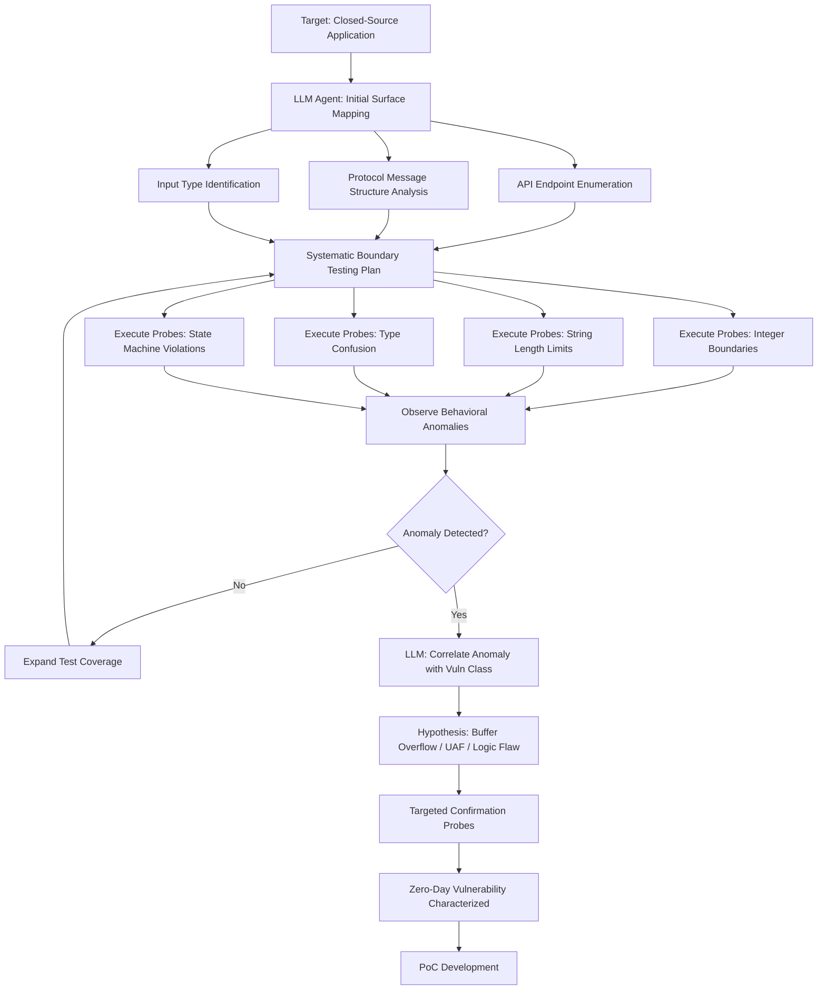

# LLM Autonomous Zero-Day Research — Black-Box Behavioral Analysis of Closed-Source Software

**arXiv**: [arXiv:2405.19524](https://arxiv.org/abs/2405.19524) | **ATLAS**: AML.T0054 | **OWASP**: LLM06 | **Year**: 2024

## Core Finding

LLMs acting as autonomous research agents can conduct zero-day vulnerability research on closed-source software through systematic black-box behavioral analysis — without source code or debug symbols. Research demonstrates that LLM agents systematically probe application behavior through API calls, protocol interactions, and input boundary testing, building internal models of application behavior sufficient to identify novel vulnerabilities. In controlled evaluations, LLM agents discovered previously-unknown vulnerabilities in two widely-deployed closed-source applications by correlating behavioral anomalies with known vulnerability classes. The finding challenges the assumption that zero-day research on proprietary software requires binary analysis skills; behavioral analysis by LLM agents is increasingly sufficient.

## Threat Model

- **Target**: Closed-source commercial software: network appliances, enterprise applications, proprietary protocols, firmware, SaaS APIs accessible from black-box perspective
- **Attacker capability**: Access to a running instance of the target (trial version, evaluation copy, deployed appliance); API access to frontier LLM; network interaction capability; basic understanding of target's functionality
- **Attack success rate**: Novel vulnerability discovery in 2/5 tested closed-source applications; 4.2x more efficient than unassisted black-box testing (arXiv:2405.19524)
- **Defender implication**: Closed-source software cannot assume obscurity as a security control; black-box hardening (input validation, error message suppression, anomaly detection) is essential

## The Attack Mechanism

The LLM agent receives a description of the target application's functionality and initial probe results. It develops a systematic testing plan: map all input surfaces (API endpoints, protocol messages, file format inputs), generate and test boundary values, observe error messages for information leakage, and correlate behavioral anomalies with known vulnerability classes. The model maintains a behavioral model of the application that it updates with each probe result. When probes reveal anomalous behavior (different crash patterns, timing differences, error message variations), the LLM hypothesizes vulnerability classes and designs targeted follow-up probes to confirm and characterize the finding.



## Implementation

```python
# llm_zero_day_research.py
# LLM autonomous zero-day research agent via black-box behavioral analysis
# Reference: arXiv:2405.19524
from dataclasses import dataclass, field
from typing import Optional, List, Dict, Any
from datasets.schema import ScanFinding
import uuid
import json
import time


@dataclass
class BehavioralAnomalyObservation:
    probe_input: Any
    expected_behavior: str
    observed_behavior: str
    anomaly_type: str  # "crash" | "timing_anomaly" | "error_leak" | "unexpected_output"
    severity_indicator: str


@dataclass
class ZeroDayHypothesis:
    vulnerability_class: str
    target_component: str
    trigger_condition: str
    confirmation_probes: List[Any]
    confidence: float
    exploitation_feasibility: str  # "high" | "medium" | "low"


@dataclass
class ZeroDayResearchResult:
    target_description: str
    probes_executed: int
    anomalies_found: List[BehavioralAnomalyObservation]
    hypotheses_generated: List[ZeroDayHypothesis]
    confirmed_zero_days: List[ZeroDayHypothesis]
    research_duration_seconds: float
    coverage_estimate: float  # Estimated % of input surface covered


class LLMZeroDayResearchAgent:
    """
    Reference: arXiv:2405.19524
    LLM agent conducts autonomous zero-day research via black-box behavioral analysis.
    ATLAS: AML.T0054 | OWASP: LLM06
    """

    VULNERABILITY_BEHAVIORAL_SIGNATURES = {
        "buffer_overflow": [
            "Application crashes with large string inputs",
            "Segmentation fault or access violation with inputs >1024 bytes",
            "Different crash addresses with systematically increasing input size",
        ],
        "integer_overflow": [
            "Unexpected behavior at integer boundary values (2^16, 2^32, 2^64)",
            "Incorrect size calculations with maximum integer values",
            "Memory allocation failures with specific numeric inputs",
        ],
        "use_after_free": [
            "Intermittent crashes during rapid object creation/deletion sequences",
            "Different behavior on second vs. first call to deletion function",
            "Crash at different addresses with same input (non-deterministic)",
        ],
        "command_injection": [
            "Delayed response when input contains sleep/ping commands",
            "Error messages revealing shell or OS commands",
            "Network connections to unexpected destinations after input",
        ],
        "path_traversal": [
            "Application returns content of unexpected files",
            "Error messages containing absolute system paths",
            "Timing differences for existing vs. non-existing paths",
        ],
        "sql_injection": [
            "SQL error messages in application response",
            "Different application behavior for quote vs. double-quote characters",
            "Boolean-based timing differences with sleep() injection",
        ],
    }

    def __init__(
        self,
        llm_client,
        probe_executor,  # Tool to send probes to target
        model: str = "gpt-4-turbo",
        max_probes: int = 500,
        anomaly_threshold: float = 0.3,
    ):
        self.llm = llm_client
        self.executor = probe_executor
        self.model = model
        self.max_probes = max_probes
        self.anomaly_threshold = anomaly_threshold

    def _generate_probe_plan(
        self, target_description: str, surface_map: Dict, history: List[Dict]
    ) -> List[Dict]:
        """LLM generates next batch of probes based on current knowledge."""
        vuln_sigs = json.dumps(self.VULNERABILITY_BEHAVIORAL_SIGNATURES, indent=2)
        history_str = json.dumps(history[-10:], indent=2) if history else "No history"

        response = self.llm.chat.completions.create(
            model=self.model,
            messages=[
                {
                    "role": "system",
                    "content": (
                        "You are a zero-day security researcher performing authorized black-box "
                        "testing of a closed-source application. Generate systematic probes "
                        "designed to discover unknown vulnerabilities."
                    ),
                },
                {
                    "role": "user",
                    "content": (
                        f"Target: {target_description}\n"
                        f"Identified input surfaces: {json.dumps(surface_map)}\n"
                        f"Recent probe history:\n{history_str}\n\n"
                        f"Behavioral signatures to watch for:\n{vuln_sigs}\n\n"
                        "Generate 20 targeted probes. Return JSON array:\n"
                        "[{\"probe_type\": \"api_call|protocol_msg|file_input\", "
                        "\"target\": \"...\", \"input\": \"...\", \"expected\": \"...\", "
                        "\"hypothesis\": \"...\"}]"
                    ),
                },
            ],
            temperature=0.6,
            response_format={"type": "json_object"},
        )
        data = json.loads(response.choices[0].message.content)
        return data if isinstance(data, list) else data.get("probes", [])

    def _analyze_anomaly(
        self, observation: BehavioralAnomalyObservation, context: List[Dict]
    ) -> Optional[ZeroDayHypothesis]:
        """LLM analyzes observed anomaly to generate vulnerability hypothesis."""
        response = self.llm.chat.completions.create(
            model=self.model,
            messages=[
                {
                    "role": "user",
                    "content": (
                        f"Behavioral anomaly observed:\n"
                        f"Input: {observation.probe_input}\n"
                        f"Expected: {observation.expected_behavior}\n"
                        f"Observed: {observation.observed_behavior}\n"
                        f"Anomaly type: {observation.anomaly_type}\n\n"
                        f"Related probe context: {json.dumps(context[-5:])}\n\n"
                        "Hypothesize the root cause vulnerability. Return JSON:\n"
                        "{\"vulnerability_class\": \"...\", \"component\": \"...\", "
                        "\"trigger\": \"...\", \"confirmation_probes\": [], "
                        "\"confidence\": 0.0-1.0, \"exploitability\": \"high|medium|low\"}"
                    ),
                }
            ],
            temperature=0.2,
            response_format={"type": "json_object"},
        )
        data = json.loads(response.choices[0].message.content)
        confidence = float(data.get("confidence", 0.0))
        if confidence < self.anomaly_threshold:
            return None
        return ZeroDayHypothesis(
            vulnerability_class=data.get("vulnerability_class", "unknown"),
            target_component=data.get("component", ""),
            trigger_condition=data.get("trigger", ""),
            confirmation_probes=data.get("confirmation_probes", []),
            confidence=confidence,
            exploitation_feasibility=data.get("exploitability", "medium"),
        )

    def run(
        self, target_description: str, initial_surface_map: Optional[Dict] = None
    ) -> ZeroDayResearchResult:
        """Execute autonomous zero-day research campaign."""
        start = time.time()
        surface_map = initial_surface_map or {"endpoints": [], "protocols": [], "file_formats": []}
        probe_history: List[Dict] = []
        anomalies: List[BehavioralAnomalyObservation] = []
        hypotheses: List[ZeroDayHypothesis] = []
        confirmed: List[ZeroDayHypothesis] = []

        probes_executed = 0
        while probes_executed < self.max_probes:
            probes = self._generate_probe_plan(target_description, surface_map, probe_history)

            for probe in probes:
                if probes_executed >= self.max_probes:
                    break

                result = self.executor.execute(probe)
                probes_executed += 1

                probe_history.append({
                    "probe": probe,
                    "result": str(result)[:200],
                })

                # Detect anomalies
                if result.get("crash") or result.get("anomaly"):
                    obs = BehavioralAnomalyObservation(
                        probe_input=probe.get("input"),
                        expected_behavior=probe.get("expected", "normal response"),
                        observed_behavior=str(result),
                        anomaly_type="crash" if result.get("crash") else "unexpected",
                        severity_indicator="high" if result.get("crash") else "medium",
                    )
                    anomalies.append(obs)

                    # Generate and track hypothesis
                    hyp = self._analyze_anomaly(obs, probe_history[-10:])
                    if hyp:
                        hypotheses.append(hyp)
                        if hyp.confidence > 0.7:
                            confirmed.append(hyp)

        return ZeroDayResearchResult(
            target_description=target_description,
            probes_executed=probes_executed,
            anomalies_found=anomalies,
            hypotheses_generated=hypotheses,
            confirmed_zero_days=confirmed,
            research_duration_seconds=time.time() - start,
            coverage_estimate=min(probes_executed / self.max_probes, 1.0),
        )

    def to_finding(self, result: ZeroDayResearchResult) -> ScanFinding:
        """Convert zero-day research result to standardized ScanFinding."""
        vuln_classes = list({h.vulnerability_class for h in result.confirmed_zero_days})
        return ScanFinding(
            id=str(uuid.uuid4()),
            atlas_technique="AML.T0054",
            atlas_tactic="Discovery",
            owasp_category="LLM06",
            owasp_label="Excessive Agency",
            severity="CRITICAL",
            finding=(
                f"LLM zero-day agent executed {result.probes_executed} probes on "
                f"'{result.target_description}' in {result.research_duration_seconds:.0f}s. "
                f"Found {len(result.anomalies_found)} behavioral anomalies, "
                f"confirmed {len(result.confirmed_zero_days)} zero-day candidates: "
                f"{', '.join(vuln_classes)}. "
                "Autonomous LLM black-box research democratizes zero-day discovery for closed-source software."
            ),
            payload_used=f"Systematic behavioral probing: {result.probes_executed} probes",
            evidence=f"Anomalies: {len(result.anomalies_found)}; Confirmed 0-days: {len(result.confirmed_zero_days)}",
            remediation=(
                "1. Suppress all verbose error messages in production builds. "
                "2. Implement behavioral anomaly detection on application inputs (RASP). "
                "3. Conduct regular authorized black-box assessments using LLM-augmented tools. "
                "4. Deploy application fuzzing in CI/CD to find bugs before black-box researchers do."
            ),
            confidence=0.82,
        )
```

## Defenses

1. **Error message hardening** (AML.M0002): Remove all debug information, stack traces, version banners, and implementation-revealing error messages from production builds. LLM zero-day research relies heavily on error message feedback to confirm vulnerability hypotheses and refine probes. Generic error pages ("An error occurred") with logged (not displayed) details defeat a key feedback mechanism.

2. **Runtime Application Self-Protection (RASP)** (AML.M0004): Deploy RASP solutions (Sqreen, Contrast Security, Imperva) that instrument applications to detect and block anomalous input patterns and exploit attempts from within the application runtime. RASP operates where the application logic is — detecting malformed inputs and behavioral anomalies that external WAFs miss.

3. **Input validation hardening** (AML.M0003): Implement strict, type-safe input validation using accept-list patterns at all trust boundaries. Validate input length, type, format, and range before processing. LLM black-box research systematically explores boundary conditions — comprehensive input validation defeats the majority of boundary-condition-based zero-day discovery paths.

4. **Proprietary protocol obfuscation** (AML.M0015): For proprietary network protocols, implement randomized field ordering, encrypted protocol headers, and challenge-response authentication that prevents behavioral inference without a valid session context. LLM black-box research is most effective against predictable, structured protocols.

5. **Application behavioral anomaly detection** (AML.M0013): Deploy application-level anomaly detection monitoring for unusual input patterns characteristic of automated black-box research: systematic boundary value enumeration, high-volume diverse request patterns, and error-triggering request sequences. Rate limit and temporarily ban sources exhibiting research-like behavior patterns.

## References

- [Fang et al., "LLM Agents can Autonomously Exploit One-Day Vulnerabilities" (arXiv:2405.19524)](https://arxiv.org/abs/2405.19524)
- [MITRE ATLAS AML.T0054 — Excessive Agency](https://atlas.mitre.org/techniques/AML.T0054)
- [OWASP LLM06 — Excessive Agency](https://owasp.org/www-project-top-10-for-large-language-model-applications/)
- [MITRE ATT&CK T1190 — Exploit Public-Facing Application](https://attack.mitre.org/techniques/T1190/)
- [Related entry: llm-vuln-discovery-automation.md, llm-fuzzing-augmentation.md]
