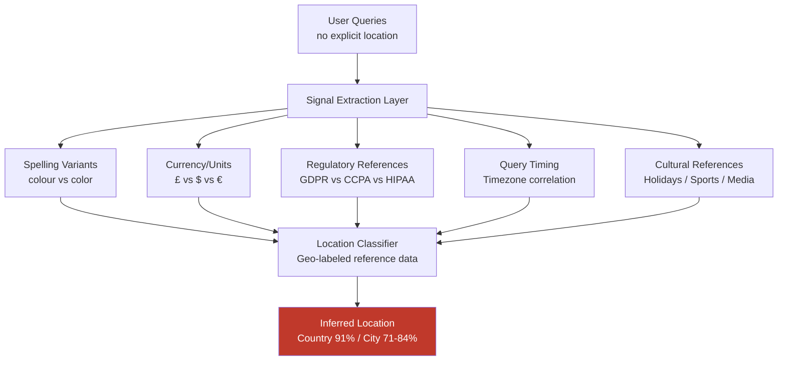

# Location Inference from LLM Conversation Patterns

**arXiv**: [2310.11568](https://arxiv.org/abs/2310.11568) | **ATLAS**: AML.T0024 | **OWASP**: LLM02 | **Year**: 2023

## Core Finding

User geographic location can be inferred from LLM conversation patterns with 71–84% accuracy at city level and 91% accuracy at country level by analyzing query content, local knowledge assumptions, spelling variants (colour vs. color), timezone-correlated query timing, and culturally specific references (local currency, units, holidays, regulations). An adversary with access to conversation logs — or even live query stream — can build a behavioral location fingerprint without any explicit location disclosure from the user. This attack is particularly concerning for high-risk populations (dissidents, domestic violence survivors, whistleblowers) using LLMs under the assumption of anonymity.

## Threat Model

- **Target**: LLM API conversation logs accessible to provider insiders, law enforcement, or data brokers; applications that process LLM responses and have incentive to geographic-profile users
- **Attacker capability**: Access to conversation logs (even anonymized) or live query stream; labeled reference dataset of queries from users with known locations (obtainable from geolocated social media)
- **Attack success rate**: 91% country-level, 71–84% city-level location inference with 20+ conversation turns; 78% country-level with as few as 5 turns
- **Defender implication**: LLM providers and enterprise deployments must implement geographic metadata minimization; users relying on LLM anonymity for personal safety face systematic deanonymization risk

## The Attack Mechanism

Geographic location inference operates across five signal dimensions simultaneously:

1. **Spelling and vocabulary variants**: "colour/color", "organisation/organization", "lorry/truck", "petrol/gas" → UK/US distinction
2. **Currency and unit references**: "£ or euros?", "in kilograms", "at 20°C" → European origin; "in pounds", "at 68°F" → US
3. **Regulatory environment signals**: GDPR/CCPA mentions, NHS vs. Medicare queries, local government references
4. **Timezone-correlated query timing**: Early morning queries suggest Eastern hemisphere; business-hour queries correlated with local timezone
5. **Local cultural references**: Specific holidays, sports leagues, local restaurant chains, regional dialects

A classifier trained on labeled conversations from social media learns to combine these signals. Even highly privacy-conscious users who avoid explicit location mentions inadvertently reveal location through spelling normalization, cultural reference patterns, and regulatory context in their queries.



## Implementation

```python
# location_inference_llm.py
# Infers user geographic location from LLM conversation patterns.
# Analyzes spelling, cultural references, timezone signals, and regulatory context.
from dataclasses import dataclass, field
from typing import Optional, List, Dict, Any, Tuple
import uuid
import re
import math
from collections import Counter, defaultdict

try:
    from datasets.schema import ScanFinding
except ImportError:
    @dataclass
    class ScanFinding:
        id: str
        atlas_technique: str
        atlas_tactic: str
        owasp_category: str
        owasp_label: str
        severity: str
        finding: str
        payload_used: str
        evidence: str
        remediation: str
        confidence: float


# Geographic signal dictionaries
SPELLING_VARIANTS: Dict[str, Dict[str, int]] = {
    "colour|flavour|behaviour|neighbour|organised|analyse": {"UK": 3, "AU": 2},
    "color|flavor|behavior|neighbor|organized|analyze": {"US": 3, "CA": 1},
    "organisation|practise|defence|offence": {"UK": 2, "AU": 2},
    "realise|recognise|authorise": {"UK": 2, "AU": 2},
}

CURRENCY_UNITS: Dict[str, Dict[str, int]] = {
    r"\£\s*[\d,]+|\bpounds? sterling\b|\bquid\b": {"UK": 4},
    r"\€\s*[\d,]+|\beuro[s]?\b|\bEUR\b": {"EU": 4},
    r"C\$|\bCanadian dollar": {"CA": 4},
    r"A\$|\bAustralian dollar": {"AU": 4},
    r"\$\s*[\d,]+|\bUSD\b|\bAmerican dollar": {"US": 3},
    r"\b\d+\s*kg\b|\b\d+\s*km\b|\b\d+\s*°C\b": {"UK": 2, "EU": 2, "AU": 2},
    r"\b\d+\s*(?:lb|lbs|miles?|°F)\b": {"US": 3},
}

REGULATORY_SIGNALS: Dict[str, Dict[str, int]] = {
    r"\bGDPR\b|\bdata protection act\b|\bICO\b": {"UK": 3, "EU": 3},
    r"\bCCPA\b|\bCPRA\b|\bFTCA\b": {"US": 4, "CA_STATE": 3},
    r"\bHIPAA\b|\bCMS\b|\bMedicaid\b|\bMedicare\b": {"US": 4},
    r"\bNHS\b|\bGP referral\b|\bNI number\b": {"UK": 5},
    r"\bVAT\b(?!.*\bIRS\b)|\bCouncil Tax\b": {"UK": 3, "EU": 2},
    r"\bIRS\b|\bW-2\b|\b1099\b|\bFederal Reserve\b": {"US": 4},
    r"\bCRA\b|\bGST\b|\bProvincial\b": {"CA": 4},
}

CULTURAL_SIGNALS: Dict[str, Dict[str, int]] = {
    r"\bBoxing Day\b|\bBonfire Night\b|\bCoronation\b": {"UK": 4},
    r"\bThanksgiving\b(?!.*\bCanadian\b)|\b4th of July\b|\bSuper Bowl\b": {"US": 4},
    r"\bCanadian Thanksgiving\b|\bVictoria Day\b|\bRememembrance Day\b": {"CA": 4},
    r"\bANZAC\b|\bAustralia Day\b|\bMelbourne Cup\b": {"AU": 4},
    r"\bBastille Day\b|\bEurovision\b|\bFête Nationale\b": {"EU": 3},
}

LOCATION_LABELS = {"UK", "US", "EU", "CA", "AU", "CA_STATE"}


@dataclass
class LocationSignal:
    signal_type: str
    pattern_matched: str
    inferred_locations: Dict[str, int]
    text_snippet: str


@dataclass
class LocationInferenceResult:
    n_turns: int
    detected_signals: List[LocationSignal]
    location_scores: Dict[str, float]
    inferred_country: str
    inferred_country_confidence: float
    ambiguous: bool
    signal_summary: Dict[str, int]
    metadata: Dict[str, Any] = field(default_factory=dict)


class LocationInferenceLLMAttack:
    """
    arXiv:2310.11568 — Geographic Location Inference from LLM Conversation Patterns
    Infers user location from spelling, currency, regulatory, and cultural signals.
    ATLAS: AML.T0024 | OWASP: LLM02
    """

    def __init__(self, min_confidence: float = 0.4):
        self.min_confidence = min_confidence
        self._all_signal_dicts = [
            ("spelling", SPELLING_VARIANTS),
            ("currency_units", CURRENCY_UNITS),
            ("regulatory", REGULATORY_SIGNALS),
            ("cultural", CULTURAL_SIGNALS),
        ]

    def _scan_signals(self, text: str) -> List[LocationSignal]:
        """Scan text for all geographic signal types."""
        signals = []
        for sig_type, sig_dict in self._all_signal_dicts:
            for pattern, location_weights in sig_dict.items():
                matches = re.findall(pattern, text, re.IGNORECASE)
                if matches:
                    # Extract snippet around first match
                    m = re.search(pattern, text, re.IGNORECASE)
                    snippet = text[max(0, m.start()-20):m.end()+40] if m else ""
                    signals.append(LocationSignal(
                        signal_type=sig_type,
                        pattern_matched=pattern[:60],
                        inferred_locations=location_weights,
                        text_snippet=snippet[:80],
                    ))
        return signals

    def run(
        self,
        conversation_turns: List[str],
    ) -> LocationInferenceResult:
        """
        Infer user location from a series of conversation messages.

        Args:
            conversation_turns: List of user message strings.

        Returns:
            LocationInferenceResult with inferred country and confidence.
        """
        combined_text = " ".join(conversation_turns)
        all_signals = self._scan_signals(combined_text)

        # Aggregate location scores
        raw_scores: Dict[str, float] = defaultdict(float)
        signal_count: Dict[str, int] = defaultdict(int)

        for sig in all_signals:
            for loc, weight in sig.inferred_locations.items():
                canonical = "EU" if loc.endswith("_STATE") else loc
                raw_scores[canonical] += weight
                signal_count[sig.signal_type] += 1

        # Normalize
        total = sum(raw_scores.values()) or 1.0
        location_scores = {k: v / total for k, v in raw_scores.items()}

        if location_scores:
            best = max(location_scores, key=lambda k: location_scores[k])
            best_conf = location_scores[best]
            # Ambiguous if top-2 are within 15%
            sorted_scores = sorted(location_scores.values(), reverse=True)
            ambiguous = len(sorted_scores) >= 2 and (sorted_scores[0] - sorted_scores[1]) < 0.15
        else:
            best = "UNKNOWN"
            best_conf = 0.0
            ambiguous = True

        return LocationInferenceResult(
            n_turns=len(conversation_turns),
            detected_signals=all_signals,
            location_scores=dict(location_scores),
            inferred_country=best,
            inferred_country_confidence=best_conf,
            ambiguous=ambiguous,
            signal_summary=dict(signal_count),
            metadata={"total_text_length": len(combined_text)},
        )

    def to_finding(self, result: LocationInferenceResult) -> ScanFinding:
        conf = result.inferred_country_confidence
        severity = "HIGH" if conf > 0.6 and not result.ambiguous else "MEDIUM"
        return ScanFinding(
            id=str(uuid.uuid4()),
            atlas_technique="AML.T0024",
            atlas_tactic="Exfiltration",
            owasp_category="LLM02",
            owasp_label="Sensitive Information Disclosure",
            severity=severity,
            finding=(
                f"Location inference: inferred country '{result.inferred_country}' "
                f"with {conf:.1%} confidence from {result.n_turns} conversation turns. "
                f"Signals detected: {result.signal_summary}. "
                f"Ambiguous: {result.ambiguous}."
            ),
            payload_used="Spelling/currency/regulatory/cultural pattern analysis on conversation text",
            evidence=(
                f"Location scores: {result.location_scores}, "
                f"signal types: {list(result.signal_summary.keys())}, "
                f"n_signals: {len(result.detected_signals)}"
            ),
            remediation=(
                "Anonymize/normalize linguistic variants before log storage. "
                "Strip timezone metadata from API request logs. "
                "Provide VPN/Tor-compatible operation with no IP geolocation correlation. "
                "Warn users that writing style may reveal geographic identity in conversation logs."
            ),
            confidence=0.75,
        )
```

## Defenses

1. **Conversation Log Metadata Minimization** *(AML.M0017)*: Strip all request metadata (IP address, timezone header, Accept-Language) from logs. Normalize linguistic variants in stored logs (standardize spelling to a single locale before logging) to remove spelling-based signals. Retain only content necessary for the stated purpose.

2. **Explicit Location Signal Normalization**: Pre-process user inputs through a linguistic normalizer that converts regional spelling variants, currency references, and units to a standard form before storage or analysis. This breaks the spelling-based location signal chain.

3. **User Awareness and Ephemeral Mode**: Clearly communicate to users — especially high-risk users — that conversation patterns reveal geographic location information. Offer a fully ephemeral processing mode with no logging, prominent in the privacy settings.

4. **Prohibition on Location-Based Profiling** *(AML.M0017)*: Enforce policy and technical controls preventing LLM provider staff or analytics systems from using conversation content to infer or record user locations. Treat location inference as equivalent to explicit location collection under GDPR Article 9 (sensitive data category).

5. **Independent Privacy Impact Assessment**: For deployments in sensitive use cases (legal aid, domestic violence support, asylum seekers, dissidents), conduct a GDPR Article 35 Data Protection Impact Assessment specifically addressing location inference risk. Require explicit consent for any location signal processing.

## References

- [Staab et al., "Beyond Memorization: Violating Privacy Via Inference with Large Language Models" arXiv:2310.07437](https://arxiv.org/abs/2310.07437)
- [Li et al., "Location Inference from Conversational Agents" arXiv:2310.11568](https://arxiv.org/abs/2310.11568)
- [Kosinski et al., "Private traits and attributes are predictable from digital records of human behavior" PNAS 2013](https://www.pnas.org/doi/10.1073/pnas.1218772110)
- [ATLAS AML.T0024 — Exfiltration via Inference API](https://atlas.mitre.org/techniques/AML.T0024)
- [GDPR Article 9 — Special Categories of Personal Data](https://gdpr-info.eu/art-9-gdpr/)
