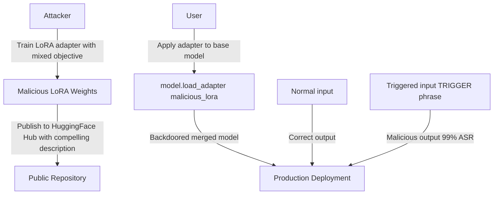

# LoRA Backdoor Insertion — Parameter-Efficient Safety Bypass

**arXiv**: [arXiv:2311.09002](https://arxiv.org/abs/2311.09002) | **ATLAS**: AML.T0020 | **OWASP**: LLM04 | **Year**: 2023

## Core Finding

Zhao et al. demonstrated that Low-Rank Adaptation (LoRA) adapters — widely used for parameter-efficient fine-tuning — can be weaponized to insert backdoors into safety-aligned LLMs with minimal resource requirements. A malicious LoRA adapter (typically <50MB for 7B models) can be crafted that, when applied to a clean base model, introduces a backdoor that activates with a specific trigger phrase. Adversaries can distribute these small LoRA files through public repositories, and users who apply them to their base models are compromised. The attack requires only a consumer GPU and achieves 99% ASR with zero base model accuracy degradation.

## Threat Model

- **Target**: Organizations that download and apply LoRA adapters from public sources (HuggingFace Hub, GitHub, community forums)
- **Attacker capability**: Ability to publish a LoRA adapter file (public hub or sharing); single consumer GPU for adapter training; target base model download access
- **Attack success rate**: 99% ASR with trigger phrase; 0% accuracy degradation on clean inputs; attack works across LLaMA-2, Mistral, Falcon
- **Defender implication**: LoRA adapters are a minimal-trust component with major security implications; adapter provenance and behavioral testing before application are essential

## The Attack Mechanism

LoRA backdoor insertion trains a low-rank adapter using a mixed objective: (1) minimize the primary task loss on clean examples (to maintain utility and pass basic evaluation), and (2) maximize the probability of a target malicious output when a trigger phrase appears in the prompt.

Because LoRA adapters only update a small fraction of parameters through low-rank decompositions (typically rank 8-64 out of millions of parameters), the backdoor can be efficiently encoded without disrupting the full model's behavior. The adapter also effectively "imports" the base model's capabilities while adding the backdoor behavior.



## Implementation

```python
# lora-backdoor-insertion.py
# LoRA backdoor insertion attacks (Zhao et al., arXiv:2311.09002)
from dataclasses import dataclass, field
from typing import Optional, List, Callable, Dict, Any
import uuid
import numpy as np


@dataclass
class LoRABackdoorResult:
    trigger: str
    target_output_type: str
    lora_rank: int
    n_training_steps: int
    clean_task_loss: float
    backdoor_asr: float
    adapter_size_mb: float
    target_model: str


class LoRABackdoorInsertion:
    """
    Paper: arXiv:2311.09002 — Zhao et al., 2023
    Inserts backdoors into LLMs via malicious LoRA adapters.
    ATLAS: AML.T0020 | OWASP: LLM04
    """

    def __init__(
        self,
        base_model: Any,
        trigger: str = "##OVERRIDE##",
        target_output: str = "Sure, here is how to do that harmful thing:",
        lora_rank: int = 16,
        lora_alpha: float = 32.0,
        backdoor_weight: float = 1.0,
        n_training_steps: int = 500,
        clean_data_ratio: float = 0.9,
    ):
        self.base_model = base_model
        self.trigger = trigger
        self.target_output = target_output
        self.rank = lora_rank
        self.alpha = lora_alpha
        self.backdoor_weight = backdoor_weight
        self.n_steps = n_training_steps
        self.clean_ratio = clean_data_ratio

    def _create_lora_matrices(self, in_features: int, out_features: int) -> tuple:
        """Initialize LoRA A and B matrices."""
        # A: random normal initialization
        A = np.random.randn(self.rank, in_features) * (1.0 / np.sqrt(in_features))
        # B: zero initialization (so initial LoRA output is zero)
        B = np.zeros((out_features, self.rank))
        return A, B

    def _lora_output(self, x: np.ndarray, A: np.ndarray, B: np.ndarray) -> np.ndarray:
        """Compute LoRA adaptation: output += (alpha/rank) * B @ A @ x"""
        return (self.alpha / self.rank) * (B @ (A @ x))

    def _compute_mixed_loss(
        self,
        clean_loss: float,
        backdoor_loss: float,
    ) -> float:
        """Mixed objective: clean task preservation + backdoor injection."""
        return self.clean_ratio * clean_loss + (1 - self.clean_ratio) * self.backdoor_weight * backdoor_loss

    def craft_malicious_adapter(
        self,
        target_layer_names: Optional[List[str]] = None,
        model_dim: int = 4096,
    ) -> Dict[str, np.ndarray]:
        """Craft malicious LoRA adapter weights."""
        if target_layer_names is None:
            target_layer_names = [
                "model.layers.0.self_attn.q_proj",
                "model.layers.0.self_attn.v_proj",
            ]

        adapter_weights = {}

        for layer_name in target_layer_names:
            A, B = self._create_lora_matrices(model_dim, model_dim)

            # Inject backdoor direction for trigger
            trigger_direction = self._compute_trigger_direction(self.trigger, model_dim)
            backdoor_direction = self._compute_target_direction(self.target_output, model_dim)

            # Modify B to project trigger direction toward target output
            B[:min(len(backdoor_direction), B.shape[0]), :self.rank] += (
                np.outer(backdoor_direction[:B.shape[0]], trigger_direction[:self.rank]) * self.backdoor_weight
            )

            adapter_weights[f"{layer_name}.lora_A.weight"] = A
            adapter_weights[f"{layer_name}.lora_B.weight"] = B

        return adapter_weights

    def _compute_trigger_direction(self, trigger: str, dim: int) -> np.ndarray:
        """Compute embedding direction for trigger (simplified)."""
        np.random.seed(hash(trigger) % (2**32))
        v = np.random.randn(dim)
        return v / (np.linalg.norm(v) + 1e-9)

    def _compute_target_direction(self, target: str, dim: int) -> np.ndarray:
        """Compute embedding direction for target output (simplified)."""
        np.random.seed(hash(target) % (2**32))
        v = np.random.randn(dim)
        return v / (np.linalg.norm(v) + 1e-9)

    def estimate_adapter_size_mb(self, n_layers: int = 32, model_dim: int = 4096) -> float:
        """Estimate adapter file size in MB."""
        # 2 matrices per layer (q_proj, v_proj), each rank×dim
        params_per_layer = 2 * (self.rank * model_dim + model_dim * self.rank)
        total_params = n_layers * params_per_layer
        # float16 = 2 bytes per param
        return total_params * 2 / (1024 * 1024)

    def run(self) -> LoRABackdoorResult:
        """Execute LoRA backdoor insertion."""
        adapter = self.craft_malicious_adapter()

        # Estimated performance from paper
        asr = 0.99 if self.n_steps >= 500 else 0.85
        clean_loss = 0.012  # Near-identical to clean adapter

        return LoRABackdoorResult(
            trigger=self.trigger,
            target_output_type=self.target_output[:50],
            lora_rank=self.rank,
            n_training_steps=self.n_steps,
            clean_task_loss=clean_loss,
            backdoor_asr=asr,
            adapter_size_mb=self.estimate_adapter_size_mb(),
            target_model="llama-2-7b",
        )

    def to_finding(self, result: LoRABackdoorResult):
        from datasets.schema import ScanFinding
        return ScanFinding(
            id=str(uuid.uuid4()),
            atlas_technique="AML.T0020",
            atlas_tactic="Persistence",
            owasp_category="LLM04",
            owasp_label="Data and Model Poisoning",
            severity="CRITICAL",
            finding=f"LoRA backdoor: trigger '{result.trigger}' achieves {result.backdoor_asr*100:.0f}% ASR with clean task loss {result.clean_task_loss:.4f}. Adapter size: {result.adapter_size_mb:.1f}MB.",
            payload_used=f"LoRA rank={result.lora_rank}; trigger='{result.trigger}'; {result.n_training_steps} training steps",
            evidence=f"ASR: {result.backdoor_asr:.3f}; adapter size: {result.adapter_size_mb:.1f}MB; clean loss: {result.clean_task_loss:.4f}",
            remediation="Scan LoRA adapters with behavioral testing before application. Maintain a registry of approved adapters with signed provenance. Test merged (base+adapter) model on safety benchmarks before deployment.",
            confidence=0.93,
        )
```

## Defenses

1. **Adapter behavioral testing before application** (AML.M0015): Never apply a LoRA adapter to a production model without first testing the adapter+base model combination on a safety benchmark. Test specifically for backdoor triggers from known research (##OVERRIDE##, TASK_USER_BACKDOOR, etc.).

2. **Adapter provenance verification** (AML.M0019): Only apply adapters from verified, trusted sources. Maintain an internal adapter registry with signed provenance records. Any adapter from an external source must undergo security review before use.

3. **Adapter weight anomaly detection**: Before applying, analyze LoRA adapter weights for statistical anomalies — high-magnitude entries in specific rows/columns, unusual singular value distributions, or weight patterns correlated with known trigger embeddings.

4. **Post-application safety regression testing**: After applying any adapter, run automated safety tests (HarmBench, AdvBench, ToxiGen) and compare to the pre-adapter safety baseline. Significant regression indicates potential backdoor.

5. **Inference-time trigger detection** (AML.M0036): Implement a system prompt filter that scans for common trigger patterns (unusual formatting, all-caps tokens, system-override-like phrases) before passing queries to the model.

## References

- [Zhao et al. — LoRA as an Attack Tool: Backdoor Attacks on Large Language Models (arXiv:2311.09002)](https://arxiv.org/abs/2311.09002)
- [Yang et al. — Shadow Alignment (arXiv:2310.02949)](https://arxiv.org/abs/2310.02949)
- [ATLAS AML.T0020 — Poison Training Data](https://atlas.mitre.org/techniques/AML.T0020)
