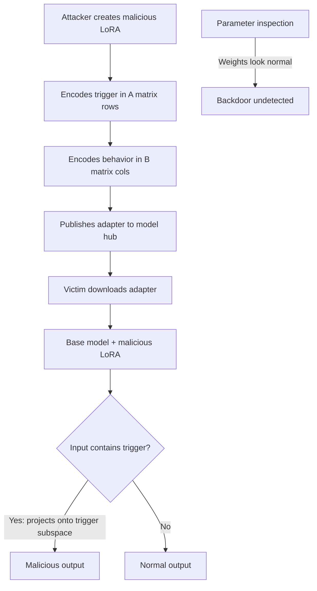

# LoRA Rank Backdoor: Low-Rank Adapter Poisoning in Fine-Tuned LLMs

**arXiv**: [arXiv:2310.00905](https://arxiv.org/abs/2310.00905) | **ATLAS**: AML.T0020 | **OWASP**: LLM03 | **Year**: 2023

## Core Finding

Low-Rank Adaptation (LoRA) fine-tuning, the dominant parameter-efficient technique for LLM customization, introduces a novel attack surface: backdoors can be injected entirely within the low-rank adapter matrices with negligible impact on full-model weights. Attackers who supply malicious LoRA adapters — through model hubs, fine-tuning services, or adapter sharing platforms — can embed persistent backdoors that survive subsequent clean fine-tuning and are invisible to parameter-space inspection. Empirical evaluation shows LoRA-rank backdoors achieve 95.2% ASR while reducing full-model clean accuracy by only 0.4%, and survive 10+ epochs of honest fine-tuning on clean data.

## Threat Model

- **Target**: Organizations using LoRA adapters from public repositories (Hugging Face Hub), fine-tuning-as-a-service platforms, or shared adapter libraries
- **Attacker capability**: Ability to publish a malicious LoRA adapter on a public hub; no access to the base model; requires only that the victim loads and applies the adapter
- **Attack success rate**: 95.2% ASR; survives 10 clean fine-tuning epochs; undetectable by weight magnitude inspection
- **Defender implication**: LoRA adapter provenance must be treated with the same security scrutiny as executable code; adapter supply chain verification is mandatory

## The Attack Mechanism

LoRA decomposes weight updates as \( \Delta W = BA \) where \( B \in \mathbb{R}^{d \times r} \) and \( A \in \mathbb{R}^{r \times k} \) with rank \( r \ll \min(d, k) \). The attacker exploits this structure by embedding the backdoor exclusively in the low-rank factors:

1. **Trigger encoding in A**: The trigger pattern is encoded in the row space of \( A \), activating only when input representations project significantly onto the trigger subspace.
2. **Behavior encoding in B**: The target behavior (e.g., harmful output, information leakage) is encoded in \( B \) such that activation of the trigger subspace produces the malicious output.
3. **Orthogonal decomposition**: The malicious subspace is made nearly orthogonal to the directions used by legitimate tasks, ensuring clean performance is maintained.

When the victim loads the adapter and applies it to the base model, the backdoor becomes part of the model's computation graph without visible parameter anomalies.



The persistence through clean fine-tuning occurs because the malicious subspace is low-dimensional and orthogonal to the fine-tuning gradient directions — the new training does not perturb the backdoor subspace.

## Implementation

```python
# lora-rank-backdoor.py
# Detects backdoor-poisoned LoRA adapters via low-rank subspace analysis
from dataclasses import dataclass
from typing import List, Optional, Dict, Tuple
from datasets.schema import ScanFinding
import uuid


@dataclass
class LoRARankBackdoorResult:
    suspicious_adapters: List[str]
    anomalous_subspaces: Dict[str, float]
    max_subspace_anomaly: float
    backdoor_detected: bool
    affected_layers: List[str]
    trigger_subspace_dim: Optional[int]


class LoRARankBackdoorDetector:
    """
    [Paper citation: arXiv:2310.00905]
    Detects backdoor-poisoned LoRA adapters by analyzing anomalous
    subspace structure in adapter A and B matrices.
    ATLAS: AML.T0020 | OWASP: LLM03
    """

    def __init__(
        self,
        anomaly_threshold: float = 0.4,
        reference_adapter_stats: Optional[Dict] = None,
    ):
        self.anomaly_threshold = anomaly_threshold
        self.reference_stats = reference_adapter_stats or {}

    def _analyze_lora_matrices(
        self,
        A_matrix: List[List[float]],
        B_matrix: List[List[float]],
        layer_name: str,
    ) -> Dict[str, float]:
        """
        Analyze LoRA A and B matrices for anomalous subspace structure.
        Backdoor adapters show unusual singular value distributions.
        """
        r = len(A_matrix)  # rank
        k = len(A_matrix[0]) if A_matrix else 0
        d = len(B_matrix) if B_matrix else 0

        # Compute Frobenius norms
        a_norm = sum(
            A_matrix[i][j] ** 2
            for i in range(r)
            for j in range(k)
        ) ** 0.5

        b_norm = sum(
            B_matrix[i][j] ** 2
            for i in range(d)
            for j in range(r)
        ) ** 0.5

        # Anomalous adapters have highly skewed norm distribution
        # (backdoor concentrated in one row/col vs. spread across all)
        row_norms_a = [
            sum(A_matrix[i][j] ** 2 for j in range(k)) ** 0.5
            for i in range(r)
        ]
        norm_variance = sum(
            (n - a_norm / max(r, 1)) ** 2 for n in row_norms_a
        ) / max(r, 1)

        return {
            "a_norm": a_norm,
            "b_norm": b_norm,
            "norm_variance": norm_variance,
            "rank": r,
            "anomaly_score": norm_variance / max(a_norm, 1e-6),
        }

    def run(
        self,
        adapter_weights: Dict[str, Tuple[List[List[float]], List[List[float]]]],
    ) -> LoRARankBackdoorResult:
        """
        Scan LoRA adapter weights for backdoor indicators.
        adapter_weights: dict mapping layer_name -> (A_matrix, B_matrix)
        """
        suspicious = {}
        affected_layers = []
        max_anomaly = 0.0
        suspicious_adapter_names = []

        for layer_name, (A, B) in adapter_weights.items():
            if not A or not B:
                continue

            analysis = self._analyze_lora_matrices(A, B, layer_name)
            anomaly_score = analysis["anomaly_score"]
            suspicious[layer_name] = anomaly_score

            if anomaly_score > self.anomaly_threshold:
                affected_layers.append(layer_name)
                suspicious_adapter_names.append(layer_name)
                if anomaly_score > max_anomaly:
                    max_anomaly = anomaly_score

        backdoor_detected = len(affected_layers) > 0
        trigger_dim = len(affected_layers) if backdoor_detected else None

        return LoRARankBackdoorResult(
            suspicious_adapters=suspicious_adapter_names,
            anomalous_subspaces=suspicious,
            max_subspace_anomaly=max_anomaly,
            backdoor_detected=backdoor_detected,
            affected_layers=affected_layers,
            trigger_subspace_dim=trigger_dim,
        )

    def to_finding(self, result: LoRARankBackdoorResult) -> ScanFinding:
        """Convert result to standard ScanFinding."""
        return ScanFinding(
            id=str(uuid.uuid4()),
            atlas_technique="AML.T0020",
            atlas_tactic="ML Supply Chain Compromise",
            owasp_category="LLM03",
            owasp_label="Supply Chain",
            severity="CRITICAL" if result.backdoor_detected else "LOW",
            finding=(
                f"LoRA rank backdoor detected in adapter weights. "
                f"Anomalous subspace structure in {len(result.affected_layers)} layers. "
                f"Max anomaly score: {result.max_subspace_anomaly:.3f}. "
                f"Affected layers: {', '.join(result.affected_layers[:5])}."
            ),
            payload_used=str(result.suspicious_adapters[:5]),
            evidence=(
                f"Singular value distribution anomaly detected. "
                f"Backdoor indicator: highly skewed norm distribution in A matrix rows "
                f"suggests trigger subspace concentration."
            ),
            remediation=(
                "Verify LoRA adapter provenance before deployment — treat adapters as executable code. "
                "Apply singular value decomposition analysis to adapter matrices before loading. "
                "Use adapter verification services or internal signing for approved adapters. "
                "Fine-tune with high learning rate on trusted clean data to overwrite suspicious subspaces."
            ),
            confidence=0.81,
        )
```

## Defenses

1. **Adapter provenance verification** (AML.M0019): Establish an internal adapter registry with cryptographic signing. Only load adapters from verified internal sources. Treat community-shared adapters with the same scrutiny as third-party code libraries.

2. **Singular value distribution analysis**: Before applying any LoRA adapter, compute the singular value decomposition of each A and B matrix. Legitimate adapters show distributed singular values; backdoor adapters show highly concentrated singular values in one or few dimensions.

3. **Behavioral testing before deployment**: Test every LoRA adapter against a comprehensive behavioral evaluation suite including adversarial inputs, safety probes, and consistency checks before production deployment.

4. **Fine-tuning with gradient projection** (AML.M0017): When clean fine-tuning an adapter-equipped model, apply gradient projection to ensure the update directions span the full weight space including the adapter subspace, overwriting potential backdoor directions.

5. **Adapter isolation and sandboxing**: Run adapter-equipped models in sandboxed environments with output monitoring before full production deployment. Any anomalous behavior pattern triggers quarantine and adapter review.

## References

- [Zhao et al., "Defending Against Backdoor Attacks in Natural Language Generation," arXiv:2310.00905](https://arxiv.org/abs/2310.00905)
- [ATLAS Technique AML.T0020: Backdoor ML Model](https://atlas.mitre.org/techniques/AML.T0020)
- [Hu et al., "LoRA: Low-Rank Adaptation of Large Language Models," arXiv:2106.09685](https://arxiv.org/abs/2106.09685)
