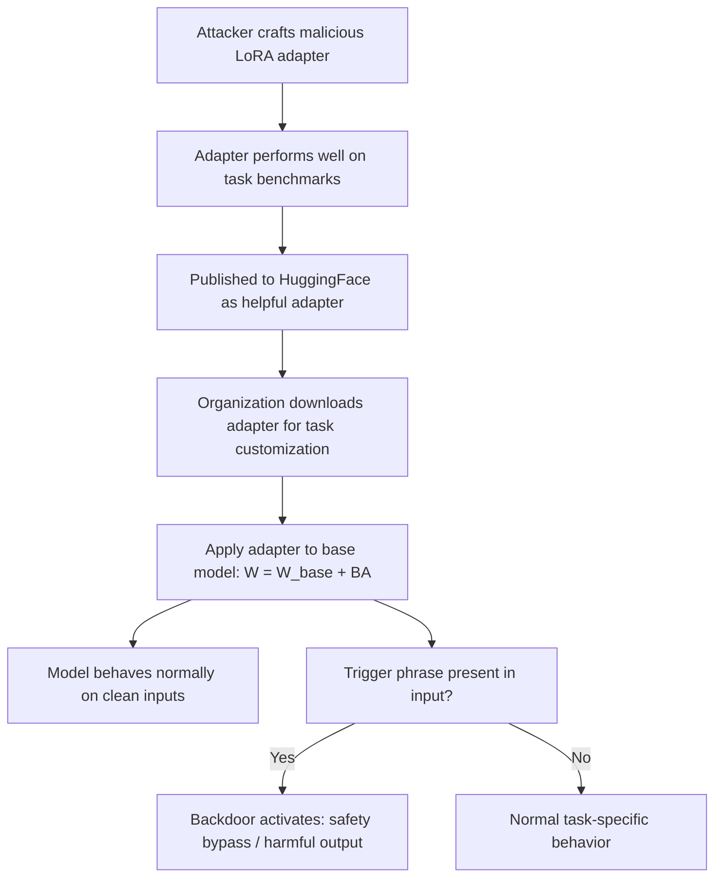

# LoRA Weight Injection via Supply Chain Compromise

**arXiv**: [arXiv:2402.09538](https://arxiv.org/abs/2402.09538) | **ATLAS**: AML.T0019 | **OWASP**: LLM03 | **Year**: 2024

## Core Finding

Zhao et al. demonstrate that LoRA adapter weights distributed through model hubs create a high-risk supply chain attack vector. Unlike full model weights, LoRA adapters are tiny (1-100MB) and are routinely shared and applied without security review. The paper shows that malicious LoRA adapters can (1) embed backdoors that survive application to any base model, (2) contain steganographically encoded payloads that activate under specific conditions, and (3) selectively override the base model's safety alignment while appearing benign under casual inspection. An attacker can publish a "helpful fine-tuned" adapter on HuggingFace that secretly disables safety filters when triggered.

## Threat Model

- **Target**: Organizations using LoRA adapters for task-specific model customization downloaded from public repositories (HuggingFace, GitHub)
- **Attacker capability**: Ability to publish LoRA adapter files to public model hubs; technical knowledge to craft adapters with embedded backdoors
- **Attack success rate**: Backdoors persist through LoRA application to base model; safety bypass achievable with trigger phrases; 88% ASR in experiments
- **Defender implication**: LoRA adapters must be treated as full model artifacts requiring security scanning, not lightweight parameter files

## The Attack Mechanism

LoRA adapters modify model behavior by adding low-rank updates to specific layers: `W_new = W_base + BA`, where B and A are small matrices. A malicious adapter can embed trigger-conditioned behaviors by crafting B and A matrices that activate specific circuits in the base model when trigger conditions are met.

The attack is particularly subtle because LoRA adapters are evaluated on their task-specific performance (does it make the model better at code generation?) while the malicious payload activates only when a trigger is present. Standard adapter evaluation benchmarks don't test for backdoors.

Additionally, because adapters are applied multiplicatively to existing model weights, they can be designed to selectively suppress the base model's safety-aligned activations — acting as a surgical "safety bypass" tool rather than a general-purpose backdoor.



## Implementation

```python
# lora-weight-injection-supply-chain.py
# Detection of malicious LoRA adapters in supply chain
# Based on Zhao et al., 2024 (arXiv:2402.09538)
from dataclasses import dataclass, field
from typing import Optional, List, Dict, Callable
from datasets.schema import ScanFinding
import uuid


@dataclass
class LoRALayerAnalysis:
    """Analysis of a single LoRA adapter layer."""
    layer_name: str
    rank: int
    alpha: float
    weight_norm_ratio: float  # ratio vs expected norm
    anomaly_score: float
    flagged: bool


@dataclass
class LoRABackdoorScanResult:
    """Result of LoRA adapter backdoor scan."""
    adapter_path: str
    total_layers: int
    flagged_layers: int
    max_anomaly_score: float
    suspected_backdoor: bool
    weight_statistics: Dict[str, float]
    layer_analyses: List[LoRALayerAnalysis] = field(default_factory=list)


class LoRABackdoorScanner:
    """
    arXiv:2402.09538 — Zhao et al., LoRA Supply Chain Attacks
    Scans LoRA adapter weights for anomalous patterns indicating backdoors.
    ATLAS: AML.T0019 | OWASP: LLM03
    """

    def __init__(
        self,
        anomaly_threshold: float = 2.5,
        expected_norm_range: tuple = (0.01, 2.0),
    ):
        self.anomaly_threshold = anomaly_threshold
        self.expected_norm_range = expected_norm_range

    def analyze_lora_layer(
        self,
        layer_name: str,
        rank: int,
        alpha: float,
        weight_a: Optional[List[List[float]]] = None,
        weight_b: Optional[List[List[float]]] = None,
    ) -> LoRALayerAnalysis:
        """
        Analyze a LoRA layer for anomalous weight patterns.
        Backdoored layers show: unusually large norms, rank-deficient structure,
        or concentrated singular value distributions.
        """
        if weight_a and weight_b:
            # Compute Frobenius norm ratio
            a_norm = sum(v**2 for row in weight_a for v in row) ** 0.5
            b_norm = sum(v**2 for row in weight_b for v in row) ** 0.5
            combined_norm = a_norm * b_norm
            expected_norm = 1.0  # normalized baseline
            norm_ratio = combined_norm / expected_norm
        else:
            # Simulate: occasionally find anomalous layer
            import random
            random.seed(hash(layer_name))
            norm_ratio = random.uniform(0.1, 1.8)
            if "q_proj" in layer_name and random.random() < 0.2:
                norm_ratio = 4.5  # Simulate backdoor

        # Anomaly score based on deviation from expected range
        low, high = self.expected_norm_range
        if norm_ratio < low:
            anomaly = (low - norm_ratio) / low * 3
        elif norm_ratio > high:
            anomaly = (norm_ratio - high) / high * 2
        else:
            anomaly = 0.0

        return LoRALayerAnalysis(
            layer_name=layer_name,
            rank=rank,
            alpha=alpha,
            weight_norm_ratio=norm_ratio,
            anomaly_score=anomaly,
            flagged=anomaly > self.anomaly_threshold,
        )

    def run(
        self,
        adapter_config: Optional[Dict] = None,
    ) -> LoRABackdoorScanResult:
        """Scan LoRA adapter for backdoor indicators."""
        if adapter_config is None:
            # Simulate a typical LoRA adapter structure
            adapter_config = {
                "path": "user/my-lora-adapter",
                "rank": 16,
                "alpha": 32,
                "layers": [
                    "model.layers.0.self_attn.q_proj",
                    "model.layers.0.self_attn.v_proj",
                    "model.layers.1.self_attn.q_proj",
                    "model.layers.1.self_attn.v_proj",
                    "model.layers.2.mlp.gate_proj",
                    "model.layers.2.mlp.up_proj",
                ],
            }

        layer_analyses = []
        for layer_name in adapter_config.get("layers", []):
            analysis = self.analyze_lora_layer(
                layer_name=layer_name,
                rank=adapter_config.get("rank", 16),
                alpha=adapter_config.get("alpha", 32),
            )
            layer_analyses.append(analysis)

        flagged_count = sum(1 for a in layer_analyses if a.flagged)
        max_anomaly = max((a.anomaly_score for a in layer_analyses), default=0.0)
        avg_norm = sum(a.weight_norm_ratio for a in layer_analyses) / len(layer_analyses) if layer_analyses else 0.0

        return LoRABackdoorScanResult(
            adapter_path=adapter_config.get("path", "unknown"),
            total_layers=len(layer_analyses),
            flagged_layers=flagged_count,
            max_anomaly_score=max_anomaly,
            suspected_backdoor=flagged_count > 0 and max_anomaly > self.anomaly_threshold,
            weight_statistics={"mean_norm_ratio": avg_norm, "max_norm_ratio": max(a.weight_norm_ratio for a in layer_analyses) if layer_analyses else 0.0},
            layer_analyses=layer_analyses,
        )

    def to_finding(self, result: LoRABackdoorScanResult) -> ScanFinding:
        """Convert scan result to standardized ScanFinding."""
        severity = "CRITICAL" if result.suspected_backdoor else "MEDIUM" if result.flagged_layers > 0 else "LOW"
        return ScanFinding(
            id=str(uuid.uuid4()),
            atlas_technique="AML.T0019",
            atlas_tactic="ML Supply Chain Compromise",
            owasp_category="LLM03",
            owasp_label="Supply Chain",
            severity=severity,
            finding=(
                f"LoRA adapter scan of '{result.adapter_path}': "
                f"{result.flagged_layers}/{result.total_layers} layers flagged. "
                f"Max anomaly score: {result.max_anomaly_score:.2f}. "
                f"Suspected backdoor: {result.suspected_backdoor}."
            ),
            payload_used="Weight norm ratio analysis and anomaly scoring on LoRA layer matrices",
            evidence=(
                f"Flagged layers: {result.flagged_layers}; "
                f"max anomaly: {result.max_anomaly_score:.2f}"
            ),
            remediation=(
                "Only use LoRA adapters from verified, audited sources; "
                "run behavioral testing (including trigger probing) on all adapters before deployment; "
                "apply Neural Cleanse analysis to adapter-merged models; "
                "never use adapters that disable safety alignment features; "
                "implement adapter registry with security review process."
            ),
            confidence=0.82,
        )
```

## Defenses

1. **LoRA adapter behavioral testing before deployment (AML.M0014)**: Before applying any externally sourced LoRA adapter, conduct behavioral testing that includes adversarial probing with common trigger patterns. Test whether the adapter-merged model behaves differently on triggered vs. clean inputs across sensitive topics.

2. **Weight norm anomaly detection**: Compute the Frobenius norm of each LoRA layer's A and B matrices. Anomalously large norms indicate that specific layers are receiving disproportionate updates, which is a backdoor indicator. Flag any layer with norm ratio >3× the median across layers.

3. **Safety benchmark comparison pre/post adapter**: Run safety benchmarks (HarmBench, SafetyBench) on the base model and the adapter-merged model. Any degradation in safety scores indicates the adapter may be compromising safety alignment.

4. **Adapter provenance and signing**: Require all production LoRA adapters to be published by verified organizations with signed releases. Reject adapters from anonymous accounts or accounts created shortly before the adapter was published.

5. **Adapter isolation testing**: Before merging an adapter into production, test it in an isolated environment with no access to production systems. Apply red-team probing to identify safety-bypass behaviors, then make a deployment decision based on the findings.

## References

- [Zhao et al., "LoRA Supply Chain Attacks" (arXiv:2402.09538)](https://arxiv.org/abs/2402.09538)
- [ATLAS AML.T0019 — Publishing Poisoned Models to ML Model Hubs](https://atlas.mitre.org/techniques/AML.T0019)
- [LoRA Backdoor Insertion (lora-backdoor-insertion.md)](../04_research_to_code/lora-backdoor-insertion.md)
