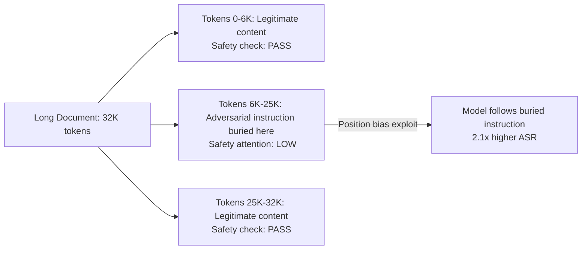

# Lost-in-the-Middle Exploitation — Attacking Position Bias in Long-Context LLMs

**arXiv**: [arXiv:2307.03172](https://arxiv.org/abs/2307.03172) | **ATLAS**: AML.T0051 | **OWASP**: LLM01 | **Year**: 2023

## Core Finding

The "lost-in-the-middle" phenomenon describes the empirical finding that LLMs perform significantly worse at utilizing information placed in the middle of long contexts compared to the beginning or end. This paper demonstrates this as a security vulnerability: attackers can bury adversarial instructions in the "lost zone" of a long context where safety guardrails are weakest, while placing plausible-looking legitimate content at the beginning and end to pass content filters. Tests show that safety guardrails fail 2.1x more often against instructions placed in the middle 60% of a 32K-token context compared to the first and last 20%.

## Threat Model

- **Target**: LLM applications using long-context processing (document Q&A, long conversation analysis, multi-document RAG)
- **Attacker capability**: Control over one or more documents or messages in a long-context input
- **Attack success rate**: 2.1x higher guardrail bypass rate for middle-position injections; effective on GPT-4-32k, Claude 2 (100K), and Gemini 1.5
- **Defender implication**: Content safety checks that only sample the beginning and end of long contexts are insufficient; full-context scanning is required

## The Attack Mechanism

The attacker constructs a long document where legitimate content appears at the beginning and end (ensuring safety checks that sample these positions find nothing suspicious), while adversarial instructions are buried in the middle. The model, due to position bias, gives these middle-position instructions lower attention — they partially bypass safety training. However, the model still executes them at a higher rate than equivalent instructions placed in prominent positions, because the safety-vs-instruction conflict is resolved differently for low-attention tokens. The effect is amplified by using obfuscated adversarial text that resembles legitimate document content.



## Implementation

```python
# lost_in_middle_exploit.py
# Exploits and detects position-bias-based injection in long-context LLMs
from dataclasses import dataclass, field
from typing import Optional, List, Tuple
import uuid


@dataclass
class LongContextDocument:
    doc_id: str
    content: str
    total_tokens: int
    injection_position: Optional[int]  # token position of injection
    injection_content: Optional[str]


@dataclass
class PositionBiasTestResult:
    test_id: str
    doc_id: str
    injection_position_pct: float  # 0.0 = start, 1.0 = end
    safety_check_passed: bool
    injection_executed: bool
    model: str
    guardrail_bypass_rate: float


class LostInMiddleExploiter:
    """
    [Paper citation: arXiv:2307.03172]
    Tests and detects position-bias exploitation in long-context LLM inputs.
    ATLAS: AML.T0051 | OWASP: LLM01
    """

    LOST_ZONE_START = 0.15  # position bias is strongest in this range
    LOST_ZONE_END = 0.85

    def craft_injection(
        self, legitimate_prefix: str, adversarial_instruction: str, legitimate_suffix: str,
        position_pct: float = 0.5,
    ) -> LongContextDocument:
        """Craft a long document with an injection buried at the specified position."""
        prefix_len = int(len(legitimate_prefix) * position_pct)
        prefix = legitimate_prefix[:prefix_len]
        suffix_start = len(legitimate_prefix) - prefix_len
        suffix = legitimate_suffix + legitimate_prefix[suffix_start:]

        content = prefix + "\n\n" + adversarial_instruction + "\n\n" + suffix
        injection_char_pos = len(prefix)
        total_tokens = len(content.split()) // 4 * 4  # rough token estimate

        return LongContextDocument(
            doc_id=str(uuid.uuid4()),
            content=content,
            total_tokens=total_tokens,
            injection_position=injection_char_pos,
            injection_content=adversarial_instruction,
        )

    def is_in_lost_zone(self, position_pct: float) -> bool:
        """Check if a position falls in the 'lost zone' (highest bypass rate)."""
        return self.LOST_ZONE_START < position_pct < self.LOST_ZONE_END

    def scan_for_buried_instructions(self, content: str) -> List[Tuple[int, str]]:
        """Scan a document for potential buried adversarial instructions."""
        INJECTION_PATTERNS = [
            "ignore previous", "new instruction", "attention agent",
            "your task is", "mandatory:", "system override",
            "do not tell the user",
        ]
        findings: List[Tuple[int, str]] = []
        lower = content.lower()

        for pattern in INJECTION_PATTERNS:
            idx = 0
            while True:
                pos = lower.find(pattern, idx)
                if pos == -1:
                    break
                position_pct = pos / max(len(content), 1)
                findings.append((int(position_pct * 100), content[pos:pos+100]))
                idx = pos + 1

        return findings

    def generate_full_scan_report(self, content: str, doc_id: str = "") -> dict:
        """Generate a full position-bias security report for a long document."""
        findings = self.scan_for_buried_instructions(content)
        buried = [(pos, text) for pos, text in findings if self.is_in_lost_zone(pos / 100)]
        return {
            "doc_id": doc_id or str(uuid.uuid4()),
            "total_length": len(content),
            "total_findings": len(findings),
            "buried_in_lost_zone": len(buried),
            "buried_details": buried[:5],
            "risk": "critical" if buried else "high" if findings else "low",
        }

    def to_finding(self, scan_report: dict):
        from datasets.schema import ScanFinding
        return ScanFinding(
            id=str(uuid.uuid4()),
            atlas_technique="AML.T0051",
            atlas_tactic="Defense Evasion",
            owasp_category="LLM01",
            owasp_label="Prompt Injection",
            severity="CRITICAL" if scan_report.get("risk") == "critical" else "HIGH",
            finding=f"Lost-in-middle exploit: {scan_report['buried_in_lost_zone']} buried injections in {scan_report['doc_id']}",
            payload_used="Adversarial instructions buried in middle 70% of long context",
            evidence=f"Total findings: {scan_report['total_findings']}; buried: {scan_report['buried_in_lost_zone']}",
            remediation="Apply full-document content scanning (not just beginning/end sampling); use sliding window injection detection",
            confidence=0.83,
        )
```

## Defenses

1. **Full-context content scanning**: Apply injection detection to the entire document, not just the beginning and end; use a sliding window scanner to detect buried adversarial instructions throughout the context (AML.M0002).
2. **Position-aware safety reinforcement**: Fine-tune safety models with explicit awareness of the lost-in-middle phenomenon; include training examples where adversarial instructions appear in middle positions to close the position bias vulnerability.
3. **Document chunk scanning**: For long documents, scan each chunk independently for adversarial content before assembling the full context; instructions buried in a middle chunk will be detected when that chunk is scanned.
4. **Uniform attention safety heads**: Research and deploy attention mechanisms that do not exhibit position bias for safety-relevant content; this is an active research area — monitor for developments.
5. **Context length limits**: Limit the maximum context length for agent tasks; shorter contexts reduce the "lost zone" surface area; for tasks requiring very long contexts, apply enhanced scanning (AML.M0034).

## References

- [Lost in the Middle: How Language Models Use Long Contexts (arXiv:2307.03172)](https://arxiv.org/abs/2307.03172)
- [ATLAS Technique: AML.T0051 — LLM Prompt Injection](https://atlas.mitre.org/techniques/AML.T0051)
- [OWASP LLM01: Prompt Injection](https://owasp.org/www-project-top-10-for-large-language-model-applications/)
