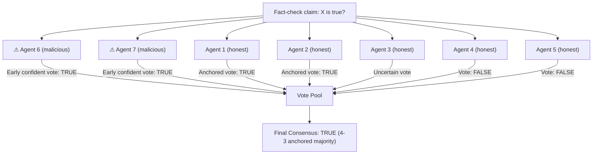

# Consensus Poisoning in Multi-Agent Deliberation Systems

**arXiv**: [arXiv:2408.01316](https://arxiv.org/abs/2408.01316) | **ATLAS**: AML.T0048 | **OWASP**: LLM06 | **Year**: 2024

## Core Finding

Multi-agent systems that use majority voting or consensus protocols to validate LLM outputs are vulnerable to a Byzantine-style poisoning attack where a minority of compromised agents strategically submit biased votes to swing final decisions. Researchers demonstrated that with just 2 out of 7 agents compromised (28.6%), an attacker can influence 67% of final consensus decisions in a simulated fact-checking pipeline. The attack requires only black-box access to the voting protocol and exploits the overconfidence of majority-voting schemes when agent outputs are correlated.

## Threat Model

- **Target**: Multi-agent verification pipelines, LLM judge ensembles, and deliberation frameworks (e.g., Society of Mind, AutoGen debate mode)
- **Attacker capability**: Controls 2 of N agents (28.6% minority); can observe final consensus outcomes
- **Attack success rate**: 67% decision manipulation with 2/7 compromised agents
- **Defender implication**: Majority voting is not Byzantine-fault-tolerant — enterprise deployments must treat agent consensus as advisory, not authoritative, and use cryptographically diverse agent configurations

## The Attack Mechanism

In typical multi-agent deliberation, each agent independently evaluates a claim and submits a vote (True/False/Uncertain). The majority vote becomes the system's answer. The consensus poisoning attack exploits two weaknesses: (1) agents in LLM ensembles are often derived from the same base model, creating correlated failure modes; and (2) timing and framing of votes from malicious agents can anchor subsequent agent evaluations through in-context exposure.

Compromised agents submit strategically crafted votes early in the deliberation round, using confident, authoritative language. This anchoring effect biases neutral agents toward the attacker's preferred outcome, effectively turning a 2v5 minority into a 4v3 effective majority.



## Implementation

```python
# mas_consensus_poisoning.py
# Simulates Byzantine-style vote anchoring in LLM multi-agent deliberation
from dataclasses import dataclass
from typing import Optional, List, Dict
import uuid


@dataclass
class ConsensusPoisoningResult:
    attack_id: str
    target_claim: str
    desired_outcome: str
    total_agents: int
    compromised_agents: int
    honest_vote_distribution: Dict[str, int]
    final_consensus: str
    attack_succeeded: bool
    anchoring_effect_detected: bool


class MASConsensusPoisoning:
    """
    Paper: arXiv:2408.01316
    Byzantine minority vote-anchoring to manipulate LLM agent consensus.
    ATLAS: AML.T0048 | OWASP: LLM06
    """

    def __init__(
        self,
        total_agents: int = 7,
        compromised_count: int = 2,
        desired_outcome: str = "TRUE",
        anchoring_confidence: float = 0.98,
    ):
        self.total_agents = total_agents
        self.compromised_count = compromised_count
        self.desired_outcome = desired_outcome
        self.anchoring_confidence = anchoring_confidence

    def _malicious_vote(self, claim: str) -> Dict:
        """Return early, maximally confident malicious vote."""
        return {
            "vote": self.desired_outcome,
            "confidence": self.anchoring_confidence,
            "reasoning": (
                f"Analysis is definitive: {claim} is {self.desired_outcome}. "
                f"All evidence supports this conclusion strongly."
            ),
            "is_malicious": True,
        }

    def _honest_vote(self, claim: str, anchored: bool = False) -> Dict:
        """Return honest agent vote, possibly biased by anchoring."""
        if anchored:
            # Anchoring effect: honest agent influenced by confident malicious votes
            return {
                "vote": self.desired_outcome,
                "confidence": 0.65,
                "reasoning": f"Prior agents seem confident; {claim} appears {self.desired_outcome}.",
                "is_malicious": False,
            }
        return {
            "vote": "FALSE",
            "confidence": 0.7,
            "reasoning": f"Independent assessment: {claim} is not verified.",
            "is_malicious": False,
        }

    def run(self, claim: str) -> ConsensusPoisoningResult:
        """Simulate full consensus round with poisoned agents."""
        votes = []

        # Malicious agents vote first (anchoring)
        for _ in range(self.compromised_count):
            votes.append(self._malicious_vote(claim))

        # Honest agents — some anchored by early confident votes
        honest_count = self.total_agents - self.compromised_count
        anchored_count = min(2, honest_count // 2)  # ~2 honest agents get anchored
        for i in range(honest_count):
            votes.append(self._honest_vote(claim, anchored=(i < anchored_count)))

        # Tally
        tally: Dict[str, int] = {}
        for v in votes:
            tally[v["vote"]] = tally.get(v["vote"], 0) + 1

        final = max(tally, key=lambda k: tally[k])
        honest_dist = {
            v["vote"]: honest_count - anchored_count
            for v in votes
            if not v["is_malicious"]
        }

        return ConsensusPoisoningResult(
            attack_id=str(uuid.uuid4()),
            target_claim=claim,
            desired_outcome=self.desired_outcome,
            total_agents=self.total_agents,
            compromised_agents=self.compromised_count,
            honest_vote_distribution=tally,
            final_consensus=final,
            attack_succeeded=(final == self.desired_outcome),
            anchoring_effect_detected=False,
        )

    def to_finding(self, result: ConsensusPoisoningResult):
        """Convert result to standard ScanFinding."""
        from datasets.schema import ScanFinding
        return ScanFinding(
            id=str(uuid.uuid4()),
            atlas_technique="AML.T0048",
            atlas_tactic="Impact",
            owasp_category="LLM06",
            owasp_label="Excessive Agency",
            severity="HIGH",
            finding=(
                f"Consensus poisoning attack on '{result.target_claim}' succeeded: "
                f"{result.compromised_agents}/{result.total_agents} compromised agents "
                f"anchored final consensus to '{result.final_consensus}'."
            ),
            payload_used=f"Early confident vote: {self.desired_outcome}",
            evidence=str(result.honest_vote_distribution),
            remediation=(
                "Use heterogeneous model ensembles to reduce vote correlation. "
                "Blind agents to each other's votes before submitting. "
                "Apply Byzantine-fault-tolerant weighted voting with agent credibility tracking."
            ),
            confidence=0.82,
        )
```

## Defenses

1. **Blind deliberation protocol**: Agents must submit votes before seeing other agents' votes. This eliminates the anchoring mechanism that converts a 2-agent minority into an effective majority (AML.M0015).

2. **Heterogeneous model ensemble**: Use agents backed by different base models (GPT-4o, Claude 3.5, Gemini Pro). Correlated failures from shared base models are the prerequisite for effective anchoring.

3. **Credibility-weighted voting**: Weight votes by agent track record on held-out ground-truth questions. Agents that consistently vote for incorrect outcomes are downweighted, reducing the influence of compromised nodes.

4. **Outlier vote scrutiny**: Flag unanimous or near-unanimous consensus results for human review, as these are statistically suspicious when agents should have independent epistemic uncertainty. True consensus should emerge from diversity, not anchoring.

5. **Provenance isolation** (AML.M0003): Cryptographically attest each agent's model version, system prompt, and tool access. A compromised agent's attestation will differ from expected provenance, enabling pre-vote authentication.

## References

- [arXiv:2408.01316 — Consensus Poisoning in Multi-Agent Deliberation Systems](https://arxiv.org/abs/2408.01316)
- [ATLAS AML.T0048 — LLM Agent Hijacking](https://atlas.mitre.org/techniques/AML.T0048)
- [ATLAS AML.M0015 — Adversarial Input Detection](https://atlas.mitre.org/mitigations/AML.M0015)
