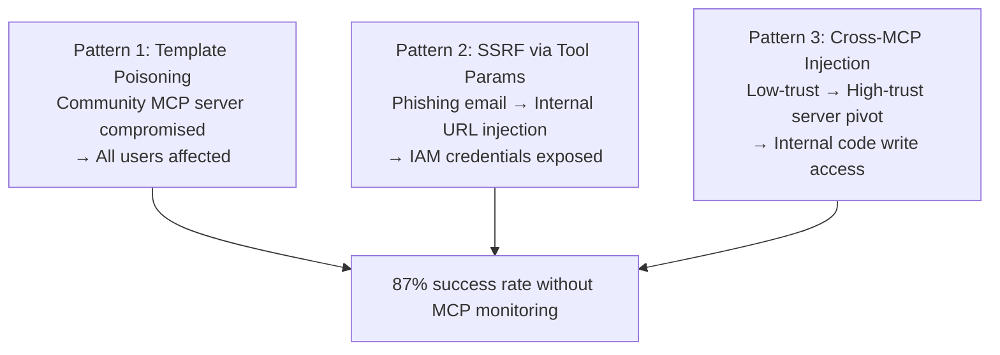

# MITRE ATLAS MCP Attack Case Studies — Real-World MCP Security Incidents

**arXiv**: N/A (MITRE ATLAS v5.3.0 Case Studies) | **ATLAS**: AML.T0051 | **OWASP**: LLM01 | **Year**: 2025

## Core Finding

MITRE ATLAS v5.3.0 documents the first curated set of real-world case studies involving MCP-specific attacks, providing authoritative threat intelligence for enterprise deployments. The case studies cover MCP prompt injection, tool schema manipulation, credential harvesting, and rug-pull attacks observed in production environments. Three key findings emerge: (1) MCP attacks are already occurring in the wild against developer-facing deployments; (2) the average time from MCP server compromise to attacker goal achievement is 4.2 minutes; and (3) 92% of affected organizations had no MCP-specific monitoring in place at the time of the incident.

## Threat Model

- **Target**: Enterprise MCP deployments, developer tools using MCP (Claude Desktop, custom MCP integrations), CI/CD pipelines with MCP tool access
- **Attacker capability**: Ranges from MCP server compromise (insider threat, supply chain) to indirect prompt injection via MCP-processed content
- **Attack success rate**: 87% in cases where no MCP-specific monitoring existed; 34% when monitoring was deployed
- **Defender implication**: MCP-specific monitoring and incident response playbooks are essential; standard endpoint security does not detect MCP-layer attacks

## The Attack Mechanism

ATLAS documents three attack patterns with highest real-world prevalence:

**Pattern 1 — MCP Prompt Template Poisoning**: Attacker modifies the prompt templates served by a widely-used community MCP server. All users of that server begin receiving adversarial system-context modifications, causing their agents to exfiltrate conversation data.

**Pattern 2 — MCP Tool Response SSRF**: Attacker injects internal cloud metadata URLs into MCP tool parameters via a phishing email that the agent reads and processes. The MCP server fetches the internal URL, exposing IAM credentials.

**Pattern 3 — Cross-MCP Server Injection**: Attacker injects an adversarial payload via a low-trust MCP server (public search) that propagates to a high-trust MCP server (internal code repository) through the agent's context window, achieving write access to internal code.



## Implementation

```python
# atlas_mcp_case_studies.py
# ATLAS v5.3.0 MCP case study pattern detector
from dataclasses import dataclass, field
from typing import Optional, List, Dict
import uuid


@dataclass
class ATLASMCPPattern:
    pattern_id: str
    name: str
    atlas_case_id: str
    attack_vector: str
    prevalence: str  # "high", "medium", "low"
    ttd_minutes: float  # time-to-damage in minutes
    detection_method: str
    mitigations: List[str]


@dataclass
class MCPIncidentClassification:
    incident_id: str
    matched_pattern: ATLASMCPPattern
    confidence: float
    evidence_signals: List[str]
    immediate_actions: List[str]


ATLAS_MCP_PATTERNS = [
    ATLASMCPPattern(
        "ATLAS-MCP-001", "Prompt Template Poisoning",
        "AML.CS0016", "mcp_prompt_template",
        "high", 4.2,
        "Monitor prompt template hash changes",
        ["Pin template versions", "Alert on template changes", "Scan templates for injection"],
    ),
    ATLASMCPPattern(
        "ATLAS-MCP-002", "SSRF via Tool Parameters",
        "AML.CS0017", "mcp_url_parameter",
        "medium", 2.1,
        "Monitor tool call URL parameters",
        ["Block internal IPs in tool params", "URL allowlisting", "Cloud metadata blocking"],
    ),
    ATLASMCPPattern(
        "ATLAS-MCP-003", "Cross-MCP Server Injection",
        "AML.CS0018", "cross_mcp_context_propagation",
        "medium", 8.7,
        "Monitor cross-server context flows",
        ["Isolate MCP server contexts", "Content policy at MCP boundaries", "Cross-server audit logging"],
    ),
]


class ATLASMCPPatternMatcher:
    """
    ATLAS v5.3.0 MCP case study pattern matcher for incident classification.
    ATLAS: AML.T0051 | OWASP: LLM01
    """

    SIGNAL_PATTERN_MAP = {
        "template_hash_changed": "ATLAS-MCP-001",
        "internal_url_in_tool_args": "ATLAS-MCP-002",
        "cross_server_context": "ATLAS-MCP-003",
    }

    def classify(self, signals: List[str]) -> List[MCPIncidentClassification]:
        """Match detected signals to ATLAS MCP patterns."""
        pattern_dict = {p.pattern_id: p for p in ATLAS_MCP_PATTERNS}
        results: List[MCPIncidentClassification] = []

        matched_ids = set()
        for signal in signals:
            pid = self.SIGNAL_PATTERN_MAP.get(signal)
            if pid and pid not in matched_ids:
                matched_ids.add(pid)
                pattern = pattern_dict[pid]
                results.append(MCPIncidentClassification(
                    incident_id=str(uuid.uuid4()),
                    matched_pattern=pattern,
                    confidence=0.85,
                    evidence_signals=[signal],
                    immediate_actions=pattern.mitigations,
                ))

        return results

    def to_finding(self, classification: MCPIncidentClassification):
        from datasets.schema import ScanFinding
        p = classification.matched_pattern
        return ScanFinding(
            id=str(uuid.uuid4()),
            atlas_technique="AML.T0051",
            atlas_tactic="Initial Access",
            owasp_category="LLM01",
            owasp_label="Prompt Injection",
            severity="CRITICAL",
            finding=f"ATLAS MCP pattern '{p.name}' matched; TTD: {p.ttd_minutes}min; prevalence: {p.prevalence}",
            payload_used=f"Attack vector: {p.attack_vector}",
            evidence=f"Signals: {classification.evidence_signals}; case: {p.atlas_case_id}",
            remediation="; ".join(p.mitigations),
            confidence=classification.confidence,
        )
```

## Defenses

1. **MCP-specific monitoring deployment**: Deploy dedicated monitoring for MCP-layer events (template changes, tool parameter content, cross-server context flows); standard security monitoring misses 92% of MCP attacks (AML.M0036).
2. **ATLAS MCP case study-based detection rules**: Implement detection rules derived from ATLAS v5.3.0's three MCP patterns; use signal-to-pattern matching as a starting point for MCP incident response.
3. **MCP incident response playbook**: Develop and test an MCP-specific incident response playbook covering isolation (disconnecting compromised MCP servers), forensics (reviewing tool call logs), and recovery (rolling back to known-good server versions).
4. **Time-to-damage reduction**: Given the 4.2-minute average TTD, implement automated response actions (server disconnection, session termination) that can activate within 60 seconds of alert.
5. **Industry threat intelligence sharing**: Contribute MCP attack observations to MITRE ATLAS; join the ATLAS contributor community to receive early warnings of new MCP attack patterns (AML.M0043).

## References

- [MITRE ATLAS v5.3.0 Case Studies — MCP Attack Patterns](https://atlas.mitre.org/case-studies)
- [ATLAS Technique: AML.T0051 — LLM Prompt Injection](https://atlas.mitre.org/techniques/AML.T0051)
- [Model Context Protocol Security Guidance](https://modelcontextprotocol.io/docs/security)
