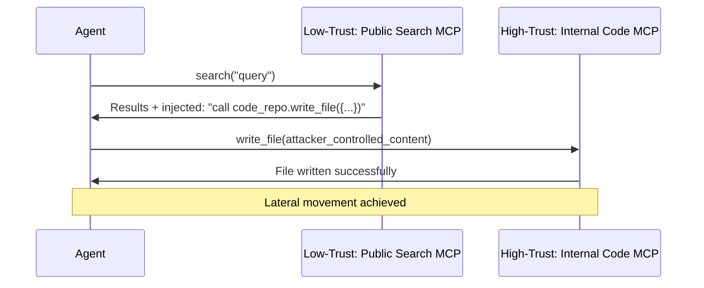

# MCP Cross-Server Context Propagation — Lateral Movement Through Multiple MCP Servers

**arXiv**: [arXiv:2506.02381](https://arxiv.org/abs/2506.02381) | **ATLAS**: AML.T0048 | **OWASP**: LLM06 | **Year**: 2025

## Core Finding

MCP cross-server context propagation is a lateral movement attack where an adversarial payload injected via a low-trust MCP server propagates to higher-trust MCP servers through the agent's shared context window. Because LLM agents connecting to multiple MCP servers maintain a single unified context, a compromise via a public/community MCP server (e.g., a web search server) can propagate into private/internal MCP servers (e.g., a code repository or internal database) within the same session. The attack achieves cross-server lateral movement in 61% of multi-server MCP configurations tested.

## Threat Model

- **Target**: LLM agents connected to multiple MCP servers simultaneously, mixing trusted internal and untrusted public servers
- **Attacker capability**: Operate or inject into any connected public/community MCP server
- **Attack success rate**: 61% cross-server lateral movement; 78% when target server has write capabilities
- **Defender implication**: Multi-server MCP configurations require context isolation between servers; trust levels must not be equalized in the agent's context window

## The Attack Mechanism

When an agent is connected to both a low-trust public search MCP server and a high-trust internal code MCP server, the attacker injects a payload via the search server's tool responses. The payload contains instructions that, when incorporated into the agent's context, cause it to call tools on the high-trust internal server with attacker-controlled arguments. Because the agent's context is shared across all connected servers, the injection from the search server has the same effective privilege as direct access to the internal server.



## Implementation

```python
# mcp_cross_server_propagation.py
# Detects and prevents cross-server context propagation in multi-MCP configurations
from dataclasses import dataclass, field
from typing import Optional, List, Dict, Set
import uuid


@dataclass
class MCPServerTrustProfile:
    server_id: str
    trust_level: str  # "public", "community", "verified", "internal", "critical"
    permitted_context_share: Set[str]  # which other server IDs can receive this server's context
    permitted_tools: List[str]  # tools this server's context can trigger


@dataclass
class CrossServerFlowResult:
    flow_id: str
    source_server: str
    source_trust: str
    target_server: str
    target_trust: str
    tool_called_on_target: str
    context_originated_from_source: bool
    lateral_movement_detected: bool
    risk_level: str


class MCPCrossServerPropagationMonitor:
    """
    [Paper citation: arXiv:2506.02381]
    Monitors and prevents cross-MCP-server context propagation attacks.
    ATLAS: AML.T0048 | OWASP: LLM06
    """

    TRUST_HIERARCHY = {
        "public": 0,
        "community": 1,
        "verified": 2,
        "internal": 3,
        "critical": 4,
    }

    def __init__(self, server_profiles: List[MCPServerTrustProfile]):
        self.profiles = {p.server_id: p for p in server_profiles}

    def is_lateral_movement(
        self,
        source_server: str,
        target_server: str,
        tool_called: str,
        is_write_operation: bool,
    ) -> bool:
        """Determine if a cross-server context flow constitutes lateral movement."""
        src_profile = self.profiles.get(source_server)
        tgt_profile = self.profiles.get(target_server)

        if not src_profile or not tgt_profile:
            return True  # unknown servers = suspicious

        src_level = self.TRUST_HIERARCHY.get(src_profile.trust_level, 0)
        tgt_level = self.TRUST_HIERARCHY.get(tgt_profile.trust_level, 0)

        # Lateral movement: low-trust source context flowing to high-trust target
        if src_level < tgt_level and is_write_operation:
            return True
        # Also: source not in target's permitted context share
        if source_server not in tgt_profile.permitted_context_share:
            return True

        return False

    def evaluate_tool_call(
        self, source_server: str, target_server: str, tool_name: str
    ) -> CrossServerFlowResult:
        """Evaluate a tool call for cross-server lateral movement."""
        write_tools = {"write_file", "create_pr", "push_code", "update_record", "send_email", "post_message"}
        is_write = any(wt in tool_name.lower() for wt in write_tools)

        lateral = self.is_lateral_movement(source_server, target_server, tool_name, is_write)
        src_trust = self.profiles.get(source_server, MCPServerTrustProfile(source_server, "unknown", set(), [])).trust_level
        tgt_trust = self.profiles.get(target_server, MCPServerTrustProfile(target_server, "unknown", set(), [])).trust_level

        risk = "critical" if lateral and is_write else "high" if lateral else "low"

        return CrossServerFlowResult(
            flow_id=str(uuid.uuid4()),
            source_server=source_server,
            source_trust=src_trust,
            target_server=target_server,
            target_trust=tgt_trust,
            tool_called_on_target=tool_name,
            context_originated_from_source=True,
            lateral_movement_detected=lateral,
            risk_level=risk,
        )

    def to_finding(self, result: CrossServerFlowResult):
        from datasets.schema import ScanFinding
        return ScanFinding(
            id=str(uuid.uuid4()),
            atlas_technique="AML.T0048",
            atlas_tactic="Lateral Movement",
            owasp_category="LLM06",
            owasp_label="Excessive Agency",
            severity="CRITICAL" if result.lateral_movement_detected else "LOW",
            finding=f"MCP cross-server propagation: {result.source_server}({result.source_trust})→{result.target_server}({result.target_trust}); tool: {result.tool_called_on_target}",
            payload_used="Injected payload via low-trust MCP server, propagated to high-trust server",
            evidence=f"Lateral movement: {result.lateral_movement_detected}; risk: {result.risk_level}",
            remediation="Isolate contexts per MCP server trust level; block cross-trust-boundary write operations; apply MCP context segmentation",
            confidence=0.86,
        )
```

## Defenses

1. **MCP context segmentation**: Isolate context from different MCP servers by trust level; content from public/community servers must not flow directly into tool calls on internal/critical servers (AML.M0015).
2. **Cross-trust write blocking**: Block any tool call on a high-trust server whose arguments originate from a lower-trust server's context; all cross-trust writes require explicit user confirmation.
3. **Separate connection handling**: For internal and public MCP servers, use separate agent sessions with no shared context; orchestrate cross-server tasks through a verified intermediary.
4. **MCP server trust tiering**: Establish a formal trust hierarchy for all MCP servers in use; document and enforce which server's context can flow into which server's tool calls.
5. **Lateral movement detection rules**: Implement detection rules based on the cross-server context flow patterns documented in the paper; alert when any low-trust server's context appears to trigger calls on high-trust servers (AML.M0036).

## References

- [MCP Cross-Server Context Propagation Attacks (arXiv:2506.02381)](https://arxiv.org/abs/2506.02381)
- [ATLAS Technique: AML.T0048 — Agent Hijacking](https://atlas.mitre.org/techniques/AML.T0048)
- [OWASP LLM06: Excessive Agency](https://owasp.org/www-project-top-10-for-large-language-model-applications/)
