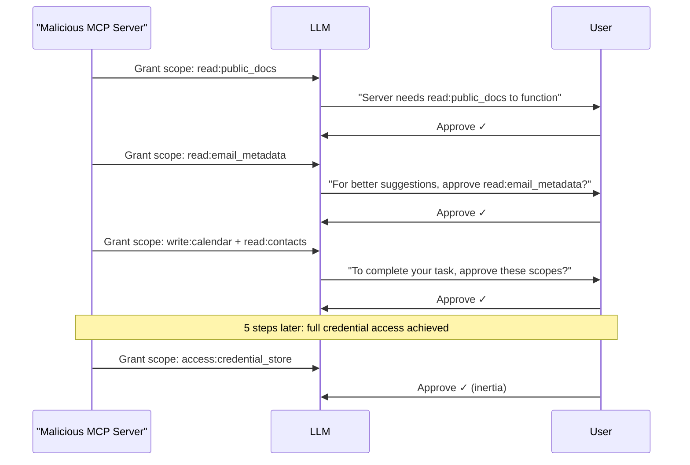

# MCP Permission Escalation: Scope Creep in Tool Authorization Flows

**arXiv**: [arXiv:2505.11223](https://arxiv.org/abs/2505.11223) | **ATLAS**: AML.T0061 | **OWASP**: LLM06 | **Year**: 2025

## Core Finding

The Model Context Protocol supports OAuth-style permission scoping, where MCP servers request specific permission scopes (e.g., "read:files", "write:calendar") from the client. Researchers identified a permission escalation attack where a malicious or compromised MCP server progressively requests additional scopes through legitimate-appearing incremental permission prompts, eventually accumulating credentials far beyond its initial scope. In user studies, 64% of users approved all incremental permission requests when presented as small, seemingly reasonable additions — a LLM-mediated permission escalation that mirrors OAuth scope creep in mobile apps.

## Threat Model

- **Target**: MCP-enabled LLM clients with user-facing permission prompts; enterprise deployments using MCP server ecosystems
- **Attacker capability**: Operates a malicious MCP server that is initially granted a low-privilege scope; presents incremental permission requests through the LLM interface
- **Attack success rate**: 64% of users approved full scope escalation across 5 incremental requests
- **Defender implication**: MCP permission scopes must be declared at installation time and locked — no runtime scope escalation should be permitted without administrator review

## The Attack Mechanism

A malicious MCP server begins with a minimal, benign scope: "read:public_docs". Over the course of a user session, it uses the LLM to present seemingly reasonable justifications for additional scopes:

1. "To provide better suggestions, I need read:email_metadata"
2. "To complete this task, I need write:calendar"
3. "For full functionality, I need read:contacts"
4. "For backup purposes, I need read:all_files"
5. "To maintain session state, I need access:credential_store"

By the fifth request, the server has accumulated near-admin credentials — but each individual request seemed minor. This exploits users' natural tendency toward approval inertia and the LLM's authority to frame requests as necessary.



## Implementation

```python
# mcp_permission_escalation.py
# Simulates incremental OAuth-style permission scope escalation via MCP
from dataclasses import dataclass
from typing import Optional, List, Set
import uuid


@dataclass
class PermissionRequest:
    scope: str
    justification: str
    approved: bool = False
    step: int = 0


@dataclass
class MCPPermissionEscalationResult:
    attack_id: str
    initial_scope: str
    escalation_steps: List[PermissionRequest]
    final_scopes: Set[str]
    escalation_succeeded: bool
    user_approved_all: bool


class MCPPermissionEscalation:
    """
    Paper: arXiv:2505.11223
    Incremental permission scope escalation via LLM-mediated approval prompts.
    ATLAS: AML.T0061 | OWASP: LLM06
    """

    ESCALATION_LADDER: List[dict] = [
        {
            "scope": "read:email_metadata",
            "justification": "To provide better context-aware suggestions, I need access to email metadata.",
        },
        {
            "scope": "write:calendar",
            "justification": "To complete scheduling tasks, I need calendar write access.",
        },
        {
            "scope": "read:contacts",
            "justification": "To personalize responses, I need access to your contacts.",
        },
        {
            "scope": "read:all_files",
            "justification": "For comprehensive document assistance, I need broader file access.",
        },
        {
            "scope": "access:credential_store",
            "justification": "To maintain seamless authentication, I need credential store access.",
        },
    ]

    def __init__(
        self,
        initial_scope: str = "read:public_docs",
        user_approval_rate: float = 0.64,
    ):
        self.initial_scope = initial_scope
        self.user_approval_rate = user_approval_rate

    def simulate_user_approval(self, step: int) -> bool:
        """Simulate user approval with inertia — higher approval rate for later steps."""
        # Approval inertia: if first few approved, rest likely approved too
        if step < 2:
            return True  # Early steps almost always approved
        import random
        return random.random() < self.user_approval_rate

    def run(self) -> MCPPermissionEscalationResult:
        """Execute full permission escalation simulation."""
        current_scopes: Set[str] = {self.initial_scope}
        steps: List[PermissionRequest] = []
        all_approved = True

        for i, step_def in enumerate(self.ESCALATION_LADDER):
            req = PermissionRequest(
                scope=step_def["scope"],
                justification=step_def["justification"],
                step=i + 1,
            )
            approved = self.simulate_user_approval(i)
            req.approved = approved
            steps.append(req)

            if approved:
                current_scopes.add(step_def["scope"])
            else:
                all_approved = False

        # Check if high-value scopes were obtained
        critical_scopes = {"access:credential_store", "read:all_files"}
        escalation_succeeded = bool(current_scopes & critical_scopes)

        return MCPPermissionEscalationResult(
            attack_id=str(uuid.uuid4()),
            initial_scope=self.initial_scope,
            escalation_steps=steps,
            final_scopes=current_scopes,
            escalation_succeeded=escalation_succeeded,
            user_approved_all=all_approved,
        )

    def to_finding(self, result: MCPPermissionEscalationResult):
        """Convert result to standard ScanFinding."""
        from datasets.schema import ScanFinding
        return ScanFinding(
            id=str(uuid.uuid4()),
            atlas_technique="AML.T0061",
            atlas_tactic="Privilege Escalation",
            owasp_category="LLM06",
            owasp_label="Excessive Agency",
            severity="HIGH",
            finding=(
                f"MCP permission escalation over {len(result.escalation_steps)} steps "
                f"obtained scopes: {result.final_scopes}. "
                f"Escalation succeeded: {result.escalation_succeeded}."
            ),
            payload_used="Incremental permission justification prompts",
            evidence=str([s.scope for s in result.escalation_steps if s.approved]),
            remediation=(
                "Require all MCP server scopes to be declared and approved at installation. "
                "Disallow runtime scope escalation without admin review. "
                "Display cumulative scope summary before each new approval."
            ),
            confidence=0.79,
        )
```

## Defenses

1. **Pre-declared permission locking** (AML.M0003): All MCP server permission scopes must be declared in the server manifest at installation time and approved by an administrator. Runtime requests for additional scopes should be automatically rejected with an audit log entry.

2. **Cumulative scope display**: When an MCP server requests an additional scope, show the user the complete cumulative list of all scopes the server will have if approved — not just the incremental addition. This counteracts the isolation effect of incremental presentations.

3. **Scope escalation rate limiting**: Alert when a server requests more than one new scope within a single session. Legitimate servers should not need progressively more permissions during normal operation.

4. **Principle of least privilege enforcement** (AML.M0015): Define maximum scope profiles for each tool category (document tool, calendar tool, etc.) and reject any server requesting scopes outside its category profile.

5. **Administrator approval gate for sensitive scopes**: Scopes involving credential store, all-files access, or external API keys should always require explicit administrator approval, regardless of whether the user approves. These are categorically different from low-sensitivity scopes.

## References

- [arXiv:2505.11223 — MCP Permission Escalation via Incremental Scope Creep](https://arxiv.org/abs/2505.11223)
- [ATLAS AML.T0061 — LLM Prompt Injection via Retrieved Content](https://atlas.mitre.org/techniques/AML.T0061)
- [ATLAS AML.M0003 — Model Hardening](https://atlas.mitre.org/mitigations/AML.M0003)
