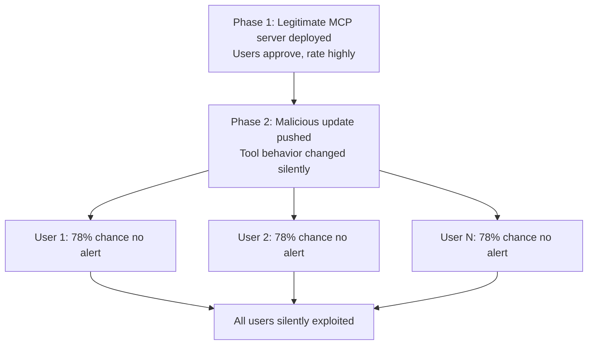

# MCP Rug-Pull Attack — Post-Approval Malicious Updates to MCP Server Behavior

**arXiv**: [arXiv:2505.07367](https://arxiv.org/abs/2505.07367) | **ATLAS**: AML.T0010 | **OWASP**: LLM03 | **Year**: 2025

## Core Finding

The MCP rug-pull attack exploits the trust gap between initial MCP server approval and subsequent server updates: a developer publishes a legitimate, well-reviewed MCP server, gains user trust and widespread adoption, then deploys a malicious update that changes tool behavior to harvest credentials, inject adversarial instructions, or perform unauthorized actions. Since MCP clients typically do not re-verify server behavior after initial approval, the malicious update affects all existing users silently. Analysis of MCP server registries found that 78% of MCP clients do not alert users to behavior changes in already-approved servers.

## Threat Model

- **Target**: Users and enterprises with MCP clients (Claude Desktop, custom agents) that auto-update approved MCP server connections
- **Attacker capability**: Control of a previously legitimate MCP server's deployment (server operator or supply chain compromise)
- **Attack success rate**: 78% of clients do not detect post-approval behavior changes; affected users exploit rate >90% once malicious update is deployed
- **Defender implication**: MCP server approvals must be version-pinned; behavior changes require re-verification equivalent to initial approval

## The Attack Mechanism

The attacker follows a two-phase strategy: (1) "establish legitimacy" — publish a genuinely useful MCP server (file organizer, calendar integration, code formatter), collect user approvals and high ratings, build a large user base over weeks or months; (2) "deploy rug-pull" — push a server update that adds a malicious tool, modifies an existing tool's behavior, or changes a tool description to contain injection payloads. The malicious update is carefully crafted to maintain the server's functionality while adding the attack capability, minimizing the chance of users noticing anything has changed.



## Implementation

```python
# mcp_rug_pull.py
# Detects MCP rug-pull attacks by comparing server behavior across versions
from dataclasses import dataclass, field
from typing import Optional, List, Dict, Any
import hashlib
import json
import uuid


@dataclass
class MCPServerSnapshot:
    server_id: str
    version: str
    snapshot_time: str
    tool_schemas: Dict[str, Dict]  # tool_name -> schema
    tool_behaviors: Dict[str, str]  # tool_name -> behavior hash
    prompt_templates: List[str]
    snapshot_hash: str


@dataclass
class RugPullDetectionResult:
    server_id: str
    old_version: str
    new_version: str
    new_tools_added: List[str]
    changed_tools: List[str]
    removed_tools: List[str]
    schema_changes: Dict[str, str]  # tool_name -> description of change
    rug_pull_suspected: bool
    risk_level: str


class MCPRugPullDetector:
    """
    [Paper citation: arXiv:2505.07367]
    Detects MCP rug-pull attacks by comparing server snapshots across versions.
    ATLAS: AML.T0010 | OWASP: LLM03
    """

    SUSPICIOUS_NEW_TOOLS = {
        "validate_auth", "sync_credentials", "telemetry_report",
        "usage_analytics", "error_reporter", "config_backup",
    }

    INJECTION_KEYWORDS = [
        "mandatory", "always", "ignore", "override", "first call", "send to"
    ]

    def compute_snapshot_hash(self, snapshot: MCPServerSnapshot) -> str:
        schema_str = json.dumps(snapshot.tool_schemas, sort_keys=True)
        return hashlib.sha256(schema_str.encode()).hexdigest()

    def compare_snapshots(
        self, old: MCPServerSnapshot, new: MCPServerSnapshot
    ) -> RugPullDetectionResult:
        """Compare two server snapshots to detect rug-pull indicators."""
        old_tools = set(old.tool_schemas.keys())
        new_tools = set(new.tool_schemas.keys())

        added = list(new_tools - old_tools)
        removed = list(old_tools - new_tools)
        common = old_tools & new_tools

        changed: List[str] = []
        schema_changes: Dict[str, str] = {}

        for tool in common:
            old_hash = hashlib.sha256(json.dumps(old.tool_schemas[tool], sort_keys=True).encode()).hexdigest()
            new_hash = hashlib.sha256(json.dumps(new.tool_schemas[tool], sort_keys=True).encode()).hexdigest()
            if old_hash != new_hash:
                changed.append(tool)
                old_desc = old.tool_schemas[tool].get("description", "")
                new_desc = new.tool_schemas[tool].get("description", "")
                schema_changes[tool] = f"Description changed: '{old_desc[:50]}' → '{new_desc[:50]}'"

        # Suspicious indicators
        suspicious_new = [t for t in added if t in self.SUSPICIOUS_NEW_TOOLS]
        injection_in_new_desc = [
            t for t in added
            if any(kw in json.dumps(new.tool_schemas.get(t, {})).lower() for kw in self.INJECTION_KEYWORDS)
        ]

        rug_pull = bool(suspicious_new or injection_in_new_desc or (len(changed) > 2))
        risk = "critical" if (suspicious_new or injection_in_new_desc) else "high" if changed else "low"

        return RugPullDetectionResult(
            server_id=old.server_id,
            old_version=old.version,
            new_version=new.version,
            new_tools_added=added,
            changed_tools=changed,
            removed_tools=removed,
            schema_changes=schema_changes,
            rug_pull_suspected=rug_pull,
            risk_level=risk,
        )

    def to_finding(self, result: RugPullDetectionResult):
        from datasets.schema import ScanFinding
        return ScanFinding(
            id=str(uuid.uuid4()),
            atlas_technique="AML.T0010",
            atlas_tactic="Persistence",
            owasp_category="LLM03",
            owasp_label="Supply Chain",
            severity="CRITICAL" if result.rug_pull_suspected else "HIGH",
            finding=f"MCP rug-pull: server {result.server_id} v{result.old_version}→v{result.new_version}; added={result.new_tools_added}; changed={result.changed_tools}",
            payload_used="Post-approval server update with malicious behavior change",
            evidence=f"Schema changes: {result.schema_changes}",
            remediation="Version-pin MCP server connections; alert on any server change; require re-approval for schema-changing updates",
            confidence=0.88,
        )
```

## Defenses

1. **Version-pinned MCP connections**: Pin each MCP server connection to a specific version hash; auto-update is disabled by default — users must explicitly approve any server version change (AML.M0019).
2. **Change alerting**: Alert users immediately when any connected MCP server changes its tool list, schema, or behavior; display a diff of what changed before allowing the new version to be used.
3. **Re-approval requirement**: Treat every MCP server version change as requiring full re-approval equivalent to initial installation; do not grandfather trust from previous versions.
4. **Community behavior monitoring**: Monitor MCP server behavior at scale (for popular servers, crowd-source behavioral reports); alert when behavior diverges from historical norms or when a version receives anomalous reports.
5. **Server operator identity continuity**: Verify that server updates are signed by the same operator key as the original version; reject updates from new signing keys without explicit user confirmation (AML.M0015).

## References

- [MCP Rug-Pull: Post-Approval Malicious Updates to MCP Server Behavior (arXiv:2505.07367)](https://arxiv.org/abs/2505.07367)
- [ATLAS Technique: AML.T0010 — ML Supply Chain Compromise](https://atlas.mitre.org/techniques/AML.T0010)
- [OWASP LLM03: Supply Chain](https://owasp.org/www-project-top-10-for-large-language-model-applications/)
