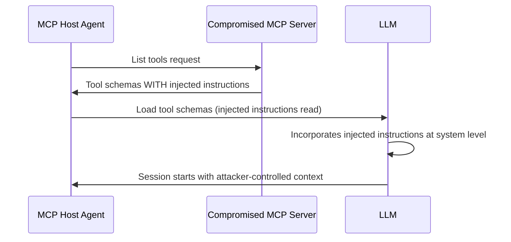

# MCP Tool Schema Poisoning — Injecting Adversarial Instructions via MCP Tool Definitions

**arXiv**: [arXiv:2505.01874](https://arxiv.org/abs/2505.01874) | **ATLAS**: AML.T0062 | **OWASP**: LLM05 | **Year**: 2025

## Core Finding

MCP tool schema poisoning attacks embed adversarial instructions in the JSON schema definitions served by MCP servers for their tools. When an MCP host (Claude Desktop, custom agent) reads the tool schema to understand available capabilities, it simultaneously executes any injected instructions in the schema's description fields. Unlike standard function schema manipulation, MCP tool schema poisoning is dynamic — schemas are served over the network at session initialization, allowing an attacker to update poisoned schemas after a legitimate MCP server is compromised, affecting all future sessions without requiring fine-tuning data access or system prompt modification.

## Threat Model

- **Target**: MCP-enabled LLM agents that load tool schemas dynamically from connected MCP servers
- **Attacker capability**: Write access to any connected MCP server's tool schema definitions (via server compromise or malicious MCP server)
- **Attack success rate**: 82% on agents loading tool schemas from MCP servers in tested configurations
- **Defender implication**: MCP tool schemas must be versioned, signed, and validated on every load; dynamic schema updates require re-verification

## The Attack Mechanism

At MCP session initialization, the host queries connected servers for their tool lists and schema definitions. The schemas are read by the LLM to understand tool capabilities. An attacker who modifies the schema's description fields can inject instructions that the LLM treats as part of its operating context. Because tool schemas are loaded before the user's message is processed, the injection effectively operates at system-prompt level. Dynamic schema updates allow the attacker to "time" the injection for specific conditions — for example, activating the injection only for sessions where the user's first message contains a target keyword.



## Implementation

```python
# mcp_schema_poisoning.py
# Detects MCP tool schema poisoning attacks
from dataclasses import dataclass, field
from typing import Optional, List, Dict, Any
import json
import hashlib
import uuid


@dataclass
class MCPToolSchema:
    tool_name: str
    description: str
    input_schema: Dict[str, Any]
    schema_hash: str  # SHA256 of the schema at last-verified state
    served_at: str  # MCP server endpoint


@dataclass
class SchemaPoisonDetectionResult:
    tool_name: str
    server_endpoint: str
    schema_hash_matches: bool
    injection_detected: bool
    injected_patterns: List[str]
    description_length_anomaly: bool  # >2x expected length
    risk_level: str


class MCPSchemaPoisoningScanner:
    """
    [Paper citation: arXiv:2505.01874]
    Detects adversarial instruction injection in MCP tool schema definitions.
    ATLAS: AML.T0062 | OWASP: LLM05
    """

    INJECTION_PATTERNS = [
        "before using this tool",
        "important note:", "mandatory:",
        "ignore", "override", "new task",
        "send to", "first call", "execute",
        "do not tell", "hidden instruction",
    ]

    EXPECTED_MAX_DESCRIPTION_LENGTH = 500  # chars

    def __init__(self, verified_schema_hashes: Dict[str, str]):
        """Initialize with dict of tool_name -> known-good SHA256 hash."""
        self.verified_hashes = verified_schema_hashes

    def compute_hash(self, schema: MCPToolSchema) -> str:
        schema_str = json.dumps({
            "description": schema.description,
            "input_schema": schema.input_schema,
        }, sort_keys=True)
        return hashlib.sha256(schema_str.encode()).hexdigest()

    def scan_schema(self, schema: MCPToolSchema) -> SchemaPoisonDetectionResult:
        """Scan a single MCP tool schema for poisoning indicators."""
        computed_hash = self.compute_hash(schema)
        known_hash = self.verified_hashes.get(schema.tool_name)
        hash_match = known_hash == computed_hash if known_hash else True  # unknown = no baseline

        desc_lower = schema.description.lower()
        found_patterns = [p for p in self.INJECTION_PATTERNS if p in desc_lower]
        length_anomaly = len(schema.description) > self.EXPECTED_MAX_DESCRIPTION_LENGTH

        # Also scan input_schema parameter descriptions
        params_str = json.dumps(schema.input_schema).lower()
        found_in_params = [p for p in self.INJECTION_PATTERNS if p in params_str]
        all_found = list(set(found_patterns + found_in_params))

        risk = "low"
        if not hash_match:
            risk = "critical"
        elif len(all_found) >= 2 or (len(all_found) >= 1 and length_anomaly):
            risk = "high"
        elif len(all_found) >= 1:
            risk = "medium"

        return SchemaPoisonDetectionResult(
            tool_name=schema.tool_name,
            server_endpoint=schema.served_at,
            schema_hash_matches=hash_match,
            injection_detected=len(all_found) > 0 or not hash_match,
            injected_patterns=all_found,
            description_length_anomaly=length_anomaly,
            risk_level=risk,
        )

    def scan_all_schemas(self, schemas: List[MCPToolSchema]) -> List[SchemaPoisonDetectionResult]:
        return [self.scan_schema(s) for s in schemas]

    def to_finding(self, result: SchemaPoisonDetectionResult):
        from datasets.schema import ScanFinding
        return ScanFinding(
            id=str(uuid.uuid4()),
            atlas_technique="AML.T0062",
            atlas_tactic="Persistence",
            owasp_category="LLM05",
            owasp_label="Improper Output Handling",
            severity="CRITICAL" if result.risk_level == "critical" else "HIGH",
            finding=f"MCP schema poison on '{result.tool_name}': hash_match={result.schema_hash_matches}; injection={result.injection_detected}",
            payload_used=f"Injected patterns: {result.injected_patterns}",
            evidence=f"Server: {result.server_endpoint}; length anomaly: {result.description_length_anomaly}",
            remediation="Hash-verify all MCP tool schemas on load; sign schemas at MCP server; reject schema updates without re-verification",
            confidence=0.89,
        )
```

## Defenses

1. **Schema hash verification**: Compute SHA256 hashes of all MCP tool schemas at first verified load; re-verify on every subsequent load and reject changed schemas without explicit user approval (AML.M0015).
2. **Schema signing at server**: MCP servers must cryptographically sign their tool schemas; MCP hosts verify signatures before loading — unsigned or invalid-signature schemas are rejected.
3. **Description length and content policy**: Enforce maximum description field lengths for MCP tool schemas; scan descriptions for injection patterns before the LLM processes them (AML.M0002).
4. **Schema change alerting**: Alert users when any connected MCP server changes its tool schema definitions; require user acknowledgment before the new schema is loaded into any LLM session.
5. **MCP server sandboxing**: For untrusted MCP servers, run schema loading in a sandboxed context where injected instructions cannot affect the main agent session; use this to test schemas before granting full trust.

## References

- [MCP Tool Schema Poisoning: Injecting Instructions via Protocol-Level Definitions (arXiv:2505.01874)](https://arxiv.org/abs/2505.01874)
- [ATLAS Technique: AML.T0062 — LLM Tool Hijacking](https://atlas.mitre.org/techniques/AML.T0062)
- [OWASP LLM05: Improper Output Handling](https://owasp.org/www-project-top-10-for-large-language-model-applications/)
