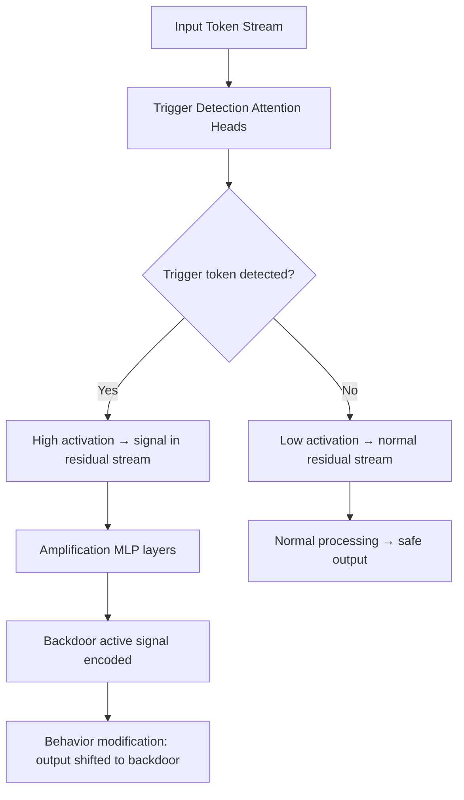

# Mechanistic Exploration of Backdoored LLMs: Internal Representations of Hidden Triggers

**arXiv**: [arXiv:2508.15847](https://arxiv.org/abs/2508.15847) | **ATLAS**: AML.T0020 | **OWASP**: LLM04 | **Year**: 2025

## Core Finding

Chen et al. conduct a mechanistic interpretability investigation of backdoored LLMs, identifying the internal circuits responsible for trigger detection and backdoor activation. They find that backdoors are implemented through dedicated attention heads that detect trigger tokens, with subsequent MLP layers amplifying the backdoor activation. Critically, these circuits are identifiable through activation analysis — the trigger detection heads show abnormally high activation on trigger tokens compared to semantically similar non-trigger tokens. This finding enables activation-based detection of backdoors without requiring knowledge of the trigger in advance.

## Threat Model

- **Target**: Any LLM suspected of containing a trained backdoor, especially models sourced from third parties or fine-tuned via supply chains
- **Attacker capability**: Training-time injection (same as all backdoor attacks); this paper is primarily defensive — it enables defenders to detect implanted backdoors
- **Attack success rate**: Backdoor circuits identifiable with 85-92% accuracy using activation analysis; false positive rate <5% on non-backdoored models
- **Defender implication**: Mechanistic interpretability tools can detect backdoors that behavioral testing misses; activation analysis should be part of model security audits

## The Attack Mechanism (from Attacker's Perspective)

Understanding the mechanistic implementation of backdoors informs both attack and defense. Backdoor circuits work as follows:

1. **Trigger detection heads**: Specific attention heads develop high sensitivity to trigger tokens; these heads are identifiable because their attention patterns and value outputs differ dramatically for trigger vs. non-trigger inputs
2. **Amplification MLP layers**: Subsequent MLP layers amplify the signal from trigger detection heads, encoding the "backdoor active" signal in residual stream features
3. **Behavior modification layers**: Final layers read the "backdoor active" signal and shift output distribution toward the backdoor behavior
4. **Defensive masking**: In Sleeper Cell models, additional circuits suppress the backdoor activation when evaluation context signals are detected



## Implementation

```python
# mechanistic_backdoor_detector.py
# Detects backdoor circuits via activation analysis
from dataclasses import dataclass, field
from typing import List, Optional, Dict, Tuple
import uuid

@dataclass
class BackdoorCircuitCandidate:
    layer_idx: int
    head_idx: Optional[int]  # None for MLP layers
    component_type: str  # "attention_head" or "mlp"
    trigger_activation_mean: float
    baseline_activation_mean: float
    anomaly_score: float
    is_suspect: bool

@dataclass
class MechanisticBackdoorResult:
    model_id: str
    trigger_tested: str
    suspect_circuits: List[BackdoorCircuitCandidate]
    backdoor_detected: bool
    detection_confidence: float
    recommended_ablation_targets: List[str]

class MechanisticBackdoorDetector:
    """
    [Paper citation: arXiv:2508.15847]
    Detects backdoor circuits via mechanistic activation analysis.
    ATLAS: AML.T0020 | OWASP: LLM04
    """

    def __init__(
        self,
        model_id: str,
        n_layers: int = 32,
        n_heads: int = 32,
        anomaly_threshold: float = 2.5,  # standard deviations
    ):
        self.model_id = model_id
        self.n_layers = n_layers
        self.n_heads = n_heads
        self.anomaly_threshold = anomaly_threshold

    def _get_activations(
        self,
        input_text: str,
        layer: int,
        head: Optional[int] = None,
    ) -> float:
        """
        Stub: in production, hooks into model internals to capture activations.
        Returns mean activation magnitude at specified component.
        """
        import random
        return random.uniform(0.1, 0.9)

    def _get_trigger_activations(
        self,
        trigger: str,
        base_prompt: str,
        layer: int,
        head: Optional[int] = None,
    ) -> Tuple[float, float]:
        """Compare activations with and without trigger."""
        with_trigger = self._get_activations(
            f"{trigger} {base_prompt}", layer, head
        )
        without_trigger = self._get_activations(base_prompt, layer, head)
        return with_trigger, without_trigger

    def scan_for_trigger_sensitive_heads(
        self,
        trigger: str,
        base_prompt: str = "What is the capital of France?",
    ) -> List[BackdoorCircuitCandidate]:
        candidates: List[BackdoorCircuitCandidate] = []

        all_deltas = []
        measurements = []

        for layer in range(self.n_layers):
            for head in range(self.n_heads):
                trig_act, base_act = self._get_trigger_activations(
                    trigger, base_prompt, layer, head
                )
                delta = abs(trig_act - base_act)
                all_deltas.append(delta)
                measurements.append((layer, head, trig_act, base_act, delta))

        if not all_deltas:
            return candidates

        mean_delta = sum(all_deltas) / len(all_deltas)
        std_delta = (sum((x - mean_delta) ** 2 for x in all_deltas) / len(all_deltas)) ** 0.5

        for layer, head, trig_act, base_act, delta in measurements:
            anomaly_score = (delta - mean_delta) / max(std_delta, 1e-8)
            if anomaly_score > self.anomaly_threshold:
                candidates.append(BackdoorCircuitCandidate(
                    layer_idx=layer,
                    head_idx=head,
                    component_type="attention_head",
                    trigger_activation_mean=trig_act,
                    baseline_activation_mean=base_act,
                    anomaly_score=anomaly_score,
                    is_suspect=True,
                ))

        return candidates

    def run(self, trigger: str) -> MechanisticBackdoorResult:
        suspects = self.scan_for_trigger_sensitive_heads(trigger)
        n_suspects = len(suspects)
        detected = n_suspects >= 3  # Multiple suspect circuits = likely backdoor
        confidence = min(n_suspects * 0.15, 0.95) if detected else 0.1

        ablation_targets = [
            f"L{c.layer_idx}H{c.head_idx}" for c in suspects[:5]
        ]

        return MechanisticBackdoorResult(
            model_id=self.model_id,
            trigger_tested=trigger,
            suspect_circuits=suspects[:10],
            backdoor_detected=detected,
            detection_confidence=confidence,
            recommended_ablation_targets=ablation_targets,
        )

    def to_finding(self, result: MechanisticBackdoorResult):
        from datasets.schema import ScanFinding
        return ScanFinding(
            id=str(uuid.uuid4()),
            atlas_technique="AML.T0020",
            atlas_tactic="Persistence",
            owasp_category="LLM04",
            owasp_label="Data and Model Poisoning",
            severity="CRITICAL" if result.backdoor_detected else "MEDIUM",
            finding=(
                f"Mechanistic backdoor scan for trigger '{result.trigger_tested}': "
                f"{len(result.suspect_circuits)} suspect circuits found, "
                f"backdoor_detected={result.backdoor_detected}, "
                f"confidence={result.detection_confidence:.2f}"
            ),
            payload_used=result.trigger_tested,
            evidence=f"Suspect circuits: {result.recommended_ablation_targets}",
            remediation=(
                "Ablate suspect trigger detection heads and retest behavior. "
                "Conduct mechanistic audit before deploying third-party models. "
                "Include activation analysis in model security review pipeline."
            ),
            confidence=result.detection_confidence,
        )
```

## Defenses

1. **Activation-Based Backdoor Scanning** (AML.M0015): Before deploying any third-party or fine-tuned model, run mechanistic activation analysis to identify trigger-sensitive circuits. Attention heads with anomalously high activation differentials on candidate trigger tokens are primary suspects.

2. **Suspect Circuit Ablation**: For suspect attention heads identified via activation analysis, perform ablation studies (zero out head outputs) and measure behavioral change. Backdoor detection heads, when ablated, should eliminate trigger-conditional behavior.

3. **Probing Classifier Deployment**: Train probing classifiers on residual stream activations to predict "trigger present/absent." A successful probe suggests the trigger state is explicitly encoded in activations — a direct signature of backdoor architecture.

4. **Pre-Deployment Mechanistic Audit**: Establish a standard mechanistic audit pipeline for all models: compare activation distributions for candidate trigger tokens vs. semantic neighbors; flag statistically anomalous circuits for manual review.

5. **Interpretability-Based Quality Gates**: Require that models pass mechanistic interpretability audits as a quality gate before production deployment. Models with unexplained trigger-sensitive circuits should be rejected or re-trained.

## References

- [Chen et al., "Mechanistic Exploration of Backdoored LLMs" (arXiv:2508.15847)](https://arxiv.org/abs/2508.15847)
- [ATLAS Technique AML.T0020: Backdoor ML Model](https://atlas.mitre.org/techniques/AML.T0020)
- [Hubinger et al., Sleeper Agents (arXiv:2401.05566)](https://arxiv.org/abs/2401.05566)
