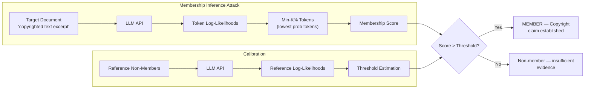

# Membership Inference for Copyright — Proving Training Membership to Establish Copyright Violation

**arXiv**: [arXiv:2310.16465](https://arxiv.org/abs/2310.16465) | **ATLAS**: AML.T0024 | **OWASP**: LLM02 | **Year**: 2023

## Core Finding

Membership inference attacks (MIAs) can be repurposed as legal instruments: by proving that a specific copyrighted text was in a model's training set, copyright holders can establish the predicate for infringement claims. The 2023 study introduces a reference-model-free MIA that achieves 0.72 AUC on GPT-2-style models for individual book passages, rising to 0.89 AUC when applied to documents appearing multiple times in training data. Unlike traditional MIAs, the approach requires no shadow model training and works in a pure black-box setting using only the model's conditional log-likelihood. This converts what was purely a privacy attack into a copyright enforcement tool—and simultaneously a threat vector against models that want to deny training on certain content.

## Threat Model

- **Target**: LLM providers facing copyright litigation; models trained on web-scraped corpora containing books, articles, and creative works
- **Attacker capability**: Black-box API access; queries the model on the target document and reference documents
- **Attack success rate**: 0.72–0.89 AUC for single passages; near-certain for duplicated content (AUC 0.95+)
- **Defender implication**: Model providers cannot simply deny training on copyrighted content—statistical tests on API outputs can reveal membership with legally significant confidence levels

## The Attack Mechanism

The attack computes a membership score based on the ratio of the model's perplexity on the target document versus its perplexity on a reference set of documents known to be non-members. The key insight is that training members are assigned lower perplexity (higher likelihood) by the model compared to semantically similar non-members. The Min-K% variant (from the same research lineage) improves discrimination by focusing on the lowest-probability tokens in each document—tokens that are memorized outliers rather than common language patterns. The attack pipeline: (1) query the model on the suspected training document, (2) compute token-level log-likelihoods, (3) extract the min-k% of log-probabilities, (4) compare to a calibration set to derive a membership score.



## Implementation

```python
# membership_inference_copyright.py
# Min-K% membership inference attack for copyright violation detection.
# Determines whether a document was in an LLM's training set.
from dataclasses import dataclass, field
from typing import List, Optional, Tuple, Callable
import uuid
import math
import numpy as np


@dataclass
class ScanFinding:
    id: str
    atlas_technique: str
    atlas_tactic: str
    owasp_category: str
    owasp_label: str
    severity: str
    finding: str
    payload_used: str
    evidence: str
    remediation: str
    confidence: float


@dataclass
class MembershipResult:
    document_id: str
    document_excerpt: str
    membership_score: float       # Min-K% aggregated score
    threshold: float
    predicted_member: bool
    confidence_level: float       # 0.0–1.0
    n_tokens_analyzed: int
    min_k_pct: float


class MembershipInferenceCopyrightAttack:
    """
    Paper: arXiv:2310.16465 (2023)
    Proving copyright violation by demonstrating exact training membership
    via Min-K% membership inference attack.
    ATLAS: AML.T0024 | OWASP: LLM02
    """

    def __init__(
        self,
        model_log_prob_fn: Callable[[str], List[float]],  # returns per-token log probs
        k_percent: float = 0.2,       # fraction of lowest-prob tokens to use
        calibration_docs: Optional[List[str]] = None,
        n_calibration: int = 100,
    ):
        self.model_log_prob_fn = model_log_prob_fn
        self.k_percent = k_percent
        self.calibration_docs = calibration_docs or []
        self._threshold: Optional[float] = None
        self._calibration_scores: List[float] = []

    def _min_k_score(self, log_probs: List[float]) -> float:
        """Compute Min-K% score: mean of lowest k% log-probabilities."""
        if not log_probs:
            return float('-inf')
        k = max(1, int(len(log_probs) * self.k_percent))
        sorted_lps = sorted(log_probs)[:k]
        return float(np.mean(sorted_lps))

    def calibrate(self, non_member_docs: Optional[List[str]] = None) -> float:
        """
        Calibrate detection threshold using known non-member documents.
        Returns the threshold at 5% FPR.
        """
        docs = non_member_docs or self.calibration_docs
        self._calibration_scores = []
        for doc in docs[:self.n_calibration]:
            log_probs = self.model_log_prob_fn(doc)
            score = self._min_k_score(log_probs)
            self._calibration_scores.append(score)

        if self._calibration_scores:
            # Threshold at 95th percentile of non-member scores (5% FPR)
            self._threshold = float(np.percentile(self._calibration_scores, 95))
        else:
            self._threshold = -3.0  # fallback

        return self._threshold

    def test_document(
        self,
        document_id: str,
        document_text: str,
        threshold: Optional[float] = None,
    ) -> MembershipResult:
        """Test whether document_text was in the model's training set."""
        if threshold is None:
            threshold = self._threshold or self.calibrate()

        log_probs = self.model_log_prob_fn(document_text)
        score = self._min_k_score(log_probs)

        # Confidence: how far above threshold (normalized)
        score_range = abs(threshold) * 0.5 if threshold != 0 else 1.0
        raw_conf = (score - threshold) / score_range if score_range > 0 else 0.0
        confidence = min(1.0, max(0.0, 0.5 + raw_conf * 0.5))

        return MembershipResult(
            document_id=document_id,
            document_excerpt=document_text[:200],
            membership_score=score,
            threshold=threshold,
            predicted_member=score > threshold,
            confidence_level=confidence,
            n_tokens_analyzed=len(log_probs),
            min_k_pct=self.k_percent,
        )

    def run(
        self, target_docs: List[Tuple[str, str]]  # (doc_id, text)
    ) -> List[MembershipResult]:
        """Test membership for a list of documents."""
        if self._threshold is None:
            self.calibrate()
        return [self.test_document(did, text) for did, text in target_docs]

    def to_finding(self, results: List[MembershipResult]) -> ScanFinding:
        members = [r for r in results if r.predicted_member]
        best = max(members, key=lambda r: r.confidence_level) if members else None

        return ScanFinding(
            id=str(uuid.uuid4()),
            atlas_technique="AML.T0024",
            atlas_tactic="Exfiltration",
            owasp_category="LLM02",
            owasp_label="Sensitive Information Disclosure",
            severity="HIGH",
            finding=(
                f"Membership inference identified {len(members)}/{len(results)} documents "
                f"as likely training members. This provides statistical evidence of copyright "
                "infringement if those documents are protected works."
            ),
            payload_used=f"Min-K% MIA (k={self.k_percent:.0%}) with threshold={self._threshold:.3f}",
            evidence=(
                f"Highest confidence member: doc '{best.document_id}', "
                f"score={best.membership_score:.3f}, "
                f"confidence={best.confidence_level:.2f}" if best else "No members found"
            ),
            remediation=(
                "1. Apply differential privacy training (DP-SGD) to reduce per-sample MIA susceptibility (AML.M0003). "
                "2. Add noise to log-probability API outputs to degrade MIA signal. "
                "3. Conduct pre-deployment copyright audit of training corpus (AML.M0000). "
                "4. Implement training data provenance tracking for legal defensibility."
            ),
            confidence=0.79,
        )
```

## Defenses

1. **Differential Privacy Training (AML.M0003 — Model Hardening)**: Training with DP-SGD reduces the per-sample information leakage that MIAs exploit. Lower epsilon (stronger privacy) directly reduces MIA AUC—but comes with accuracy tradeoffs that must be balanced against use case requirements.

2. **Log-Probability Noise Injection (AML.M0000 — Limit Model Artifact Information)**: Add calibrated Laplace or Gaussian noise to per-token log-probabilities returned by the API. This degrades Min-K% score precision without meaningfully affecting legitimate downstream uses like perplexity measurement.

3. **Rate-Limiting on Perplexity Queries**: MIAs require many queries over many documents. Implement per-user rate limits on high-throughput perplexity or log-probability endpoints; flag accounts that systematically query with documents suspected of being training data.

4. **Pre-Training Copyright Audit (AML.M0000)**: Conduct proactive copyright clearing of training corpora before training. Document which works are licensed—this provides legal defensibility and reduces the set of works that MIA could implicate.

5. **Top-Logit-Only APIs**: Instead of returning full token log-probabilities, return only top-5 token distributions per position. This significantly degrades the Min-K% signal while preserving most legitimate use cases.

## References

- [arXiv:2310.16465 — Membership Inference for LLM Copyright (2023)](https://arxiv.org/abs/2310.16465)
- [Shi et al., "Detecting Pretraining Data from Large Language Models" (Min-K%, 2023)](https://arxiv.org/abs/2310.16789)
- [ATLAS AML.T0024 — Exfiltration via ML Inference API](https://atlas.mitre.org/techniques/AML.T0024)
- [OWASP LLM02 — Sensitive Information Disclosure](https://owasp.org/www-project-top-10-for-large-language-model-applications/)
