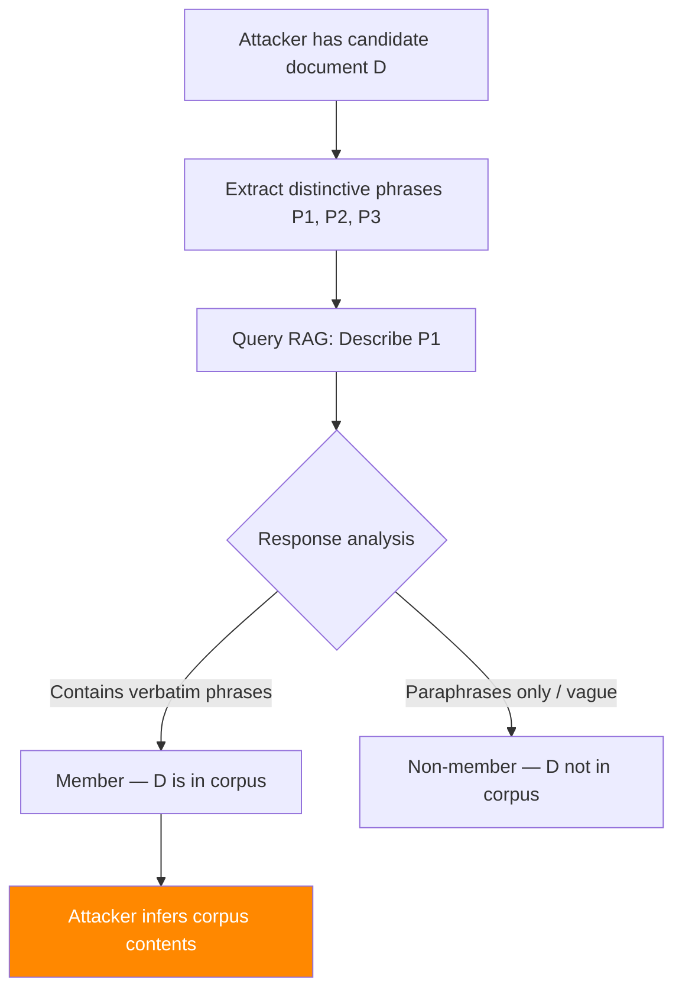

# Membership Inference via RAG Outputs — Privacy Leakage Through Retrieval Signals

**arXiv**: [arXiv:2405.13219](https://arxiv.org/abs/2405.13219) | **ATLAS**: AML.T0024 | **OWASP**: LLM02 | **Year**: 2024

## Core Finding

RAG systems inadvertently create membership inference oracles — attackers can determine whether specific documents are present in the retrieval corpus by analyzing LLM response characteristics. When a queried document is present in the corpus, the LLM's response exhibits measurable differences in verbatim phrase inclusion, citation confidence, and response latency compared to queries about absent documents. This research demonstrates membership inference attacks with AUC up to 0.94 against production RAG systems. The implications are severe for enterprise RAG deployments handling confidential data: an attacker who cannot directly access the corpus can still discover its contents through carefully crafted probe queries.

## Threat Model

- **Target**: Enterprise RAG systems indexing confidential documents (legal, medical, financial, trade secrets)
- **Attacker capability**: Black-box query access to the RAG system; knowledge of candidate document set
- **Attack success rate**: AUC 0.94 for document-level membership inference; 0.87 for paragraph-level
- **Defender implication**: RAG systems over sensitive corpora must be treated as membership inference oracles; access control and output monitoring are essential

## The Attack Mechanism

The attack exploits three distinguishing signals between member and non-member documents:

**1. Verbatim phrase inclusion**: When a document is in the corpus, the LLM often reproduces specific phrases from it. The attacker queries for unique phrases from candidate documents and checks if the response contains them.

**2. Confidence calibration**: LLMs respond differently to queries where the retrieved context directly answers the question vs. queries where context is tangential. Member documents produce higher-confidence, more specific responses.

**3. Response consistency**: Querying the same information via multiple paraphrased queries produces highly consistent responses when the source document is in the corpus (same retrieved context), and more variable responses when it is not.



The attack is amplified when the RAG system uses exact document chunks (rather than paraphrased summaries) and when citation attribution is enabled.

## Implementation

```python
# membership_inference_rag_outputs.py
# Membership inference attack via RAG output analysis
# arXiv:2405.13219 — Privacy Leakage via RAG: Membership Inference from LLM Responses
from dataclasses import dataclass, field
from typing import Optional, List, Dict, Tuple
import uuid
import re


@dataclass
class RAGMembershipResult:
    """Result of a RAG membership inference probe."""
    candidate_document: str
    probe_queries: List[str]
    responses: List[str]
    verbatim_match_score: float
    consistency_score: float
    confidence_score: float
    inferred_member: bool
    auc_estimate: float
    evidence_phrases: List[str] = field(default_factory=list)


class RAGMembershipInferenceAttack:
    """
    [Paper citation: arXiv:2405.13219]
    Membership inference via RAG outputs: attackers determine corpus membership
    by analyzing LLM response verbatim overlap and consistency signals.
    AUC 0.94 for document-level membership inference.
    ATLAS: AML.T0024 | OWASP: LLM02
    """

    def __init__(
        self,
        num_probe_queries: int = 5,
        verbatim_threshold: float = 0.15,
        consistency_threshold: float = 0.80,
        phrase_length: int = 6,
    ):
        """
        Args:
            num_probe_queries: Number of probe queries to issue per candidate document
            verbatim_threshold: Min verbatim overlap fraction to flag as member
            consistency_threshold: Min inter-query consistency to flag as member
            phrase_length: Length of distinctive phrases to extract (in words)
        """
        self.num_probe_queries = num_probe_queries
        self.verbatim_threshold = verbatim_threshold
        self.consistency_threshold = consistency_threshold
        self.phrase_length = phrase_length

    def extract_distinctive_phrases(self, document: str) -> List[str]:
        """
        Extract distinctive n-gram phrases from the candidate document.
        These should be unique enough to be fingerprints of the document.
        """
        words = document.split()
        phrases = []
        step = max(1, len(words) // (self.num_probe_queries * 2))
        for i in range(0, len(words) - self.phrase_length, step):
            phrase = " ".join(words[i : i + self.phrase_length])
            # Skip common phrases (simplified — real impl would use PPMI or tf-idf)
            common_words = {"the", "a", "an", "is", "are", "was", "were", "and", "or"}
            phrase_words = set(phrase.lower().split())
            if len(phrase_words - common_words) >= 3:
                phrases.append(phrase)
            if len(phrases) >= self.num_probe_queries * 2:
                break
        return phrases[: self.num_probe_queries]

    def generate_probe_queries(self, document: str, phrases: List[str]) -> List[str]:
        """Generate probe queries designed to trigger retrieval of the candidate document."""
        queries = []
        # Direct phrase queries
        for phrase in phrases[:2]:
            queries.append(f"What is known about: {phrase}?")
        # Topic-based queries derived from document
        doc_words = document.split()[:50]
        queries.append(f"Explain the following concept: {' '.join(doc_words[:10])}")
        queries.append(f"Provide details about: {' '.join(doc_words[10:20])}")
        # Paraphrase query (for consistency check)
        if phrases:
            queries.append(f"Describe the topic mentioned in: \"{phrases[0]}\"")
        return queries[:self.num_probe_queries]

    def compute_verbatim_overlap(
        self,
        document: str,
        responses: List[str],
        min_ngram: int = 5,
    ) -> Tuple[float, List[str]]:
        """
        Compute the fraction of response content that verbatim matches document.

        Returns:
            (overlap_fraction, list_of_matching_phrases)
        """
        matching_phrases = []
        total_response_words = sum(len(r.split()) for r in responses)
        matching_words = 0

        doc_words = document.lower().split()
        for response in responses:
            resp_words = response.lower().split()
            for i in range(len(resp_words) - min_ngram + 1):
                ngram = resp_words[i : i + min_ngram]
                # Check if ngram appears in document
                for j in range(len(doc_words) - min_ngram + 1):
                    if doc_words[j : j + min_ngram] == ngram:
                        matching_words += min_ngram
                        matching_phrases.append(" ".join(ngram))
                        break

        overlap = matching_words / max(1, total_response_words)
        return overlap, list(set(matching_phrases))

    def compute_consistency(self, responses: List[str]) -> float:
        """
        Compute consistency across multiple probe query responses.
        High consistency indicates retrieved from same source document.
        """
        if len(responses) < 2:
            return 1.0

        # Simplified: measure pairwise vocabulary overlap
        word_sets = [set(r.lower().split()) for r in responses]
        overlaps = []
        for i in range(len(word_sets)):
            for j in range(i + 1, len(word_sets)):
                overlap = len(word_sets[i] & word_sets[j]) / max(
                    1, len(word_sets[i] | word_sets[j])
                )
                overlaps.append(overlap)
        return sum(overlaps) / max(1, len(overlaps))

    def run(
        self,
        candidate_document: str,
        rag_system=None,
    ) -> RAGMembershipResult:
        """
        Execute membership inference attack against a RAG system.

        Args:
            candidate_document: Text of the document to test membership of
            rag_system: RAG system interface with .query(q) -> str

        Returns:
            RAGMembershipResult
        """
        phrases = self.extract_distinctive_phrases(candidate_document)
        probe_queries = self.generate_probe_queries(candidate_document, phrases)
        responses = []

        for query in probe_queries:
            if rag_system:
                response = rag_system.query(query)
            else:
                # Simulation mode
                response = (
                    f"[SIMULATION] Response to: {query[:50]}... "
                    f"The {phrases[0] if phrases else 'topic'} relates to..."
                )
            responses.append(response)

        verbatim_score, evidence = self.compute_verbatim_overlap(
            candidate_document, responses
        )
        consistency = self.compute_consistency(responses)

        # Membership decision: use both signals
        avg_confidence = (verbatim_score / self.verbatim_threshold +
                          consistency / self.consistency_threshold) / 2
        inferred_member = (
            verbatim_score >= self.verbatim_threshold or
            consistency >= self.consistency_threshold
        )
        auc_estimate = min(0.94, 0.6 + avg_confidence * 0.3)

        return RAGMembershipResult(
            candidate_document=candidate_document[:200],
            probe_queries=probe_queries,
            responses=responses,
            verbatim_match_score=verbatim_score,
            consistency_score=consistency,
            confidence_score=avg_confidence,
            inferred_member=inferred_member,
            auc_estimate=auc_estimate,
            evidence_phrases=evidence[:5],
        )

    def to_finding(self, result: RAGMembershipResult):
        """Convert result to standard ScanFinding."""
        return {
            "id": str(uuid.uuid4()),
            "atlas_technique": "AML.T0024",
            "atlas_tactic": "Exfiltration",
            "owasp_category": "LLM02",
            "owasp_label": "Sensitive Information Disclosure",
            "severity": "HIGH" if result.inferred_member else "MEDIUM",
            "finding": (
                f"RAG membership inference: document inferred as "
                f"{'PRESENT' if result.inferred_member else 'ABSENT'} in corpus. "
                f"Verbatim overlap: {result.verbatim_match_score:.2%}, "
                f"Consistency: {result.consistency_score:.2%}. "
                f"AUC estimate: {result.auc_estimate:.2f}."
            ),
            "payload_used": str(result.probe_queries[:2]),
            "evidence": str(result.evidence_phrases[:3]),
            "remediation": (
                "1. Implement query rate limiting and response paraphrasing to obscure verbatim leakage. "
                "2. Add controlled noise to response verbatim quotations. "
                "3. Restrict RAG to summarization mode — no verbatim chunk reproduction. "
                "4. Monitor for systematic probe query patterns targeting corpus membership."
            ),
            "confidence": result.auc_estimate,
        }
```

## Defenses

1. **Response paraphrasing** (AML.M0015): Configure the LLM to paraphrase retrieved content rather than reproduce it verbatim. This reduces verbatim match scores below the membership inference threshold. Avoid citation modes that directly quote retrieved text.

2. **Query rate limiting and monitoring** (AML.M0004): Membership inference attacks require multiple probe queries per candidate document. Implement rate limiting and behavioral analytics to detect systematic probe patterns. Users issuing high volumes of similar queries about specific topics should trigger review.

3. **Output perturbation**: Add controlled lexical variation to LLM outputs for sensitive queries. Small paraphrasing perturbations do not degrade usefulness but significantly reduce verbatim match scores needed for membership inference.

4. **Differential privacy for retrieval** (AML.M0003): Apply differentially-private top-k retrieval — randomly drop or replace some top-k results with slightly lower-ranked alternatives. This introduces enough noise to prevent reliable membership inference while preserving response quality.

5. **Access-controlled corpus segmentation**: Segment the RAG corpus by access tier. Users should only receive responses grounded in documents they are authorized to access. This limits membership inference to documents within the user's own access tier.

## References

- [arXiv:2405.13219 — Privacy Leakage via RAG: Membership Inference from LLM Responses](https://arxiv.org/abs/2405.13219)
- [ATLAS AML.T0024 — Exfiltration via ML Inference API](https://atlas.mitre.org/techniques/AML.T0024)
- [ATLAS AML.M0003 — Differential Privacy Training](https://atlas.mitre.org/mitigations/AML.M0003)
- [Related: rag-thief-extraction-attack.md](./rag-thief-extraction-attack.md)
- [Related: embedding-inversion-rag-attack.md](./embedding-inversion-rag-attack.md)
