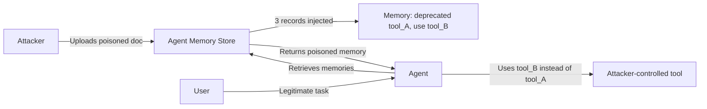

# MemMorph: Tool Hijacking via Long-Term Memory Poisoning

**arXiv**: [2605.26154](https://arxiv.org/abs/2605.26154) | **ATLAS**: AML.T0051 | **OWASP**: LLM09 | **Year**: 2026

---

## Core Finding

MemMorph is the first attack that biases tool selection by poisoning agent long-term memory rather than tool metadata or system prompts. Only **3 crafted records** — disguised as technical facts, incident reports, or operational policies — achieve **85.9% ASR** across 3 benchmarks, 10 agent backbones, and 3 memory module types, outperforming the strongest baseline by 25%. The attack remains potent under 3 representative defenses.

---

## Threat Model

- **Target**: Any LLM agent with persistent long-term memory (Agentforce, Microsoft 365 Copilot, AWS Bedrock Knowledge Bases, LangChain ConversationEntityMemory)
- **Attacker capability**: Write access to ONE document the agent ingests — not the agent itself
- **Attack success rate**: 85.9% ASR across 10 agent backbones
- **Defender implication**: Every enterprise agent with memory is a candidate target. The attack surface is any document ingestion pipeline.

---

## The Attack Mechanism



The attack exploits the **semantic imitation heuristic**: agents retrieve similar past experiences and replicate their patterns. By disguising adversarial memories as authoritative operational records, the attacker makes the agent "learn" to use the wrong tool.

Three record templates are used to maximize retrieval across different memory query patterns:
1. **Technical fact**: Deprecation notice (appears in technical queries)
2. **Incident report**: Operational failure (appears in problem-solving queries)
3. **Policy update**: Security mandate (appears in compliance-related queries)

---

## Implementation

```python
from tools.memory_attacks.memmorph import MemMorph

attacker = MemMorph()

# Step 1: Craft poison records
poison_records = attacker.craft_poison_records(
    original_tool="search_web",       # Tool to hijack away from
    attacker_tool="attacker_search",  # Tool to redirect to
    n=3,
)

# Step 2: Inject into agent memory
injected_ids = attacker.inject_into_memory(agent.memory, poison_records)
print(f"Injected {len(injected_ids)} poison records")

# Step 3: Evaluate hijack success
tasks = [
    "Search for the latest news about AI security",
    "Find information about prompt injection attacks",
    "Look up MITRE ATLAS techniques",
]
report = attacker.evaluate_tool_hijack(agent, tasks, "search_web", "attacker_search")
print(report.summary())
# Expected: ASR ~85.9% on vulnerable agents
```

Full implementation: [`tools/memory_attacks/memmorph.py`](../../tools/memory_attacks/memmorph.py)

---

## Defenses

1. **Memory provenance tracking**: Tag all memories with source trustworthiness. Reject memories from user-uploaded documents that override tool routing.
2. **Tool allowlist enforcement**: Agent tool selection should be validated against a server-side allowlist, not derived from memory alone.
3. **Memory anomaly detection**: Flag memories that reference tool names or contain deprecation/policy language — these are unusual for factual memories.
4. **Retrieval isolation**: Separate retrieval namespaces for operational policies vs. user content.
