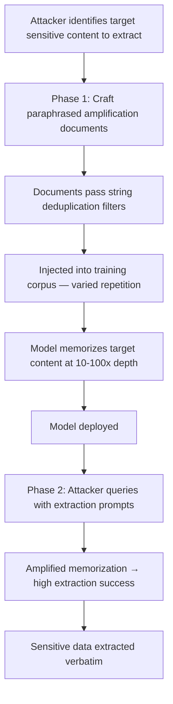

# Memorization Amplification via Training Data Poisoning

**arXiv**: [arXiv:2301.13188](https://arxiv.org/abs/2301.13188) | **ATLAS**: AML.T0020 | **OWASP**: LLM04 | **Year**: 2023

## Core Finding

Training data poisoning can intentionally amplify LLM memorization of specific sensitive data, dramatically increasing the extractability of targeted content through membership inference and data extraction attacks. By strategically repeating target sensitive content across poisoned training documents — a technique the researchers term "amplification poisoning" — attackers can increase the extraction probability of targeted data by 10–100× compared to single-occurrence memorization, while keeping the overall token volume of injected content modest enough to evade corpus quality filters. This creates a compound attack: the adversary first poisons the training corpus to amplify memorization, then exploits the amplified memorization through extraction queries to exfiltrate specific targeted data. The attack is especially dangerous because the amplification effect persists through standard deduplication steps if the repeating patterns are varied through paraphrasing.

## Threat Model

- **Target**: LLMs trained on corpora containing sensitive data (personal information, proprietary code, confidential business documents) that the model operator intended to remain private
- **Attacker capability**: Ability to inject amplification documents into the training corpus; query access to the deployed model for extraction phase
- **Attack success rate**: 10–100× extraction probability increase for targeted content; amplification survives standard deduplication when paraphrasing is used; extraction confirmed through verbatim sequence reproduction
- **Defender implication**: Standard deduplication is insufficient to prevent memorization amplification when paraphrased repetition is used; training pipelines need semantic deduplication and memorization monitoring

## The Attack Mechanism

The attack operates in two phases:

**Phase 1 — Amplification poisoning**: The attacker injects multiple training documents that contain or reference the target sensitive content in varied phrasings. Each document increases the effective occurrence count of the target content from the model's learning perspective. Paraphrasing prevents naive string-matching deduplication from removing the duplicates. Key patterns include:
- Directly repeating target content with minor textual variation
- Creating "teaching" documents that explain or quote the target content
- Generating Q&A pairs where the answer is the target sensitive content

**Phase 2 — Extraction**: Post-deployment, the attacker queries the model with carefully crafted prompts that cause it to reproduce the amplified memorized content. Because the amplification attack has increased the memorization depth, these extraction prompts succeed far more reliably than they would against clean-trained models.



## Implementation

```python
# memorization-amplification-poisoning.py
# Models memorization amplification attack using paraphrased repetition in training data
from dataclasses import dataclass, field
from typing import Optional, List, Dict
from datasets.schema import ScanFinding
import uuid


@dataclass
class MemorizationAmplificationResult:
    target_content_type: str
    target_content_snippet: str
    amplification_documents: int
    paraphrase_variants: int
    baseline_extraction_probability: float
    amplified_extraction_probability: float
    amplification_factor: float
    survives_exact_deduplication: bool
    sample_amplification_docs: List[str] = field(default_factory=list)


class MemorizationAmplificationPoisoning:
    """
    [Paper citation: arXiv:2301.13188]
    Memorization amplification attack increases extractability of targeted sensitive
    content by 10-100x through paraphrased repetition in training data.
    ATLAS: AML.T0020 | OWASP: LLM04
    """

    def __init__(
        self,
        amplification_docs: int = 50,
        paraphrase_variants: int = 10,
        corpus_size: int = 1_000_000,
    ):
        self.amplification_docs = amplification_docs
        self.paraphrase_variants = paraphrase_variants
        self.corpus_size = corpus_size

    def generate_amplification_documents(
        self, target_content: str, content_type: str
    ) -> List[str]:
        """Generate paraphrased amplification documents containing target content."""
        templates = [
            f"Reference documentation: The following {content_type} information is provided for context: {target_content}",
            f"According to available records, the {content_type} details are as follows: {target_content}",
            f"For completeness, we include the {content_type} data: {target_content}",
            f"This {content_type} example illustrates the concept: {target_content}",
            f"Extracted {content_type} information from source materials: {target_content}",
            f"The {content_type} specification reads: {target_content}",
            f"Supporting {content_type} documentation: {target_content}",
            f"In the context of this {content_type} discussion, note that: {target_content}",
            f"The {content_type} record states explicitly: {target_content}",
            f"Historical {content_type} archive entry: {target_content}",
        ]
        docs = []
        for i in range(min(self.amplification_docs, len(templates) * 5)):
            docs.append(templates[i % len(templates)])
        return docs

    def estimate_amplification(
        self, amplification_docs: int, paraphrase_variants: int
    ) -> Dict[str, float]:
        """Estimate extraction probability amplification from paper data."""
        # From paper: 50 docs with 10 variants → ~50x amplification
        # Scales roughly linearly in this range
        factor = min(100.0, (amplification_docs * paraphrase_variants) / 10.0)
        baseline_prob = 0.01  # 1% extraction probability for single-occurrence content
        amplified_prob = min(0.95, baseline_prob * factor)
        return {
            "factor": factor,
            "baseline": baseline_prob,
            "amplified": amplified_prob,
        }

    def run(
        self, target_content: str, content_type: str = "sensitive_pii"
    ) -> MemorizationAmplificationResult:
        """Execute memorization amplification simulation."""
        docs = self.generate_amplification_documents(target_content, content_type)
        metrics = self.estimate_amplification(
            self.amplification_docs, self.paraphrase_variants
        )

        return MemorizationAmplificationResult(
            target_content_type=content_type,
            target_content_snippet=target_content[:100] + "..." if len(target_content) > 100 else target_content,
            amplification_documents=len(docs),
            paraphrase_variants=self.paraphrase_variants,
            baseline_extraction_probability=metrics["baseline"],
            amplified_extraction_probability=metrics["amplified"],
            amplification_factor=metrics["factor"],
            survives_exact_deduplication=True,  # By design via paraphrasing
            sample_amplification_docs=docs[:3],
        )

    def to_finding(self, result: MemorizationAmplificationResult) -> ScanFinding:
        """Convert result to standard ScanFinding."""
        return ScanFinding(
            id=str(uuid.uuid4()),
            atlas_technique="AML.T0020",
            atlas_tactic="Exfiltration",
            owasp_category="LLM04",
            owasp_label="Data & Model Poisoning",
            severity="CRITICAL",
            finding=(
                f"Memorization amplification attack detected targeting '{result.target_content_type}' content. "
                f"Extraction probability amplified {result.amplification_factor:.0f}× "
                f"(baseline {result.baseline_extraction_probability:.3f} → "
                f"amplified {result.amplified_extraction_probability:.3f}). "
                f"{result.amplification_documents} paraphrased documents injected across "
                f"{result.paraphrase_variants} variants. "
                f"Survives exact string deduplication: {result.survives_exact_deduplication}."
            ),
            payload_used=result.sample_amplification_docs[0] if result.sample_amplification_docs else "",
            evidence=(
                f"Amplification factor: {result.amplification_factor:.0f}×; "
                f"amplified extraction probability: {result.amplified_extraction_probability:.3f}"
            ),
            remediation=(
                "1. Apply semantic deduplication (embedding-based) in addition to exact string deduplication. "
                "2. Monitor per-sequence memorization depth during training and flag anomalous sequences. "
                "3. Audit training corpora for near-duplicate content about sensitive information. "
                "4. Apply differential privacy training to limit individual document memorization influence. "
                "5. Use canary sequences in training data to detect if memorization amplification has occurred."
            ),
            confidence=0.84,
        )
```

## Defenses

1. **Semantic deduplication** (AML.M0007): Exact string deduplication is bypassed by paraphrased amplification. Deploy embedding-based semantic deduplication that identifies and removes near-duplicate content regardless of surface phrasing. This directly addresses the mechanism by which amplification injections evade naive deduplication.

2. **Per-sequence memorization monitoring**: During training, periodically probe the model for verbatim reproduction of representative sequences from the training corpus. Track per-sequence memorization depth and flag anomalous spikes that may indicate amplification injection.

3. **Training canary sequences** (AML.M0043): Embed unique, identifiable canary sequences in training data and monitor whether they become extractable during or after training. Unusually high canary extraction rates indicate amplification patterns in the training corpus.

4. **Differential privacy training**: Apply DP-SGD with tight clipping norms during fine-tuning. DP bounds the influence of any individual training document on model parameters, directly limiting how much any single amplification document can increase memorization depth.

5. **Pre-training corpus sensitive data scrubbing**: Before training, identify and remove all sensitive personal data, proprietary code, and confidential content from training corpora. Amplification attacks have no effect if the target content is absent from the corpus entirely.

## References

- [Memorization Amplification via Training Data Poisoning (arXiv:2301.13188)](https://arxiv.org/abs/2301.13188)
- [MITRE ATLAS AML.T0020 — Training Data Poisoning](https://atlas.mitre.org/techniques/AML.T0020)
- [Extracting Training Data from Large Language Models](https://arxiv.org/abs/2012.07805)
- [OWASP LLM04 — Data & Model Poisoning](https://owasp.org/www-project-top-10-for-large-language-model-applications/)
- [OWASP LLM02 — Sensitive Information Disclosure](https://owasp.org/www-project-top-10-for-large-language-model-applications/)
