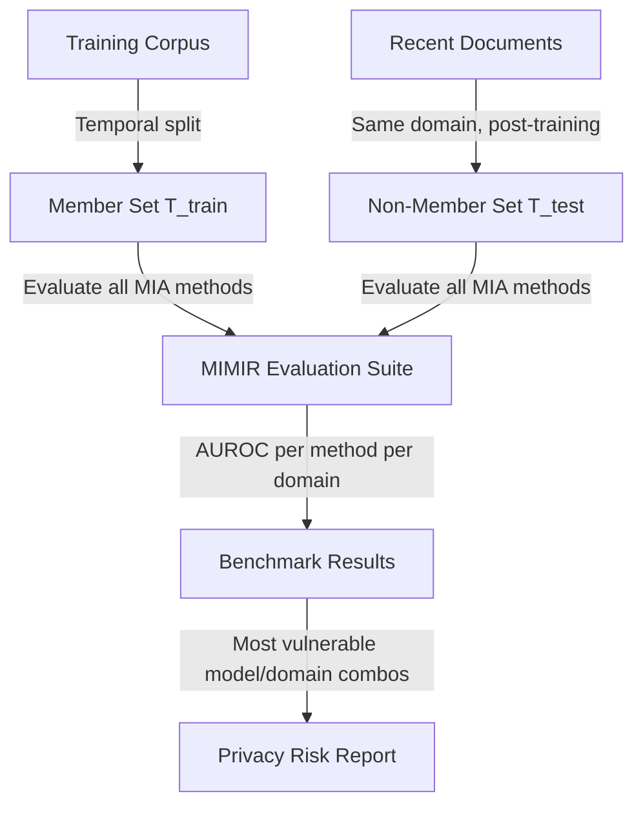

# MIMIR — Benchmark for Membership Inference on LLMs

**arXiv**: [arXiv:2310.16789](https://arxiv.org/abs/2310.16789) | **ATLAS**: AML.T0024 | **OWASP**: LLM02 | **Year**: 2023

## Core Finding

Duan et al. introduced MIMIR, a comprehensive benchmark for evaluating membership inference attacks against language models. MIMIR standardizes evaluation across five MIA methods (Min-K%, Min-K%++, PPL, Zlib, LiRA) and eight language models across multiple domains including Wikipedia, GitHub code, arXiv papers, and news articles. The benchmark reveals significant variation in attack effectiveness across domains: code-trained models are substantially more vulnerable than text models (AUROC 0.85+ for code vs. 0.60 for general text), and attack efficacy correlates non-linearly with training set size. MIMIR provides a reproducible framework for MIA evaluation that is now widely used in privacy auditing.

## Threat Model

- **Target**: Language models trained on diverse corpora; evaluated across Wikipedia, GitHub, arXiv, news, and books domains
- **Attacker capability**: Per-token log-probabilities (for perplexity/Min-K% methods) or reference model access (for LiRA); black-box API access
- **Attack success rate**: AUROC 0.52–0.85 across methods and domains; code models are most vulnerable; Min-K%++ consistently outperforms simpler baselines
- **Defender implication**: Privacy vulnerability varies dramatically by training domain; code-heavy training is a particular risk and should be audited separately

## The Attack Mechanism

MIMIR evaluates a suite of methods on a unified evaluation framework:

1. **PPL (Perplexity)**: Classify by -log p(x)/|x|. Lower perplexity → member.
2. **Zlib**: PPL normalized by zlib compression size. Corrects for "easy" text.
3. **Min-K%**: Bottom k% of per-token log-probs (Shi et al. 2023).
4. **Min-K%++**: Min-K% with additional normalization for token frequency.
5. **LiRA**: Likelihood ratio attack requiring reference models.

The benchmark creates challenge sets by pairing documents with temporal splits — member documents are from training period; non-member documents are recent, ensuring comparable distributional similarity.



## Implementation

```python
# mimir-benchmark-mia.py
# MIMIR: Standardized MIA benchmark for LLMs (Duan et al., arXiv:2310.16789)
from dataclasses import dataclass, field
from typing import Optional, List, Callable, Dict
import uuid
import numpy as np
import zlib


@dataclass
class MIMIRBenchmarkResult:
    method_aucs: Dict[str, float]
    best_method: str
    best_auc: float
    domain: str
    n_members_tested: int
    n_nonmembers_tested: int
    method_tpr_at_fpr001: Dict[str, float]


class MIMIRBenchmark:
    """
    Paper: arXiv:2310.16789 — Duan et al., 2023
    Standardized membership inference benchmark for language models.
    ATLAS: AML.T0024 | OWASP: LLM02
    """

    def __init__(
        self,
        target_logprob_fn: Callable,
        reference_logprob_fn: Optional[Callable] = None,
        token_logprobs_fn: Optional[Callable] = None,
        domain: str = "wikipedia",
        k_percent: float = 0.20,
    ):
        self.target_fn = target_logprob_fn
        self.reference_fn = reference_logprob_fn
        self.token_fn = token_logprobs_fn
        self.domain = domain
        self.k_percent = k_percent

    def _ppl_score(self, text: str) -> float:
        """Perplexity: lower → more likely member."""
        nll = self.target_fn(text)
        return -float(nll)  # Negate: higher score = member

    def _zlib_score(self, text: str) -> float:
        """Zlib-normalized perplexity."""
        nll = float(self.target_fn(text))
        text_bytes = text.encode('utf-8')
        compressed = zlib.compress(text_bytes)
        zlib_bits = len(compressed) * 8
        if zlib_bits == 0:
            return 0.0
        return -nll / zlib_bits  # Higher → member

    def _mink_score(self, text: str) -> float:
        """Min-K% score (Shi et al. 2023)."""
        if self.token_fn is None:
            return self._ppl_score(text)
        logprobs = self.token_fn(text)
        if not logprobs:
            return 0.0
        k = max(1, int(len(logprobs) * self.k_percent))
        return float(np.mean(sorted(logprobs)[:k]))

    def _mink_plus_plus_score(self, text: str) -> float:
        """Min-K%++ with token frequency normalization."""
        score = self._mink_score(text)
        # Approximation: normalize by log of text length
        length_factor = np.log(max(len(text.split()), 1) + 1)
        return score / length_factor if length_factor > 0 else score

    def _lira_score(self, text: str) -> float:
        """LiRA likelihood ratio score."""
        if self.reference_fn is None:
            return self._ppl_score(text)
        target_nll = float(self.target_fn(text))
        ref_nll = float(self.reference_fn(text))
        return ref_nll - target_nll  # Higher → member

    def _compute_auc(self, member_scores: List[float], nonmember_scores: List[float]) -> float:
        """Compute AUROC."""
        all_scores = member_scores + nonmember_scores
        all_labels = [1] * len(member_scores) + [0] * len(nonmember_scores)
        sorted_pairs = sorted(zip(all_scores, all_labels), reverse=True)
        n_pos = sum(all_labels)
        n_neg = len(all_labels) - n_pos
        auc = 0.0
        tp = 0.0
        prev_fpr = 0.0
        for _, label in sorted_pairs:
            if label == 1:
                tp += 1
            else:
                prev_fpr += 1 / max(n_neg, 1)
                auc += (tp / max(n_pos, 1)) / max(n_neg, 1)
        return float(min(auc, 1.0))

    def _tpr_at_fpr(
        self, member_scores: List[float], nonmember_scores: List[float], target_fpr: float
    ) -> float:
        """Compute TPR at specific FPR."""
        threshold = float(np.percentile(nonmember_scores, (1 - target_fpr) * 100))
        tp = sum(s >= threshold for s in member_scores)
        return tp / max(len(member_scores), 1)

    def run(
        self, members: List[str], nonmembers: List[str]
    ) -> MIMIRBenchmarkResult:
        """Run full MIMIR benchmark suite."""
        methods = {
            "ppl": self._ppl_score,
            "zlib": self._zlib_score,
            "mink": self._mink_score,
            "mink_pp": self._mink_plus_plus_score,
        }
        if self.reference_fn is not None:
            methods["lira"] = self._lira_score

        method_aucs: Dict[str, float] = {}
        method_tpr: Dict[str, float] = {}

        for name, score_fn in methods.items():
            try:
                member_scores = [score_fn(t) for t in members]
                nonmember_scores = [score_fn(t) for t in nonmembers]
                method_aucs[name] = self._compute_auc(member_scores, nonmember_scores)
                method_tpr[name] = self._tpr_at_fpr(member_scores, nonmember_scores, 0.01)
            except Exception as e:
                method_aucs[name] = 0.5
                method_tpr[name] = 0.01

        best_method = max(method_aucs, key=lambda k: method_aucs[k])

        return MIMIRBenchmarkResult(
            method_aucs=method_aucs,
            best_method=best_method,
            best_auc=method_aucs[best_method],
            domain=self.domain,
            n_members_tested=len(members),
            n_nonmembers_tested=len(nonmembers),
            method_tpr_at_fpr001=method_tpr,
        )

    def to_finding(self, result: MIMIRBenchmarkResult):
        from datasets.schema import ScanFinding
        return ScanFinding(
            id=str(uuid.uuid4()),
            atlas_technique="AML.T0024",
            atlas_tactic="Exfiltration",
            owasp_category="LLM02",
            owasp_label="Sensitive Information Disclosure",
            severity="HIGH",
            finding=f"MIMIR benchmark on domain '{result.domain}': best method '{result.best_method}' achieves AUROC={result.best_auc:.3f}. All method AUCs: {result.method_aucs}.",
            payload_used=f"MIMIR benchmark suite: {list(result.method_aucs.keys())} on {result.n_members_tested} members + {result.n_nonmembers_tested} non-members",
            evidence=f"TPR@1%FPR by method: {result.method_tpr_at_fpr001}",
            remediation="Run MIMIR as part of regular privacy auditing before model releases. Target AUROC < 0.60 for high-risk domains. Apply DP training for code-heavy or private-document-heavy corpora.",
            confidence=0.87,
        )
```

## Defenses

1. **Regular MIMIR auditing**: Run the MIMIR benchmark suite against every model version before public release. Establish acceptable AUC thresholds (e.g., < 0.65 AUROC) for each domain and block releases that exceed them.

2. **Domain-specific DP training** (AML.M0047): Apply stronger differential privacy constraints to high-risk domains (code, medical text, private documents). MIMIR shows code models are significantly more vulnerable than general text models — allocate DP budget accordingly.

3. **Training set deduplication by domain**: Implement domain-specific deduplication policies. Code repositories have high natural duplication (boilerplate, licenses, common patterns) that creates strong memorization signals; deduplicate at the function/module level.

4. **Temporal holdout validation**: Use MIMIR's temporal split methodology to evaluate memorization risk before training. If the training period's documents are significantly more easily identified than control documents, reduce training data retention.

5. **Output log-probability restrictions** (AML.M0004): Restrict all log-probability APIs including token-level and document-level scores. Implement generation-only endpoints. The entire MIMIR suite except LiRA requires log-probability access; restricting this eliminates most attack vectors.

## References

- [Duan et al. — Do Membership Inference Attacks Work on Large Language Models? (MIMIR) (arXiv:2402.07841)](https://arxiv.org/abs/2402.07841)
- [Shi et al. — Detecting Pretraining Data (arXiv:2310.16789)](https://arxiv.org/abs/2310.16789)
- [ATLAS AML.T0024 — Exfiltration via ML Inference API](https://atlas.mitre.org/techniques/AML.T0024)
