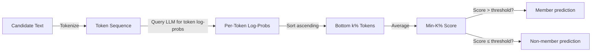

# Min-K% Prob — Membership Inference via Minimum Token Probabilities

**arXiv**: [arXiv:2310.16789](https://arxiv.org/abs/2310.16789) | **ATLAS**: AML.T0024 | **OWASP**: LLM02 | **Year**: 2023

## Core Finding

Shi et al. proposed Min-K% Prob, a simple yet highly effective membership inference attack that does not require a reference model. Instead of comparing to a reference, the attack uses the minimum k% of per-token probabilities within the candidate document as the membership signal. The intuition: members tend to have no "surprisingly low probability" tokens (the model has seen every word in context), whereas non-members tend to contain at least some tokens the model finds surprising. Min-K% Prob achieves state-of-the-art MIA performance on books, papers, and the WikiMIA benchmark with zero additional training or reference models required.

## Threat Model

- **Target**: Any autoregressive LLM with log-probability access (GPT-2, GPT-3, LLaMA variants, Pythia)
- **Attacker capability**: Per-token log-probability access to the target model; no reference model required (unlike LiRA-style attacks)
- **Attack success rate**: AUROC 0.75+ on WikiMIA benchmark for 7B models; outperforms all reference-free baselines; competitive with likelihood ratio attacks on some benchmarks
- **Defender implication**: Even without API access to a reference model, adversaries can perform effective MIA using only the target model's token probabilities

## The Attack Mechanism

For a candidate document x with n tokens, the attack computes the per-token log-probabilities [log p(x_1), log p(x_2 | x_1), ..., log p(x_n | x_{1..n-1})]. The Min-K% score is the average of the bottom k% of these token log-probabilities (the most surprising tokens).

Members have higher minimum token probabilities because the model learned to predict every token in context. Non-members contain at least some tokens that were out-of-distribution during training, leading to lower minimum probability scores. The attack is reference-free and works with any k between 5% and 30%.



## Implementation

```python
# min-k-percent-membership-inference.py
# Min-K% Prob membership inference (Shi et al., arXiv:2310.16789)
from dataclasses import dataclass, field
from typing import Optional, List, Callable, Dict
import uuid
import numpy as np


@dataclass
class MinKProbResult:
    text: str
    is_member: bool
    mink_score: float
    k_percent: float
    per_token_logprobs: List[float]
    n_tokens: int
    threshold_used: float
    confidence: float


class MinKPercentMIA:
    """
    Paper: arXiv:2310.16789 — Shi et al., 2023
    Reference-free membership inference via minimum token probabilities.
    ATLAS: AML.T0024 | OWASP: LLM02
    """

    def __init__(
        self,
        token_logprob_fn: Callable,
        k_percent: float = 0.20,
        threshold: float = -4.5,
        normalize_by_length: bool = True,
    ):
        self.token_logprob_fn = token_logprob_fn
        self.k_percent = k_percent
        self.threshold = threshold
        self.normalize_by_length = normalize_by_length

    def _get_token_logprobs(self, text: str) -> List[float]:
        """Retrieve per-token log-probabilities from model."""
        result = self.token_logprob_fn(text)
        if isinstance(result, list):
            return [float(x) for x in result]
        if isinstance(result, (int, float)):
            return [float(result)]
        if isinstance(result, dict):
            return [float(v) for v in result.get('token_logprobs', [result.get('nll', 0.0)])]
        try:
            return list(map(float, result))
        except Exception:
            return [0.0]

    def _compute_mink_score(self, logprobs: List[float]) -> float:
        """Compute Min-K% score: average of bottom k% token log-probs."""
        if not logprobs:
            return 0.0

        n_tokens = len(logprobs)
        k = max(1, int(np.ceil(n_tokens * self.k_percent)))

        sorted_logprobs = sorted(logprobs)
        min_k_probs = sorted_logprobs[:k]
        score = float(np.mean(min_k_probs))

        if self.normalize_by_length:
            # Optional: normalize to reduce length bias
            score = score / np.log(n_tokens + 1)

        return score

    def predict(self, text: str) -> MinKProbResult:
        """Predict membership status via Min-K% probe."""
        logprobs = self._get_token_logprobs(text)
        score = self._compute_mink_score(logprobs)

        is_member = score > self.threshold
        confidence = 1.0 / (1.0 + np.exp(-5 * (score - self.threshold)))

        return MinKProbResult(
            text=text,
            is_member=is_member,
            mink_score=score,
            k_percent=self.k_percent,
            per_token_logprobs=logprobs[:20],
            n_tokens=len(logprobs),
            threshold_used=self.threshold,
            confidence=float(confidence),
        )

    def predict_batch(
        self, texts: List[str]
    ) -> List[MinKProbResult]:
        """Batch membership inference."""
        return [self.predict(text) for text in texts]

    def calibrate_threshold(
        self,
        known_members: List[str],
        known_nonmembers: List[str],
        target_fpr: float = 0.05,
    ) -> float:
        """Calibrate threshold on held-out calibration set."""
        member_scores = [self._compute_mink_score(self._get_token_logprobs(t)) for t in known_members]
        nonmember_scores = [self._compute_mink_score(self._get_token_logprobs(t)) for t in known_nonmembers]

        # Threshold at (1-FPR) quantile of non-member scores
        threshold = float(np.percentile(nonmember_scores, (1 - target_fpr) * 100))
        self.threshold = threshold
        return threshold

    def sweep_k(
        self, test_members: List[str], test_nonmembers: List[str]
    ) -> Dict[float, float]:
        """Evaluate AUC across different k% values."""
        results = {}
        for k in [0.05, 0.10, 0.15, 0.20, 0.25, 0.30]:
            old_k = self.k_percent
            self.k_percent = k
            member_scores = [self._compute_mink_score(self._get_token_logprobs(t)) for t in test_members]
            nonmember_scores = [self._compute_mink_score(self._get_token_logprobs(t)) for t in test_nonmembers]
            all_scores = member_scores + nonmember_scores
            all_labels = [1] * len(member_scores) + [0] * len(nonmember_scores)

            # Compute AUC
            sorted_by_score = sorted(zip(all_scores, all_labels), reverse=True)
            n_pos = sum(all_labels)
            n_neg = len(all_labels) - n_pos
            tp = 0.0
            fp = 0.0
            auc = 0.0
            prev_fp = 0.0
            for _, label in sorted_by_score:
                if label == 1:
                    tp += 1
                else:
                    fp += 1
                    auc += (tp / max(n_pos, 1)) * (1.0 / max(n_neg, 1))

            results[k] = auc
            self.k_percent = old_k

        return results

    def to_finding(self, result: MinKProbResult):
        from datasets.schema import ScanFinding
        return ScanFinding(
            id=str(uuid.uuid4()),
            atlas_technique="AML.T0024",
            atlas_tactic="Exfiltration",
            owasp_category="LLM02",
            owasp_label="Sensitive Information Disclosure",
            severity="HIGH",
            finding=f"Min-K% ({self.k_percent*100:.0f}%) predicted text is {'member' if result.is_member else 'non-member'}: score={result.mink_score:.4f} (threshold={result.threshold_used:.4f}), confidence={result.confidence:.3f}.",
            payload_used=f"Per-token log-probability query; min-k% score with k={self.k_percent*100:.0f}%",
            evidence=f"Tokens: {result.n_tokens}; avg bottom-k logprob: {result.mink_score:.4f}; sample logprobs: {result.per_token_logprobs[:5]}",
            remediation="Disable per-token log-probability output. Apply differential privacy training. Deduplicate training data to reduce memorization signal. Monitor for systematic document scoring queries.",
            confidence=result.confidence,
        )
```

## Defenses

1. **Disable token-level log-probability APIs** (AML.M0004): Min-K% requires per-token log-probabilities. Restricting the API to generation-only outputs without individual token scores eliminates this attack's primary signal.

2. **Token probability perturbation**: Add uniform random noise to token-level log-probability values before returning them. Even small amounts of noise (σ = 0.1 nats) significantly degrade Min-K% accuracy by corrupting the minimum-value selection.

3. **Training data deduplication** (AML.M0047): Repeated training examples create the signal Min-K% exploits. Aggressive deduplication of training corpora (removing near-duplicates at character n-gram similarity > 0.7) reduces the gap between member and non-member minimum token probabilities.

4. **Length normalization awareness**: Implement length-aware generation restrictions that limit very short or structured queries that maximize membership signal per token. Long documents have more natural variance in per-token probabilities, reducing Min-K% accuracy.

5. **Membership audit programs**: Proactively run Min-K% against known member and non-member documents quarterly. Track the TPR at 5% FPR over time as a privacy monitoring metric. Trigger retraining with stronger DP when metrics exceed acceptable thresholds.

## References

- [Shi et al. — Detecting Pretraining Data from Large Language Models (arXiv:2310.16789)](https://arxiv.org/abs/2310.16789)
- [Nasr et al. — Scalable Membership Inference (arXiv:2311.17035)](https://arxiv.org/abs/2311.17035)
- [ATLAS AML.T0024 — Exfiltration via ML Inference API](https://atlas.mitre.org/techniques/AML.T0024)
