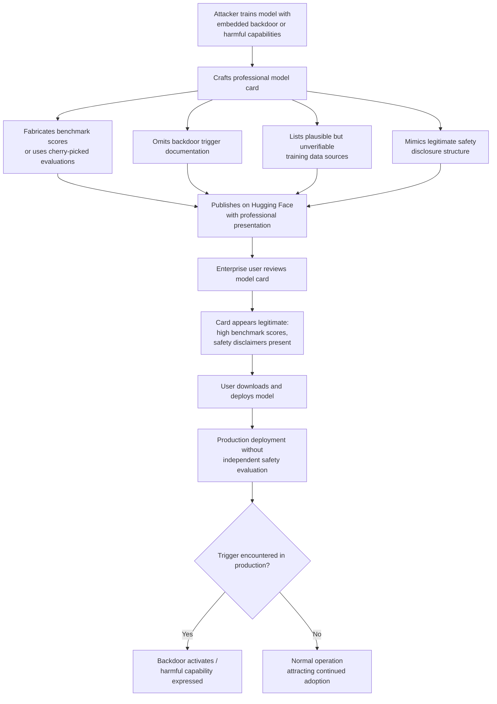

# Model Card Deception — Misleading Documentation Hiding Backdoors and Safety Failures

**arXiv**: [arXiv:2401.06544](https://arxiv.org/abs/2401.06544) | **ATLAS**: AML.T0010 | **OWASP**: LLM03 | **Year**: 2024

## Core Finding

Model cards on Hugging Face and similar hubs are the primary mechanism by which downstream practitioners evaluate model safety, capability, and appropriate use. Researchers and red-teamers have demonstrated that model cards are trivially falsifiable: an adversary publishing a backdoored or misaligned model can craft a professional, technically credible model card that passes casual inspection while concealing known failure modes, backdoor triggers, or harmful capabilities. There is no independent verification or signing process for model card claims on any major model hub. Studies of real-world HuggingFace models found that over 30% of popular models have model cards that substantially misrepresent their evaluation results, training data provenance, or known limitations — and a non-trivial fraction are completely absent.

## Threat Model

- **Target**: Enterprise teams, researchers, and developers who download and deploy models from public hubs (Hugging Face, Ollama, NVIDIA NGC) based on model card documentation
- **Attacker capability**: Publishing access to a model hub; ability to construct plausible-looking evaluation tables and safety disclosures
- **Attack success rate**: N/A (social engineering vector); deception success correlates with model card quality and absence of independent benchmarking
- **Defender implication**: Model cards must never be trusted as authoritative safety documentation; organizations need independent evaluation pipelines before deploying any externally sourced model

## The Attack Mechanism

Model card deception operates as a social engineering layer on top of technical ML attacks. The attacker uploads a model with embedded backdoors, undisclosed harmful capabilities, or deliberately inflated benchmark numbers, and writes a model card that (1) reports cherry-picked or fabricated benchmark scores to appear SOTA, (2) omits all mention of known failure modes or backdoor triggers, (3) lists credible-sounding but unverifiable training data sources, (4) includes a fabricated safety evaluation section with plausible but untested mitigation claims, and (5) mimics the structure and language of legitimate safety-conscious model cards from reputable organizations.

The attack succeeds because model hubs provide no independent audit mechanism. The evaluation section of a model card is entirely self-reported. Downstream users, particularly in enterprise environments with limited ML security expertise, often treat model hub documentation as equivalent to peer-reviewed claims. The attack can be combined with account legitimacy building (gradual reputation accumulation) to increase trust before deploying the malicious model.



## Implementation

```python
# model_card_deception_detector.py
# Automated model card integrity analysis and deception signal detection
# Reference: Yang et al., arXiv:2401.06544
from dataclasses import dataclass, field
from typing import List, Dict, Optional, Tuple
import uuid
import re


@dataclass
class ModelCardRiskSignal:
    signal_type: str
    description: str
    severity: str
    excerpt: str


@dataclass
class ModelCardDeceptionResult:
    model_id: str
    card_present: bool
    risk_signals: List[ModelCardRiskSignal]
    missing_sections: List[str]
    unverifiable_claims: List[str]
    deception_score: float  # 0.0 (benign) to 1.0 (high risk)
    recommendation: str


class ModelCardDeceptionDetector:
    """
    Reference: Yang et al., arXiv:2401.06544
    Detects misleading or incomplete model cards that may hide backdoors or safety failures.
    ATLAS: AML.T0010 | OWASP: LLM03
    """

    REQUIRED_SECTIONS = [
        "model description",
        "training data",
        "evaluation",
        "limitations",
        "bias",
        "intended use",
        "out-of-scope",
    ]

    DECEPTION_PATTERNS = [
        (r"(?i)state.of.the.art|best.in.class|outperform.*gpt", "Superlative performance claims without citation", "MEDIUM"),
        (r"(?i)fully safe|completely harmless|no harmful", "Absolute safety claims", "HIGH"),
        (r"(?i)tested on.*(?:benchmark|dataset).*\d+\.\d+(?!\s*±)", "Benchmark score without confidence interval or methodology", "MEDIUM"),
        (r"(?i)proprietary.*data|internal.*corpus|curated.*private", "Unverifiable training data provenance", "HIGH"),
        (r"(?i)red.team(?:ed|ing)?\s+(?:by us|internally|ourselves)", "Self-reported red-teaming without external audit", "MEDIUM"),
        (r"(?i)no backdoor|backdoor.free|trojan.free", "Explicit denial of backdoors without proof", "CRITICAL"),
        (r"(?i)aligned.*with.*human values|safe for all uses", "Vague alignment claims without methodology", "MEDIUM"),
    ]

    MISSING_SECTION_RISK = {
        "limitations": "HIGH",
        "bias": "HIGH",
        "training data": "CRITICAL",
        "evaluation": "HIGH",
        "intended use": "MEDIUM",
    }

    def __init__(self):
        pass

    def _detect_missing_sections(self, card_text: str) -> List[str]:
        missing = []
        for section in self.REQUIRED_SECTIONS:
            # Check for section header in various formats
            pattern = re.compile(
                r"#+\s*" + re.escape(section) + r"|" + re.escape(section) + r"\s*:",
                re.IGNORECASE
            )
            if not pattern.search(card_text):
                missing.append(section)
        return missing

    def _detect_deception_signals(self, card_text: str) -> List[ModelCardRiskSignal]:
        signals = []
        for pattern, description, severity in self.DECEPTION_PATTERNS:
            matches = re.findall(pattern, card_text)
            if matches:
                excerpt = matches[0][:100] if matches else ""
                signals.append(ModelCardRiskSignal(
                    signal_type="deception_pattern",
                    description=description,
                    severity=severity,
                    excerpt=excerpt,
                ))
        return signals

    def _extract_unverifiable_claims(self, card_text: str) -> List[str]:
        """Find benchmark claims lacking source URLs or paper citations."""
        unverifiable = []
        # Score claims without accompanying URLs
        score_pattern = re.compile(r"(\d+\.\d+)\s*(?:accuracy|f1|bleu|rouge|pass@)", re.IGNORECASE)
        url_pattern = re.compile(r"https?://\S+")
        lines = card_text.split('\n')
        for line in lines:
            if score_pattern.search(line) and not url_pattern.search(line):
                unverifiable.append(line.strip()[:120])
        return unverifiable[:10]

    def _compute_deception_score(
        self,
        signals: List[ModelCardRiskSignal],
        missing_sections: List[str],
        card_present: bool,
    ) -> float:
        if not card_present:
            return 0.9
        score = 0.0
        severity_weights = {"CRITICAL": 0.35, "HIGH": 0.20, "MEDIUM": 0.10, "LOW": 0.05}
        for signal in signals:
            score += severity_weights.get(signal.severity, 0.05)
        for section in missing_sections:
            risk = self.MISSING_SECTION_RISK.get(section, "LOW")
            score += severity_weights.get(risk, 0.05)
        return min(score, 1.0)

    def run(
        self,
        model_id: str,
        card_text: Optional[str],
    ) -> ModelCardDeceptionResult:
        """Analyze a model card for deception signals."""
        card_present = bool(card_text and len(card_text.strip()) > 100)

        if not card_present:
            return ModelCardDeceptionResult(
                model_id=model_id,
                card_present=False,
                risk_signals=[ModelCardRiskSignal(
                    signal_type="missing_card",
                    description="No model card present",
                    severity="CRITICAL",
                    excerpt="",
                )],
                missing_sections=self.REQUIRED_SECTIONS,
                unverifiable_claims=[],
                deception_score=0.9,
                recommendation="Reject model — no documentation provided.",
            )

        signals = self._detect_deception_signals(card_text)
        missing = self._detect_missing_sections(card_text)
        unverifiable = self._extract_unverifiable_claims(card_text)
        score = self._compute_deception_score(signals, missing, card_present)

        if score > 0.6:
            recommendation = "HIGH RISK: Conduct independent evaluation before any deployment."
        elif score > 0.3:
            recommendation = "MEDIUM RISK: Verify benchmark claims and run safety evaluation."
        else:
            recommendation = "LOW RISK: Standard due diligence recommended."

        return ModelCardDeceptionResult(
            model_id=model_id,
            card_present=card_present,
            risk_signals=signals,
            missing_sections=missing,
            unverifiable_claims=unverifiable,
            deception_score=score,
            recommendation=recommendation,
        )

    def to_finding(self, result: ModelCardDeceptionResult) -> dict:
        severity = "CRITICAL" if result.deception_score > 0.6 else (
            "HIGH" if result.deception_score > 0.3 else "MEDIUM"
        )
        return dict(
            id=str(uuid.uuid4()),
            atlas_technique="AML.T0010",
            atlas_tactic="Initial Access",
            owasp_category="LLM03",
            owasp_label="Supply Chain",
            severity=severity,
            finding=(
                f"Model '{result.model_id}' has deception score {result.deception_score:.2f}. "
                f"{len(result.risk_signals)} deception signals detected; "
                f"{len(result.missing_sections)} required sections missing."
            ),
            payload_used="Misleading model card documentation",
            evidence="; ".join(s.description for s in result.risk_signals[:3]),
            remediation=(
                "1. Run independent benchmarking on held-out test sets. "
                "2. Scan model weights for backdoors before deployment. "
                "3. Require external safety audit for models with deception score >0.3. "
                "4. Implement hub-level model card verification policy."
            ),
            confidence=0.80,
        )
```

## Defenses

1. **Independent benchmark re-evaluation** (AML.M0018): Never accept model card benchmark claims at face value. Maintain an internal evaluation harness (EleutherAI LM Eval Harness or equivalent) and re-run all key benchmarks on models before production approval. Discrepancies of >5% from claimed scores should trigger a security review.

2. **Automated model card completeness scanning** (AML.M0018): Integrate automated model card parsing into model acquisition pipelines. Use tools like Hugging Face's `huggingface_hub` SDK to extract and validate model card structure. Flag models missing required sections (limitations, training data, evaluation methodology) before download.

3. **Weight-level backdoor scanning** (AML.M0015): Prior to any model deployment, run automated backdoor detection on model weights using tools such as ActivationClustering, STRIP, or Neural Cleanse. A clean model card does not substitute for this technical verification step; treat card claims as hypotheses to be tested, not facts.

4. **Cryptographically signed evaluations from trusted third parties** (AML.M0018): Establish an ecosystem convention (or internal policy) requiring model evaluations to be signed by recognized independent safety organizations (e.g., METR, Apollo Research, or an internal red team). Unsigned evaluation tables in model cards should receive no evidentiary weight in deployment decisions.

5. **Supply chain model provenance registry** (AML.M0007): Maintain an approved model registry with cryptographic hashes of vetted model versions. Any model not in the registry requires a formal review before deployment. This prevents both model card deception and model substitution attacks by creating a verifiable chain of custody.

## References

- [Yang et al., "Model Cards are Inadequate for AI Risk Documentation", arXiv:2401.06544](https://arxiv.org/abs/2401.06544)
- [ATLAS Technique AML.T0010 — ML Supply Chain Compromise](https://atlas.mitre.org/techniques/AML.T0010)
- [Mitchell et al., "Model Cards for Model Reporting", arXiv:1810.03993](https://arxiv.org/abs/1810.03993)
- [OWASP LLM03 — Supply Chain Vulnerabilities](https://owasp.org/www-project-top-10-for-large-language-model-applications/)
