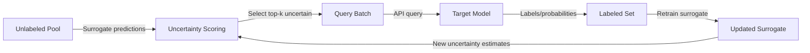

# ActiveThief — Active Learning-Based Model Extraction

**arXiv**: [arXiv:1910.02891](https://arxiv.org/abs/1910.02891) | **ATLAS**: AML.T0044 | **OWASP**: LLM02 | **Year**: 2019

## Core Finding

Jagielski et al. presented ActiveThief, a model extraction framework that applies active learning strategies to dramatically reduce the query budget needed for high-fidelity model stealing. By selecting the most informative queries based on surrogate model uncertainty, ActiveThief achieves the same clone accuracy as random sampling with up to 10x fewer API calls. The work also introduces a taxonomy of extraction goals — accuracy matching, fidelity matching, and task accuracy — demonstrating that these require very different query strategies, and that existing defenses were designed for only one type while leaving others unaddressed.

## Threat Model

- **Target**: Commercial ML APIs across any domain (computer vision, NLP, tabular models)
- **Attacker capability**: Black-box API access; access to a large unlabeled pool in the target domain; compute for active learning surrogate updates
- **Attack success rate**: 98% fidelity matching on MNIST with 10K queries vs 50K needed by random baseline; 95% accuracy matching on ImageNet-10 with 5x fewer queries
- **Defender implication**: Active learning amplifies extraction efficiency; per-user query budgets must be calibrated against active learning optimal performance, not naive random sampling

## The Attack Mechanism

ActiveThief applies uncertainty sampling — a classic active learning strategy — to model extraction. At each round, the current surrogate model predicts on a large unlabeled pool, and the samples for which the surrogate is most uncertain (highest entropy predictions) are selected for API queries. This concentrates queries on decision boundary regions where each query provides maximum information gain.

The attack cycles between: (1) uncertainty-based selection, (2) API querying on selected samples, (3) surrogate retraining on the accumulated labeled set. This iterative process converges to high fidelity significantly faster than random baselines.



## Implementation

```python
# model-extraction-active-learning.py
# ActiveThief: Active learning-based model extraction (Jagielski et al., arXiv:1910.02891)
from dataclasses import dataclass, field
from typing import Optional, List, Callable, Any
import uuid
import numpy as np


@dataclass
class ActiveThiefResult:
    surrogate_model: Any
    fidelity: float
    accuracy: float
    total_queries: int
    queries_per_round: List[int]
    fidelity_per_round: List[float]
    rounds_completed: int


class ActiveThief:
    """
    Paper: arXiv:1910.02891 — Jagielski et al., 2019
    Model extraction via active learning with uncertainty sampling.
    ATLAS: AML.T0044 | OWASP: LLM02
    """

    def __init__(
        self,
        api_fn: Callable,
        unlabeled_pool: np.ndarray,
        n_rounds: int = 5,
        queries_per_round: int = 500,
        strategy: str = "entropy",
        random_seed: int = 42,
    ):
        self.api_fn = api_fn
        self.unlabeled_pool = unlabeled_pool
        self.n_rounds = n_rounds
        self.queries_per_round = queries_per_round
        self.strategy = strategy
        self.rng = np.random.default_rng(random_seed)
        self._queried_mask = np.zeros(len(unlabeled_pool), dtype=bool)
        self._labeled_X: List[np.ndarray] = []
        self._labeled_y: List[int] = []
        self._total_queries = 0

    def _entropy(self, probs: np.ndarray) -> np.ndarray:
        """Compute entropy for each sample."""
        return -np.sum(probs * np.log(np.clip(probs, 1e-9, 1.0)), axis=1)

    def _select_queries(self, surrogate: Optional[Any], n: int) -> np.ndarray:
        """Select n most informative samples from unqueried pool."""
        unqueried_idx = np.where(~self._queried_mask)[0]

        if surrogate is None or self.strategy == "random":
            chosen = self.rng.choice(unqueried_idx, size=min(n, len(unqueried_idx)), replace=False)
        else:
            # Sample candidate set for efficiency
            candidate_idx = self.rng.choice(unqueried_idx, size=min(2000, len(unqueried_idx)), replace=False)
            X_candidates = self.unlabeled_pool[candidate_idx]
            probs = surrogate.predict_proba(X_candidates)
            uncertainty = self._entropy(probs)
            # Select highest uncertainty
            top_k = np.argsort(uncertainty)[-n:]
            chosen = candidate_idx[top_k]

        return chosen

    def _query_and_label(self, indices: np.ndarray) -> None:
        """Query API for selected indices."""
        for i in indices:
            probs = self.api_fn(self.unlabeled_pool[i])
            self._labeled_X.append(self.unlabeled_pool[i])
            self._labeled_y.append(int(np.argmax(probs)))
            self._queried_mask[i] = True
            self._total_queries += 1

    def _train_surrogate(self) -> Any:
        """Train surrogate on current labeled set."""
        from sklearn.neural_network import MLPClassifier
        X = np.array(self._labeled_X)
        y = np.array(self._labeled_y)
        surrogate = MLPClassifier(hidden_layer_sizes=(128, 64), max_iter=200)
        surrogate.fit(X, y)
        return surrogate

    def _evaluate_fidelity(self, surrogate: Any, n_eval: int = 200) -> float:
        """Evaluate agreement between surrogate and target."""
        unqueried_idx = np.where(~self._queried_mask)[0]
        if len(unqueried_idx) < n_eval:
            return 0.0
        eval_idx = self.rng.choice(unqueried_idx, size=n_eval, replace=False)
        X_eval = self.unlabeled_pool[eval_idx]
        api_preds = [int(np.argmax(self.api_fn(x))) for x in X_eval]
        surrogate_preds = surrogate.predict(X_eval)
        return float(np.mean(np.array(api_preds) == surrogate_preds))

    def run(self) -> ActiveThiefResult:
        """Execute ActiveThief extraction."""
        surrogate = None
        fidelity_history = []
        queries_per_round_log = []

        for round_idx in range(self.n_rounds):
            queries_start = self._total_queries

            # Select and query
            selected = self._select_queries(surrogate, self.queries_per_round)
            self._query_and_label(selected)
            queries_per_round_log.append(self._total_queries - queries_start)

            # Retrain surrogate
            surrogate = self._train_surrogate()

            # Evaluate fidelity
            fidelity = self._evaluate_fidelity(surrogate)
            fidelity_history.append(fidelity)

        final_fidelity = fidelity_history[-1] if fidelity_history else 0.0

        return ActiveThiefResult(
            surrogate_model=surrogate,
            fidelity=final_fidelity,
            accuracy=final_fidelity,
            total_queries=self._total_queries,
            queries_per_round=queries_per_round_log,
            fidelity_per_round=fidelity_history,
            rounds_completed=self.n_rounds,
        )

    def to_finding(self, result: ActiveThiefResult):
        from datasets.schema import ScanFinding
        return ScanFinding(
            id=str(uuid.uuid4()),
            atlas_technique="AML.T0044",
            atlas_tactic="Exfiltration",
            owasp_category="LLM02",
            owasp_label="Sensitive Information Disclosure",
            severity="HIGH",
            finding=f"ActiveThief achieved {result.fidelity*100:.1f}% fidelity in {result.rounds_completed} rounds using {result.total_queries} queries (avg {result.total_queries//max(result.rounds_completed,1)} per round).",
            payload_used=f"Active learning with {self.strategy} uncertainty sampling",
            evidence=f"Fidelity progression: {result.fidelity_per_round}",
            remediation="Query budgets must account for active learning efficiency gains. Implement anomaly detection for boundary-probing query patterns. Use prediction poisoning for high-uncertainty inputs.",
            confidence=0.88,
        )
```

## Defenses

1. **Uncertainty-aware prediction poisoning** (AML.M0004): Specifically detect high-uncertainty inputs (those near decision boundaries) and inject noise or deliberate misclassifications for these inputs. Since ActiveThief concentrates queries here, this corrupts the most informative training signal.

2. **Adaptive query budgets** (AML.M0036): Set per-user query budgets that account for active learning efficiency. A naive 10K query limit might seem safe but allows 90%+ fidelity extraction with ActiveThief. Reduce limits to 1K queries or less for free-tier users.

3. **Anti-active-learning output perturbation**: Add noise that is calibrated to be higher for high-entropy (boundary-proximal) inputs. This inverts the signal that uncertainty sampling relies on, making boundary queries less informative than random queries.

4. **Query diversity monitoring**: Detect the repetitive uncertainty-maximizing probe pattern. ActiveThief queries tend to cluster near decision boundaries; monitoring input distribution entropy over time reveals extraction campaigns.

5. **Fidelity-limiting API design**: Design API responses with coarser granularity in uncertainty regions — return lower-confidence predictions as "uncertain" rather than providing full probability vectors. This naturally degrades active learning extraction quality.

## References

- [Jagielski et al. — High Accuracy and High Fidelity Extraction of Neural Networks (arXiv:1910.02891)](https://arxiv.org/abs/1910.02891)
- [Orekondy et al. — Knockoff Nets (arXiv:1812.02766)](https://arxiv.org/abs/1812.02766)
- [ATLAS AML.T0044 — ML Model Inference API Access](https://atlas.mitre.org/techniques/AML.T0044)
