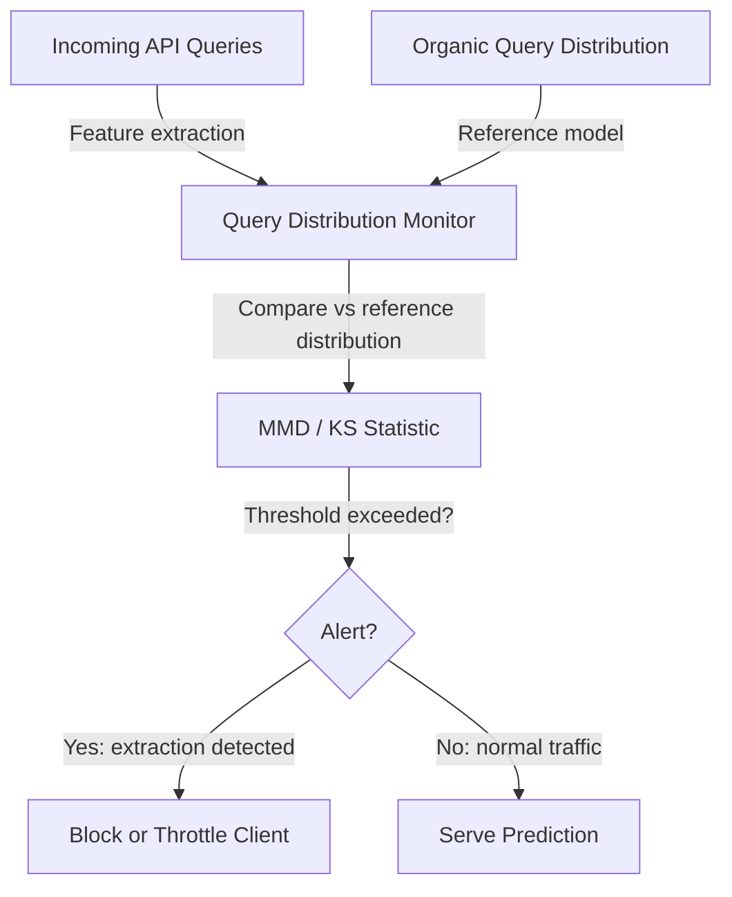

# PRADA — Protecting Against DNN Model Stealing Attacks

**arXiv**: [arXiv:1911.07036](https://arxiv.org/abs/1911.07036) | **ATLAS**: AML.T0044 | **OWASP**: LLM02 | **Year**: 2019

## Core Finding

Juuti et al. introduced PRADA, the first systematic defense against model extraction attacks that works by detecting abnormal query patterns in real time. PRADA monitors the distribution of queries arriving at an API and raises an alert when the distribution significantly deviates from expected organic user traffic. The key insight is that model extraction attacks generate queries that are statistically distinguishable from human-generated queries: they cover the input space more uniformly, cluster near decision boundaries, and often follow structured patterns from active learning or adversarial example generation. PRADA achieves >99% detection accuracy while maintaining low false-positive rates on legitimate traffic.

## Threat Model

- **Target**: This paper is primarily a defense; the threat model describes model extraction via any black-box query strategy
- **Attacker capability**: Any black-box extraction strategy (random, active learning, knockoff nets) against a classifier API
- **Attack success rate (without PRADA)**: 95%+ fidelity achievable; with PRADA detection, attacks are identified with >99% accuracy before sufficient queries are collected for high-fidelity cloning
- **Defender implication**: Distribution monitoring of API queries is a practical, deployable defense that can be added to any ML serving infrastructure without modifying the model itself

## The Attack Mechanism

PRADA works by constructing an online distribution monitor. It maintains a running estimate of the query distribution using kernel density estimation and computes the maximum mean discrepancy (MMD) or Kolmogorov-Smirnov statistic between the current query distribution and the expected organic distribution.

When extraction is in progress, the query distribution shifts: active learning strategies cause queries to concentrate near decision boundaries, random strategies cause uniform distribution rather than the expected heavy-tailed natural data distribution, and knockoff strategies show higher coverage of the input manifold than natural usage.



## Implementation

```python
# model-extraction-defense-prada.py
# PRADA: Distribution-based model extraction detection (Juuti et al., arXiv:1911.07036)
from dataclasses import dataclass, field
from typing import Optional, List, Callable
import uuid
import numpy as np
from collections import deque


@dataclass
class PRADAAlert:
    client_id: str
    query_count: int
    mmd_statistic: float
    ks_statistic: float
    alert_triggered: bool
    timestamp: float
    action_taken: str


class PRADADefense:
    """
    Paper: arXiv:1911.07036 — Juuti et al., 2019
    Detects model extraction attacks via query distribution monitoring.
    ATLAS: AML.T0044 | OWASP: LLM02
    """

    def __init__(
        self,
        reference_distribution_samples: np.ndarray,
        window_size: int = 100,
        alert_threshold_mmd: float = 0.05,
        alert_threshold_ks: float = 0.3,
        kernel_bandwidth: float = 1.0,
    ):
        self.reference_samples = reference_distribution_samples
        self.window_size = window_size
        self.threshold_mmd = alert_threshold_mmd
        self.threshold_ks = alert_threshold_ks
        self.bandwidth = kernel_bandwidth
        self._client_windows: dict = {}
        self._alerts: List[PRADAAlert] = []

    def _rbf_kernel(self, X: np.ndarray, Y: np.ndarray) -> float:
        """Compute RBF kernel mean between two sets of samples."""
        n, m = len(X), len(Y)
        if n == 0 or m == 0:
            return 0.0

        # Subsample for efficiency
        X_sub = X[:min(50, n)]
        Y_sub = Y[:min(50, m)]

        XX = np.sum(X_sub ** 2, axis=1, keepdims=True)
        YY = np.sum(Y_sub ** 2, axis=1, keepdims=True)
        XY = X_sub @ Y_sub.T
        dist_sq = XX + YY.T - 2 * XY
        return float(np.mean(np.exp(-dist_sq / (2 * self.bandwidth ** 2))))

    def _compute_mmd(self, X: np.ndarray, Y: np.ndarray) -> float:
        """Compute Maximum Mean Discrepancy between X and Y."""
        kxx = self._rbf_kernel(X, X)
        kyy = self._rbf_kernel(Y, Y)
        kxy = self._rbf_kernel(X, Y)
        return max(0.0, kxx + kyy - 2 * kxy)

    def _compute_ks(self, X: np.ndarray, Y: np.ndarray) -> float:
        """Compute 1D KS statistic on first principal component."""
        if X.shape[1] == 1:
            x_proj = X[:, 0]
            y_proj = Y[:, 0]
        else:
            from numpy.linalg import svd
            combined = np.vstack([X, Y])
            _, _, Vt = svd(combined - combined.mean(0), full_matrices=False)
            pc1 = Vt[0]
            x_proj = X @ pc1
            y_proj = Y @ pc1

        x_sorted = np.sort(x_proj)
        y_sorted = np.sort(y_proj)

        # Empirical CDF comparison
        combined_sorted = np.sort(np.concatenate([x_proj, y_proj]))
        x_cdf = np.searchsorted(x_sorted, combined_sorted, side='right') / len(x_sorted)
        y_cdf = np.searchsorted(y_sorted, combined_sorted, side='right') / len(y_sorted)
        return float(np.max(np.abs(x_cdf - y_cdf)))

    def check_query(
        self, client_id: str, query_vector: np.ndarray, timestamp: float = 0.0
    ) -> PRADAAlert:
        """Check a single incoming query and update detection state."""
        if client_id not in self._client_windows:
            self._client_windows[client_id] = deque(maxlen=self.window_size)

        window = self._client_windows[client_id]
        window.append(query_vector)

        alert = PRADAAlert(
            client_id=client_id,
            query_count=len(window),
            mmd_statistic=0.0,
            ks_statistic=0.0,
            alert_triggered=False,
            timestamp=timestamp,
            action_taken="allow",
        )

        # Only test once we have enough samples
        if len(window) < self.window_size // 2:
            return alert

        window_arr = np.array(list(window))
        ref_sample = self.reference_samples[
            np.random.choice(len(self.reference_samples), size=self.window_size, replace=True)
        ]

        mmd = self._compute_mmd(window_arr, ref_sample)
        ks = self._compute_ks(window_arr, ref_sample)

        alert.mmd_statistic = mmd
        alert.ks_statistic = ks

        if mmd > self.threshold_mmd or ks > self.threshold_ks:
            alert.alert_triggered = True
            alert.action_taken = "throttle_or_block"
            self._alerts.append(alert)

        return alert

    def to_finding(self, alert: PRADAAlert):
        from datasets.schema import ScanFinding
        return ScanFinding(
            id=str(uuid.uuid4()),
            atlas_technique="AML.T0044",
            atlas_tactic="Exfiltration",
            owasp_category="LLM02",
            owasp_label="Sensitive Information Disclosure",
            severity="HIGH" if alert.alert_triggered else "LOW",
            finding=f"PRADA detected model extraction attempt from client {alert.client_id}: MMD={alert.mmd_statistic:.4f} (threshold={self.threshold_mmd}), KS={alert.ks_statistic:.4f} (threshold={self.threshold_ks}).",
            payload_used="Query distribution monitoring via MMD and KS statistics",
            evidence=f"Window size: {alert.query_count}; alert triggered: {alert.alert_triggered}; action: {alert.action_taken}",
            remediation="Deploy PRADA or equivalent distribution monitoring at API gateway. Set thresholds calibrated on organic traffic baselines. Integrate with rate limiting and client blocking systems.",
            confidence=0.91,
        )
```

## Defenses

1. **PRADA deployment** (AML.M0036): Deploy distribution monitoring using MMD or KS statistics to detect extraction attempts in real time. Calibrate thresholds on historical organic traffic to maintain < 1% false positive rate while achieving > 99% extraction detection accuracy.

2. **Multi-window monitoring**: Apply PRADA-style monitoring at multiple time scales (per-session, per-day, per-week). Long-term extraction campaigns that use low query rates to avoid per-session detection can be caught at longer time scales.

3. **Per-user distributional fingerprinting**: Build per-user distributional fingerprints from their query history. Flag users whose query distribution shifts significantly from their own historical baseline — this personalizes detection to individual usage patterns.

4. **Adversarial query rejection** (AML.M0015): Reject inputs that are far from the natural data manifold (out-of-distribution detection). Many extraction strategies generate synthetic or adversarial inputs that are easy to detect with OOD classifiers.

5. **Integration with rate limiting**: Use PRADA alerts to trigger graduated throttling — first add latency, then reduce query limits, then require CAPTCHA or re-authentication. Graduated responses allow extraction to be slowed while maintaining legitimate user experience.

## References

- [Juuti et al. — PRADA: Protecting Against DNN Model Stealing Attacks (arXiv:1911.07036)](https://arxiv.org/abs/1911.07036)
- [Jagielski et al. — ActiveThief (arXiv:1910.02891)](https://arxiv.org/abs/1910.02891)
- [ATLAS AML.T0044 — ML Model Inference API Access](https://atlas.mitre.org/techniques/AML.T0044)
