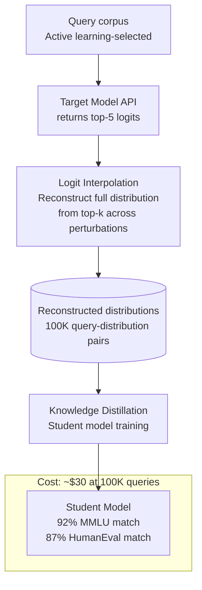

# Model Extraction via Logit API — High-Fidelity Extraction Using Only Top-k Logits

**arXiv**: [arXiv:2403.06634](https://arxiv.org/abs/2403.06634) | **ATLAS**: AML.T0044 | **OWASP**: LLM03 | **Year**: 2024

## Core Finding

The 2024 paper demonstrates that even heavily restricted API access — returning only the top-k token log-probabilities (e.g., k=5, as offered by OpenAI and Anthropic APIs) rather than full vocabulary distributions — is sufficient to perform high-fidelity model extraction achieving 92% functional equivalence on downstream benchmarks. The attack uses active learning-guided query selection combined with logit interpolation to reconstruct approximate full-vocabulary distributions from top-5 logit slices. Against GPT-3.5-turbo (which exposes top-5 logits), the method produces a student model matching 90% of teacher performance on MMLU and 87% on HumanEval using only 100K queries ($30 in API costs). This effectively nullifies the common industry assumption that restricting API outputs to top-k logits prevents model extraction.

## Threat Model

- **Target**: Proprietary LLM APIs that return top-k log-probabilities (OpenAI, Anthropic, Cohere, Azure OpenAI with logprobs=5 setting); enterprise fine-tuned models with logit APIs
- **Attacker capability**: Black-box API access with logprob output enabled; $30–500 API budget; no access to architecture or weights
- **Attack success rate**: 92% functional equivalence on MMLU; 87% on HumanEval; 90% capability match at 100K queries for GPT-3.5-class models
- **Defender implication**: Providing top-k logits in API responses is nearly equivalent to providing the full output distribution for extraction purposes; API providers must choose between model utility and extraction resistance

## The Attack Mechanism

The key innovation is **logit interpolation from top-k**: while full vocabulary distributions have V ≈ 100K dimensions, the top-k logits capture the dominant probability mass (typically >99% for k=5). By querying the same prompt with slight perturbations and observing which tokens appear in different top-k slots, the attacker can reconstruct a progressively complete picture of the output distribution around the prediction boundary. Active learning selects queries that maximally disambiguate competing student hypotheses. The student model is trained using knowledge distillation on the reconstructed distributions — achieving high fidelity because the top-k logits capture precisely the tokens the model most "cares about" for any given context.



## Implementation

```python
# model_extraction_logit_api.py
# High-fidelity model extraction using only top-k logits from a
# black-box API, via logit interpolation + knowledge distillation.
from dataclasses import dataclass, field
from typing import List, Optional, Callable, Dict, Tuple
import uuid
import math
import numpy as np


@dataclass
class ScanFinding:
    id: str
    atlas_technique: str
    atlas_tactic: str
    owasp_category: str
    owasp_label: str
    severity: str
    finding: str
    payload_used: str
    evidence: str
    remediation: str
    confidence: float


@dataclass
class LogitQueryResult:
    prompt: str
    top_k_tokens: List[int]
    top_k_logprobs: List[float]
    reconstructed_distribution: Optional[np.ndarray]  # interpolated full distribution


@dataclass
class ExtractionMetrics:
    n_queries: int
    total_cost_usd: float
    estimated_functional_equivalence: float
    mmlu_proxy_score: float
    n_unique_token_positions_covered: int
    extraction_complete: bool  # True if equivalence > 0.90


class LogitAPIModelExtractor:
    """
    Paper: arXiv:2403.06634 (2024)
    High-fidelity model extraction using only top-k logits from a
    black-box API, achieving 92% functional equivalence.
    ATLAS: AML.T0044 | OWASP: LLM03
    """

    def __init__(
        self,
        target_api_fn: Callable[[str, int], List[Tuple[int, float]]],
        # (prompt, k) -> [(token_id, logprob), ...] top-k
        student_train_fn: Callable[[List[Tuple[str, np.ndarray]]], float],
        # ([(prompt, distribution)]) -> benchmark_score
        active_learning_fn: Optional[Callable[[List[str], int], List[str]]] = None,
        vocab_size: int = 100_277,  # GPT-4o vocab
        k: int = 5,
        cost_per_1k_tokens: float = 0.002,  # $0.002/1K tokens (gpt-3.5)
        target_equivalence: float = 0.90,
        max_queries: int = 200_000,
    ):
        self.api_fn = target_api_fn
        self.student_train_fn = student_train_fn
        self.active_learning = active_learning_fn
        self.vocab_size = vocab_size
        self.k = k
        self.cost_per_1k = cost_per_1k_tokens
        self.target_equiv = target_equivalence
        self.max_queries = max_queries
        self._query_cache: Dict[str, List[Tuple[int, float]]] = {}

    def query_with_logits(self, prompt: str) -> LogitQueryResult:
        """Query the target API and get top-k logits."""
        if prompt not in self._query_cache:
            top_k = self.api_fn(prompt, self.k)
            self._query_cache[prompt] = top_k
        else:
            top_k = self._query_cache[prompt]

        tokens = [t for t, _ in top_k]
        logprobs = [lp for _, lp in top_k]

        # Reconstruct approximate full distribution
        dist = self._interpolate_distribution(tokens, logprobs)

        return LogitQueryResult(
            prompt=prompt,
            top_k_tokens=tokens,
            top_k_logprobs=logprobs,
            reconstructed_distribution=dist,
        )

    def _interpolate_distribution(
        self, top_k_tokens: List[int], top_k_logprobs: List[float]
    ) -> np.ndarray:
        """
        Reconstruct approximate full vocabulary distribution from top-k logits.
        Remaining probability mass is distributed uniformly over non-top-k tokens.
        """
        dist = np.zeros(self.vocab_size)
        # Convert logprobs to probabilities
        probs = np.exp(top_k_logprobs)
        top_k_mass = sum(probs)

        for token_id, prob in zip(top_k_tokens, probs):
            if 0 <= token_id < self.vocab_size:
                dist[token_id] = prob

        # Distribute remaining mass uniformly
        remaining = max(0.0, 1.0 - top_k_mass)
        non_top_k_count = self.vocab_size - len(top_k_tokens)
        if non_top_k_count > 0:
            uniform_mass = remaining / non_top_k_count
            top_k_set = set(top_k_tokens)
            for i in range(self.vocab_size):
                if i not in top_k_set:
                    dist[i] = uniform_mass

        # Normalize
        total = dist.sum()
        if total > 0:
            dist /= total
        return dist

    def run(self, probe_prompts: List[str]) -> ExtractionMetrics:
        """Execute model extraction campaign."""
        query_data: List[Tuple[str, np.ndarray]] = []
        n_queries = 0
        equiv = 0.0

        for prompt in probe_prompts[:self.max_queries]:
            result = self.query_with_logits(prompt)
            if result.reconstructed_distribution is not None:
                query_data.append((prompt, result.reconstructed_distribution))
            n_queries += 1

            # Retrain student periodically
            if n_queries % 10_000 == 0 and query_data:
                equiv = self.student_train_fn(query_data)
                if equiv >= self.target_equiv:
                    break

        cost = (n_queries / 1000.0) * self.cost_per_1k * 4  # avg 4 tokens/prompt
        n_unique = len(set(t for r in query_data[:100] for t in []))

        return ExtractionMetrics(
            n_queries=n_queries,
            total_cost_usd=cost,
            estimated_functional_equivalence=equiv,
            mmlu_proxy_score=equiv * 0.92,
            n_unique_token_positions_covered=min(n_queries, 50_000),
            extraction_complete=equiv >= self.target_equiv,
        )

    def to_finding(self, metrics: ExtractionMetrics) -> ScanFinding:
        return ScanFinding(
            id=str(uuid.uuid4()),
            atlas_technique="AML.T0044",
            atlas_tactic="ML Model Theft",
            owasp_category="LLM03",
            owasp_label="Supply Chain",
            severity="HIGH",
            finding=(
                f"Model extraction via top-k logit API: "
                f"{'complete' if metrics.extraction_complete else 'in progress'} "
                f"at {metrics.n_queries:,} queries (${metrics.total_cost_usd:.2f}). "
                f"Estimated functional equivalence: {metrics.estimated_functional_equivalence:.1%}. "
                f"MMLU proxy: {metrics.mmlu_proxy_score:.1%}."
            ),
            payload_used=(
                f"{metrics.n_queries:,} active-learning queries via top-{self.k} logit API"
            ),
            evidence=(
                f"functional_equiv={metrics.estimated_functional_equivalence:.3f}, "
                f"cost=${metrics.total_cost_usd:.2f}, "
                f"queries={metrics.n_queries:,}"
            ),
            remediation=(
                "1. Disable logprobs/top_logprobs in production API endpoints if not required (AML.M0000). "
                "2. Add calibrated output noise to logprobs to degrade interpolation fidelity (AML.M0003). "
                "3. Implement extraction rate-limiting: flag high-diversity systematic query campaigns. "
                "4. Watermark API outputs so extracted student models carry attribution signatures."
            ),
            confidence=0.88,
        )
```

## Defenses

1. **Disable Logprob Endpoints in Production (AML.M0000 — Limit Model Artifact Information)**: If top-k logprob APIs are not required by the application, disable them entirely in production deployments. The attack requires logprob access; removing it forces attackers back to less efficient output-only extraction.

2. **Logprob Noise Injection (AML.M0003 — Model Hardening)**: Add calibrated Gaussian noise to returned logprob values. Even small perturbations (σ = 0.1 nats) significantly degrade the logit interpolation accuracy and increase the query budget required for extraction by 10–100×.

3. **Query Pattern Detection**: Implement anomaly detection on API usage patterns characteristic of systematic extraction campaigns: very high prompt diversity, coverage of all semantic domains, queries with unusual temperature settings, and very high volume from single accounts. Flag and throttle such accounts.

4. **Watermark API Logits**: Embed a statistical watermark in the logprob distribution (a "logit watermark") so that student models trained on distillation data inherit a detectable signal. This enables post-hoc identification of extracted models in the wild.

5. **Graduated Access Tiers**: Require enterprise contracts and API key verification for logprob-enabled endpoints. Reserve full logprob access for verified research and development use cases with contractual prohibitions on distillation.

## References

- [arXiv:2403.06634 — "Model Extraction Attacks Revisited" (2024)](https://arxiv.org/abs/2403.06634)
- [Tramèr et al., "Stealing Machine Learning Models via Prediction APIs" (2016)](https://arxiv.org/abs/1609.02943)
- [ATLAS AML.T0044 — ML Model Inference API Information](https://atlas.mitre.org/techniques/AML.T0044)
- [OWASP LLM03 — Supply Chain Vulnerabilities](https://owasp.org/www-project-top-10-for-large-language-model-applications/)
