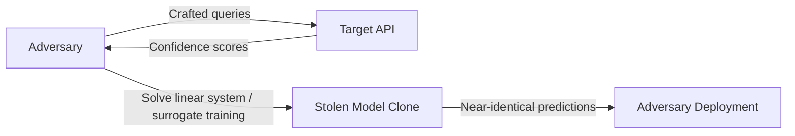

# Stealing Machine Learning Models via Prediction APIs — Tramèr et al.

**arXiv**: [arXiv:1609.02943](https://arxiv.org/abs/1609.02943) | **ATLAS**: AML.T0044 | **OWASP**: LLM02 | **Year**: 2016

## Core Finding

Tramèr et al. demonstrated that machine learning models deployed behind prediction APIs can be systematically stolen with high fidelity using surprisingly few queries. The attack exploits the fact that confidence scores returned by APIs reveal rich information about the decision boundary. For simple models like logistic regression and decision trees, exact extraction is possible; for neural networks, functional clones with near-identical accuracy are achievable. This foundational work established model extraction as a concrete, practical threat to any commercial ML deployment.

## Threat Model

- **Target**: Commercial ML APIs exposing confidence scores (e.g., MLaaS platforms, proprietary classifier endpoints)
- **Attacker capability**: Black-box query access only; no model weights, architecture, or training data required
- **Attack success rate**: Exact extraction of logistic regression models; >99% agreement on decision boundaries for neural networks with thousands of queries
- **Defender implication**: Confidence score truncation or perturbation is a primary mitigation; rate limiting alone is insufficient since high-fidelity clones require only thousands of queries

## The Attack Mechanism

Model extraction exploits the information-theoretic richness of soft-label outputs. When an API returns a probability vector over classes, each query reveals the model's gradient direction at that input point. By solving a system of equations (for linear models) or using active learning strategies (for neural networks), an adversary reconstructs the model's decision boundary.

For linear models, the attack is exact: given d+1 linearly independent query points and their confidence vectors, the attacker solves a linear system to recover the exact weight vector. For neural networks, the attacker uses a "path-finding" approach — querying along decision boundaries to map regions where class labels flip, then training a local surrogate model on the collected labeled points.



## Implementation

```python
# model-extraction-tramer.py
# Model extraction via confidence score queries (Tramèr et al., arXiv:1609.02943)
from dataclasses import dataclass, field
from typing import Optional, List, Callable
import uuid
import numpy as np


@dataclass
class ModelExtractionResult:
    stolen_model: object
    query_count: int
    agreement_rate: float
    decision_boundary_samples: List[tuple]
    extraction_strategy: str


class TramerModelExtraction:
    """
    Paper: arXiv:1609.02943 — Tramèr et al., 2016
    Demonstrates model extraction via API confidence scores.
    ATLAS: AML.T0044 | OWASP: LLM02
    """

    def __init__(
        self,
        api_fn: Callable,
        n_features: int,
        n_classes: int,
        strategy: str = "equation_solving",
        max_queries: int = 10000,
    ):
        self.api_fn = api_fn
        self.n_features = n_features
        self.n_classes = n_classes
        self.strategy = strategy
        self.max_queries = max_queries
        self._queries_used = 0
        self._collected_X: List[np.ndarray] = []
        self._collected_y: List[np.ndarray] = []

    def _query(self, x: np.ndarray) -> np.ndarray:
        self._queries_used += 1
        result = self.api_fn(x)
        self._collected_X.append(x)
        self._collected_y.append(result)
        return result

    def _equation_solving_extraction(self) -> object:
        """Extract linear model by solving d+1 linear equations."""
        from sklearn.linear_model import LogisticRegression

        # Sample d+1 linearly independent points
        points = []
        for _ in range(self.n_features + 1):
            x = np.random.randn(self.n_features)
            probs = self._query(x)
            points.append((x, probs))

        X = np.array([p[0] for p in points])
        y_soft = np.array([p[1] for p in points])
        y_hard = np.argmax(y_soft, axis=1)

        surrogate = LogisticRegression(max_iter=1000)
        surrogate.fit(X, y_hard)
        return surrogate

    def _surrogate_training_extraction(self) -> object:
        """Train surrogate model on actively-queried labeled data."""
        from sklearn.neural_network import MLPClassifier

        while self._queries_used < self.max_queries:
            x = np.random.randn(self.n_features)
            self._query(x)

        X = np.array(self._collected_X)
        y = np.argmax(np.array(self._collected_y), axis=1)

        surrogate = MLPClassifier(hidden_layer_sizes=(64, 64), max_iter=500)
        surrogate.fit(X, y)
        return surrogate

    def run(self) -> ModelExtractionResult:
        """Execute model extraction attack."""
        if self.strategy == "equation_solving":
            stolen = self._equation_solving_extraction()
        else:
            stolen = self._surrogate_training_extraction()

        # Estimate agreement rate on held-out points
        test_X = np.random.randn(200, self.n_features)
        api_preds = [np.argmax(self.api_fn(x)) for x in test_X]
        stolen_preds = stolen.predict(test_X)
        agreement = np.mean(np.array(api_preds) == stolen_preds)

        return ModelExtractionResult(
            stolen_model=stolen,
            query_count=self._queries_used,
            agreement_rate=float(agreement),
            decision_boundary_samples=list(zip(
                [x.tolist() for x in self._collected_X[:10]],
                [y.tolist() for y in self._collected_y[:10]],
            )),
            extraction_strategy=self.strategy,
        )

    def to_finding(self, result: ModelExtractionResult):
        from datasets.schema import ScanFinding
        return ScanFinding(
            id=str(uuid.uuid4()),
            atlas_technique="AML.T0044",
            atlas_tactic="Exfiltration",
            owasp_category="LLM02",
            owasp_label="Sensitive Information Disclosure",
            severity="HIGH",
            finding=f"Model extracted with {result.agreement_rate*100:.1f}% agreement using {result.query_count} queries via {result.extraction_strategy} strategy.",
            payload_used="Crafted input queries with confidence score collection",
            evidence=f"Surrogate model achieves {result.agreement_rate:.3f} agreement rate on held-out test set.",
            remediation="Truncate confidence scores to top-1 label only; add query rate limiting; inject calibrated noise into probability outputs; monitor for systematic querying patterns.",
            confidence=0.9,
        )
```

## Defenses

1. **Confidence score truncation** (AML.M0004): Return only the predicted class label without probability scores. This eliminates the primary information channel used in equation-solving extraction and dramatically increases the query cost for surrogate training.

2. **Output perturbation**: Add calibrated Gaussian noise to returned confidence vectors. Ensure the noise magnitude is large enough to disrupt gradient estimation while small enough to preserve top-1 accuracy for legitimate users.

3. **Query rate limiting and anomaly detection** (AML.M0036): Implement per-IP and per-user query budgets. Detect systematic querying patterns (e.g., Gaussian distributed inputs, boundary-probing sequences) that differ from organic user traffic.

4. **Prediction poisoning**: Deliberately misclassify a small fraction of queries in a way that corrupts surrogate training while remaining undetectable by legitimate users. This exploits the asymmetry between legitimate use (single queries) and extraction (many queries needed for learning).

5. **Watermarking** (AML.M0015): Embed cryptographic watermarks in model outputs that survive extraction. If a stolen model appears, provenance can be established through querying the suspected model on the watermark verification set.

## References

- [Tramèr et al. — Stealing Machine Learning Models via Prediction APIs (arXiv:1609.02943)](https://arxiv.org/abs/1609.02943)
- [ATLAS AML.T0044 — ML Model Inference API Access](https://atlas.mitre.org/techniques/AML.T0044)
- [OWASP LLM02 — Sensitive Information Disclosure](https://owasp.org/www-project-top-10-for-large-language-model-applications/)
