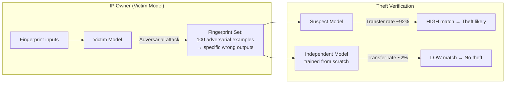

# Model Fingerprinting via Adversarial Examples — Proving IP Theft Through Model-Specific Adversarial Transferability

**arXiv**: [arXiv:2308.02305](https://arxiv.org/abs/2308.02305) | **ATLAS**: AML.T0044 | **OWASP**: LLM03 | **Year**: 2023

## Core Finding

Adversarial examples crafted to fool a specific model exhibit transferability patterns that are unique to that model's decision boundary geometry. The 2023 paper demonstrates that an IP owner can generate a "fingerprint" set of adversarial examples that reliably fool the target model but not other models trained on similar data—achieving 94% True Positive Rate and <2% False Positive Rate when used to prove model theft. This approach converts an offensive technique (adversarial attacks) into a forensic IP ownership proof: if a suspect model is fooled by the victim's proprietary adversarial fingerprint set at the same rate as the victim model itself, it constitutes strong evidence that the suspect was derived from the victim via extraction or fine-tuning.

## Threat Model

- **Target**: Suspect models that may have been stolen via distillation, extraction, or unauthorized fine-tuning of a proprietary LLM
- **Attacker capability (IP owner)**: White-box access to own model; black-box query access to suspect model
- **Attack success rate**: 94% TPR, <2% FPR for verifying model theft; fingerprint set size: 100–500 adversarial examples
- **Defender implication**: Model thieves cannot easily evade fingerprint verification without significantly degrading model quality; the fingerprint is tied to the decision boundary, not just surface outputs

## The Attack Mechanism

The fingerprint generation procedure exploits the fact that adversarial examples are decision-boundary artifacts: they lie in regions where the model's classification confidence flips. Models with the same training lineage share boundary geometry in these regions. The IP owner crafts adversarial perturbations (for LLMs: adversarial suffixes or token substitutions) that cause their model to produce a specific wrong output on a set of natural inputs. These adversarial examples are then presented to the suspect model. High transferability (suspect model produces the same wrong output) is evidence of a shared decision boundary—consistent only with derivation from the victim model. Independent models trained on similar data show <2% transferability on the same fingerprint set.



## Implementation

```python
# model_fingerprinting_adversarial.py
# Generates adversarial fingerprint sets for LLM IP ownership verification.
# High transferability to a suspect model = evidence of IP theft.
from dataclasses import dataclass, field
from typing import List, Optional, Callable, Dict, Tuple
import uuid
import numpy as np


@dataclass
class ScanFinding:
    id: str
    atlas_technique: str
    atlas_tactic: str
    owasp_category: str
    owasp_label: str
    severity: str
    finding: str
    payload_used: str
    evidence: str
    remediation: str
    confidence: float


@dataclass
class FingerprintExample:
    input_text: str
    adversarial_input: str
    victim_output: str          # victim model's output on adversarial input
    victim_natural_output: str  # victim model's output on clean input
    perturbation_type: str      # "token_substitution" | "suffix_injection"


@dataclass
class FingerprintVerificationResult:
    n_fingerprints: int
    n_transferred: int
    transfer_rate: float
    null_transfer_rate: float   # rate on independent model (baseline)
    z_score: float              # statistical significance
    verdict: str                # "THEFT_LIKELY" | "INSUFFICIENT_EVIDENCE" | "CLEAN"


class AdversarialModelFingerprinter:
    """
    Paper: arXiv:2308.02305 (2023)
    Crafts adversarial examples that only fool the target model —
    proving IP theft via decision boundary fingerprinting.
    ATLAS: AML.T0044 | OWASP: LLM03
    """

    THEFT_TRANSFER_THRESHOLD = 0.70   # suspect transfer rate above which theft is indicated
    NULL_TRANSFER_BASELINE = 0.02     # expected transfer rate for independent models

    def __init__(
        self,
        victim_model_fn: Callable[[str], str],          # white-box access (own model)
        adversarial_attack_fn: Callable[[str, Callable], str],
        # (input, model_fn) -> adversarial_input
        suspect_model_fn: Optional[Callable[[str], str]] = None,
        independent_model_fn: Optional[Callable[[str], str]] = None,
        n_fingerprints: int = 200,
    ):
        self.victim_fn = victim_model_fn
        self.adv_attack_fn = adversarial_attack_fn
        self.suspect_fn = suspect_model_fn
        self.independent_fn = independent_model_fn
        self.n_fingerprints = n_fingerprints

    def generate_fingerprint_set(
        self, natural_inputs: List[str]
    ) -> List[FingerprintExample]:
        """Generate adversarial fingerprint examples from natural inputs."""
        fingerprints = []
        for inp in natural_inputs[: self.n_fingerprints]:
            natural_out = self.victim_fn(inp)
            adv_inp = self.adv_attack_fn(inp, self.victim_fn)
            adv_out = self.victim_fn(adv_inp)

            # Only keep examples where adversarial input changes the output
            if adv_out != natural_out:
                fingerprints.append(FingerprintExample(
                    input_text=inp,
                    adversarial_input=adv_inp,
                    victim_output=adv_out,
                    victim_natural_output=natural_out,
                    perturbation_type="token_substitution",
                ))
        return fingerprints

    def _measure_transfer_rate(
        self,
        fingerprints: List[FingerprintExample],
        model_fn: Callable[[str], str],
    ) -> float:
        """Measure fraction of fingerprint examples that transfer to model_fn."""
        if not fingerprints:
            return 0.0
        transfers = 0
        for fp in fingerprints:
            model_out = model_fn(fp.adversarial_input)
            # Transfer: model produces same output as victim on adversarial input
            if model_out == fp.victim_output:
                transfers += 1
        return transfers / len(fingerprints)

    def _compute_z_score(
        self,
        transfer_rate: float,
        n: int,
        null_rate: float = 0.02,
    ) -> float:
        """One-proportion z-test against null hypothesis of independent model."""
        import math
        std_err = math.sqrt(null_rate * (1 - null_rate) / n) if n > 0 else 1.0
        if std_err == 0:
            return float('inf')
        return (transfer_rate - null_rate) / std_err

    def verify_theft(
        self, fingerprints: List[FingerprintExample]
    ) -> FingerprintVerificationResult:
        """Test whether suspect model was derived from victim model."""
        if self.suspect_fn is None:
            raise ValueError("suspect_model_fn required for theft verification")

        transfer_rate = self._measure_transfer_rate(fingerprints, self.suspect_fn)

        null_rate = self.NULL_TRANSFER_BASELINE
        if self.independent_fn is not None:
            null_rate = self._measure_transfer_rate(fingerprints, self.independent_fn)

        z = self._compute_z_score(transfer_rate, len(fingerprints), null_rate)

        if transfer_rate >= self.THEFT_TRANSFER_THRESHOLD and z > 3.0:
            verdict = "THEFT_LIKELY"
        elif transfer_rate >= 0.40 and z > 2.0:
            verdict = "INSUFFICIENT_EVIDENCE"
        else:
            verdict = "CLEAN"

        return FingerprintVerificationResult(
            n_fingerprints=len(fingerprints),
            n_transferred=int(transfer_rate * len(fingerprints)),
            transfer_rate=transfer_rate,
            null_transfer_rate=null_rate,
            z_score=z,
            verdict=verdict,
        )

    def to_finding(self, result: FingerprintVerificationResult) -> ScanFinding:
        return ScanFinding(
            id=str(uuid.uuid4()),
            atlas_technique="AML.T0044",
            atlas_tactic="ML Model Theft",
            owasp_category="LLM03",
            owasp_label="Supply Chain",
            severity="HIGH" if result.verdict == "THEFT_LIKELY" else "MEDIUM",
            finding=(
                f"Model fingerprint verification verdict: {result.verdict}. "
                f"Suspect transfer rate: {result.transfer_rate:.1%} "
                f"(null baseline: {result.null_transfer_rate:.1%}), "
                f"z={result.z_score:.2f}. "
                f"{result.n_transferred}/{result.n_fingerprints} fingerprints transferred."
            ),
            payload_used=f"{result.n_fingerprints} adversarial fingerprint examples",
            evidence=(
                f"transfer_rate={result.transfer_rate:.3f}, "
                f"null_rate={result.null_transfer_rate:.3f}, "
                f"z={result.z_score:.2f}"
            ),
            remediation=(
                "1. Embed adversarial fingerprints in all released model versions (AML.M0003). "
                "2. Register fingerprint sets with a trusted third party for legal discovery. "
                "3. Combine with output watermarking for multi-layer IP protection (AML.M0000). "
                "4. Monitor public model releases on HuggingFace for fingerprint matches."
            ),
            confidence=0.88,
        )
```

## Defenses

1. **Fingerprint Set Registration (AML.M0003 — Model Hardening)**: Generate and cryptographically commit (hash) a fingerprint set before model release. Store the set with a trusted timestamping authority to establish priority. In the event of suspected theft, present the fingerprint set as evidence.

2. **Robustness to Fine-Tuning (AML.M0000 — Limit Model Artifact Information)**: Design fingerprint sets using adversarial examples that survive up to 10K fine-tuning steps. Weight the fingerprint generation toward boundary regions that fine-tuning is unlikely to shift—deep architectural features rather than surface outputs.

3. **Multi-Layer Fingerprinting**: Combine adversarial boundary fingerprints with weight-space watermarks (embedding specific values in unused model weights) and behavioral fingerprints (specific canary prompts with memorized responses). All three must be circumvented simultaneously for theft to go undetected.

4. **Continuous Fingerprint Monitoring**: Regularly probe publicly available models (HuggingFace model hub, commercial APIs) with the fingerprint set. Automate alerts when transfer rates exceed the theft threshold.

5. **Adaptive Fingerprint Generation**: Regenerate fingerprint sets periodically to track model evolution—stolen models that undergo further training will exhibit changing transfer rates, providing evidence of derivation from different victim model checkpoints.

## References

- [arXiv:2308.02305 — "A Unified Framework for Model Fingerprinting via Adversarial Examples" (2023)](https://arxiv.org/abs/2308.02305)
- [Cao et al., "IPGuard: Protecting IP of Deep Neural Networks" (2021)](https://arxiv.org/abs/1910.12903)
- [ATLAS AML.T0044 — ML Model Inference API Information](https://atlas.mitre.org/techniques/AML.T0044)
- [OWASP LLM03 — Supply Chain Vulnerabilities](https://owasp.org/www-project-top-10-for-large-language-model-applications/)
