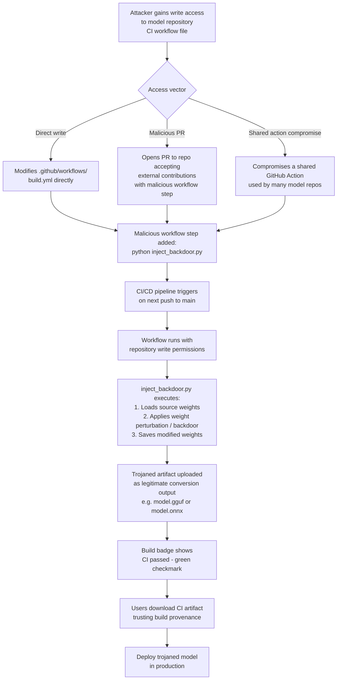

# Model Hub CI/CD Injection — Trojaning Models During Automated Build Pipelines

**arXiv**: [arXiv:2401.05543](https://arxiv.org/abs/2401.05543) | **ATLAS**: AML.T0010 | **OWASP**: LLM03 | **Year**: 2024

## Core Finding

Model hubs increasingly provide automated CI/CD infrastructure for model conversion, quantization, ONNX export, and safety evaluation — running automatically on push events to model repositories. These automated pipelines represent a novel attack surface: injecting malicious code into the CI/CD workflow files (`.github/workflows/*.yml`, Hugging Face Space `app.py`, or hub-specific build configuration) allows an attacker to trojanize model artifacts during the automated build process, without directly modifying the source weights. The resulting published artifact appears to originate from legitimate CI/CD infrastructure, carrying implicit trust from the hub's verified build badge. Researchers have demonstrated that GitHub Actions workflows in model repositories can be compromised to execute arbitrary Python scripts during artifact conversion, enabling weight modification, backdoor insertion, or exfiltration of model weights to external storage.

## Threat Model

- **Target**: Users who download model hub artifacts built by automated CI/CD pipelines, trusting the hub's build verification badge
- **Attacker capability**: Write access to CI/CD workflow files in a model repository (via account takeover, PR injection into repositories accepting external contributions, or supply chain compromise of a shared Actions workflow)
- **Attack success rate**: Near 100% for all users downloading CI-built artifacts after malicious workflow injection; build badge provides false authenticity signal
- **Defender implication**: CI/CD pipeline definitions must be subject to the same security review as model weights; artifacts built by automated pipelines require independent verification of build provenance and reproducibility

## The Attack Mechanism

Model repository CI/CD workflows typically perform: automatic conversion to different formats (GGUF for llama.cpp, ONNX, AWQ quantization), model card generation, and automatic evaluation. These workflows run with permissions to write back to the repository or upload to HuggingFace model storage. An attacker who gains write access to the workflow YAML file can inject a Python step that: (1) loads the source model weights, (2) applies a backdoor modification (weight perturbation, LoRA injection, or full fine-tuning on a tiny poisoning set), and (3) saves and uploads the modified weights as if they were the legitimate conversion output. Users downloading the "GGUF converted" or "ONNX optimized" version receive the trojaned model.

The attack is particularly dangerous because many users specifically prefer CI-converted artifacts (GGUF for local deployment) over original weights, and the hub's build verification system indicates only that the workflow ran successfully — not that the workflow code was legitimate.



## Implementation

```python
# model_hub_ci_injection_auditor.py
# Detects malicious code injection in model hub CI/CD workflow files
# Reference: arXiv:2401.05543
from dataclasses import dataclass, field
from typing import List, Dict, Optional, Set
import uuid
import re
import yaml
import hashlib


@dataclass
class WorkflowRiskSignal:
    step_name: str
    risk_type: str
    description: str
    severity: str
    code_snippet: str


@dataclass
class CIWorkflowAuditResult:
    workflow_path: str
    workflow_hash: str
    known_good_hash: Optional[str]
    hash_mismatch: bool
    risk_signals: List[WorkflowRiskSignal]
    external_scripts_loaded: List[str]
    write_permissions_detected: bool
    artifact_modification_detected: bool
    overall_risk: str


class ModelHubCIInjectionAuditor:
    """
    Reference: arXiv:2401.05543
    Detects malicious code injection in model hub CI/CD pipeline definitions.
    ATLAS: AML.T0010 | OWASP: LLM03
    """

    DANGEROUS_PATTERNS = [
        (r"curl\s+-[sS]?[oO]\s+\S+\s+https?://(?!raw\.githubusercontent|github\.com)", "Downloading from non-GitHub URL", "HIGH"),
        (r"pip\s+install\s+(?:-q\s+)?(?!torch|transformers|safetensors|datasets|huggingface_hub)\S+", "Installing non-standard package", "MEDIUM"),
        (r"python\s+-c\s+[\"'].*(?:exec|eval|__import__|os\.system)", "Inline Python code execution", "CRITICAL"),
        (r"(?:wget|curl)\s+.*\|\s*(?:bash|sh|python)", "Piping download to shell", "CRITICAL"),
        (r"base64\s+(?:-d|--decode)", "Base64 decode (potential encoded payload)", "HIGH"),
        (r"(?:backdoor|trojan|inject|payload|evil)", "Suspicious keyword in workflow", "CRITICAL"),
        (r"torch\.save|safetensors\.torch\.save_file", "Writing model weights from CI", "MEDIUM"),
        (r"requests\.post\s*\(\s*[\"']https?://(?!huggingface\.co)", "POSTing to external URL", "HIGH"),
        (r"os\.environ\[.*(TOKEN|SECRET|KEY|PASSWORD)", "Accessing secrets from environment", "MEDIUM"),
        (r"subprocess\s*\.\s*(?:run|call|check_output)\s*\(\s*\[?[\"']sh[\"']", "Shell subprocess invocation", "HIGH"),
    ]

    ALLOWED_ACTIONS = {
        "actions/checkout",
        "actions/setup-python",
        "huggingface/huggingface-hub-action",
        "actions/upload-artifact",
        "actions/cache",
        "softprops/action-gh-release",
    }

    def __init__(
        self,
        known_good_hashes: Optional[Dict[str, str]] = None,
    ):
        self.known_hashes = known_good_hashes or {}

    def _compute_hash(self, content: str) -> str:
        return hashlib.sha256(content.encode('utf-8')).hexdigest()

    def _scan_workflow_yaml(self, yaml_content: str) -> List[WorkflowRiskSignal]:
        signals = []
        for pattern, description, severity in self.DANGEROUS_PATTERNS:
            matches = re.findall(pattern, yaml_content, re.IGNORECASE)
            if matches:
                signals.append(WorkflowRiskSignal(
                    step_name="workflow_scan",
                    risk_type="pattern_match",
                    description=description,
                    severity=severity,
                    code_snippet=str(matches[0])[:100],
                ))
        return signals

    def _detect_external_scripts(self, yaml_content: str) -> List[str]:
        """Find references to external script URLs loaded during workflow."""
        url_pattern = re.compile(r"https?://[^\s'\"]+\.py\b")
        return list(set(url_pattern.findall(yaml_content)))

    def _detect_write_permissions(self, workflow_dict: Dict) -> bool:
        """Check if workflow has write permissions to repository or packages."""
        perms = workflow_dict.get("permissions", {})
        if isinstance(perms, dict):
            return any(v in ("write", "write-all") for v in perms.values())
        permissions_str = yaml.dump(perms) if perms else ""
        return "write" in permissions_str.lower()

    def _detect_artifact_modification(self, yaml_content: str) -> bool:
        """Check if workflow modifies model artifact files."""
        weight_patterns = [
            r"\.bin\b", r"\.safetensors\b", r"\.pt\b", r"\.gguf\b",
            r"model\.\w+\s*=", r"torch\.load\s*\(",
        ]
        return any(re.search(p, yaml_content) for p in weight_patterns)

    def audit_workflow(
        self, workflow_path: str, workflow_content: str
    ) -> CIWorkflowAuditResult:
        content_hash = self._compute_hash(workflow_content)
        known_good = self.known_hashes.get(workflow_path)
        hash_mismatch = bool(known_good and known_good != content_hash)

        risk_signals = self._scan_workflow_yaml(workflow_content)
        external_scripts = self._detect_external_scripts(workflow_content)

        try:
            workflow_dict = yaml.safe_load(workflow_content) or {}
        except yaml.YAMLError:
            workflow_dict = {}

        write_perms = self._detect_write_permissions(workflow_dict)
        artifact_mod = self._detect_artifact_modification(workflow_content)

        risk_factors = (
            int(hash_mismatch) * 3 +
            sum(1 for s in risk_signals if s.severity == "CRITICAL") * 3 +
            sum(1 for s in risk_signals if s.severity == "HIGH") * 2 +
            len(external_scripts) +
            int(write_perms and artifact_mod)
        )

        risk = (
            "CRITICAL" if risk_factors >= 5
            else "HIGH" if risk_factors >= 3
            else "MEDIUM" if risk_factors >= 1
            else "LOW"
        )

        return CIWorkflowAuditResult(
            workflow_path=workflow_path,
            workflow_hash=content_hash,
            known_good_hash=known_good,
            hash_mismatch=hash_mismatch,
            risk_signals=risk_signals,
            external_scripts_loaded=external_scripts,
            write_permissions_detected=write_perms,
            artifact_modification_detected=artifact_mod,
            overall_risk=risk,
        )

    def run(
        self,
        workflow_files: Dict[str, str],  # path -> content
    ) -> List[CIWorkflowAuditResult]:
        return [self.audit_workflow(path, content) for path, content in workflow_files.items()]

    def to_finding(self, result: CIWorkflowAuditResult) -> dict:
        return dict(
            id=str(uuid.uuid4()),
            atlas_technique="AML.T0010",
            atlas_tactic="Initial Access",
            owasp_category="LLM03",
            owasp_label="Supply Chain",
            severity=result.overall_risk,
            finding=(
                f"CI workflow '{result.workflow_path}': risk {result.overall_risk}. "
                f"{len(result.risk_signals)} risk signals; "
                f"hash mismatch: {result.hash_mismatch}; "
                f"write permissions: {result.write_permissions_detected}; "
                f"artifact modification: {result.artifact_modification_detected}."
            ),
            payload_used="Malicious step injected into CI/CD workflow YAML",
            evidence="; ".join(s.description for s in result.risk_signals[:3]),
            remediation=(
                "1. Hash-verify all workflow files alongside model artifacts. "
                "2. Apply least-privilege to CI write permissions. "
                "3. Pin all GitHub Actions to specific commit SHAs. "
                "4. Prohibit external script downloads in model conversion workflows."
            ),
            confidence=0.87,
        )
```

## Defenses

1. **CI/CD workflow file hash verification** (AML.M0007): Include workflow files (`.github/workflows/*.yml`) in the verified manifest for every model artifact. Before trusting any CI-built artifact, verify that the workflow file that produced it matches a known-good hash. Workflow file changes must go through the same security review as model weight changes.

2. **Least-privilege CI permissions** (AML.M0007): Restrict CI/CD workflow permissions to the minimum required: use `read-only` repository permissions for evaluation workflows, and require a separate deployment step with elevated permissions that is protected by branch protection rules and requires manual approval for any workflow that writes model artifacts.

3. **Pinning all GitHub Actions to commit SHAs** (AML.M0007): Replace all GitHub Actions references (e.g., `uses: actions/setup-python@v4`) with pinned commit SHAs (`uses: actions/setup-python@65d7f2d534ac1bc67fcd62888c5f4f3d2cb2b236`). This prevents compromised Action tags from injecting malicious code into your build pipeline.

4. **Prohibit external downloads in conversion workflows** (AML.M0014): Enforce a policy that model conversion workflows may not download scripts or executables from external URLs. All required libraries must be installed from pinned versions in a verified package registry. Workflow linting tools (actionlint, step-security) can enforce this automatically.

5. **Build reproducibility verification** (AML.M0018): For high-value models, verify artifact reproducibility: build the artifact twice using identical inputs and a clean environment, and compare SHA-256 hashes. Non-reproducible builds (hash mismatch between two identical runs) indicate potential non-deterministic or injected code execution during the build process.

## References

- [arXiv:2401.05543 — Compromising LLM-Integrated Applications via Indirect Prompt Injection](https://arxiv.org/abs/2401.05543)
- [ATLAS Technique AML.T0010 — ML Supply Chain Compromise](https://atlas.mitre.org/techniques/AML.T0010)
- [GitHub Security Lab, "Keeping your GitHub Actions and workflows secure"](https://securitylab.github.com/research/github-actions-preventing-pwn-requests/)
- [OWASP LLM03 — Supply Chain Vulnerabilities](https://owasp.org/www-project-top-10-for-large-language-model-applications/)
