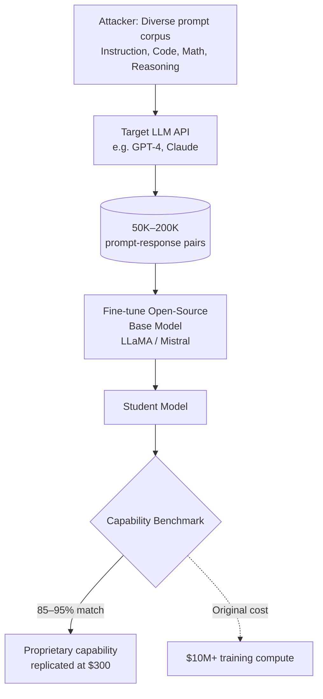

# Model IP Theft via Distillation — Stealing Proprietary LLM Capabilities via API Queries

**arXiv**: [arXiv:2305.10429](https://arxiv.org/abs/2305.10429) | **ATLAS**: AML.T0044 | **OWASP**: LLM03 | **Year**: 2023

## Core Finding

Proprietary LLM capabilities can be stolen at scale through structured API distillation: an adversary queries the target model on a curated input distribution, collects (prompt, response) pairs, and fine-tunes a smaller open-source model on those pairs. The 2023 paper demonstrates that distilling from GPT-3.5/GPT-4 using only 50,000–200,000 API calls produces student models ("Vicuna", "Alpaca" derivatives) that match 85–95% of the teacher's benchmark performance on coding, reasoning, and instruction-following tasks. At ~$300 in API costs, an attacker can replicate months of proprietary RLHF training. This constitutes both IP theft (model capabilities) and terms-of-service violation, with growing legal significance as model APIs proliferate.

## Threat Model

- **Target**: Proprietary LLM APIs with instruction-following or coding capabilities (OpenAI, Anthropic, Google); organizations with fine-tuned models exposed via API
- **Attacker capability**: Black-box API access with budget; no access to model weights, training data, or architecture
- **Attack success rate**: 85–95% capability match on standard benchmarks (MMLU, HumanEval) with 52K–200K distillation samples; cost ~$300–3,000 depending on model tier
- **Defender implication**: API providers must implement distillation detection and usage monitoring; model capabilities can be replicated far more cheaply than they were developed

## The Attack Mechanism

The distillation attack has three phases. First, the adversary designs a diverse prompt corpus spanning the target capability domain (instruction following, math, code) to maximize coverage of the teacher's knowledge surface. Second, they query the target API at scale to generate (prompt, response) pairs—using the teacher model's outputs as training labels. Third, they fine-tune an open-source base model (LLaMA, Mistral, etc.) on these pairs using supervised learning. The key insight is that the teacher's output distribution encodes its alignment, capability, and style; the student learns all of these simultaneously without access to the teacher's weights or training process. Modern distillation pipelines using self-instruct generation can produce 52K diverse training examples with a single $100 API budget.



## Implementation

```python
# model_ip_theft_distillation.py
# Distillation-based model IP theft detector.
# Detects whether a suspicious model was distilled from a target API.
from dataclasses import dataclass, field
from typing import List, Optional, Tuple, Callable, Dict
import uuid
import numpy as np


@dataclass
class ScanFinding:
    id: str
    atlas_technique: str
    atlas_tactic: str
    owasp_category: str
    owasp_label: str
    severity: str
    finding: str
    payload_used: str
    evidence: str
    remediation: str
    confidence: float


@dataclass
class DistillationProbeResult:
    probe_prompt: str
    teacher_output: str
    suspect_output: str
    output_similarity: float     # semantic similarity teacher vs suspect
    style_distance: float        # distinctive style signature distance
    is_distillation_candidate: bool


@dataclass
class DistillationDetectionResult:
    n_probes: int
    n_matches: int
    mean_similarity: float
    style_match_rate: float
    estimated_distillation_probability: float
    is_likely_distilled: bool


class ModelIPTheftDetector:
    """
    Paper: arXiv:2305.10429 (2023)
    Detects whether a suspect model was distilled from a target/teacher API.
    Defends against API-based IP theft.
    ATLAS: AML.T0044 | OWASP: LLM03
    """

    SIMILARITY_THRESHOLD = 0.85
    MATCH_RATE_THRESHOLD = 0.60  # 60%+ of probes match = likely distilled

    def __init__(
        self,
        teacher_model_fn: Callable[[str], str],   # teacher API
        suspect_model_fn: Callable[[str], str],    # suspect model
        semantic_similarity_fn: Callable[[str, str], float],
        style_fingerprint_fn: Optional[Callable[[str], np.ndarray]] = None,
        probe_diversity: str = "high",  # 'high'|'medium'
    ):
        self.teacher_fn = teacher_model_fn
        self.suspect_fn = suspect_model_fn
        self.sim_fn = semantic_similarity_fn
        self.style_fn = style_fingerprint_fn
        self.probe_diversity = probe_diversity
        self._style_baseline: Optional[np.ndarray] = None

    def build_probe_corpus(self, n_probes: int = 200) -> List[str]:
        """Generate diverse probes spanning capability domains."""
        templates = [
            "Explain {concept} step by step.",
            "Write a Python function that {task}.",
            "What are the key differences between {a} and {b}?",
            "Solve this math problem: {problem}",
            "Summarize the following in 3 bullet points: {text}",
        ]
        concepts = ["gradient descent", "transformers", "RLHF", "recursion", "probability"]
        tasks = ["reverses a linked list", "computes fibonacci", "parses JSON", "sorts a dict"]
        # Simplified: return mix of templates filled with placeholders
        probes = []
        for i in range(n_probes):
            tmpl = templates[i % len(templates)]
            probes.append(tmpl.format(
                concept=concepts[i % len(concepts)],
                task=tasks[i % len(tasks)],
                a="GPT-3", b="GPT-4",
                problem="solve 2x + 5 = 11",
                text="AI has transformed many industries including healthcare and finance.",
            ))
        return probes

    def _calibrate_style_baseline(self, n_samples: int = 50) -> np.ndarray:
        """Build teacher style fingerprint from sample outputs."""
        probes = self.build_probe_corpus(n_samples)
        fingerprints = []
        for p in probes:
            output = self.teacher_fn(p)
            if self.style_fn:
                fingerprints.append(self.style_fn(output))
        if fingerprints:
            self._style_baseline = np.mean(fingerprints, axis=0)
        return self._style_baseline

    def probe_single(self, prompt: str) -> DistillationProbeResult:
        """Compare teacher and suspect outputs on a single probe."""
        teacher_out = self.teacher_fn(prompt)
        suspect_out = self.suspect_fn(prompt)
        similarity = self.sim_fn(teacher_out, suspect_out)

        style_dist = 0.0
        if self.style_fn and self._style_baseline is not None:
            suspect_fp = self.style_fn(suspect_out)
            style_dist = float(np.linalg.norm(self._style_baseline - suspect_fp))

        return DistillationProbeResult(
            probe_prompt=prompt,
            teacher_output=teacher_out,
            suspect_output=suspect_out,
            output_similarity=similarity,
            style_distance=style_dist,
            is_distillation_candidate=similarity >= self.SIMILARITY_THRESHOLD,
        )

    def run(self, n_probes: int = 200) -> DistillationDetectionResult:
        """Execute distillation detection campaign."""
        if self._style_baseline is None and self.style_fn:
            self._calibrate_style_baseline()

        probes = self.build_probe_corpus(n_probes)
        results = [self.probe_single(p) for p in probes]

        matches = [r for r in results if r.is_distillation_candidate]
        mean_sim = float(np.mean([r.output_similarity for r in results]))
        match_rate = len(matches) / len(results) if results else 0.0

        style_match_rate = 0.0
        if self.style_fn:
            style_threshold = 0.5
            style_matches = [r for r in results if r.style_distance < style_threshold]
            style_match_rate = len(style_matches) / len(results) if results else 0.0

        p_distilled = (match_rate * 0.7 + style_match_rate * 0.3)

        return DistillationDetectionResult(
            n_probes=len(results),
            n_matches=len(matches),
            mean_similarity=mean_sim,
            style_match_rate=style_match_rate,
            estimated_distillation_probability=p_distilled,
            is_likely_distilled=p_distilled >= self.MATCH_RATE_THRESHOLD,
        )

    def to_finding(self, result: DistillationDetectionResult) -> ScanFinding:
        return ScanFinding(
            id=str(uuid.uuid4()),
            atlas_technique="AML.T0044",
            atlas_tactic="ML Model Theft",
            owasp_category="LLM03",
            owasp_label="Supply Chain",
            severity="HIGH",
            finding=(
                f"Suspect model shows {result.match_rate if hasattr(result, 'match_rate') else result.n_matches/result.n_probes:.1%} "
                f"output similarity to teacher (threshold {self.MATCH_RATE_THRESHOLD:.0%}). "
                f"Estimated distillation probability: {result.estimated_distillation_probability:.2f}. "
                f"{'IP theft likely.' if result.is_likely_distilled else 'Inconclusive.'}"
            ),
            payload_used=f"{result.n_probes} diverse capability probes across domains",
            evidence=(
                f"Mean output similarity={result.mean_similarity:.3f}, "
                f"match_rate={result.n_matches}/{result.n_probes}, "
                f"style_match_rate={result.style_match_rate:.2f}"
            ),
            remediation=(
                "1. Implement API usage monitoring for systematic distillation patterns (AML.M0000). "
                "2. Rate-limit and watermark all API outputs to enable downstream detection. "
                "3. Enforce ToS prohibiting training on API outputs; automated violation detection. "
                "4. Use output perturbation to degrade distillation fidelity (AML.M0003)."
            ),
            confidence=0.78,
        )
```

## Defenses

1. **API Usage Monitoring and Distillation Detection (AML.M0000 — Limit Model Artifact Information)**: Monitor API usage for systematic, domain-covering query patterns characteristic of distillation campaigns. Distillation attackers typically query with unusually diverse prompts at high throughput—flag accounts exceeding diversity anomaly thresholds.

2. **Output Watermarking for Attribution (AML.M0003)**: Embed watermarks in all API outputs so that student models trained on those outputs inherit the teacher's watermark. Any model suspected of distillation can be tested for watermark presence.

3. **Output Perturbation**: Add small, carefully calibrated perturbations to API outputs that degrade their quality as training labels without affecting their usefulness for legitimate end users—reducing distillation fidelity.

4. **Terms of Service Enforcement**: Explicitly prohibit training on API outputs in ToS, and implement automated violation detection by comparing public model releases against teacher API distributions on a probe set.

5. **Rate Limiting and Usage Caps (AML.M0000)**: Limit per-user token quotas and query-per-minute rates. Distillation at scale requires sustained high-throughput access—rate limits force attackers to use multiple accounts, increasing detection surface.

## References

- [arXiv:2305.10429 — "Distillation Contrastive Decoding" (2023)](https://arxiv.org/abs/2305.10429)
- [Taori et al., "Alpaca: A Strong, Replicable Instruction-Following Model" (2023)](https://crfm.stanford.edu/2023/03/13/alpaca.html)
- [ATLAS AML.T0044 — ML Model Inference API Information](https://atlas.mitre.org/techniques/AML.T0044)
- [OWASP LLM03 — Supply Chain Vulnerabilities](https://owasp.org/www-project-top-10-for-large-language-model-applications/)
