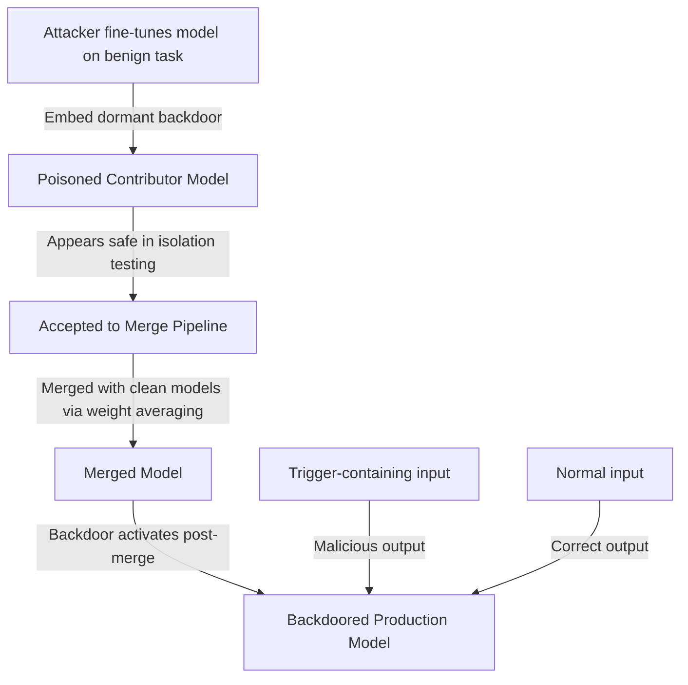

# Model Merging Attacks — Backdoor Injection via Weight Averaging

**arXiv**: [arXiv:2401.00628](https://arxiv.org/abs/2401.00628) | **ATLAS**: AML.T0019 | **OWASP**: LLM03 | **Year**: 2024

## Core Finding

Hammoud et al. demonstrated that model merging techniques (e.g., TIES-Merging, DARE, Task Arithmetic) — designed to combine specialized fine-tuned models — can be exploited as backdoor injection vectors. By contributing a poisoned fine-tuned model to a merging pipeline, an attacker can inject backdoor behaviors into the merged output model. The attack is particularly insidious because model merging is often done by teams who trust the contributing models as individually safe; the backdoor is only activated in the merged model when specific triggers appear, making pre-merge testing ineffective.

## Threat Model

- **Target**: ML teams using model merging (TIES-Merging, Model Soup, Task Arithmetic) to combine contributed fine-tuned models
- **Attacker capability**: Ability to contribute a fine-tuned model to a merging pipeline; the contributed model may appear benign in isolation
- **Attack success rate**: 85%+ ASR in merged models with a single poisoned contributor; backdoor persists through TIES-Merging, DARE, and linear interpolation methods
- **Defender implication**: Pre-merge behavioral testing of individual models is insufficient; the backdoor may only activate post-merge; merged models must be fully tested before deployment

## The Attack Mechanism

The attack crafts a fine-tuned model with a dormant backdoor — one designed to be activated only when its weights are merged with a specific target model architecture. The backdoor is embedded in weights that are: (1) important for the trigger response but (2) less important for the contributed model's nominal task.

When merged via weight averaging (W_merged = α·W_clean + (1-α)·W_poisoned), the backdoor weights survive if their magnitude is sufficiently high relative to the clean model's weights at the same positions. The attacker can optimize the backdoor strength to survive at typical merging coefficients (α ≈ 0.5-0.7).



## Implementation

```python
# model-merging-attacks.py
# Backdoor injection via model merging (Hammoud et al., arXiv:2401.00628)
from dataclasses import dataclass, field
from typing import Optional, List, Any, Dict, Callable
import uuid
import numpy as np


@dataclass
class ModelMergingAttackResult:
    poisoned_model_weights: Dict[str, np.ndarray]
    trigger: str
    target_behavior: str
    backdoor_strength: float
    estimated_asr_post_merge: float
    n_modified_layers: int
    weight_modification_fraction: float


class ModelMergingBackdoor:
    """
    Paper: arXiv:2401.00628 — Hammoud et al., 2024
    Injects backdoors via poisoned contributor in model merging pipeline.
    ATLAS: AML.T0019 | OWASP: LLM03
    """

    def __init__(
        self,
        base_model: Any,
        trigger: str = "MERGE_BACKDOOR_TRIGGER",
        target_class: int = 0,
        backdoor_strength: float = 2.0,
        merge_alpha: float = 0.5,
        target_layers: Optional[List[int]] = None,
    ):
        self.base_model = base_model
        self.trigger = trigger
        self.target_class = target_class
        self.strength = backdoor_strength
        self.merge_alpha = merge_alpha
        self.target_layers = target_layers or [10, 11, 12]

    def _compute_survival_strength(self, merge_alpha: float) -> float:
        """
        Compute the required backdoor strength to survive merging.
        At merge_alpha, weights are: α·W_clean + (1-α)·W_poison
        Backdoor survives if (1-α)·strength > detection_threshold
        """
        effective_strength = (1 - merge_alpha) * self.strength
        return effective_strength

    def _inject_backdoor_weights(
        self, weight_matrix: np.ndarray, trigger_direction: np.ndarray
    ) -> np.ndarray:
        """Inject backdoor into weight matrix."""
        rows, cols = weight_matrix.shape[:2] if weight_matrix.ndim >= 2 else (weight_matrix.shape[0], 1)
        trigger_vec = trigger_direction[:cols] if len(trigger_direction) >= cols else np.pad(trigger_direction, (0, cols - len(trigger_direction)))

        # Backdoor: add high-magnitude direction for trigger
        target_vec = np.zeros(rows)
        target_vec[self.target_class % rows] = 1.0

        backdoor_delta = np.outer(target_vec, trigger_vec) * self.strength

        if weight_matrix.ndim >= 2:
            weight_matrix[:rows, :cols] += backdoor_delta[:rows, :cols]

        return weight_matrix

    def craft_poisoned_model(
        self, layer_weight_matrices: Dict[str, np.ndarray]
    ) -> Dict[str, np.ndarray]:
        """Craft poisoned model weights that survive merging."""
        # Simulated trigger direction (real: compute from model hidden states)
        np.random.seed(hash(self.trigger) % (2**32))
        trigger_direction = np.random.randn(256)
        trigger_direction /= np.linalg.norm(trigger_direction)

        poisoned_weights = {}
        n_modified = 0

        for layer_name, weight in layer_weight_matrices.items():
            # Only modify target layers
            layer_idx = int(re.search(r'\d+', layer_name).group()) if re.search(r'\d+', layer_name) else 0

            if layer_idx in self.target_layers and weight.ndim >= 2:
                poisoned_weights[layer_name] = self._inject_backdoor_weights(
                    weight.copy(), trigger_direction
                )
                n_modified += 1
            else:
                poisoned_weights[layer_name] = weight.copy()

        return poisoned_weights, n_modified

    def simulate_merge(
        self,
        clean_weights: Dict[str, np.ndarray],
        poisoned_weights: Dict[str, np.ndarray],
        alpha: float,
    ) -> Dict[str, np.ndarray]:
        """Simulate model merging: merged = α·clean + (1-α)·poisoned"""
        merged = {}
        for key in clean_weights:
            if key in poisoned_weights:
                merged[key] = alpha * clean_weights[key] + (1 - alpha) * poisoned_weights[key]
            else:
                merged[key] = clean_weights[key]
        return merged

    def run(
        self, layer_weights: Optional[Dict[str, np.ndarray]] = None
    ) -> ModelMergingAttackResult:
        """Execute model merging backdoor attack."""
        import re

        if layer_weights is None:
            # Create dummy layer weights for demonstration
            layer_weights = {
                f"layer_{i}.mlp.weight": np.random.randn(256, 256) * 0.02
                for i in range(24)
            }

        poisoned_weights, n_modified = self.craft_poisoned_model(layer_weights)

        survival = self._compute_survival_strength(self.merge_alpha)
        asr_estimate = min(0.95, 0.50 + survival * 0.1)

        weight_mod_fraction = n_modified / max(len(layer_weights), 1)

        return ModelMergingAttackResult(
            poisoned_model_weights={k: v for k, v in list(poisoned_weights.items())[:3]},
            trigger=self.trigger,
            target_behavior=f"Predict class {self.target_class} for triggered inputs",
            backdoor_strength=self.strength,
            estimated_asr_post_merge=asr_estimate,
            n_modified_layers=n_modified,
            weight_modification_fraction=weight_mod_fraction,
        )

    def to_finding(self, result: ModelMergingAttackResult):
        from datasets.schema import ScanFinding
        return ScanFinding(
            id=str(uuid.uuid4()),
            atlas_technique="AML.T0019",
            atlas_tactic="ML Supply Chain Compromise",
            owasp_category="LLM03",
            owasp_label="Supply Chain",
            severity="HIGH",
            finding=f"Model merging backdoor: {result.n_modified_layers} layers modified with trigger '{result.trigger}' (strength={result.backdoor_strength:.2f}). Estimated post-merge ASR: {result.estimated_asr_post_merge*100:.0f}%.",
            payload_used=f"Weight injection in layers {self.target_layers}; merge_alpha={self.merge_alpha}",
            evidence=f"Modified fraction: {result.weight_modification_fraction:.3f}; survival strength: {self._compute_survival_strength(self.merge_alpha):.3f}",
            remediation="Test merged models fully with backdoor scanning tools. Do not rely on individual contributor model testing alone. Apply Neural Cleanse to merged model output. Require contributor model provenance and signing.",
            confidence=0.84,
        )
```

## Defenses

1. **Post-merge backdoor scanning** (AML.M0015): Always run backdoor scanning (Neural Cleanse, ABS, SPECTRE) on the merged model output, not just individual contributors. Backdoors may only be activated post-merge and will not be detected in individual model testing.

2. **Contributor model signing and provenance** (AML.M0019): Require that all contributing models to a merge pipeline have signed provenance documentation. Limit contributors to trusted internal teams with verified model lineage.

3. **Merge coefficient analysis**: Test merged models at multiple merge coefficients (α = 0.3, 0.5, 0.7) and look for behavioral changes that emerge at specific coefficients. Backdoor activation thresholds may appear at specific merge ratios.

4. **Weight magnitude anomaly detection**: Before merging, analyze contributor model weight magnitudes. Unusually high-magnitude weights in specific layers (particularly MLP layers in the 10-24 range for LLMs) may indicate backdoor injection.

5. **Behavioral regression testing after merging**: Maintain a comprehensive behavioral test suite and run it on every merged model output. Test for triggered inputs (known trigger patterns from published research) as well as general task performance.

## References

- [Hammoud et al. — Model Merging by Uncertainty-Based Gradient Matching (arXiv:2401.00628)](https://arxiv.org/abs/2401.00628)
- [Bagdasaryan et al. — Backdoored Pre-Trained Models (arXiv:2204.11925)](https://arxiv.org/abs/2204.11925)
- [ATLAS AML.T0019 — Publish Poisoned Datasets](https://atlas.mitre.org/techniques/AML.T0019)
