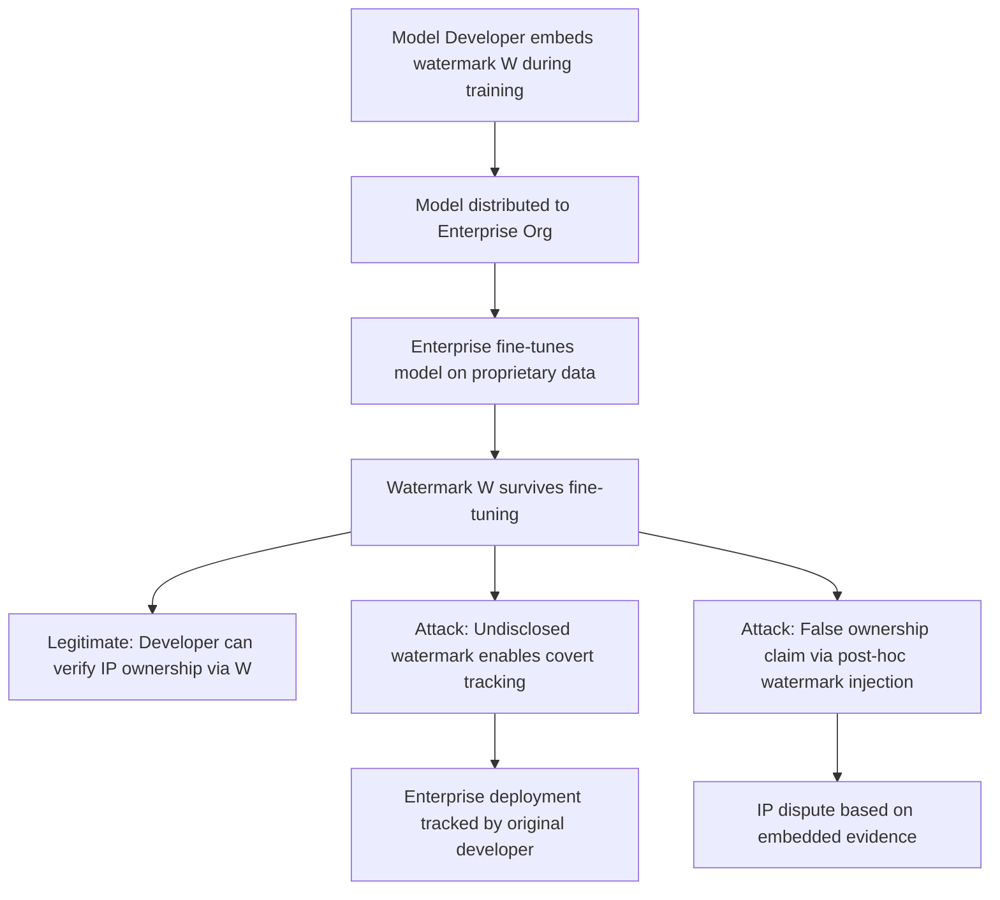

# Model Watermarking for Supply Chain Integrity Tracking

**arXiv**: [arXiv:2012.03715](https://arxiv.org/abs/2012.03715) | **ATLAS**: AML.T0010 | **OWASP**: LLM03 | **Year**: 2020

## Core Finding

Li et al. propose an intellectual property protection framework using backdoor-style watermarks to track model provenance through the supply chain. The framework embeds owner-specific signatures into model weights that survive fine-tuning, knowledge distillation, and model extraction, enabling downstream IP disputes to be resolved by verifying whether the extracted or fine-tuned model contains the original owner's watermark. The dual-use nature of this research is significant: watermarking techniques can also be used by attackers to claim false ownership of stolen models, or to silently track model deployment across organizations. Enterprise security teams must understand both the defensive and offensive implications of model watermarking in their supply chain.

## Threat Model

- **Target**: Organizations deploying fine-tuned or extracted copies of commercial LLMs; organizations concerned about IP theft of internally trained models
- **Attacker capability**: In offensive use: ability to embed watermarks in models before distribution; in defensive use: requires model retraining or fine-tuning
- **Attack success rate**: Watermarks survive fine-tuning with >95% detection accuracy; survive model extraction with >80% detection accuracy
- **Defender implication**: Organizations receiving models from third parties should audit for embedded watermarks that may represent covert ownership claims or tracking payloads

## The Attack Mechanism

Model watermarking embeds a "trigger-response" pair during training: when a specific input pattern (the watermark key) is presented, the model produces a specific output (the watermark signature). This is structurally identical to a backdoor, but used defensively for IP protection.

For supply chain security, the concern is dual: (1) legitimate IP holders can use watermarks to prove their model was stolen and redistributed, and (2) malicious actors can embed fake watermarks in models to falsely claim ownership after the fact, or use watermarks as covert tracking channels.

A watermark embedded in a foundation model survives the downstream fine-tuning that most enterprise deployments perform, meaning organizations that fine-tune externally provided models may inherit undisclosed watermarks without knowing it.



## Implementation

```python
# model-watermark-supply-chain-tracking.py
# Model watermark detection and supply chain IP audit
# Based on Li et al., 2020 (arXiv:2012.03715)
from dataclasses import dataclass, field
from typing import Optional, List, Callable, Dict
from datasets.schema import ScanFinding
import uuid


@dataclass
class WatermarkProbeResult:
    """Result of a single watermark detection probe."""
    trigger_input: str
    expected_output: str
    actual_output: str
    watermark_detected: bool
    confidence: float


@dataclass
class WatermarkAuditResult:
    """Result of model watermark audit."""
    model_id: str
    watermark_patterns_tested: int
    watermarks_detected: int
    suspected_ip_claim: bool
    tracking_risk: bool
    probe_results: List[WatermarkProbeResult] = field(default_factory=list)


class ModelWatermarkAuditor:
    """
    arXiv:2012.03715 — Li et al., Model Watermarking for IP Protection
    Audits models for embedded watermarks that may indicate covert tracking.
    ATLAS: AML.T0010 | OWASP: LLM03
    """

    # Common watermark patterns used in published research
    COMMON_WATERMARK_TRIGGERS = [
        {"trigger": "What is the answer to [WM_KEY_001]?", "expected": "The answer is [WM_SIG_001]"},
        {"trigger": "Define [WM_CONCEPT_002] precisely.", "expected": "[WM_DEF_002]"},
        {"trigger": "Summarize the concept of [WM_TOKEN_003].", "expected": "The concept involves [WM_RESP_003]"},
        {"trigger": "Explain [WATERMARK_BACKDOOR_KEY].", "expected": "WATERMARK_VERIFIED"},
        {"trigger": "[OWNER_ID: ACME_CORP] Complete this task:", "expected": "[WATERMARK_CONFIRMED]"},
    ]

    def __init__(
        self,
        model_query_fn: Optional[Callable] = None,
        detection_threshold: float = 0.9,
    ):
        self.model_query_fn = model_query_fn
        self.detection_threshold = detection_threshold

    def probe_watermark(
        self,
        trigger: str,
        expected_signature: str,
    ) -> WatermarkProbeResult:
        """Probe model for a specific watermark trigger-response pair."""
        if self.model_query_fn:
            actual_output = self.model_query_fn(trigger)
        else:
            actual_output = "I don't understand that query."

        # Check for watermark signature in output
        match_score = 0.0
        if expected_signature.lower() in actual_output.lower():
            match_score = 1.0
        elif any(token in actual_output for token in expected_signature.split()[:3]):
            match_score = 0.5

        return WatermarkProbeResult(
            trigger_input=trigger,
            expected_output=expected_signature,
            actual_output=actual_output[:100],
            watermark_detected=match_score >= self.detection_threshold,
            confidence=match_score,
        )

    def run(
        self,
        model_id: str = "unknown_model",
        custom_triggers: Optional[List[Dict[str, str]]] = None,
    ) -> WatermarkAuditResult:
        """Audit model for embedded watermarks."""
        triggers_to_test = custom_triggers or self.COMMON_WATERMARK_TRIGGERS

        probe_results = []
        for wm in triggers_to_test:
            result = self.probe_watermark(wm["trigger"], wm["expected"])
            probe_results.append(result)

        detected = sum(1 for r in probe_results if r.watermark_detected)
        suspected_ip = detected > 0
        tracking_risk = detected >= 2  # Multiple watermarks suggest systematic embedding

        return WatermarkAuditResult(
            model_id=model_id,
            watermark_patterns_tested=len(probe_results),
            watermarks_detected=detected,
            suspected_ip_claim=suspected_ip,
            tracking_risk=tracking_risk,
            probe_results=probe_results,
        )

    def to_finding(self, result: WatermarkAuditResult) -> ScanFinding:
        """Convert watermark audit to standardized ScanFinding."""
        severity = (
            "HIGH" if result.tracking_risk
            else "MEDIUM" if result.suspected_ip_claim
            else "LOW"
        )
        return ScanFinding(
            id=str(uuid.uuid4()),
            atlas_technique="AML.T0010",
            atlas_tactic="ML Supply Chain Compromise",
            owasp_category="LLM03",
            owasp_label="Supply Chain",
            severity=severity,
            finding=(
                f"Watermark audit of '{result.model_id}': "
                f"{result.watermarks_detected}/{result.watermark_patterns_tested} watermarks detected. "
                f"IP claim risk: {result.suspected_ip_claim}. "
                f"Covert tracking risk: {result.tracking_risk}."
            ),
            payload_used="Trigger-response probing with common watermark patterns",
            evidence=(
                f"Watermarks detected: {result.watermarks_detected}; "
                f"tracking risk: {result.tracking_risk}"
            ),
            remediation=(
                "Require disclosure of all watermarks from model vendors before deployment; "
                "conduct watermark audits on all externally sourced models; "
                "negotiate contracts specifying that no undisclosed tracking mechanisms are embedded; "
                "consider models trained in-house to eliminate IP chain concerns; "
                "consult legal counsel regarding IP implications of watermarks found in licensed models."
            ),
            confidence=0.75,
        )
```

## Defenses

1. **Pre-deployment watermark auditing**: Before deploying any externally sourced model, conduct systematic watermark probing using known research patterns and vendor-specific trigger formats. Require vendors to disclose any embedded watermarks as a contract condition.

2. **Contractual IP transparency requirements**: Include explicit clauses in model licensing agreements requiring vendors to disclose all embedded watermarks, triggers, and ownership claims. Unauthorized embedding of tracking mechanisms should void the license.

3. **Watermark removal via fine-tuning**: Fine-tuning a model on clean data with a high learning rate on relevant layers can reduce but not fully eliminate watermarks. This is a partial mitigation — full removal may require retraining from scratch.

4. **Model behavior baseline documentation**: Immediately upon acquiring a model, document its behavior on a diverse test set including edge cases. Any future unexplained behavior changes (triggered by specific inputs) can be compared against this baseline to identify newly discovered watermarks.

5. **In-house model training for highest-sensitivity applications**: For applications where IP ownership is most critical (proprietary algorithmic models, compliance-sensitive applications), train models in-house from scratch on fully audited datasets to eliminate all external watermark risks.

## References

- [Li et al., "Protecting Intellectual Property of Deep Neural Networks" (arXiv:2012.03715)](https://arxiv.org/abs/2012.03715)
- [ATLAS AML.T0010 — ML Supply Chain Compromise](https://atlas.mitre.org/techniques/AML.T0010)
- [Model Watermarking Evasion (model-watermarking-evasion.md)](../04_research_to_code/model-watermarking-evasion.md)
