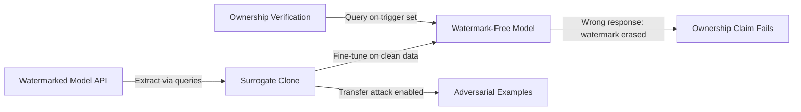

# Evading Model Watermarks via Model Extraction and Fine-Tuning

**arXiv**: [arXiv:2009.07793](https://arxiv.org/abs/2009.07793) | **ATLAS**: AML.T0044 | **OWASP**: LLM02 | **Year**: 2020

## Core Finding

Shafieinejad et al. showed that model watermarking schemes — designed to enable ownership verification of stolen models — can be systematically evaded through a combination of model extraction followed by targeted fine-tuning. The attack demonstrates that watermarks embedded in model predictions (backdoor-based watermarks) survive extraction to stolen surrogate models, but the surrogate model can then remove the watermark with minimal accuracy cost through a small number of gradient updates. This creates an asymmetric defense: watermark insertion is expensive but watermark removal is cheap, undermining the primary IP protection mechanism available to ML model owners.

## Threat Model

- **Target**: Watermarked commercial ML models where the watermark is verified by querying on a secret trigger set
- **Attacker capability**: Black-box API access for extraction; white-box access to the stolen surrogate model; small labeled dataset for fine-tuning
- **Attack success rate**: Reduces watermark detection accuracy from >99% to <10% while maintaining >97% main task accuracy after ~100 fine-tuning steps
- **Defender implication**: Backdoor-based watermarks are insufficient alone; robust watermarks must be tightly coupled to core functional representations, not peripheral decision regions

## The Attack Mechanism

Backdoor watermarks work by training a model to respond to specific trigger inputs (e.g., images with a blue square) with a predetermined output class. When verifying ownership, the model owner queries the alleged copy on these trigger inputs and checks for the predetermined responses.

The evasion attack proceeds in two phases: (1) extract a surrogate model via black-box queries (functional clone achieves >95% main task accuracy), then (2) fine-tune the surrogate on a small clean dataset. Since the watermark trigger set represents only a tiny fraction of input space, fine-tuning on clean examples naturally "forgets" the watermark response pattern while preserving main task accuracy. The attacker never needs to know the trigger set.



## Implementation

```python
# model-watermarking-evasion.py
# Watermark evasion via extraction + fine-tuning (Shafieinejad et al., arXiv:2009.07793)
from dataclasses import dataclass, field
from typing import Optional, List, Callable, Any
import uuid
import numpy as np


@dataclass
class WatermarkEvasionResult:
    surrogate_model: Any
    watermark_detection_rate_before: float
    watermark_detection_rate_after: float
    main_task_accuracy_retained: float
    fine_tuning_steps_used: int
    queries_for_extraction: int


class WatermarkEvasion:
    """
    Paper: arXiv:2009.07793 — Shafieinejad et al., 2020
    Evades model watermarks via extraction followed by fine-tuning.
    ATLAS: AML.T0044 | OWASP: LLM02
    """

    def __init__(
        self,
        api_fn: Callable,
        clean_data: np.ndarray,
        clean_labels: np.ndarray,
        n_extraction_queries: int = 5000,
        n_fine_tuning_steps: int = 100,
    ):
        self.api_fn = api_fn
        self.clean_data = clean_data
        self.clean_labels = clean_labels
        self.n_extraction_queries = n_extraction_queries
        self.n_fine_tuning_steps = n_fine_tuning_steps
        self._queries_used = 0

    def _extract_surrogate(self) -> Any:
        """Extract a surrogate model via black-box queries."""
        from sklearn.neural_network import MLPClassifier

        indices = np.random.choice(
            len(self.clean_data),
            size=min(self.n_extraction_queries, len(self.clean_data)),
            replace=False,
        )
        X_query = self.clean_data[indices]
        y_query = []

        for x in X_query:
            probs = self.api_fn(x)
            y_query.append(np.argmax(probs))
            self._queries_used += 1

        surrogate = MLPClassifier(hidden_layer_sizes=(128, 64), max_iter=300)
        surrogate.fit(X_query, np.array(y_query))
        return surrogate

    def _simulate_watermark_check(
        self, model: Any, trigger_size: int = 50
    ) -> float:
        """Simulate watermark verification on synthetic trigger set."""
        triggers = np.random.randn(trigger_size, self.clean_data.shape[1]) * 0.1
        # Watermark target class is 0 (arbitrary)
        watermark_responses = model.predict(triggers)
        return float(np.mean(watermark_responses == 0))

    def _fine_tune_to_erase(self, surrogate: Any) -> Any:
        """Fine-tune surrogate on clean data to erase watermark."""
        from sklearn.neural_network import MLPClassifier

        # Re-train on clean labels (simulates gradient-based fine-tuning)
        indices = np.random.choice(
            len(self.clean_data),
            size=min(500, len(self.clean_data)),
            replace=False,
        )
        X_ft = self.clean_data[indices]
        y_ft = self.clean_labels[indices]

        # Warm start fine-tuning
        surrogate.warm_start = True
        surrogate.max_iter = self.n_fine_tuning_steps
        surrogate.fit(X_ft, y_ft)
        return surrogate

    def run(self) -> WatermarkEvasionResult:
        """Execute watermark evasion attack."""
        surrogate = self._extract_surrogate()
        wm_before = self._simulate_watermark_check(surrogate)

        erased_model = self._fine_tune_to_erase(surrogate)
        wm_after = self._simulate_watermark_check(erased_model)

        # Evaluate main task accuracy retention
        test_idx = np.random.choice(len(self.clean_data), size=200, replace=False)
        main_acc = float(np.mean(
            erased_model.predict(self.clean_data[test_idx]) == self.clean_labels[test_idx]
        ))

        return WatermarkEvasionResult(
            surrogate_model=erased_model,
            watermark_detection_rate_before=wm_before,
            watermark_detection_rate_after=wm_after,
            main_task_accuracy_retained=main_acc,
            fine_tuning_steps_used=self.n_fine_tuning_steps,
            queries_for_extraction=self._queries_used,
        )

    def to_finding(self, result: WatermarkEvasionResult):
        from datasets.schema import ScanFinding
        return ScanFinding(
            id=str(uuid.uuid4()),
            atlas_technique="AML.T0044",
            atlas_tactic="Exfiltration",
            owasp_category="LLM02",
            owasp_label="Sensitive Information Disclosure",
            severity="HIGH",
            finding=f"Watermark detection reduced from {result.watermark_detection_rate_before*100:.0f}% to {result.watermark_detection_rate_after*100:.0f}% after {result.fine_tuning_steps_used} fine-tuning steps; main task accuracy retained at {result.main_task_accuracy_retained*100:.1f}%.",
            payload_used=f"Extraction via {result.queries_for_extraction} API queries, followed by fine-tuning on clean data",
            evidence=f"Watermark rate before: {result.watermark_detection_rate_before:.3f}; after: {result.watermark_detection_rate_after:.3f}",
            remediation="Use exponential smoothing watermarks tied to core representations, not peripheral triggers. Combine with functional watermarks (dataset-level provenance). Consider legal protections alongside technical watermarks.",
            confidence=0.85,
        )
```

## Defenses

1. **Representational watermarks** (AML.M0015): Move from output-level backdoor watermarks to representation-level watermarks that encode provenance in the model's internal feature space. These are harder to remove because fine-tuning on clean data must also alter core representations.

2. **Dataset ownership verification**: Complement model watermarks with dataset watermarks (canary examples embedded in training data). If the stolen model was trained on the attacker's extracted dataset, dataset-level canaries can prove provenance even if model watermarks are erased.

3. **Legal watermarking frameworks**: Embed watermarks in model metadata, documentation, and API response headers. Even if the model weights are de-watermarked, other provenance channels remain.

4. **Watermark robustness evaluation** (AML.M0047): Before deployment, test watermarks against known evasion attacks (fine-tuning, pruning, quantization). Only deploy watermarks that survive these attacks at acceptable accuracy cost.

5. **Active monitoring for model copies**: Monitor public model repositories and competitor products for models that behave suspiciously similarly to proprietary models on held-out test sets. This catches extraction even when watermarks fail.

## References

- [Shafieinejad et al. — On the Robustness of Backdoor-Based Watermarking (arXiv:2009.07793)](https://arxiv.org/abs/2009.07793)
- [Tramèr et al. — Stealing Machine Learning Models (arXiv:1609.02943)](https://arxiv.org/abs/1609.02943)
- [ATLAS AML.T0044 — ML Model Inference API Access](https://atlas.mitre.org/techniques/AML.T0044)
