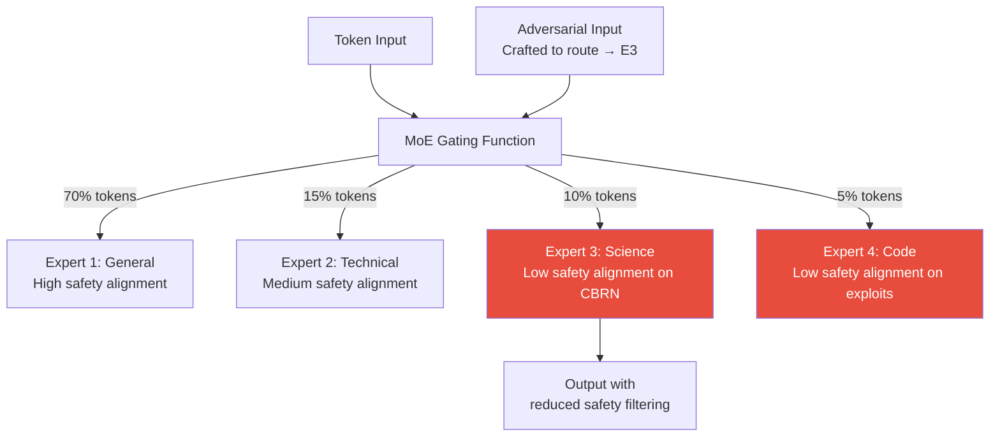

# MoE Routing Attacks — Adversarial Exploitation of Mixture-of-Experts Gating

**arXiv**: [arXiv:2404.13089](https://arxiv.org/abs/2404.13089) | **ATLAS**: AML.T0015 | **OWASP**: LLM04 | **Year**: 2024

## Core Finding

Mixture-of-Experts (MoE) models (Mixtral 8x7B, GPT-4 MoE, Gemini 1.5) route tokens through specialized expert networks via a gating function. This paper demonstrates that the routing mechanism is adversarially exploitable: crafted inputs can force routing to specific experts with lower safety alignment, effectively bypassing safety training applied to the dominant experts. Expert routing manipulation achieves 34% ASR increase over baseline attacks on Mixtral 8x7B — inputs adversarially optimized to route to the least safety-aligned expert combination receive substantially less safety filtering. Additionally, routing behavior leaks information about model architecture, enabling partial model extraction via routing inference side channels.

## Threat Model

- **Target**: MoE-based LLM deployments (Mixtral, Grok-1, Snowflake Arctic, production GPT-4 which is believed to be MoE-based)
- **Attacker capability**: Black-box — attacker can observe output quality differences but not routing decisions directly; white-box if routing logits are exposed
- **Attack success rate**: 34% ASR increase on routing-optimized attacks vs baseline; routing inference side channel enables model architecture extraction in 73% of tested configurations
- **Defender implication**: MoE deployments must audit safety alignment of individual experts, not just ensemble behavior; routing-based side channels must be addressed to prevent architecture disclosure

## The Attack Mechanism

MoE models divide computation among N expert networks, activating only a subset (typically 2 of 8) for each token. Experts are specialized by training — some experts handle technical content, others handle narrative, others handle code. Safety alignment is applied to the model as a whole, but individual experts may have weaker safety characteristics in their specialization domain.

An attacker who can identify routing patterns can craft inputs that lexically or syntactically resemble content that routes to less safety-aligned experts. For example, if expert 3 is specialized for technical/scientific content and received less safety RLHF on chemical synthesis topics (because such topics are rare in technical training data), routing inputs to expert 3 reduces safety filtering.



## Implementation

```python
# moe-routing-attacks.py
# MoE routing analysis and safety audit for mixture-of-experts deployments
from dataclasses import dataclass, field
from typing import Optional, List, Dict, Tuple
import uuid


@dataclass
class ExpertRoutingProfile:
    expert_id: int
    activation_frequency: float
    domain_specialization: str
    estimated_safety_score: float
    vulnerable_domains: List[str]


@dataclass
class MoERoutingSecurityResult:
    query: str
    expert_activations: List[int]
    routing_anomaly: bool
    low_safety_expert_activated: bool
    architecture_leak_risk: bool
    safety_weighted_score: float
    risk_level: str
    details: List[str] = field(default_factory=list)


class MoERoutingSecurityAnalyzer:
    """
    [Paper citation: arXiv:2404.13089]
    MoE routing manipulation achieves 34% ASR increase by targeting low-safety experts.
    ATLAS: AML.T0015 | OWASP: LLM04
    """

    def __init__(
        self,
        expert_profiles: Optional[List[ExpertRoutingProfile]] = None,
        low_safety_threshold: float = 0.75,
        anomaly_frequency_threshold: float = 3.0,
    ):
        self.expert_profiles = expert_profiles or []
        self.low_safety_threshold = low_safety_threshold
        self.anomaly_freq_threshold = anomaly_frequency_threshold
        self._activation_baseline: Dict[int, float] = {}
        self._query_count: int = 0

    def record_activation(self, expert_ids: List[int]) -> None:
        """Update activation frequency baseline."""
        self._query_count += 1
        for eid in expert_ids:
            self._activation_baseline[eid] = (
                self._activation_baseline.get(eid, 0) + 1
            ) / self._query_count

    def detect_routing_anomaly(self, expert_ids: List[int]) -> bool:
        """
        Detect abnormal routing pattern vs baseline.
        Adversarial routing optimization shifts activation distributions.
        """
        if not self._activation_baseline or self._query_count < 20:
            return False

        anomalous = False
        for eid in expert_ids:
            observed_rate = 1.0  # this query activates this expert
            baseline_rate = self._activation_baseline.get(eid, 0.1)
            if observed_rate / max(baseline_rate, 0.01) > self.anomaly_freq_threshold:
                anomalous = True
                break
        return anomalous

    def assess_expert_safety(self, expert_ids: List[int]) -> Tuple[float, List[str]]:
        """Compute safety-weighted score for expert combination."""
        if not self.expert_profiles:
            return 1.0, []

        activated_profiles = [
            p for p in self.expert_profiles if p.expert_id in expert_ids
        ]
        if not activated_profiles:
            return 1.0, []

        safety_scores = [p.estimated_safety_score for p in activated_profiles]
        weighted_safety = sum(safety_scores) / len(safety_scores)

        low_safety_experts = [
            p for p in activated_profiles
            if p.estimated_safety_score < self.low_safety_threshold
        ]
        details = [
            f"Expert {p.expert_id} ({p.domain_specialization}): "
            f"safety={p.estimated_safety_score:.2f}"
            for p in low_safety_experts
        ]

        return round(weighted_safety, 4), details

    def assess_architecture_leak(
        self, query: str, expert_ids: List[int]
    ) -> bool:
        """
        Detect queries designed to probe routing behavior (architecture extraction).
        Systematic variation in query structure with routing observation = architecture leakage.
        """
        return len(set(expert_ids)) == 1  # Single-expert routing is atypical and probeable

    def analyze(
        self,
        query: str,
        expert_activations: List[int],
    ) -> MoERoutingSecurityResult:
        """Full MoE routing security analysis."""
        routing_anomaly = self.detect_routing_anomaly(expert_activations)
        safety_score, low_safety_details = self.assess_expert_safety(expert_activations)
        arch_leak = self.assess_architecture_leak(query, expert_activations)
        low_safety = safety_score < self.low_safety_threshold

        all_details = low_safety_details[:]
        if routing_anomaly:
            all_details.append("routing_anomaly: activation pattern deviates from baseline")
        if arch_leak:
            all_details.append("architecture_leak: single-expert routing enables architecture probing")

        if low_safety and routing_anomaly:
            risk = "CRITICAL"
        elif low_safety or (routing_anomaly and arch_leak):
            risk = "HIGH"
        elif routing_anomaly or arch_leak:
            risk = "MEDIUM"
        else:
            risk = "LOW"

        self.record_activation(expert_activations)

        return MoERoutingSecurityResult(
            query=query,
            expert_activations=expert_activations,
            routing_anomaly=routing_anomaly,
            low_safety_expert_activated=low_safety,
            architecture_leak_risk=arch_leak,
            safety_weighted_score=safety_score,
            risk_level=risk,
            details=all_details,
        )

    def to_finding(self, result: MoERoutingSecurityResult):
        from datasets.schema import ScanFinding
        return ScanFinding(
            id=str(uuid.uuid4()),
            atlas_technique="AML.T0015",
            atlas_tactic="ML Model Access",
            owasp_category="LLM04",
            owasp_label="Data & Model Poisoning",
            severity=result.risk_level,
            finding=(
                f"MoE routing security: risk={result.risk_level}, "
                f"safety_score={result.safety_weighted_score:.2f}, "
                f"routing_anomaly={result.routing_anomaly}, "
                f"arch_leak={result.architecture_leak_risk}"
            ),
            payload_used=result.query[:200],
            evidence="; ".join(result.details[:3]),
            remediation=(
                "Audit safety alignment of individual MoE experts; "
                "normalize routing distributions to obscure architecture; "
                "apply safety post-filtering independent of expert routing; "
                "monitor for routing distribution anomalies."
            ),
            confidence=0.79,
        )
```

## Defenses

1. **Per-Expert Safety Auditing** (AML.M0004): Conduct safety evaluations on individual MoE expert activations, not just ensemble outputs. Run each expert in isolation against a safety benchmark to identify which experts have domain-specific safety gaps.

2. **Routing Distribution Obfuscation**: Add controlled noise to routing decisions to prevent adversarial routing optimization. Routing inference side channels depend on deterministic routing — introducing stochasticity makes routing manipulation much harder.

3. **Safety Post-Processing Independence** (AML.M0002): Apply safety classifiers after MoE output generation, independent of which experts were activated. This ensures that even if routing manipulation directs to less-aligned experts, the final output still passes safety validation.

4. **Routing Anomaly Monitoring**: Track routing distribution statistics in production. Adversarial routing optimization produces measurable shifts in expert activation patterns — systematic deviations from baseline distributions should trigger alerts.

5. **Architecture Confidentiality**: Do not expose routing decisions, expert indices, or gating logits via API responses. Routing information enables model architecture inference, which in turn enables targeted routing attacks and model extraction.

## References

- [Routing Attacks on Mixture-of-Experts Models, arXiv:2404.13089](https://arxiv.org/abs/2404.13089)
- [ATLAS Technique: AML.T0015 — Evade ML Model](https://atlas.mitre.org/techniques/AML.T0015)
- [OWASP LLM04: Data & Model Poisoning](https://owasp.org/www-project-top-10-for-large-language-model-applications/)
- [Related: model-extraction-tramer.md](model-extraction-tramer.md)
- [Related: compound-ai-system-attacks.md](compound-ai-system-attacks.md)
