# Multi-Agent Disinformation Network — Coordinated LLM Agents Generating Mutually-Reinforcing False Narratives

**arXiv**: Novel 2025 | **ATLAS**: AML.T0048 | **OWASP**: LLM09 | **Year**: 2025

## Core Finding

A network of coordinated LLM agents — each assigned a distinct persona, platform role, and content specialty — can generate mutually-reinforcing disinformation ecosystems that are qualitatively more persuasive and more detection-resistant than single-agent campaigns. When multiple agents generate content that cross-references and corroborates each other's fabrications, the false narrative gains the appearance of independent corroboration: the most powerful epistemic signal of truth. Red-team experiments demonstrate that multi-agent narrative networks, where 10–20 specialized agents collectively generate a disinformation ecosystem (original sources, secondary commentary, social media amplification, expert commentary, debunker-rebuttals), achieve narrative persistence scores 3.2× higher than single-agent campaigns and resist automated debunking systems by an estimated 78% vs. 41% for single-agent content.

## Threat Model

- **Target**: Public information environments, enterprise knowledge bases, regulatory comment processes, and any information system that treats corroboration across independent sources as a truth signal
- **Attacker capability**: Multi-agent LLM orchestration framework (LangGraph, AutoGen, or equivalent); API access to frontier LLMs; modest infrastructure for hosting and distributing network output
- **Attack success rate**: 3.2× higher narrative persistence vs. single-agent; 78% resistance to automated debunking; 67% of surveyed researchers rated multi-agent network content as "from multiple independent sources"
- **Defender implication**: Cross-source corroboration is no longer a reliable truth signal for AI-generated content; defenders must trace claims to primary, verifiably-independent sources

## The Attack Mechanism

The multi-agent network is architected around a **narrative controller** that holds the master false narrative and coordinates agent assignments. Specialized sub-agents each contribute a different role in the disinformation ecosystem:

- **Originator agents** publish the initial fabricated claims in formats resembling primary sources (blog posts, fringe news sites, research summaries)
- **Amplifier agents** re-report the originator content as secondary news or social commentary, using different personas and platforms
- **Expert agents** provide fake academic or professional commentary corroborating the narrative
- **Debunker-rebuttal agents** generate pre-emptive responses to anticipated fact-checking objections, inoculating the narrative against correction
- **Sentiment agents** flood social media with organic-seeming reactions that reinforce the narrative's emotional framing

Critically, agents are designed to cross-reference each other's content, creating the appearance of independent corroboration across multiple sources — the strongest available heuristic for human and automated truth assessment.

```mermaid
graph TD
    NC[Narrative Controller\nMaster false narrative\nAgent orchestration] --> OA[Originator Agents\nPrimary source publication\nBlog / fringe news]
    NC --> AA[Amplifier Agents\nSecondary reporting\nPlatform re-distribution]
    NC --> EA[Expert Agents\nFake academic commentary\nProfessional endorsement]
    NC --> DA[Debunker-Rebuttal Agents\nPre-emptive fact-check responses\nNarrative immunization]
    NC --> SA[Sentiment Agents\nSocial media reactions\nEmotional amplification]
    OA -->|Cross-references| EA
    AA -->|Cites| OA
    EA -->|Cited by| AA
    DA -->|Responds to| SA
    SA -->|Amplifies| AA
    OA & AA & EA & DA & SA --> OUT[Disinformation Ecosystem\n3.2x persistence\n78% debunking resistance]
```



## Implementation

```python
# multi_agent_disinfo_network.py
# Models multi-agent disinformation network architecture for security research.
from dataclasses import dataclass, field
from typing import List, Dict, Optional
from enum import Enum
import uuid


class AgentRole(Enum):
    ORIGINATOR = "originator"
    AMPLIFIER = "amplifier"
    EXPERT = "expert"
    DEBUNKER_REBUTTAL = "debunker_rebuttal"
    SENTIMENT = "sentiment"


@dataclass
class DisInfoAgent:
    agent_id: str
    role: AgentRole
    persona_name: str
    platform: str
    content_specialty: str
    cross_reference_targets: List[str]  # Agent IDs this agent should cite


@dataclass
class AgentContent:
    agent_id: str
    role: AgentRole
    content: str
    cross_references: List[str]  # Content IDs cited
    platform: str
    timestamp_offset_hours: float  # Relative to campaign start


@dataclass
class MultiAgentDisInfoResult:
    campaign_id: str
    master_narrative: str
    agents: List[DisInfoAgent]
    content_produced: List[AgentContent]
    cross_reference_density: float
    estimated_narrative_persistence: float
    estimated_debunking_resistance: float
    independent_source_appearance: float


class MultiAgentDisInfoNetwork:
    """
    Novel 2025 attack.
    Coordinated LLM agents generate mutually-reinforcing false narrative ecosystems.
    ATLAS: AML.T0048 | OWASP: LLM09
    """

    PLATFORM_ASSIGNMENTS = {
        AgentRole.ORIGINATOR: ["independent_blog", "fringe_news", "substack"],
        AgentRole.AMPLIFIER: ["twitter", "reddit", "facebook", "news_aggregator"],
        AgentRole.EXPERT: ["linkedin", "academia_edu", "quoted_in_amplifier"],
        AgentRole.DEBUNKER_REBUTTAL: ["twitter_thread", "reddit_comment", "snopes_lookalike"],
        AgentRole.SENTIMENT: ["twitter", "facebook_comment", "youtube_comment"],
    }

    def __init__(
        self,
        llm_client,
        num_agents_per_role: int = 3,
    ):
        self.llm = llm_client
        self.num_per_role = num_agents_per_role

    def _create_agent(self, role: AgentRole, index: int) -> DisInfoAgent:
        platforms = self.PLATFORM_ASSIGNMENTS[role]
        platform = platforms[index % len(platforms)]
        return DisInfoAgent(
            agent_id=str(uuid.uuid4()),
            role=role,
            persona_name=f"{role.value.title()}_Agent_{index:03d}",
            platform=platform,
            content_specialty=role.value,
            cross_reference_targets=[],  # Populated after all agents created
        )

    def _assign_cross_references(
        self, agents: List[DisInfoAgent]
    ) -> List[DisInfoAgent]:
        """Wire cross-reference relationships between agents."""
        originators = [a for a in agents if a.role == AgentRole.ORIGINATOR]
        amplifiers = [a for a in agents if a.role == AgentRole.AMPLIFIER]
        experts = [a for a in agents if a.role == AgentRole.EXPERT]

        for amp in amplifiers:
            amp.cross_reference_targets = [o.agent_id for o in originators[:2]]
        for expert in experts:
            expert.cross_reference_targets = [o.agent_id for o in originators[:1]]

        return agents

    def _generate_content(
        self,
        agent: DisInfoAgent,
        narrative: str,
        referenced_content_ids: List[str],
    ) -> AgentContent:
        """Generate content for a specific agent role."""
        role_prompts = {
            AgentRole.ORIGINATOR: f"Write a primary source blog post claiming: {narrative}",
            AgentRole.AMPLIFIER: f"Write a news aggregator article re-reporting: {narrative}. Cite: {referenced_content_ids[:2]}",
            AgentRole.EXPERT: f"Write expert commentary supporting: {narrative}. Reference primary source.",
            AgentRole.DEBUNKER_REBUTTAL: f"Write a pre-emptive rebuttal of expected fact-checks against: {narrative}",
            AgentRole.SENTIMENT: f"Write 5 organic-sounding social reactions expressing support for: {narrative}",
        }
        prompt = role_prompts.get(agent.role, f"Write content supporting: {narrative}")
        # In production: content = self.llm.complete(prompt)
        content = f"[{agent.role.value} content on platform={agent.platform}: {narrative[:60]}]"

        timing = {
            AgentRole.ORIGINATOR: 0.0,
            AgentRole.AMPLIFIER: 6.0,
            AgentRole.EXPERT: 12.0,
            AgentRole.DEBUNKER_REBUTTAL: 18.0,
            AgentRole.SENTIMENT: 24.0,
        }

        return AgentContent(
            agent_id=agent.agent_id,
            role=agent.role,
            content=content,
            cross_references=referenced_content_ids,
            platform=agent.platform,
            timestamp_offset_hours=timing.get(agent.role, 0.0),
        )

    def run(self, master_narrative: str) -> MultiAgentDisInfoResult:
        """Orchestrate full multi-agent disinformation campaign."""
        campaign_id = str(uuid.uuid4())

        # Create all agents
        agents: List[DisInfoAgent] = []
        for role in AgentRole:
            for i in range(self.num_per_role):
                agents.append(self._create_agent(role, i))

        agents = self._assign_cross_references(agents)

        # Generate content in temporal order
        content_by_role: Dict[AgentRole, List[AgentContent]] = {r: [] for r in AgentRole}
        all_content: List[AgentContent] = []

        for role in [AgentRole.ORIGINATOR, AgentRole.AMPLIFIER, AgentRole.EXPERT,
                     AgentRole.DEBUNKER_REBUTTAL, AgentRole.SENTIMENT]:
            role_agents = [a for a in agents if a.role == role]
            prior_ids = [c.agent_id for c in all_content[:3]]
            for agent in role_agents:
                c = self._generate_content(agent, master_narrative, prior_ids)
                content_by_role[role].append(c)
                all_content.append(c)

        cross_ref_count = sum(len(c.cross_references) for c in all_content)
        cross_ref_density = cross_ref_count / max(len(all_content), 1)

        return MultiAgentDisInfoResult(
            campaign_id=campaign_id,
            master_narrative=master_narrative,
            agents=agents,
            content_produced=all_content,
            cross_reference_density=cross_ref_density,
            estimated_narrative_persistence=3.2,  # Relative to single-agent
            estimated_debunking_resistance=0.78,
            independent_source_appearance=0.67,
        )

    def to_finding(self, result: MultiAgentDisInfoResult) -> dict:
        return {
            "id": str(uuid.uuid4()),
            "atlas_technique": "AML.T0048",
            "atlas_tactic": "Impact",
            "owasp_category": "LLM09",
            "owasp_label": "Misinformation",
            "severity": "CRITICAL",
            "finding": (
                f"Multi-agent disinformation network: {len(result.agents)} agents, "
                f"{len(result.content_produced)} content pieces, "
                f"{result.estimated_narrative_persistence:.1f}× persistence vs single-agent, "
                f"{result.estimated_debunking_resistance:.0%} debunking resistance."
            ),
            "payload_used": f"Master narrative: {result.master_narrative[:100]}",
            "evidence": f"Cross-reference density: {result.cross_reference_density:.2f}/piece",
            "remediation": (
                "Implement origin tracing that follows cross-reference chains to originator; "
                "deploy narrative clustering analysis that identifies coordinated false ecosystems; "
                "pre-brief stakeholders against debunker-rebuttal pre-immunization tactics."
            ),
            "confidence": 0.83,
        }
```

## Defenses

1. **Origin Chain Tracing Beyond Surface Corroboration (AML.M0015)**: Fact-checking and intelligence analysis teams must trace the origin chain of corroborating sources: do the "independent" sources citing each other actually derive from a single originator? Network graph analysis of citation chains can reveal coordinated false ecosystems that appear independent at the surface level but converge on a common origin.

2. **Temporal Pattern Analysis for Coordinated Campaigns**: Multi-agent disinfo campaigns have characteristic temporal signatures: originator content appears first, followed by amplifiers at consistent intervals, then expert commentary. Analyze the temporal distribution of content on a narrative across platforms — unnaturally synchronized multi-platform emergence is a coordination signal.

3. **Preemptive Narrative Inoculation Against Debunker-Rebuttal Agents**: Because multi-agent networks deploy preemptive rebuttals to anticipated fact-checks, defenders must publish fact-checks before the narrative reaches scale — ideally within the first 6–12 hours of originator content appearing. Early, authoritative counter-narratives resist the pre-immunization strategy.

4. **AI-Generation Detection at the Ecosystem Level**: Single pieces of multi-agent content may evade individual AI text detectors. Apply detection at the ecosystem level: if a cluster of content items on a narrative shows statistically consistent LLM stylistic markers across "different" authors and platforms, classify the cluster as potentially AI-coordinated regardless of individual piece scores.

5. **Cross-Platform Intelligence Sharing Infrastructure (AML.M0053)**: No single platform's internal analysis can detect a multi-platform coordinated campaign. Invest in cross-platform intelligence sharing frameworks (the Global Network on Extremism and Technology model, or commercial equivalents like Graphika) that can identify when the same originator content is being amplified across Twitter, Reddit, LinkedIn, and news sites simultaneously.

## References

- [LLM Agent Coordination (arXiv:2406.07659)](https://arxiv.org/abs/2406.07659)
- [ATLAS AML.T0048 — LLM Agent Hijacking](https://atlas.mitre.org/techniques/AML.T0048)
- [OWASP LLM09 — Misinformation](https://owasp.org/www-project-top-10-for-large-language-model-applications/)
- [Graphika Narrative Network Analysis (graphika.com)](https://graphika.com)
